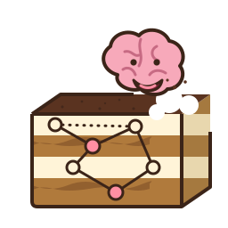
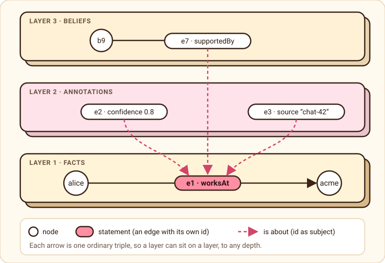
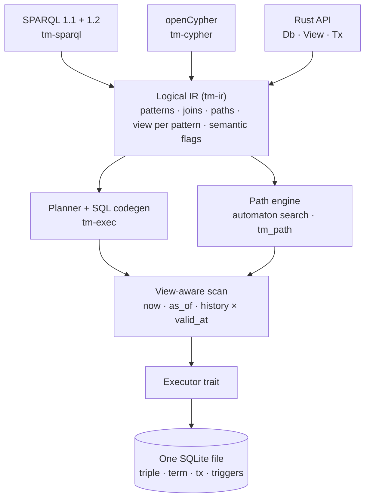

<p align="center"></p>

<h1 align="center">Tiramemsu</h1>

<p align="center"><em>Your agent’s brain loves Tiramemsu.</em></p>

<p align="center"><strong>Layered, never-forget memory for agents.</strong><br>
An embedded graph database on SQLite. Every fact has an id, so facts can carry layers of provenance and belief, and every change is kept with when it was made and when it was true.</p>

<p align="center"><a href="site/articles/layered-graphs.html">Layered graphs, explained</a> · <a href="site/articles/tiramemsu-vs-oxilite.html">Tiramemsu vs oxilite</a> · <a href="site/articles/metagraphs.html">Metagraphs</a> · <a href="lat.md/">Design (lat.md)</a> · <a href="openspec/specs/">Specs (OpenSpec)</a></p>

> **Status: new.** Designed and implemented in September 2026 as one Rust library. It is not published to crates.io, has no server yet, and runs on rusqlite only. Node.js and Python packages exist in [`bindings/`](bindings/) but are not published either. What is measured and what is not is listed under [Status](#status).

## Why

A knowledge graph stores facts. An agent also needs to say *how sure am I*, *where did I read it*, *what do I conclude from it*, and later *I was wrong*. Those are statements about statements. In tiramemsu a fact is a row `(eid, s, p, o)` with its own id, and an id can be the subject or object of another statement. That gives you **layered graphs** with no second data structure:

<p align="center"></p>

## Features

- **Layers.** Provenance, confidence and beliefs stack to any depth. Retracting a fact retracts its layers, and correcting it replays them.
- **Bitemporal.** Transaction time (when the database believed it) and valid time (when it was true). `now`, `as_of(t)`, `history` and `valid_at(d)` views, per query or per pattern.
- **Never forget.** SQLite triggers reject `DELETE` and any second change to a row, inside the file. Forgetting means retracting. Erasure for legal reasons is planned as crypto-shredding (destroy a key, keep the rows).
- **Memory verbs.** Idempotent `assert`, `create` for parallel edges, `supersede` (correct a fact and replay its layers), `confirm` (another source agrees), cardinality-one and unique predicates, and `with` / `dry_run` for changes that leave no trace.
- **SPARQL and Cypher, one store.** SPARQL 1.1 with RDF 1.2 annotations, and openCypher, share one logical IR and one semantics table. A relationship is also a `:Statement` node, so Cypher can reach layers.
- **Paths.** Reachability, trails and shortest paths through a native automaton search, also as a SQL table function (`tm_path`). Paths can cross layers, stay inside named graphs, and be time-respecting (valid time never goes backwards along the walk), also from SPARQL (`SERVICE <urn:tiramemsu:tm:timeRespecting/…>` with `tm:arrival`) and Cypher (`MATCH TIME RESPECTING AFTER $t ARRIVAL AS t`). Path results say whether the search was exhaustive, stopped at an explicit bound, or cut by the configured hop cap.
- **Named graphs as tags.** A graph is a node, or a statement, and membership is one more layer statement. `GRAPH`, `FROM`, `FROM NAMED` and `WITH` work with no new column or table.
- **Metagraphs.** Edges are vertices (statement ids), and vertices and edges are containers (graphs named by a node or a statement). Nesting, fold and unfold are ordinary statements, so they travel in time.
- **Bulk import.** An opt-in import session commits chunks as ordinary atomic transactions, holds the write lease, skips the per-commit `ANALYZE`, and refreshes planner statistics once when finished. Progress counts committed rows and rejected chunks; cancelling keeps every committed chunk.
- **Text recall.** Opt-in FTS5 recall over string values (inline short strings included): `View::text_search`, SPARQL `?e tm:textMatch "words"` and Cypher `CALL tiramemsu.text.search(...)` share one operation. Hits respect as-of, history, valid time and graphs, and carry a lexical score plus evidence (confidence, confirmations, authors, when added); absent evidence is reported as absent, and ties break on the statement id.
- **Cyclic joins.** Opt-in native leapfrog triejoin for pure cyclic patterns (triangles and longer cycles) as the `tm_lftj` table function: `OpenOptions::planner.lftj`. It returns exactly the SQL rows (set or bag semantics, per-pattern views, graphs, provenance), routes only when enabled, installed, applicable and the size estimate agrees, and `explain_sparql` names the route or the reason it stayed in SQL.
- **Bounded calls.** Opt-in query budgets: a deadline, cancellation from another thread, a reader-pool timeout and row or byte limits per operation. A stopped write commits nothing, and an over-budget result is an error, never a truncated answer.
- **Saved answers.** Save a SPARQL or Cypher query with its parameters, view and result, and let later events mark it: `stale` when a cited statement is retracted or superseded, `recheck` when any other write (or the clock) could have changed it. Each mark is reported once, survives restarts, and only a successful re-run clears it; answers on past views stay fresh.
- **MCP server.** `tiramemsu-mcp` serves one memory file to Claude Code, Claude Desktop or any MCP client over stdio (`claude mcp add tiramemsu -- tiramemsu-mcp --db ./memory.db`): typed `assert`, `confirm`, `supersede`, `query`, `dependents`, bundle, `text_search` and saved-answer tools, a read-only mode, per-call budgets, and query results that name their view and say whether their provenance is complete.
- **Embedded.** One SQLite file (WAL, STRICT). The core reaches SQLite through a small synchronous executor trait.

### What agents are saying

Early feedback from the people it is for. We made these up, but each one is about something the code really does.

> “I used to say *‘I recall you said Acme’* with total confidence. Now I say *0.8, from chat-2026-09-29*. My humans find this either reassuring or unsettling.” — a chatbot, on layers

> “I was wrong about where Alice works. `supersede` fixed the fact and carried my confidence over to it. I have never felt so forgiven.” — an assistant, on supersede

> “My last memory store let me `DELETE` things. I do not trust myself with that kind of power. Here the triggers say no, in the file itself.” — a cautious agent, on never forgetting

> “A user asked what I believed last Tuesday. I ran `as_of` and answered without a single hallucination. I asked for a raise in tokens.” — a support agent, on bitemporal views

> “I wanted to try a wild idea without committing to it. A `with` block let me be reckless and leave no trace.” — a planner agent, on speculation

> “My orchestrator speaks SPARQL and my intern speaks Cypher. They now share one store and, for the first time, one opinion.” — a multi-agent swarm, on two query languages

## Questions only layers can answer

Every statement and every layer on it has an id, both clocks, a structural link to what it is about, and a row that is never deleted. Together those answer questions that usually need glue code, each in one query. All of these are tests; the queries are in [`lat.md/recipes.md`](lat.md/recipes.md) and explained in [the article](site/articles/layer-recipes.html).

| Question | How |
|---|---|
| What did this belief rest on, back then? | A path from the belief through statement ids, inside `SERVICE <tm:asOf/150>` |
| What breaks if I retract this? | `View::dependents(eid)` on any view, with no write lock; equal to the path `(^sys:subject\|^sys:object)*` |
| Who wrote this, and why was that forgotten? | `?r tm:txAdded ?t . ?t sys:author ?who`, and `tm:txRetracted` → `sys:reason` |
| How was this fact corrected over time? | `?r sys:supersedes+ ?old` |
| Where do my sources disagree? | Same subject and predicate, different objects, overlapping valid time, different authors |
| How late did we learn it? | `tm:addedAt` / `r.addedAt` against `tm:validFrom` / `tm:validTo` |
| Which of my answers are stale? | `View::sparql_with(q, &SparqlOptions { provenance: true })` cites the statement ids behind every row |
| Can I hand this fact to another agent? | `View::bundle(eid)` exports it with its layers and evidence; `Tx::import_bundle` asserts it idempotently |
| Can I stop layers from rotting? | `(v:confidence sys:subjectType sys:STMT)` rejects a confidence on anything but a statement |
| What can I reach inside one session? | Recursive paths under `GRAPH <g>` / `GRAPH ?g` only cross the graph's statements |
| What does this edge contain? | `GRAPH <urn:tiramemsu:stmt:n> { … }`: a statement names a graph, its contents follow a supersede and go with a retraction |
| Could this have reached B, and when? | Time-respecting paths: valid time never goes backwards along the walk, and each row carries its earliest arrival |

## Architecture



| Crate | Role |
|---|---|
| `tm-core` | ObjectId codec, term dictionary, format-1 schema and triggers, the transaction engine, views, the `Executor` trait. No SQLite dependency. |
| `tm-rusqlite` | The rusqlite host: bundled SQLite, functions, virtual tables. |
| `tm-ir` | Logical algebra, per-pattern views, semantic flags. |
| `tm-exec` | Planner, SQL codegen, path engine, result decoding. |
| `tm-sparql` | SPARQL front end. |
| `tm-cypher` | openCypher front end. |
| `tiramemsu` | The facade: `Db`, `View`, `Tx`. The only crate an application needs. |

Each layer depends only on the one below it, and time is resolved in exactly one place. The full design is in [`lat.md/`](lat.md/), and every capability has a spec under [`openspec/specs/`](openspec/specs/).

## Quick start

From [`crates/tiramemsu/examples/quickstart.rs`](crates/tiramemsu/examples/quickstart.rs). Run it with `cargo run -p tiramemsu --example quickstart`.

```rust
let db = Db::open(dir.join("memory.db"), OpenOptions::default())?;

// 1. A fact is a statement with its own id, so it can carry layers.
db.transact(TxOptions::default(), |tx| {
    let eid = match tx.assert(v("alice"), v("worksAt"), v("acme"), Valid::ALWAYS)? {
        Asserted::New(e) | Asserted::Existing(e) => e,
    };
    tx.assert(Value::Stmt(eid), v("confidence"), &conf, Valid::ALWAYS)?;
    tx.assert(Value::Stmt(eid), v("source"), Value::str("chat-2026-09-29"), Valid::ALWAYS)?;
    Ok(())
})?;

// 2. Correct it. The layers are replayed on the new fact; nothing is deleted.
let corrected = db.transact(TxOptions::default(), |tx| {
    tx.supersede(fact, Patch { o: Some(v("globex")), ..Patch::default() })?;
    Ok(())
})?;

// 3. What is believed now, and what was believed before the correction?
let q = "SELECT ?who ?org WHERE { ?who v:worksAt ?org }";
db.as_of(TimeRef::Tx(corrected.t.0 - 1)).sparql(q)?;   // alice → acme
db.now().sparql(q)?;                                   // alice → globex

// 4. The same store in Cypher. The confidence layer is a relationship property.
db.now().cypher("MATCH (p)-[r:worksAt]->(o) RETURN p, o, r.confidence", &CypherParams::default())?;
```

Layer queries in SPARQL use RDF 1.2 annotation syntax, and Cypher sees the id as a relationship and as a `:Statement` node:

```sparql
SELECT ?c ?s WHERE { v:alice v:worksAt v:acme {| v:confidence ?c ; v:source ?s |} }
```

```cypher
MATCH (a)-[r:worksAt]->(c), (b:Belief)-[:supportedBy]->(r) RETURN a, c, r.confidence, b
```

## Build and test

Rust 1.91.1 is pinned in `rust-toolchain.toml`. If your shell finds another `rustc` first (for example Homebrew's), put rustup's first on `PATH`, because `open-cypher` needs 1.88 or newer.

```sh
export PATH="$HOME/.cargo/bin:$PATH"
cargo build --workspace
cargo test --workspace                 # 1 109 tests; PROPTEST_CASES=64 to speed up property tests
cargo clippy --workspace --all-targets -- -D warnings
lat check                              # design graph and code refs stay in sync
```

## Status

| | |
|---|---|
| Size | About 68 000 lines of Rust in 7 crates, 1 109 tests, 38 capability specs |
| SPARQL | 634 of 781 in-scope W3C tests pass (66 more are skipped: named-graph data and unsupported formats). Every failing one is listed with a reason in `crates/tm-sparql/tests/w3c/expected-deviations.toml`, and an unexpected result fails the build |
| Cypher | 2 615 of 3 880 openCypher TCK scenarios (67 %). Temporal types, `CALL`, and a few dual-view cases are deferred and listed in `crates/tm-cypher/tests/tck/allowlist.txt` |
| Speed | Raw SQLite lookups on the schema take about 4 µs at 11 million statements; about 150 bytes per statement with all indexes. See [`bench/`](bench/) |

**Known limits.** As-of lookups slow down as one key collects many updates. A membership per statement roughly doubles the file. SPARQL decimals come back as doubles. Recursive paths add no statement ids to query provenance (results say so: `provenance_gaps`). There is no WASM binding or network server yet; the MCP server is local stdio only. The comparison with oxilite's change-log approach to history is not benchmarked head to head.

## How it differs from oxilite

[oxilite](https://github.com/Volland/oxilite) is a shipped, Oxigraph-compatible RDF database on SQLite by the same author. It stores quads and uses reifiers for annotations, keeps history in a change log, and runs on D1, WebAssembly and more. Tiramemsu stores statements with ids, keeps lifetime in the row and is bitemporal, but it is new, runs on rusqlite only and has none of oxilite's reasoning or validation, and its Node.js and Python packages are not published yet. [The article](site/articles/tiramemsu-vs-oxilite.html) has the details and a benchmark.

## Repository

| Path | Contents |
|---|---|
| `crates/` | The seven crates |
| `lat.md/` | The design as a cross-linked knowledge graph: architecture, data model, time model, storage, query, tests |
| `openspec/specs/` | Requirements with scenarios, one folder per capability; `openspec/changes/archive/` has the changes that built them |
| `bindings/` | The JSON bridge, and the Node.js (`@tiramemsu/node`) and Python (`tiramemsu`) packages built on it; publishing guides in `docs/` |
| `bench/` | SQLite versus DuckDB, and ids versus reifiers, benchmarks with results |
| `docs/design-options.md` | The option analysis behind the design decisions |
| `site/` | The static website (GitHub Pages) and its articles |

## Website

`site/` is plain HTML and one stylesheet, with no build step, no scripts and no external fonts. `.github/workflows/pages.yml` publishes it to GitHub Pages on pushes to `main` that touch `site/`. Enable it once under *Settings → Pages → Source: GitHub Actions*.

## License

MIT OR Apache-2.0.
