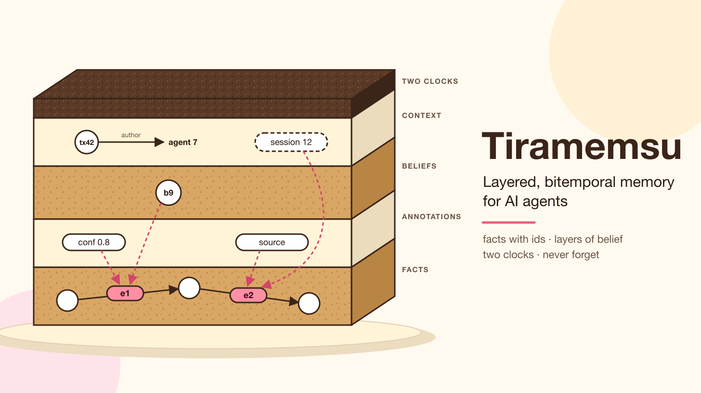
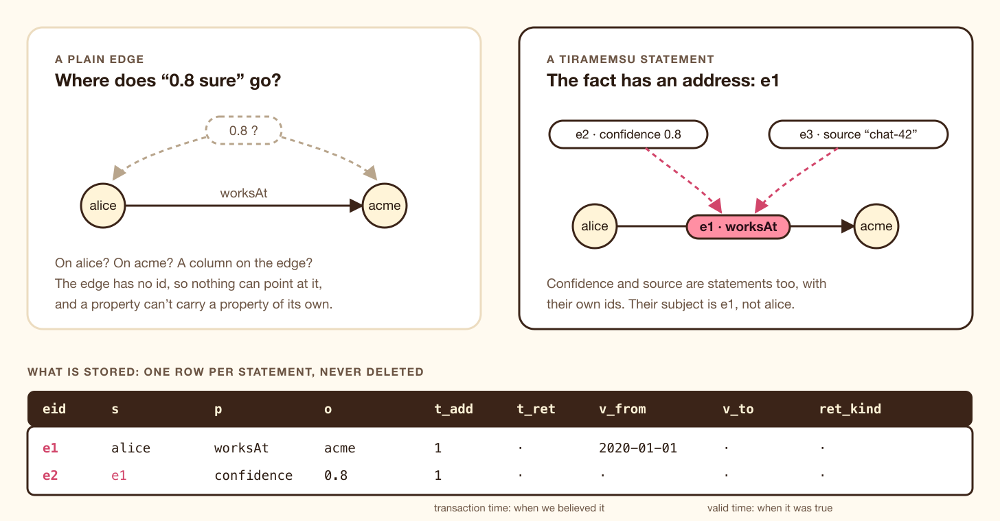
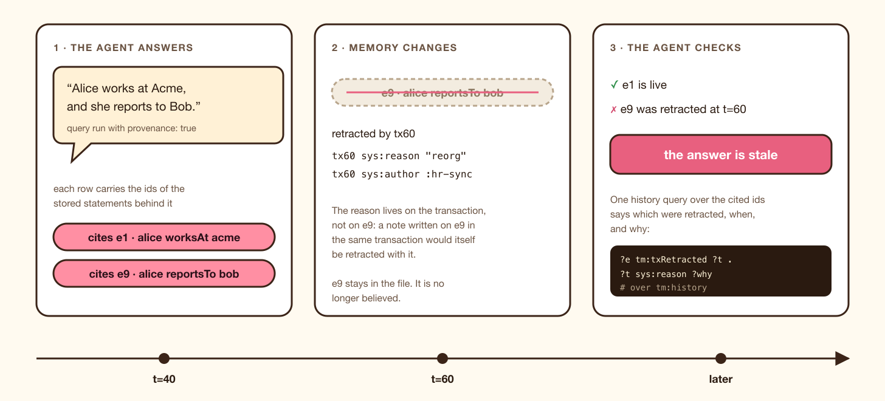
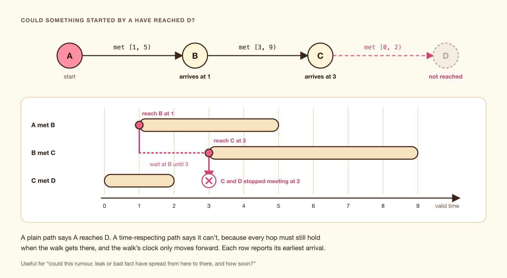

# Tiramemsu: memory that remembers being wrong

*Layered graphs, two clocks and a rule against forgetting. An embedded graph database on SQLite for agents that need to say how sure they are, where they read something, and what they believed last Tuesday.*



---

Ask your agent where Alice works, and it says "Acme."

That answer is fine until you ask the next few questions:

- **How sure are you?**
- **Where did you read that?**
- **Since when has it been true, and is it still true?**
- **What did you believe last Tuesday, when you booked the meeting?**
- **And when you found out you were wrong, what else did that change?**

Most agent memory today cannot answer any of these. A vector store holds chunks of text, with no notion of a fact, let alone a fact about a fact. A typical knowledge graph holds the current state: when Alice changes jobs, the edge is overwritten, and the old belief, its source and the time we believed it are gone. The agent sounds confident and has no way to back it up.

I built **Tiramemsu** to answer those questions directly. It is an embedded graph database, one SQLite file linked into your process, and it is built on three ideas:

1. **Every fact has an address.** A triple is a row with its own id, so other facts can point at it. Stacking those pointers gives you *layered graphs*: confidence, provenance and beliefs about facts, to any depth.
2. **Two clocks.** Every fact records when the database believed it (*transaction time*) and when it was true in the world (*valid time*).
3. **Never forget.** No row is ever deleted or rewritten. Being wrong is recorded, not erased.

The rest of this post goes through each idea, the queries it makes possible, and what is unusual about putting all three in one row. It ends with how it works under the hood and an honest list of what isn't done yet.

The name, if you were wondering, comes from tiramisu, and yes, the layers are the point. Our slogan is "Your agent's brain loves Tiramemsu."

## What an agent's memory actually needs

Before any design, here is the list of requirements I kept coming back to. An agent's memory should be able to:

- **Say how sure it is**, per fact, not per document.
- **Cite where a fact came from**: which conversation, which crawler, which user, which import.
- **Hold beliefs about facts**: "I conclude X because of fact Y", where Y is a specific stored statement, not a string that happens to match.
- **Tell belief time from world time.** "We learned in March that she left in January" is two different times, and both matter.
- **Correct itself without amnesia.** Fixing a fact should not destroy the record that we once believed otherwise, or the evidence attached to it.
- **Answer the audit question**: what did the agent know when it acted?
- **Move a belief to another agent** along with its evidence.

Each of these exists somewhere. RDF-star and RDF 1.2 can annotate triples. Datomic treats transactions as entities and lets you query the database as of any point. XTDB is bitemporal. Graphiti, a temporal knowledge graph built for agent memory, closes an edge's validity window when a newer fact contradicts it. What I couldn't find was all of them *in one statement*, so that a single query can walk from a belief to its evidence, rewind that walk to an earlier transaction, and ask who wrote each step and why.

## Idea one: give every fact an address

Here is the problem in one picture.



*A plain edge has no address, so "0.8 sure" has nowhere to go. In Tiramemsu the fact is statement e1, and confidence and source are statements about e1.*

In a property graph, you can put `confidence: 0.8` on the `worksAt` relationship. But now you want to say *who* estimated 0.8, and *when*. A property cannot have properties. And a relationship cannot be the endpoint of another relationship, so "belief b9 is supported by *this* employment fact" can't be expressed as an edge.

RDF has the same problem with more ceremony. Classic reification turns one triple into four. RDF-star and RDF 1.2 add quoted triples and annotations, which help, but the quoted triple is still a *value*, not a stored thing with an identity and a lifetime.

Tiramemsu stores every statement as one row:

```
(eid, s, p, o, t_add, t_ret, v_from, v_to, ret_kind)
```

The `eid` is the statement's address. It is never reused. The subject or the object of any statement can be another statement's eid. That's the whole trick. Properties are statements too, so `confidence 0.8` is itself statement e2, with its own id, its own two clocks, and room for further statements about it.

This is the "domain graph" idea from MillenniumDB, a research graph database that gives every edge an id, and the uniform statement model of Amazon Neptune's OneGraph. Tiramemsu drops MillenniumDB's separate properties table, so that *everything* is addressable. If you've read my writing on metagraphs, this is a metagraph made practical: edges are first-class, so edges can connect edges.

## Idea two: layered graphs

Once facts have addresses, layers come for free. A layer is just more triples whose subject or object is a statement id.


*Layers are ordinary triples about statement ids. There's no second data structure and no depth limit.*

In the picture:

- **Layer 1, facts:** `e1 = (alice, worksAt, acme)`.
- **Layer 2, annotations:** `e2 = (e1, confidence, 0.8)` and `e3 = (e1, source, "chat-42")`.
- **Layer 3, beliefs and evidence:** `e7 = (b9, supportedBy, e1)`, where the object is a statement. And `e8 = (e7, method, "llm-extraction")`: *how* the belief got its support. Layers nest.
- **Layer 4, context:** the transaction that wrote e1 is a node too, with `sys:author :agent7`. The membership of e1 in `:session12` is a statement with its own id.

There are two rules. A statement cannot use its own eid as its subject or object. Longer cycles (e7 about e8 about e7) are allowed, and the engine handles them.

### Querying layers

SPARQL reads layers with the RDF 1.2 annotation syntax:

```sparql
SELECT ?c ?s WHERE {
  v:alice v:worksAt v:acme {| v:confidence ?c ; v:source ?s |}
}
```

In Cypher, a statement is both a relationship and a `:Statement` node (the *dual view*). The confidence layer reads like a relationship property, and a belief can point at a relationship:

```cypher
MATCH (a)-[r:worksAt]->(c), (b:Belief)-[:supportedBy]->(r)
RETURN a, c, r.confidence, b
```

Both languages compile to the same logical plan over the same store, and a differential test suite checks that they agree.

### Typed layers keep annotations honest

A common bug in annotated graphs is a confidence that lands on the wrong thing: on the node `alice` instead of on the statement about Alice. You can declare that a predicate annotates statements only:

```
(v:confidence  sys:subjectType  sys:STMT)
```

After that, `(e1 v:confidence 0.8)` is accepted and `(v:alice v:confidence 0.8)` fails with `SubjectTypeMismatch`, from the API, SPARQL and Cypher alike. A query for `?e v:confidence ?c` then only ever sees statement annotations.

### Named graphs are just another layer

Sessions, agents and sources are often modeled as named graphs. In most stores that means a fourth column. In Tiramemsu a graph is a node, and membership is one more layer statement, `(e1 sys:inGraph :session12)`, with its own id and its own two clocks.

This has consequences you can use:

- One fact keeps **one** identity however many graphs it's in. Confidence on the fact belongs to the fact, not to a copy per graph.
- Membership has **its own time**. Under `asOf`, you see the graph as it was.
- Deleting from a graph retracts the **membership**, not the fact.
- **Paths can stay inside a graph.** `GRAPH v:session12 { v:alice v:knows+ ?x }` only crosses statements that are members of `session12`, so you can reason over one session's beliefs without the rest of memory leaking in.

## Idea three: two clocks

Take the sentence *Alice works at Acme*. It carries two times, and people mix them up constantly.

- **Transaction time** is when the database learned the fact, and when it stopped believing it. It belongs to the database, and nobody can change it afterwards, because it is the record of what happened.
- **Valid time** is when the fact held in the world. Alice started at Acme in 2020 and left at the end of 2023. That belongs to reality. We may learn it late, or get it wrong and fix it.

A store with only transaction time can replay what it believed, but can't say when things were true. A store with only valid time can say when things were true, but forgets that it once believed something else. With both, you can ask four questions:

- *True now, believed now:* what do we think is true today?
- *True then, believed now:* what do we now think was true in 2024?
- *True now, believed then:* what did we think was true today, back then?
- *True then, believed then:* what did we think about 2024, back then?

The last one is what audits, incident reviews and "why did the agent say that?" need.

### A worked example

Three things happen to what we know about Alice:

1. **Transaction 1.** We learn `alice worksAt acme`, valid from 2020-01-01, with no end.
2. **Transaction 2.** We learn she actually left at the end of 2023. We *supersede* the fact with an end date of 2024-01-01.
3. **Transaction 3.** We learn she joined Globex on 2024-03-01.

Nothing is deleted. Here is what the store holds, drawn on both clocks:


*Each statement is a rectangle. A query is a horizontal cut (as of some transaction), a vertical cut (valid at some date), or both.*

The same question, "who does Alice work for?", gives a different answer in each view:

- **now:** acme and globex. Both episodes are believed, and without a valid-time filter both show.
- **now, valid at 2026-01-01:** globex.
- **now, valid at 2024-02-01:** nobody. There are two months between jobs, and the database says so.
- **as of t=1:** acme.
- **as of t=1, valid at 2026-01-01:** acme. We believed she was still there. We were wrong, and we remember being wrong.

That last line is the heart of the project.

### Asking in code

Time can be chosen for a whole query or for one part of it. From Rust:

```rust
let q = "SELECT ?org WHERE { v:alice v:worksAt ?org }";
db.now().sparql(q)?;
db.as_of(TimeRef::Tx(1)).sparql(q)?;
db.as_of(TimeRef::Tx(1)).valid_at(jan_2026_ms).sparql(q)?;
```

In SPARQL, time goes in `FROM` for the whole query:

```sparql
SELECT ?org
FROM <urn:tiramemsu:tm:asOf/1>
FROM <urn:tiramemsu:tm:validAt/2026-01-01>
WHERE { v:alice v:worksAt ?org }
```

In Cypher it's a `USE` clause:

```cypher
USE AS OF 1 VALID AT date('2026-01-01')
MATCH (a)-[:worksAt]->(c) RETURN a, c
```

The feature I use most is **per-pattern time**. One part of a query can look at the past while another looks at the present, which makes "what changed?" a single query:

```sparql
# what changed about Alice's employer between tx 150 and now
SELECT ?before ?after WHERE {
  SERVICE <urn:tiramemsu:tm:asOf/150> { v:alice v:worksAt ?before }
  v:alice v:worksAt ?after .
  FILTER (?before != ?after)
}
```

One design decision is worth pointing out: **valid-time filtering is always opt-in.** With no clause, you get "believed now", with valid time unfiltered. An implicit "valid now" would quietly hide every past fact, which is the opposite of what a memory is for.

### How late did we learn it?

Because every statement carries both clocks, you can compare them. `tm:addedAt` is the wall-clock instant a statement was recorded, and `validTo` is when it stopped being true. Put them together and you measure how *late* memory was:

```sparql
# facts recorded after they had already stopped being true
SELECT ?s WHERE {
  ?s v:worksAt ?o ~ ?r .
  ?r tm:addedAt ?a ; tm:validTo ?to
  FILTER(?a > ?to)
}
```

```cypher
// learned more than $days days after it became true
MATCH (a)-[r:worksAt]->(c)
WHERE r.addedAt.epochMillis - r.validFrom.epochMillis > $days * 86400000
RETURN a, c
```

Only a store with both clocks on every statement can ask this. The instants are virtual predicates computed from the transaction table, so they cost one lookup and no stored row.

## Never forget, and how to be wrong gracefully

"Never delete anything" sounds like a slogan until you ask how a system is supposed to change its mind. Tiramemsu's answer is a small set of *memory verbs*, each of which adds to history instead of rewriting it.

- **`assert`** adds a fact, and it's **idempotent**. Asserting something already believed, with an overlapping valid time, returns the existing id. An agent that re-reads the same document doesn't pile up duplicates.
- **`create`** always makes a new statement. This is how you get parallel edges: two phone calls are two facts.
- **`retract`** ends belief in a fact and **cascades**: every statement whose subject or object is that fact is retracted in the same transaction. Retracting `alice worksAt acme` retracts its confidence, its source, the belief that cited it, and its graph memberships, but never other facts about Alice or Acme.
- **`supersede`** corrects a fact, including its valid-time interval, and **replays its layers** onto the corrected version.
- **`confirm`** records that another source agrees, and changes nothing else.
- **`with` and `dry_run`** apply changes hypothetically, let you query the result, and throw them away. Nothing reaches history.

Supersede is the interesting one. Here is what a correction looks like:


*A correction retracts the fact together with its layers, replays them under new ids with the fix applied, and links the new version to the old one.*

In one transaction, supersede:

1. Computes the fact's cascade set: e1 and everything standing on it (e2, e7, e8).
2. Retracts all of them, marked with the reason `supersede`.
3. Inserts them again under new ids, with the patch applied to the root: e10 now starts in February.
4. Records `e10 sys:supersedes e1`.

So every annotation and every belief that relied on the fact **survives the correction**, and the history shows exactly one correction event. Because each supersede also replays the earlier `sys:supersedes` link, the whole edit history of a fact is one path query:

```sparql
SELECT ?old WHERE { v:alice v:age ?a ~ ?r . ?r sys:supersedes+ ?old }
```

There's a subtle case that I think the design gets right. Some predicates hold one value at a time, and you can declare them `sys:cardinality sys:one`. When Alice's age goes from 30 to 31, that is **not** a correction. It's a different fact. The source and confidence of "30" don't apply to "31". So a cardinality-one change retracts the old value *with* its layers and replays nothing. Supersede means "I got this fact wrong." Cardinality-one replacement means "the world moved on." They behave differently because they mean different things.

### The file defends itself

"Never forget" isn't just a promise in the library code. It is enforced by **SQLite triggers inside the file**. They refuse `DELETE` on statements, terms and transactions, any second change to a row, and any reuse of an id. The only change ever allowed to a stored statement is setting its retraction time once, from empty. A script that opens the file with plain `sqlite3` gets the same protection.

Two practical exceptions keep this from becoming a burden:

- **High-churn state** that doesn't deserve history, such as `lastSeen`, counters or per-turn scores, goes in a separate `volatile` table, outside the graph. The rule of thumb: if you would ever ask "why?" or "as of when?" about a value, it's a triple. Otherwise it's volatile.
- **Legal erasure** is designed as *crypto-shredding*. Values of predicates marked sensitive are encrypted with a per-person key, and erasing someone destroys the key, not the rows. The file format already reserves space for it. It is scheduled, not built.

## Sources: where a memory came from

The most useful layer for an agent is often not confidence. It is **provenance**: who told me this, and when.

In Tiramemsu, **transactions are nodes.** Every committed write gets a transaction number and a wall-clock instant, and metadata on the transaction is ordinary triples: `sys:author`, `sys:source`, `sys:reason`, or any predicate you like. Every statement links to the transaction that wrote it through a virtual predicate, `tm:txAdded`, which costs no stored row.


*Where a fact came from, how many sources back it, and where sources disagree are all queries over data that is already stored.*

Some questions this answers directly:

```sparql
# every employment fact written by agent7
SELECT ?who ?c WHERE {
  ?who v:worksAt ?c ~ ?r .
  ?r tm:txAdded ?t .
  ?t sys:author v:agent7
}

# why were facts forgotten?
SELECT ?who ?why FROM <urn:tiramemsu:tm:history> WHERE {
  ?who v:worksAt ?c ~ ?r .
  ?r tm:txRetracted ?t .
  ?t sys:reason ?why
}
```

One detail is deliberate: **the reason for a retraction goes on the transaction, never on the retracted fact.** A note written on e9 in the same transaction that retracts e9 would itself be cascaded away. Putting the reason on the transaction keeps it.

**Confirmation** is a statement too. `confirm(e1)` asserts `(e1 sys:confirmedBy tx31)`, and tx31 carries its own author and source. So "seen five times from three sources" is a query over confirmations joined to transaction metadata. It's never a counter that drifts out of sync.

**Contradictions** between sources become a query as well. Look for two believed statements with the same subject and predicate, different objects, overlapping valid time, and different transaction authors:

```sparql
SELECT ?s ?o1 ?o2 ?a1 ?a2 WHERE {
  ?s v:worksAt ?o1 ~ ?r1 . ?s v:worksAt ?o2 ~ ?r2 .
  FILTER(STR(?o1) < STR(?o2))
  ?r1 tm:txAdded ?t1 . ?t1 sys:author ?a1 .
  ?r2 tm:txAdded ?t2 . ?t2 sys:author ?a2 .
  FILTER(?a1 != ?a2)
  OPTIONAL { ?r1 tm:validFrom ?f1 } OPTIONAL { ?r1 tm:validTo ?u1 }
  OPTIONAL { ?r2 tm:validFrom ?f2 } OPTIONAL { ?r2 tm:validTo ?u2 }
  FILTER((!BOUND(?f1) || !BOUND(?u2) || ?f1 < ?u2) &&
         (!BOUND(?f2) || !BOUND(?u1) || ?f2 < ?u1))
}
```

Episodes that don't overlap, like a later job, aren't reported. And if you'd rather *prevent* a conflict than find it, declare the predicate cardinality-one, and the second write replaces the first on write.

## Answers that cite their facts

Here is a failure mode every RAG and agent builder knows. The agent answered a question last week. Since then, one of the facts behind that answer turned out to be wrong. Which of the agent's past answers should it stop trusting?

Tiramemsu can attach, to every row of a SPARQL result, the ids of the stored statements that produced it:

```rust
let answer = view.sparql_with(q, &SparqlOptions { provenance: true })?;
let cited = answer.solutions().unwrap().provenance(0).unwrap(); // sorted eids
```

The agent stores those ids with its answer. Later, one history query over them tells it which were retracted, when, and why:

```sparql
SELECT ?e ?t FROM <urn:tiramemsu:tm:history> WHERE {
  VALUES ?e { <urn:tiramemsu:stmt:12> <urn:tiramemsu:stmt:19> }
  ?e tm:txRetracted ?t
}
```



*An answer that keeps the ids of its facts can find out when it goes stale.*

Provenance counts what *matched*: optional parts that bound, the union branch taken, annotations and graph memberships. It doesn't count what a filter only *tested*. Turning it on never changes the rows, and a property test checks that a fresh store holding only the cited statements reproduces each row.

The reverse question matters just as much. Before retracting a fact: **what would this take with it?** `View::dependents(e1)` walks the same cascade a retraction would, as a read on any view, without taking the write lock:

```rust
let at_risk = db.now().dependents(e1)?;                   // what a retraction would take now
let then    = db.as_of(TimeRef::Tx(150)).dependents(e1)?; // what depended on it back then
```

It is never truncated, because an under-reported impact list is the worst possible answer to "what breaks if I do this?"

## Paths through layers, and through time

Graph databases are good at paths. Tiramemsu's paths can do two things most can't.

**They can cross into statements.** A path can land on a statement id and keep going. Starting at a belief, you can follow `supportedBy` onto the fact it rests on, then along `derivedFrom` links between statements, and read the whole walk as of an earlier transaction:

```sparql
SELECT ?src WHERE {
  SERVICE <urn:tiramemsu:tm:asOf/150> {
    v:belief9 v:supportedBy/v:derivedFrom* ?src
  }
}
```

Under `asOf`, the walk sees the links as they were then, including links retracted since. Neo4j can't point an edge at an edge, most RDF-star stores can't run property paths through quoted triples, and Datomic's datoms have no identity to walk to.

**They can respect time.** A plain path answers "is there a route from A to D?" A *time-respecting* path answers "could something have *travelled* from A to D?" Every fact it crosses must still hold when the walk reaches it, and the walk's clock only moves forward.



*A plain path says A reaches D. A time-respecting path says it can't: by the time anything reached C, C and D had stopped meeting.*

Think of a rumor, a leaked secret, a bad fact spreading between agents, or an infection. The question is not only whether D is *connected* to A, but whether anything from A *could have reached* D, and how soon. Each row comes back with its **earliest arrival**:

```rust
let args = PathArgs {
    time_respecting: Some(TimeRespecting { after: None }),
    ..PathArgs::default()
};
let rows = view.path_with(a, "met+", &args)?;
// B arrives at 1, C at 3; D is not reached
```

All four path modes support it (reachability, trails, any shortest, all shortest), and a property test compares every mode with brute-force enumeration of all time-respecting walks on random graphs.

## Handing a belief to another agent

Tiramemsu is embedded, and the natural setup is **one SQLite file per agent**. Then agents need to share, and sharing a bare triple throws away exactly what makes it trustworthy: the confidence, the source, the belief it supports.

A **fact bundle** moves a fact together with its layers, the statements it rests on and its graph memberships:

```rust
let bundle = agent_a.now().bundle(e1)?.to_json(); // "tiramemsu-bundle/1"
agent_b.transact(TxOptions::default(), |tx| {
    tx.meta(Value::iri(vocab::SYS_SOURCE), v("agentA"))?; // provenance of the import
    tx.import_bundle(&Bundle::from_json(&bundle)?)?;
    Ok(())
})?;
```


*A bundle carries a belief with its evidence. Ids are local to the bundle, because eids and transaction numbers belong to one file.*

Import uses assert semantics, so it's **idempotent**: importing twice changes nothing, and if agent B already knows the fact, the layers attach to B's existing statement instead of creating a duplicate. What stays behind is what only makes sense locally: transaction numbers, confirmations and history. B records *when B learned it*, from whom, in its own clock. Bundles also export as RDF 1.2 N-Triples with reifiers, for other RDF tools.

## Under the hood


*Two query languages, one logical plan, one place where time is resolved, one SQLite file.*

A few design choices that matter in practice:

- **SQLite, on purpose.** Agent memory is embedded, per-request and write-heavy in small pieces. I benchmarked DuckDB against SQLite on the same 11 million statements. SQLite answered a point lookup in about 4 µs against DuckDB's 414 µs, and a 2-hop query in 7.5 µs against about 1 ms. DuckDB won the whole-store aggregates by a mile, so it's still useful as a read-only analytics tool that attaches the file. It just isn't the engine.
- **A row carries its own lifetime.** There is no separate change log. "Now" queries use *partial* indexes (`WHERE t_ret IS NULL`), so they never touch retracted rows. "As of" queries use full history indexes ordered newest-first, so the past is one index range, not a log replay.
- **Time is resolved in exactly one place.** A view-aware scan turns a view into conditions on four columns, and SPARQL, Cypher and the path engine all read through it. They can't disagree about what "as of t" means.
- **Small values live inside the id.** Every value is a 64-bit integer with a 4-bit tag in the low bits. Integers, booleans, dates, date-times with their timezone offset, and strings of up to 7 bytes are stored inline, with no dictionary lookup. The low-bit tag keeps small ids small in SQLite's variable-length integers.
- **Paths are a native engine**, an automaton search over the graph, not recursive SQL. It is also exposed as a SQL table function, `tm_path`.
- **The core never names SQLite.** It reaches the database through a small synchronous executor trait, so it can move to other SQLite hosts later.

With every index, the store takes about 150 bytes per statement.

## Trying it

The Rust quick start is in the repository (`cargo run -p tiramemsu --example quickstart`). Here is the same story in Python:

```python
from tiramemsu import Database, Iri

V = "urn:tiramemsu:v:"  # written `v:` in queries
alice, works_at, acme, globex, confidence = (
    Iri(V + name) for name in ("alice", "worksAt", "acme", "globex", "confidence")
)
db = Database("memory.db")

# 1. A fact is a statement with its own id, so it can carry layers.
with db.transact() as tx:
    job = tx.assert_(alice, works_at, acme)
    tx.assert_(job, confidence, 0.8)
fact = tx.report.asserted[0]

# 2. Correct it: the layers are replayed on the new fact, nothing is deleted.
with db.transact() as tx:
    tx.supersede(fact, o=globex)

# 3. What is believed now, and what was believed before the correction?
q = "SELECT ?org WHERE { v:alice v:worksAt ?org }"
db.as_of(tx=1).sparql(q)   # acme
db.now().sparql(q)         # globex

# 4. The same store in Cypher: the confidence layer is a relationship property.
db.now().cypher("MATCH (p)-[r:worksAt]->(o) RETURN p, o, r.confidence AS conf")  # conf = 0.8
```

## Where it stands, honestly

Tiramemsu is **new**. It was designed and implemented in September 2026 as one Rust library.

- **Size:** about 68,000 lines of Rust in seven crates, 1,109 tests, and 38 capability specs.
- **SPARQL:** 634 of 781 in-scope W3C tests pass. Every failure is listed with a reason, and an unexpected result fails the build.
- **Cypher:** 2,615 of 3,880 openCypher TCK scenarios (67%). Temporal types, `CALL` and a few dual-view cases are deferred.
- **Not published yet:** the crates aren't on crates.io, and the Python and Node.js packages are built but not on PyPI or npm. For now you build from the repository.

**Known limits:**

- As-of lookups slow down as one key collects many updates.
- Putting every statement in a named graph roughly doubles the file.
- SPARQL decimals come back as doubles.
- Time-respecting paths have no SPARQL or Cypher syntax yet, only the API and `tm_path`.
- Recursive paths don't add statement ids to query provenance yet.
- There is no MCP server, WASM binding or network server yet.

**What's next:**

- **Retrieval.** Full-text search over string terms and, on hosts that support it, vector indexes, usable from SPARQL, Cypher and paths. Agents mostly recall by text or embedding, not by graph pattern, and the store already holds everything needed to rank a hit by support: confidence layers, confirmation counts, distinct authors and recency.
- **Crypto-shredding**, for erasure that doesn't break history.
- **Published bindings**, and an MCP server so any LLM app can use Tiramemsu as its memory.
- **Worst-case-optimal joins** for cyclic patterns. The benchmark case is already made: they were 36–104× faster than SQLite's plan on skewed and layered cyclic patterns.

## The point

A memory that only stores the current answer makes an agent confident and unaccountable. A memory with addresses, layers, two clocks and no delete button lets an agent say something much more useful:

> *I believe Alice works at Globex, 0.8 sure, from a chat on the 29th, confirmed by two other sources. Until March I thought it was Acme. Here's when I found out I was wrong, and here's what I had concluded from it.*

That's more than most of us manage.

---

**Tiramemsu** is open source under MIT or Apache-2.0: **[github.com/Volland/tiramemsu](https://github.com/Volland/tiramemsu)**. The design lives in the repository as a cross-linked knowledge graph (`lat.md/`), and every recipe in this post is a test.

*If you're building agent memory and any of this hurts in a familiar way, I'd love to hear which question your agents can't answer yet. Reply or leave a comment.*
