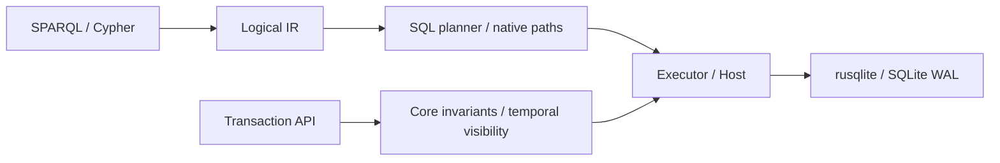

# Project and architecture review

Reviewed on 2026-10-03 at commit `8d20ed6`, including the working tree. The architecture is a strong fit for embedded, auditable agent memory. The immediate priorities are panic-safe resource cleanup, predictable import costs, and usable retrieval.

Follow-up patch: transaction, speculative, and read panic cleanup is repaired, including failed read-commit rollback. The path benchmark now fails on errors and correctly labels all-endpoint searches; the facade/direct benchmark decodes identical triples with matching snapshot boundaries. The findings and logs below are the original pre-patch review. Future features remain unimplemented and are indexed in [feature-proposals.md](feature-proposals.md).

## Architecture assessment

The seven-crate split is coherent. `tm-core` owns the statement identity model, dictionary, temporal visibility, write invariants, and transactions. `tm-rusqlite` supplies the SQLite host. `tm-sparql` and `tm-cypher` lower into `tm-ir`; `tm-exec` generates SQL and runs native paths. `tiramemsu` owns the writer, readers, caches, and application API. The JSON bridge shares binding behavior between Python and Node.



Keep the common IR, central temporal scan predicates, statement ids, and host capability checks. They prevent language-specific storage semantics and give provenance, corrections, and named graphs one model. The examples demonstrated annotation queries, history, graph scope, and Cypher reading the same layers. The existing conformance and differential suites provide useful protection against semantic drift.

The executor abstraction is specifically a SQLite host boundary, not a ready-made general database backend: it exposes SQLite values, functions, virtual tables, PRAGMAs, and SQLite-oriented schema/code generation. A WASM SQLite host is a natural extension; a DuckDB or remote database backend would require a larger redesign. `tm-core` is independently usable, but the facade still links both query frontends: its `sparql` feature currently controls differential tests, rather than optional library dependencies.

## Findings, in priority order

### 1. High: a caught transaction panic leaves the writer unusable

The probe asserts a fact inside `Db::transact`, panics, catches the unwind, and attempts another transaction. The second write returns `cannot start a transaction within a transaction`. A pooled committed read still sees zero rows, so this reproduces loss of handle usability rather than committed data corruption.

[`Store::transact`](../crates/tm-core/src/engine/mod.rs) rolls back returned errors, but a panic bypasses its cleanup. [`Db::lock`](../crates/tiramemsu/src/db.rs) recovers the poisoned mutex and exposes the unrecovered store. `Store::read` and speculative transactions have similarly manual cleanup paths and need auditing; those additional paths were not separately reproduced here.

Add transaction guards that roll back on unwind and restore dictionary state. Speculation also needs to preserve its burned-id contract. Re-throw the original panic after cleanup, or explicitly mark the handle unusable when recovery fails. Verify caught panics followed by reads and writes, and confirm no transaction number or dictionary entry leaks. This is most relevant to applications that catch Rust panics; an aborting process does not continue using the handle.

### 2. High: a reader panic permanently shrinks the pool

With one reader, an intentional panic in the query engine's test hook is caught. A subsequent read does not finish within 250 ms, although `reader_count()` still reports one. Source inspection shows why: [`ReaderPool::read`](../crates/tiramemsu/src/pool.rs) removes the executor from `idle`, and only returns it after the callback completes normally or returns an error. Unwinding drops the checked-out executor. Future borrowers wait on the condition variable with no remaining reader.

The hook is a controlled fault injection, not evidence that ordinary query text causes a panic. It proves the resource lifetime problem if execution ever unwinds. Add an RAII reader lease that rolls back and returns or replaces the connection on every exit path. Also audit failed read commits, which currently return the connection without explicit rollback. Add bounded pool acquisition and report actual available/checked-out capacity for operational diagnostics.

### 3. Medium: bulk loading repeatedly performs full statistics analysis

[`Stats::after_commit`](../crates/tm-core/src/storage/stats.rs) uses the same threshold for commit count and inserted statement count. Its maintenance function runs full `ANALYZE`, `PRAGMA optimize`, and a schema-cookie bump synchronously after commit. In a debug probe loading 20,000 facts in twenty 1,000-fact transactions, the default threshold caused **20 analyses and took 3.00 s**; a threshold of 1,000,000 caused **zero analyses and took 1.77 s**.

This small fixture demonstrates maintenance cost, not the asymptotic cost on a production database. A later query can also suffer when analysis is deferred. Introduce a bulk-import mode that postpones analysis and runs it once before handing the database back for queries. Separate maintenance thresholds, consider proportional data-growth triggers, and expose maintenance time and errors. Keep reader-statistics refresh: the code documents a real need for pooled readers to reload statistics.

### 4. Medium: benchmark labels and error handling can mislead tuning

In [`path.rs`](../crates/tiramemsu/benches/path.rs), trail queries use `unwrap_or(0)`, turning a failed search into a successful-looking fast sample. The `any_shortest_pairs` benchmark evaluates an all-endpoints search and filters its results for a destination afterward; it does not measure target-directed shortest-path search.

In [`core.rs`](../crates/tiramemsu/benches/core.rs), the facade/direct lookup comparison decodes full `Triple` values on one side and only `eid` on the other. Its roughly 2× gap cannot be attributed solely to dynamic dispatch. SPARQL benchmarks call `View::sparql` each iteration and therefore include settings reads, parsing, lowering, planning, execution, and decoding; they are application latency, not pure storage latency.

Require expected result counts, fail on benchmark errors, align returned data in comparisons, and distinguish target-directed versus all-endpoints paths. Add prepared-query and full text-query measurements separately. The Python triangle benchmark measures a reduced raw schema and Python's SQLite build, not the Rust planner or complete temporal store.

## What the parameter runs showed

Final Criterion runs were sequential after the workspace tests completed, with 0.2 s warmup and 0.5 s measurement. Values below are Criterion's central estimates, rounded. These short synthetic measurements are exploratory, not release targets or tail-latency guarantees. Host: macOS arm64, Rust 1.91.1. Raw logs are in [`review-results/`](review-results/).

| Experiment | Parameters | Result | Interpretation |
|---|---|---|---|
| SPARQL point, now | 10k / 100k statements | 58.4 / 58.3 µs | Little sensitivity to this size increase |
| SPARQL two-hop, now | 10k / 100k | 95.0 / 100.4 µs | Modest increase |
| SPARQL point, as-of | 10k / 100k | 63.2 / 62.7 µs | Snapshot selection adds modest cost here |
| SPARQL two-hop, as-of | 10k / 100k | 121.5 / 131.5 µs | More expensive than current view |
| SPARQL point, valid-at | 10k / 100k | 64.8 / 69.3 µs | Valid-time filtering works with small overhead |
| SPARQL two-hop, valid-at | 10k / 100k | 124.9 / 135.3 µs | Similar cost to as-of in this fixture |
| As-of lookup after churn | 1 / 10 / 100 / 1,000 versions per key | 2.75 / 3.23 / 7.76 / 81.5 µs | About 30× slowdown at the high end |
| Current lookup after churn | Same versions | 2.78 / 2.72 / 2.74 / 17.9 µs | Also regresses at 1,000 versions; cause needs isolation |
| Supersede dry run | 1 / 10 / 100 / 1,000 statements in cascade | 0.51 / 0.96 / 4.77 / 53.7 ms | Large evidence fans make corrections expensive |
| Chain reachability | 10,000 edges | 139 ms | Narrow frontiers expose per-hop query cost |
| Small-world reachability | 5,000 ring nodes plus shortcuts | 4.88 ms | Wide frontiers amortize reads; different workload from chain |
| All-shortest grid | 30×30 grid, 12-hop bound | 10.0 ms | Enumeration cost matters even on small graphs |
| Frontier batch | 64 / 256 / 1,024 | 343 / 330 / 349 µs | No reason to raise the default 256 from this fixture |

The separate debug probe tested eight threads doing 4,000 total SPARQL point queries, reader counts 0/1/4/8, cache capacities 0/16/16,384, query-engine disablement, and path limits. More readers improved this read-heavy fixture; this does not establish a universal pool size. Cache changes showed no consistent benefit for one repeatedly queried string. With `query_engine=false`, core triples still worked and SPARQL returned `Unsupported`, as intended.

On a 100-edge chain, a state limit of 10 allowed a 3-hop trail but rejected 15 and 100 hops with `PathLimitExceeded`. At 10,000 states the three requests returned 3, 15, and 100 endpoints. Valid time 999 returned none; time 1,000 returned all 100 reachable endpoints with sufficient state budget. A small successful bounded result must not be presented as exhaustive reachability. The API documents silent hop truncation for unbounded Cypher trail patterns.

The churn probe's current-read plan used `live_spo` plus a temporary B-tree for ordering. It does not support claiming that the current-view slowdown is caused by selection of a history index. Test page/cache effects, maintenance, and historical table layout before choosing an index change. The roadmap's as-of throughput target of at least 70% of the no-history baseline is clearly not met by this churn fixture.

The raw triangle experiment reproduced equal counts using SQL and set intersection:

| Nodes per layer | Edges | Triangles | SQLite | Intersection | Ratio |
|---|---|---|---|---|---|
| 25 | 1,325 | 5,625 | 3.6 ms | 0.5 ms | 7.4× |
| 50 | 5,150 | 22,500 | 23.3 ms | 1.7 ms | 13.6× |
| 100 | 20,300 | 90,000 | 162.2 ms | 7.6 ms | 21.3× |

This supports developing the deferred native cyclic-join operator for skewed workloads. Validate end-to-end IR semantics and representative application queries before enabling automatic routing. Python's SQLite here was 3.53.0; do not directly compare these numbers with earlier committed runs on SQLite 3.45.3.

## Proposed features and architecture work

| Priority | Proposal | User benefit | Implementation direction |
|---|---|---|---|
| First | Panic-safe resources and query budgets | One failed operation cannot strand an agent's memory handle | Transaction/read leases; pool wait timeout; cancellation and row/result limits |
| First | Bulk import with explicit finalization | Predictable ingestion of documents or sessions | Batch transaction API, deferred analysis, one final statistics refresh, progress and maintenance metrics |
| Next | Text retrieval with evidence ranking | Agents can recall a memory without already knowing its graph pattern | Start with FTS5 over live strings, then graph expansion and ranking by source diversity, confidence, and recency; vector retrieval later |
| Next | Small MCP interface | Make existing memory verbs accessible to agent tools | Assert/confirm/supersede/query/dependents/bundle with typed terms, provenance, and bounded paths; start as a local embedded adapter |
| Next | Saved answers and stale-answer notifications | Explain which remembered answers need rechecking | Persist query/view and supporting eids; use the existing event feed and dependents API for invalidation |
| Next | Temporal path syntax and explicit completeness | Ask time-respecting questions in either language without dropping to Rust | Lower both frontends into existing path IR; report reached hop/state limits and completeness |
| Targeted | Native cyclic joins | Avoid the demonstrated layered-graph join explosion | Implement the existing `NativeKind::Lftj` extension point; preserve per-pattern time, graph membership, and set/bag semantics |
| Later | Conflict review and safe memory exchange | Show conflicting sources and corrections before merging agent knowledge | Build UI/API workflows over existing conflict recipes, bundles, and dry runs; decide replica identity before promising incremental multi-agent synchronization |
| Later | Optional frontend dependencies / WASM host | Smaller embedding footprint and browser use | Real Cargo feature gates for frontends; a second SQLite host that demonstrates which executor capabilities are portable |

Retrieval, crypto-shredding, and LFTJ are already described in the design roadmap; these are prioritization proposals, not claims of newly discovered requirements. Saved-answer invalidation should mark incomplete provenance explicitly: recursive paths, negative conditions, and virtual predicates do not supply a complete dependency set today. Avoid promising a sound stale-answer detector from positive eids alone.

I would keep SQLite as the primary backend, and spend the next development cycle on resource safety and import/query observability, then FTS recall plus a narrow MCP adapter. Both fit the current architecture. A network server, alternative storage engine, and general reasoning system would expand the scope substantially before the embedded experience has been hardened.

## Validation and reproduction

`PROPTEST_CASES=64 cargo test --workspace --offline` completed with **1,127 passed, zero failed, zero ignored** across 106 Rust test/doc-test summaries. W3C and TCK harnesses passed their configured deviation checks; that does not mean every upstream scenario is supported. All four shipped examples ran successfully. Node/Python runtime packaging tests and large 1M–10M datasets were not run. Existing unrelated working-tree edits were preserved.

`cargo clippy --offline --workspace --all-targets -- -D warnings` also passed. The review is indexed in the design graph, and `lat check` passed after that index was updated.

```sh
PROPTEST_CASES=64 cargo test --workspace --offline
cargo bench --offline -p tiramemsu --bench core -- --warm-up-time 0.2 --measurement-time 0.5
SPARQL_BENCH_STATEMENTS=10000 cargo bench --offline -p tiramemsu --bench sparql -- --warm-up-time 0.2 --measurement-time 0.5
SPARQL_BENCH_STATEMENTS=100000 cargo bench --offline -p tiramemsu --bench sparql -- --warm-up-time 0.2 --measurement-time 0.5
PATH_BENCH_STATEMENTS=10000 cargo bench --offline -p tiramemsu --bench path -- --warm-up-time 0.2 --measurement-time 0.5
```

[`probe.rs`](review-results/probe.rs) is a standalone diagnostic program, not a change to the product. To rerun, create a temporary Cargo binary with a path dependency on this checkout's `crates/tiramemsu` and `tempfile = "3"`, copy the program into `src/main.rs`, and use `cargo run --offline --manifest-path <temporary-project>/Cargo.toml`. It intentionally catches panics and checks a blocked reader with a timeout. Timings use the debug profile and should only be compared within that probe.

Run `python3 docs/review-results/triangle_sweep.py` from the repository root for the reduced triangle sweep. It reuses the definitions from `bench/triangles/bench.py` with layer sizes 25, 50, and 100. The full original script runs much larger cases.
