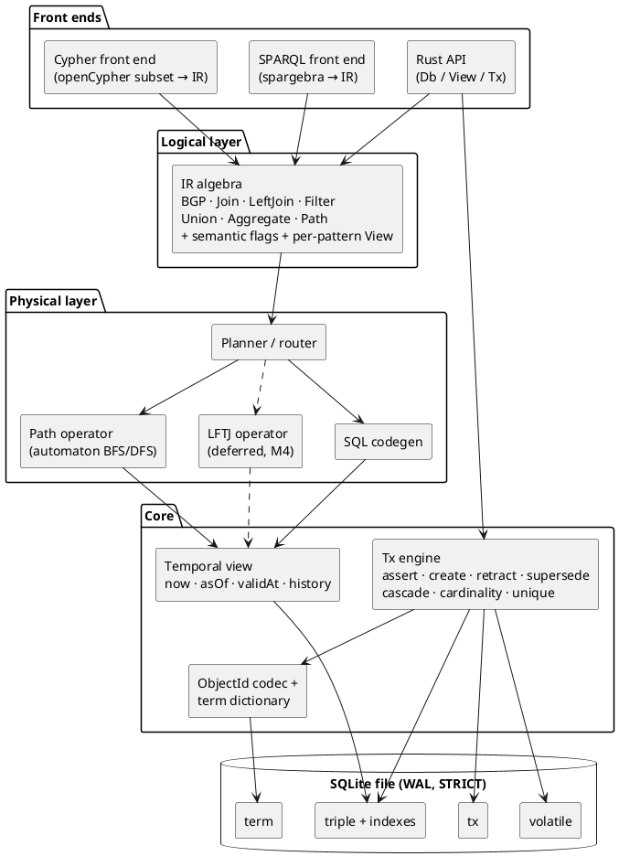
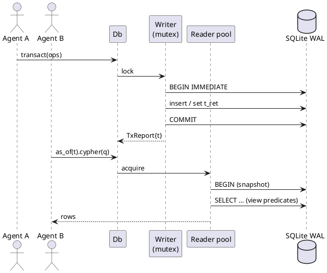
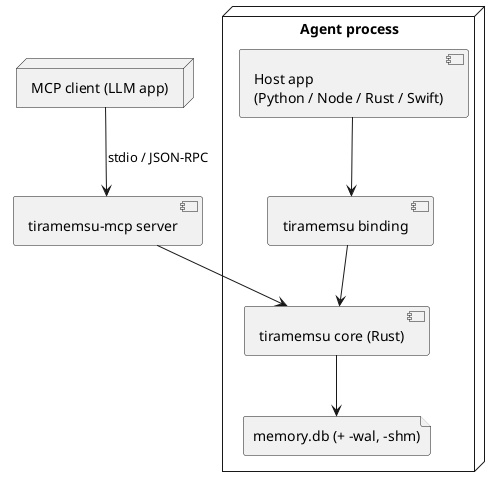

# Architecture

Tiramemsu is a stack of layers: two query front ends over one logical IR, a planner that routes to SQL or native operators, a temporal view layer, and one SQLite file.

It follows MillenniumDB's logical design (edge ids, tagged ObjectIds, permutation indexes, automaton paths) on top of SQLite's B-trees instead of custom storage. See [[prior-art#MillenniumDB]].

## Layers

Each layer depends only on the layer below it. Time is resolved in exactly one place, the view-aware scan in [[query#Views and Scans]].

## Crates

The Rust workspace is split by layer so each front end compiles against the IR only, and the core never depends on a query language.

| Crate | Responsibility | Depends on |
|---|---|---|
| `tm-core` | ObjectId codec, term dictionary, SQLite schema and migrations, tx engine, views, event log, volatile table, predicate schema | `rusqlite` (bundled) |
| `tm-ir` | Logical algebra, semantic flags, view descriptors | `tm-core` (ids, views) |
| `tm-exec` | Planner/router, SQL codegen, path operator, `tm_path` table function, later LFTJ | `tm-ir`, `tm-core` |
| `tm-sparql` | SPARQL 1.1 (+1.2 annotations) → IR, results as SPARQL JSON/terms | `spargebra`, `tm-ir` |
| `tm-cypher` | openCypher subset + extensions → IR, results as Cypher values | a Cypher parser, `tm-ir` |
| `tiramemsu` | Facade: `Db`, `View`, `Tx`, `QueryResult`; the only crate bindings use | all of the above |

Bindings (PyO3, napi-rs, WASM, MCP server) are separate crates on top of `tiramemsu`. See [[api#Bindings]].

## Connections and Concurrency

One writer connection behind a mutex and a pool of reader connections, all on one WAL-mode SQLite file.

- **Writer:** every transaction, speculative `with`, and schema change goes through the single writer. Transactions are serialised, which gives MERGE and `sys:unique` checks their atomicity. See [[time-model#Operations]].
- **Readers:** each query takes a reader connection and runs inside one read transaction, so it sees a consistent WAL snapshot.
- **Historical reads** never conflict with writes: rows are only ever appended or have `t_ret` set once, and `asOf(t)` for `t` ≤ the last committed tx is stable forever. See [[time-model#Never Forget]].
- The `tx` counter is read and incremented inside the writer transaction, so `t` is gap-free and strictly increasing.

## Deployment

The engine is a library linked into the host process. The same core builds for native targets and for WASM with an in-browser SQLite VFS.

