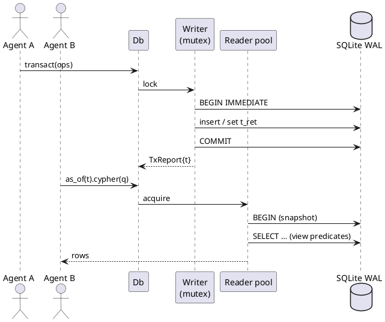
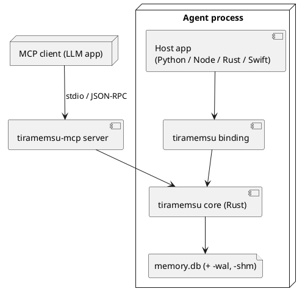

# Architecture

Tiramemsu is a stack of layers: two query front ends over one logical IR, a planner that routes to SQL or native operators, a temporal view layer, and one SQLite file.

It follows MillenniumDB's logical design (edge ids, tagged ObjectIds, permutation indexes, automaton paths) on top of SQLite's B-trees instead of custom storage. See [[prior-art#MillenniumDB]].

## Layers

Each layer depends only on the layer below it. Time is resolved in exactly one place, the view-aware scan in [[query#Views and Scans]].

## Crates

The Rust workspace is split by layer so each front end compiles against the IR only, and the core never depends on a query language.

| Crate | Responsibility | Depends on |
|---|---|---|
| `tm-core` | ObjectId codec, term dictionary, SQLite schema and migrations, tx engine, views, event log, volatile table, predicate schema, the `Executor` trait | nothing SQLite-specific ([[architecture#Executor]]) |
| `tm-rusqlite` | The first executor host: `rusqlite` with bundled SQLite, UDF and virtual-table registration | `rusqlite` (bundled), `tm-core` |
| `tm-wasm` | The WebAssembly host: SQLite compiled to `wasm32-unknown-unknown`, memory or OPFS storage, verified journal mode, probed capabilities ([[architecture#WebAssembly Host]]) | `tm-rusqlite`, `rusqlite` → `sqlite-wasm-rs`, `sqlite-wasm-vfs` |
| `tm-ir` | Logical algebra, semantic flags, view descriptors | `tm-core` (ids, views) |
| `tm-exec` | Planner/router, SQL codegen, path operator, `tm_path` table function, opt-in LFTJ operator (`tm_lftj`) | `tm-ir`, `tm-core` |
| `tm-sparql` | SPARQL 1.1 (+1.2 annotations) → IR, results as SPARQL JSON/terms | `spargebra`, `tm-ir` |
| `tm-cypher` | openCypher subset + extensions → IR, results as Cypher values | a Cypher parser, `tm-ir` |
| `tiramemsu` | Facade: `Db`, `View`, `Tx`, `QueryResult`; the only crate bindings use | `tm-core`, `tm-rusqlite`; the others behind cargo features ([[architecture#Crates#Cargo Features]]) |

Bindings (PyO3, napi-rs, WASM in `bindings/wasm`, MCP server) are separate crates on top of `tiramemsu`. The MCP server `tiramemsu-mcp` is a workspace crate under `crates/` built on the JSON bridge, so protocol code stays out of `tm-core` and the facade. See [[api#Bindings]].

### Cargo Features

The facade's query engine and front ends are optional dependencies (`add-optional-query-frontends`): `default-features = false` links no IR, planner or parser, and the default build is unchanged.

| Feature | Facade surface | Adds to the dependency tree |
|---|---|---|
| none | `Db`, transactions, speculation, views and `triples`, dependents, bundles and their JSON and N-Triples forms, previews, conflicts, text recall, bulk import, budgets | `tm-core`, `tm-rusqlite` |
| `exec` | `execute_ir`, `explain_ir`, `View::path*`, LFTJ, the `ir` module and the engine open options | `tm-ir`, `tm-exec` |
| `sparql` | `View::sparql*`, `SparqlResult`, `Solutions`; implies `exec` | `tm-sparql`, `spargebra`, `peg` |
| `cypher` | `View::cypher`, `Db::cypher_write*`, `TxCypher`; implies `exec` | `tm-cypher`, `open-cypher` |
| `default` | `sparql` + `cypher`, and saved answers, which store queries of both languages | all |

- **Serialisation is not parsing.** The RDF terms and the N-Triples writer moved from `tm-sparql` to [[crates/tm-core/src/rdf.rs#render]] and [[crates/tm-core/src/rdf.rs#write_ntriples]], which `tm-sparql` re-exports, so bundle N-Triples and JSON need no front end.
- **No engine without `exec`.** The facade's engine type is uninhabited and [[crates/tiramemsu/src/db.rs#open_engine]] installs nothing, so a core build behaves like `query_engine: false` with the options absent.
- **Disabled APIs are absent**, not runtime errors, and the file format does not depend on the features. The JSON bridge, the MCP server and the bindings enable `sparql` and `cypher` explicitly.
- **Compatibility.** Until 0.2 the `sparql` feature only switched the SPARQL side of the differential suite and `default-features = false` still built both front ends; the facade README documents the migration.
- **Checks.** `scripts/feature-matrix.sh` asserts each combination's `cargo tree -e normal`, checks and tests it, and hands one file between it and the default build; the CI `features` job runs it for core, exec, sparql, cypher, default and the bindings ([[tests#Optional Query Frontends]]).

## Executor

`tm-core` reaches SQLite through a small synchronous `Executor` trait, so the engine can run on any host with interactive transactions. Hosts: `rusqlite` with bundled SQLite, and `tm-wasm` on SQLite compiled to WebAssembly ([[architecture#WebAssembly Host]]).

The boundary is drawn now, before code exists, because it costs little today and a lot later. oxilite, which started from an abstract executor, runs on five SQLite hosts ([[prior-art#oxilite]]).

- **Required of every host:** prepared statements with bound parameters, interactive transactions (`BEGIN IMMEDIATE` … `COMMIT`/`ROLLBACK`), savepoints, and a stable snapshot within a read transaction. The tx engine reads before it writes (idempotent assert, cascade, schema checks, dictionary lookup), so it needs all of them.
- **Capabilities** (declared by the host): `reader_pool` (otherwise the reader is the writer, as on WASM), `functions` (scalar UDFs), `vtab` (virtual tables: `tm_path`, `tm_text` and `rarray`), `stat4`, `fts5` (text recall and its derived index, [[storage#Text Index]]; without it only recall fails, with `MissingCapability`).
- **Tiers:** `tm-core` needs only the required set, so a minimal host can run transactions, views, the event log and `View::triples`. `tm-exec` (SPARQL, Cypher, paths) also needs `functions` and `vtab`, and refuses to open on a host without them rather than degrading silently. A facade built without the `exec` feature is the `tm-core` tier at compile time ([[architecture#Crates#Cargo Features]]).
- **Hosts considered:** `rusqlite` (v1, all capabilities); SQLite compiled to WASM (`tm-wasm`: `functions`, `vtab` and `fts5`, no `stat4`, no `reader_pool`, probed at runtime); Cloudflare Durable Objects SQLite, which has interactive transactions through `transactionSync` but no user functions or virtual tables, so it gets the `tm-core` tier only; Turso, capabilities to be verified. Cloudflare D1 is out of scope: it has no interactive transactions (see oxilite's D5).
- `tm-exec` checks the capabilities in [[crates/tm-exec/src/host.rs#check_capabilities]] and registers its SQL functions and native operators through the executor's `registry()` hook (`HostRegistry` in `tm-core`); the `rusqlite` glue stays in `tm-rusqlite`.
- Host-specific details, such as `prepare_cached`, `Connection::from_handle` inside a virtual table, and `rarray`, stay inside the host crate.
- **Interruption** is optional: `Executor::set_interrupt` hands a host the stop conditions of a budgeted operation. The `rusqlite` host maps them to SQLite's progress handler; the default ignores them, and then only the engine's own checks stop work ([[query#Query Budgets]]).

## Connections and Concurrency

One writer connection behind a mutex and a pool of reader connections, all on one WAL-mode SQLite file.

- **Writer:** every transaction, speculative `with`, and schema change goes through the single writer. Transactions are serialised, which gives MERGE and `sys:unique` checks their atomicity. See [[time-model#Operations]].
- **Import lease:** a bulk import session holds an exclusive write lease between its chunks; other writes fail with `ImportInProgress` instead of interleaving, and readers carry on ([[query#Bulk Import]]).
- **Readers:** each query takes a reader connection and runs inside one read transaction, so it sees a consistent WAL snapshot.
- **Bounded acquisition:** waiting for a reader is unbounded by default; `OpenOptions::reader_timeout` or a per-operation budget turns a long wait into `PoolTimeout`, and a deadline or cancellation also ends it ([[query#Query Budgets]]).
- **Recovery:** returned errors, failed read commits, and unwinding callbacks roll back active snapshots. A pooled executor is returned before the original panic is resumed, so caught panics do not reduce reader capacity.
- **Historical reads** never conflict with writes: rows are only ever appended or have `t_ret` set once, and `asOf(t)` for `t` ≤ the last committed tx is stable forever. See [[time-model#Never Forget]].
- The `tx` counter is read and incremented inside the writer transaction, so `t` is gap-free and strictly increasing.

## WebAssembly Host

`tm-wasm` runs the engine on SQLite compiled to `wasm32-unknown-unknown` inside a Web Worker, with the database in memory or in OPFS, in the native file format (`add-wasm-sqlite-host`).

- **Runtime choice.** `rusqlite` 0.40 links [`sqlite-wasm-rs`](https://crates.io/crates/sqlite-wasm-rs) on that target (SQLite 3.53 compiled to WASM, VFSes in Rust), so the host reuses the `RusqliteExec` of `tm-rusqlite` for statements, savepoints, registration and interrupts. [[crates/tm-wasm/src/lib.rs#WasmHost]] adds storage, the journal policy and the probe. Calls are synchronous, hence the worker.
- **Storage.** `Storage::Memory` (`memvfs`, any context, volatile), `Storage::Opfs` (the sync-access-handle pool of `sqlite-wasm-vfs`, dedicated worker, installed with `install_opfs`), and `Storage::File`, the native file VFS for tests. A storage the target lacks is `Unsupported`.
- **Probed capabilities** ([[crates/tm-wasm/src/probe.rs#probe_capabilities]]): each is established by running it on a scratch connection. In WebAssembly `functions`, `vtab` and `fts5` hold, so the whole query engine runs; `stat4` is not compiled in and `reader_pool` is never declared (`THREADSAFE=0`, no shared memory). `limit_capabilities` narrows the set, and the facade then refuses the engine with `MissingCapability`.
- **Journal contract.** Neither VFS has shared memory, so SQLite answers `journal_mode = WAL` with `delete`. The host reads the mode the runtime reports at open and fails with `MissingCapability` under `Journal::Wal`; `Journal::Rollback` is the explicit opt-in. [[crates/tm-wasm/src/lib.rs#WasmExec]] keeps the engine's WAL switch from changing the verified mode. The file format is identical, a hot journal is rolled back on open, and a native host switches the file back to WAL.
- **Interchange.** `export_file` and `import_file` move committed bytes; a closed native `Db` leaves no `-wal` (the readers close before the writer), so its main file is complete.
- **Limits.** `std::time::Instant` and `SystemTime` are missing on the target: `WasmClock` supplies `Date.now()`, and budgets and bulk import sessions are refused by the binding. SPARQL needs `--cfg getrandom_backend="wasm_js"` (in `.cargo/config.toml`). The OPFS tests snapshot storage during an open write; a worker killed mid-write on OPFS is not exercised.

## Deployment

The engine is a library linked into the host process. The same core builds for native targets and for WASM with an in-browser SQLite VFS, each through its own executor host ([[architecture#Executor]], [[architecture#WebAssembly Host]]).

## Project Website

A static site in `site/` (a home page and articles) is published to GitHub Pages by `.github/workflows/pages.yml` on pushes to `main` that touch `site/`. There is no build step.

The custom domain is `tiramemsu.com`, set in the repository's Pages settings (the workflow deploy ignores a `CNAME` file). Its DNS records at Cloudflare must be DNS-only (grey cloud): four apex A records to GitHub's Pages IPs `185.199.108.153` to `185.199.111.153`, and `www` as a CNAME to `volland.github.io`. A proxied (orange cloud) record stops GitHub issuing the HTTPS certificate and serves "Site not found", and would also make Cloudflare a data processor that `datenschutz.html` does not name.

The pages are plain HTML with one stylesheet (`site/style.css`), light and dark palettes, and no scripts, trackers or external fonts. Links are relative, so the site works under a project path. `site/assets/` holds the icon `logo.svg` (a brain taking a bite out of a tiramisu whose layers are a graph), `layers.svg` and `architecture.svg`, which the `README.md` also uses.

- **Tone:** the slogan is "Your agent's brain loves Tiramemsu" (home page hero and `README.md`). The "What agents are saying" quotes are openly invented, say so in their intro, and each must describe a feature that exists, so a removed feature means removing its quote.
- **Legal pages:** `impressum.html`, `datenschutz.html` and `agb.html` are German, carry the operator's name, address and e-mail, and are linked from every page footer. The privacy text says the site sets no cookies and loads nothing external, and names GitHub Pages as the host that logs IP addresses, so adding a script, font, tracker or form means revising `datenschutz.html` first. They are a good-faith draft, not legal advice.
- **Articles:** `layered-graphs.html` explains statement ids and layers with queries taken from the test suite. `time-travel.html` explains the two clocks with a worked example whose queries mirror `lat.md/query#Temporal Syntax` and `crates/tiramemsu/tests/cypher_temporal.rs`, so a change to the temporal syntax or the view semantics should be reflected there. `metagraphs.html` explains edges as vertices and vertices and edges as containers, with queries from [[recipes#Metagraphs]] and the test `metagraph_containers_nesting_and_fold`, so a change to graph names, supersede or the dual view should be reflected there. `tiramemsu-vs-oxilite.html` compares the two databases and quotes the benchmark in `bench/eid-vs-reifier/`. Their numbers come from `bench/`, [[prior-art#oxilite]] and the status table, so a change to those should be reflected there.
- **Quick start:** the home page shows the same story in Python, Node.js and Rust, as CSS-only tabs (radio inputs, no script). The Rust tab and the README snippet are trimmed from `crates/tiramemsu/examples/quickstart.rs`, which `cargo clippy --all-targets` compiles. The Python and Node.js tabs were run against the built packages, so a change to either binding's API means re-running them and updating the tabs.

## Long-Read Article

`article/` holds a Substack long read about tiramemsu with its illustrations, separate from the site. It quotes the status table, the recipes and the benchmarks, so a change to those should be reflected there.

`tiramemsu-long-read.md` is the source; `preview.html` is a self-contained copy for pasting into the Substack editor, rebuilt by `build-preview.sh` with pandoc. The illustrations are SVGs in `images/src/`, rendered to 1456 px PNGs, because Substack takes no SVG. The article avoids tables, which Substack cannot show, and `article/README.md` lists the title, captions and publishing steps.

## Crate Documentation and Publishing

Each crate's `README.md` is its crates.io page and, through `#![doc = include_str!("../README.md")]`, its crate-level rustdoc, so every Rust block in it is a doctest.

- **Links** in READMEs are absolute `https://github.com/Volland/tiramemsu/...` URLs, because relative ones break on crates.io and docs.rs. Diagrams are ASCII, since crates.io does not render Mermaid; the repository README uses Mermaid.
- **Metadata** is inherited from `[workspace.package]`: version, licence, repository, keywords, categories and `rust-version = "1.88"`, the minimum that `open-cypher` needs. Workspace path dependencies carry the workspace version (`version = "0.3.0"`) so the crates can be published. Each crate directory holds copies of both licence files.
- **Package size:** `tm-sparql` and `tm-cypher` exclude their W3C and openCypher TCK test data from the published package.
- **Publish order** follows the dependencies: `tm-core`, `tm-ir`, `tm-rusqlite`, `tm-exec`, `tm-sparql`, `tm-cypher`, `tiramemsu`, `tm-wasm`, then `tiramemsu-json` and `tiramemsu-mcp`. The Node, Python and WebAssembly binding crates are not published to crates.io.
- **Core stays SQLite-free:** doctests inside `tm-core/src` may not spell `tm_rusqlite::`, because a test greps that source for `rusqlite::` (see [[architecture#Executor]]). They use an import alias, and the README, which is not scanned, uses the normal form.
- **Checks:** `RUSTDOCFLAGS='-D warnings' cargo doc --workspace --no-deps` and `cargo test --workspace --doc` must pass.
- **Reduced builds:** the facade includes its README as crate docs only when both front ends are enabled, since the tour uses them; other combinations get a short feature summary, and doctests on core items use only the core API ([[architecture#Crates#Cargo Features]]).
