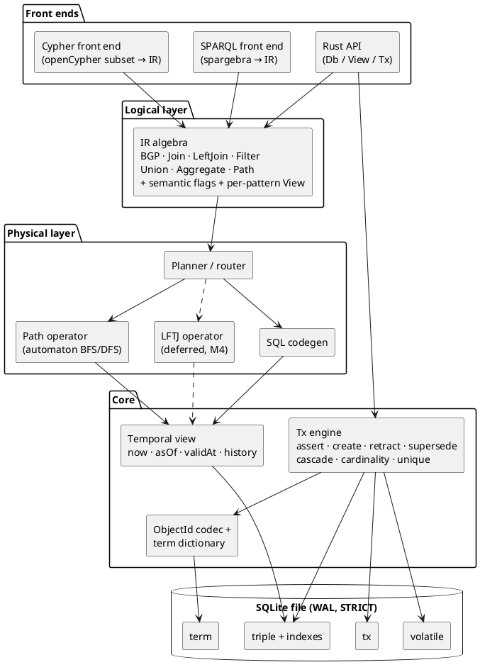
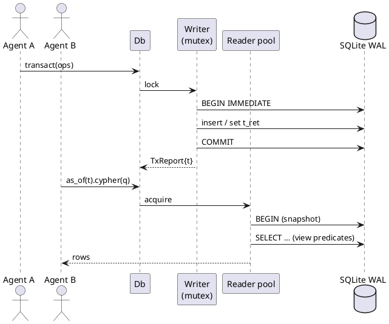
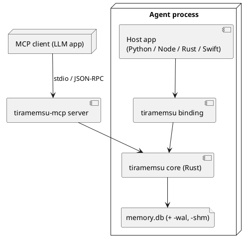

# Architecture

Tiramemsu is a stack of layers: two query front ends over one logical IR, a planner that routes to SQL or native operators, a temporal view layer, and one SQLite file.

It follows MillenniumDB's logical design (edge ids, tagged ObjectIds, permutation indexes, automaton paths) on top of SQLite's B-trees instead of custom storage. See [[prior-art#MillenniumDB]].

## Layers

Each layer depends only on the layer below it. Time is resolved in exactly one place, the view-aware scan in [[query#Views and Scans]].

## Crates

The Rust workspace is split by layer so each front end compiles against the IR only, and the core never depends on a query language.

| Crate | Responsibility | Depends on |
|---|---|---|
| `tm-core` | ObjectId codec, term dictionary, SQLite schema and migrations, tx engine, views, event log, volatile table, predicate schema, the `Executor` trait | nothing SQLite-specific ([[architecture#Executor]]) |
| `tm-rusqlite` | The first executor host: `rusqlite` with bundled SQLite, UDF and virtual-table registration | `rusqlite` (bundled), `tm-core` |
| `tm-ir` | Logical algebra, semantic flags, view descriptors | `tm-core` (ids, views) |
| `tm-exec` | Planner/router, SQL codegen, path operator, `tm_path` table function, later LFTJ | `tm-ir`, `tm-core` |
| `tm-sparql` | SPARQL 1.1 (+1.2 annotations) → IR, results as SPARQL JSON/terms | `spargebra`, `tm-ir` |
| `tm-cypher` | openCypher subset + extensions → IR, results as Cypher values | a Cypher parser, `tm-ir` |
| `tiramemsu` | Facade: `Db`, `View`, `Tx`, `QueryResult`; the only crate bindings use | all of the above |

Bindings (PyO3, napi-rs, WASM, MCP server) are separate crates on top of `tiramemsu`. See [[api#Bindings]].

## Executor

`tm-core` reaches SQLite through a small synchronous `Executor` trait, so the engine can run on any host with interactive transactions. `rusqlite` with bundled SQLite is the first host and the only one in v1.

The boundary is drawn now, before code exists, because it costs little today and a lot later. oxilite, which started from an abstract executor, runs on five SQLite hosts ([[prior-art#oxilite]]).

- **Required of every host:** prepared statements with bound parameters, interactive transactions (`BEGIN IMMEDIATE` … `COMMIT`/`ROLLBACK`), savepoints, and a stable snapshot within a read transaction. The tx engine reads before it writes (idempotent assert, cascade, schema checks, dictionary lookup), so it needs all of them.
- **Capabilities** (declared by the host): `reader_pool` (otherwise the reader is the writer, as on WASM), `functions` (scalar UDFs), `vtab` (virtual tables: `tm_path` and `rarray`), `stat4`, `fts5`.
- **Tiers:** `tm-core` needs only the required set, so a minimal host can run transactions, views, the event log and `View::triples`. `tm-exec` (SPARQL, Cypher, paths) also needs `functions` and `vtab`, and refuses to open on a host without them rather than degrading silently.
- **Hosts considered:** `rusqlite` (v1, all capabilities); SQLite compiled to WASM (M5 binding, capabilities to be checked); Cloudflare Durable Objects SQLite, which has interactive transactions through `transactionSync` but no user functions or virtual tables, so it gets the `tm-core` tier only; Turso, capabilities to be verified. Cloudflare D1 is out of scope: it has no interactive transactions (see oxilite's D5).
- `tm-exec` checks the capabilities in [[crates/tm-exec/src/host.rs#check_capabilities]] and registers its SQL functions and native operators through the executor's `registry()` hook (`HostRegistry` in `tm-core`); the `rusqlite` glue stays in `tm-rusqlite`.
- Host-specific details, such as `prepare_cached`, `Connection::from_handle` inside a virtual table, and `rarray`, stay inside the host crate.

## Connections and Concurrency

One writer connection behind a mutex and a pool of reader connections, all on one WAL-mode SQLite file.

- **Writer:** every transaction, speculative `with`, and schema change goes through the single writer. Transactions are serialised, which gives MERGE and `sys:unique` checks their atomicity. See [[time-model#Operations]].
- **Readers:** each query takes a reader connection and runs inside one read transaction, so it sees a consistent WAL snapshot.
- **Historical reads** never conflict with writes: rows are only ever appended or have `t_ret` set once, and `asOf(t)` for `t` ≤ the last committed tx is stable forever. See [[time-model#Never Forget]].
- The `tx` counter is read and incremented inside the writer transaction, so `t` is gap-free and strictly increasing.

## Deployment

The engine is a library linked into the host process. The same core builds for native targets and for WASM with an in-browser SQLite VFS, each through its own executor host ([[architecture#Executor]]).

## Project Website

A static site in `site/` (a home page and articles) is published to GitHub Pages by `.github/workflows/pages.yml` on pushes to `main` that touch `site/`. There is no build step.

The custom domain is `tiramemsu.com`, set in the repository's Pages settings (the workflow deploy ignores a `CNAME` file). Its DNS records at Cloudflare must be DNS-only (grey cloud): four apex A records to GitHub's Pages IPs `185.199.108.153` to `185.199.111.153`, and `www` as a CNAME to `volland.github.io`. A proxied (orange cloud) record stops GitHub issuing the HTTPS certificate and serves "Site not found", and would also make Cloudflare a data processor that `datenschutz.html` does not name.

The pages are plain HTML with one stylesheet (`site/style.css`), light and dark palettes, and no scripts, trackers or external fonts. Links are relative, so the site works under a project path. `site/assets/` holds the icon `logo.svg` (a brain taking a bite out of a tiramisu whose layers are a graph), `layers.svg` and `architecture.svg`, which the `README.md` also uses.

- **Tone:** the slogan is "Your agent's brain loves Tiramemsu" (home page hero and `README.md`). The "What agents are saying" quotes are openly invented, say so in their intro, and each must describe a feature that exists, so a removed feature means removing its quote.
- **Legal pages:** `impressum.html`, `datenschutz.html` and `agb.html` are German, carry the operator's name, address and e-mail, and are linked from every page footer. The privacy text says the site sets no cookies and loads nothing external, and names GitHub Pages as the host that logs IP addresses, so adding a script, font, tracker or form means revising `datenschutz.html` first. They are a good-faith draft, not legal advice.
- **Articles:** `layered-graphs.html` explains statement ids and layers with queries taken from the test suite. `time-travel.html` explains the two clocks with a worked example whose queries mirror `lat.md/query#Temporal Syntax` and `crates/tiramemsu/tests/cypher_temporal.rs`, so a change to the temporal syntax or the view semantics should be reflected there. `tiramemsu-vs-oxilite.html` compares the two databases and quotes the benchmark in `bench/eid-vs-reifier/`. Their numbers come from `bench/`, [[prior-art#oxilite]] and the status table, so a change to those should be reflected there.
- **Quick start:** the home page shows the same story in Python, Node.js and Rust, as CSS-only tabs (radio inputs, no script). The Rust tab and the README snippet are trimmed from `crates/tiramemsu/examples/quickstart.rs`, which `cargo clippy --all-targets` compiles. The Python and Node.js tabs were run against the built packages, so a change to either binding's API means re-running them and updating the tabs.

## Crate Documentation and Publishing

Each crate's `README.md` is its crates.io page and, through `#![doc = include_str!("../README.md")]`, its crate-level rustdoc, so every Rust block in it is a doctest.

- **Links** in READMEs are absolute `https://github.com/Volland/tiramemsu/...` URLs, because relative ones break on crates.io and docs.rs. Diagrams are ASCII, since crates.io does not render Mermaid; the repository README uses Mermaid.
- **Metadata** is inherited from `[workspace.package]`: version, licence, repository, keywords, categories and `rust-version = "1.88"`, the minimum that `open-cypher` needs. Workspace path dependencies carry `version = "0.1.0"` so the crates can be published. Each crate directory holds copies of both licence files.
- **Package size:** `tm-sparql` and `tm-cypher` exclude their W3C and openCypher TCK test data from the published package.
- **Publish order** follows the dependencies: `tm-core`, `tm-ir`, `tm-rusqlite`, `tm-exec`, `tm-sparql`, `tm-cypher`, then `tiramemsu`.
- **Core stays SQLite-free:** doctests inside `tm-core/src` may not spell `tm_rusqlite::`, because a test greps that source for `rusqlite::` (see [[architecture#Executor]]). They use an import alias, and the README, which is not scanned, uses the normal form.
- **Checks:** `RUSTDOCFLAGS='-D warnings' cargo doc --workspace --no-deps` and `cargo test --workspace --doc` must pass.

