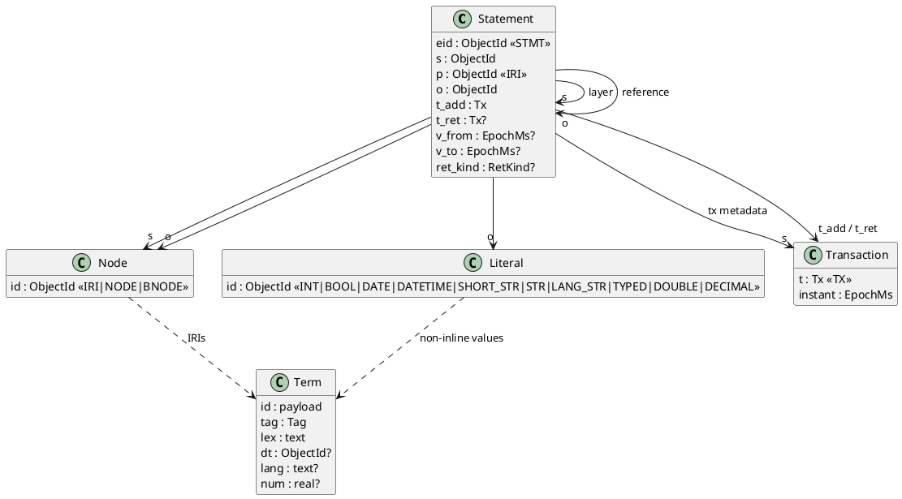
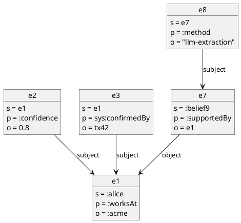

# Data Model

Everything is a triple with its own identity (eid). Properties, relationships, labels, schema, provenance and bookkeeping are all triples; eids can be the subject or object of other triples.

This is MillenniumDB's domain graph, with its separate Properties table dropped so that every property is addressable too. See [[prior-art#MillenniumDB]] and [[prior-art#Neptune OneGraph]].

## Statements

A statement is one row `(eid, s, p, o)` plus its lifetime and valid time. The eid is its address. Content `(s, p, o, v_from, v_to)` never changes after insert.

| Field | Kind | Meaning |
|---|---|---|
| `eid` | `STMT` ObjectId | Identity of this occurrence of the fact. Never reused. See [[storage#Triple Table]] |
| `s` | `IRI`, `NODE`, `BNODE`, `STMT`, `TX` | Subject. May be another statement (layers) or a transaction (tx metadata) |
| `p` | `IRI` | Predicate |
| `o` | any ObjectId | Object: a node, a literal, or another statement |
| `t_add`, `t_ret` | tx numbers | Transaction-time lifetime. See [[time-model#Transaction Time]] |
| `v_from`, `v_to` | epoch ms or NULL | Valid-time interval, half-open. See [[time-model#Valid Time]] |
| `ret_kind` | small int | Why `t_ret` was set: explicit, cascade, supersede or cardinality. See [[time-model#Event Log]] |

A statement whose object is a literal is a **property** of its subject. A statement whose object is a node or a statement is a **relationship**. `sys:isEdge` overrides this per predicate. See [[query#Front Ends#Cypher Dual View]].

## Layers

Layers are built by attaching triples to eids of lower layers: confidence, provenance, validity, beliefs about facts. Nesting has no depth limit, and it is how "layered" is meant.

Rules:
- A statement may not use its own eid as its subject or object. Longer cycles (e7 about e8 about e7) are allowed, and the cascade handles them with a visited set. See [[time-model#Cascade]].
- There is no named-graph column. Context, source, session or agent membership is itself a layer triple on the eid, e.g. `(e1 sys:inContext :session12)`. Physical isolation per agent means one SQLite file per agent.
- Transactions are subjects too: `(tx205 sys:reason "user correction")`, `(tx205 sys:author :agent7)`.

## ObjectId

Every value in `s`, `p`, `o` and `eid` is a signed 64-bit integer: a 60-bit payload shifted left by 4, OR-ed with a 4-bit tag in the low bits.

`id = (payload << 4) | tag`. Low-bit tagging keeps small ids small, because SQLite stores integers as 1–8 byte varints. It also keeps signed order within a tag, which SQLite's signed comparison needs. MillenniumDB's high-byte tag would break both. See [[prior-art#MillenniumDB]].

| Tag | Name | Storage | Payload |
|---|---|---|---|
| 0 | `IRI` | dictionary | term id |
| 1 | `NODE` | inline | counter (anonymous LPG node) |
| 2 | `BNODE` | inline | counter (RDF blank node, skolemised on export) |
| 3 | `STMT` | inline | statement counter (the eid) |
| 4 | `TX` | inline | transaction number `t` |
| 5 | `INT` | inline | 60-bit signed integer |
| 6 | `BOOL` | inline | 0 or 1 |
| 7 | `DATETIME` | inline | `(epoch_ms << 11) \| tz`: signed epoch milliseconds (49 bits) and an 11-bit timezone code |
| 8 | `DATE` | inline | signed days since 1970-01-01 |
| 9 | `SHORT_STR` | inline | UTF-8 string of ≤ 7 bytes plus a 4-bit length |
| 10 | `STR` | dictionary | term id (plain string > 7 bytes) |
| 11 | `LANG_STR` | dictionary | term id (language-tagged string) |
| 12 | `TYPED` | dictionary | term id (any other datatype, or an out-of-range integer) |
| 13 | `DOUBLE` | dictionary | term id, with `num` set |
| 14 | `DECIMAL` | dictionary | term id, with `num` set |
| 15 | `SEALED` (reserved) | dictionary | term id of a crypto-shredded literal. Reserved for M6; format 1 rejects it. See [[time-model#Erasure]] |

### Canonical Encoding

Every value has exactly one ObjectId, so equality is always integer equality and idempotent assert can compare ids.

- An integer inside the 60-bit range is always `INT`. It is never a dictionary entry.
- A plain string of ≤ 7 UTF-8 bytes is always `SHORT_STR`.
- Numbers and booleans collapse to their value. This is a deliberate deviation from RDF term identity: `"01"^^xsd:integer` and `"1"^^xsd:integer` become the same value, and are returned in canonical form. Idempotent assert then matches by value.
- `xsd:dateTime` keeps its timezone. The payload is `(epoch_ms << 11) | tz`, where `tz` 0 means no timezone and 1–1681 is the offset in minutes plus 841 (−14:00 to +14:00). Digits below a millisecond are truncated, and instants beyond ±2⁴⁸ ms (about ±8 900 years) are `TYPED`.
- Two date-times are the same term only if both the instant and the offset match, as in RDF: `12:00+02:00` and `10:00Z` are two terms. Value comparison (`=`, `<`, ordering, Cypher equality) compares the instant, `id >> 15`, which needs no dictionary and no UDF. A date-time without a timezone is ordered as if it were UTC. Idempotent assert matches by term, so re-stating the same instant with another offset is a new fact (Cypher `SET` supersedes rather than no-ops).
- The offset is kept because a local time is part of what an agent remembers ("the meeting is at 09:00 Kyiv time"), and because SPARQL `TIMEZONE`/`TZ` and Cypher's zoned versus local date-times need it. `xsd:date` still drops a timezone suffix.

### Range Scans

A range filter on one predicate seeks from `(v << 4) | TAG` and keeps rows with `o & 15 = TAG`. A predicate usually holds a single datatype, so little is scanned in vain.

For `DATETIME` the bound is `(ms << 15) | 7` (any offset), since the instant is the high part of the payload.

Doubles and decimals are not inline. Their range queries go through the indexed `term.num` column and join back by id. See [[storage#Term Dictionary]].

## Nodes and Identity

Cypher and SPARQL share one id space. A node is an `IRI`, an anonymous `NODE`, or a `BNODE`, and both languages see every node.

- A node created from SPARQL, or by IRI from Cypher, is an `IRI`.
- A node created by Cypher `CREATE (n)` without an IRI gets a `NODE` id. It is exported to RDF as `urn:tiramemsu:node:<n>`, and parsing that IRI returns the same `NODE` id, so the round trip is exact.
- A blank node from RDF input gets a `BNODE` id. It is exported as `urn:tiramemsu:bnode:<n>` (skolemised), including in SPARQL JSON results.
- Statement eids and transactions render as `urn:tiramemsu:stmt:<n>` and `urn:tiramemsu:tx:<t>`. All four skolem forms round-trip to the same ObjectId.
- Nodes have no lifetime. A node exists while any triple mentions it. Only statements are asserted and retracted.

## Vocabulary Mapping

Cypher names and RDF IRIs map through one configurable `@vocab` base plus a prefix table. Both are stored as `sys:` triples, so the mapping is versioned.

- **Cypher → IRI:** a bare name (label, relationship type, property key) resolves to `@vocab` + name, verbatim with no case change. A backticked CURIE such as `` `schema:name` `` resolves through the prefix table.
- **IRI → Cypher:** an IRI under `@vocab` shows as its local name. Otherwise it shows as a CURIE if a prefix matches, else as the full IRI in backticks.
- **Labels:** a Cypher label is an `rdf:type` triple. `labels(n)` returns the objects of `rdf:type` for `n`.
- SPARQL predeclares `rdf`, `rdfs`, `xsd`, `sys`, `tm`, `v` (the `@vocab`) and every prefix of the table, so `v:name` needs no `PREFIX`. A `PREFIX` in the query overrides a predeclared one.
- The default `@vocab` is `urn:tiramemsu:v:`. It is set per database as `(sys:db sys:vocab <iri>)`. Prefixes are `(sys:db sys:prefix [sys:prefixName "schema"; sys:prefixIri <https://schema.org/>])`, stored as a small layer.

### Reserved Namespaces

These namespaces belong to the engine. User data cannot assert `sys:` predicates, except schema flags, vocab/prefix settings and tx metadata, nor any `tm:` predicate.

| Prefix | IRI | Use |
|---|---|---|
| `sys:` | `urn:tiramemsu:sys:` | Engine bookkeeping: `supersedes`, `confirmedBy`, `reason`, `author`, schema flags, vocab, prefixes, virtual `subject`/`object` hops |
| `tm:` | `urn:tiramemsu:tm:` | Time IRIs and functions in queries: `tm:asOf/…`, `tm:validAt/…`, `tm:history`, `tm:txAdded` |
| `v:` | `urn:tiramemsu:v:` (default) | User vocabulary |
| — | `urn:tiramemsu:node:` / `urn:tiramemsu:bnode:` | Skolem IRIs for anonymous nodes |
| — | `urn:tiramemsu:stmt:<n>` / `urn:tiramemsu:tx:<t>` | Skolem IRIs for statement eids and transactions in query results. They parse back to the same `STMT`/`TX` id |

`sys:` triples are hidden from Cypher `labels()`, `keys()` and `properties()` by default.

## Predicate Schema

Predicates may carry optional schema flags, stored as `sys:` triples with the predicate IRI as subject. Unknown predicates default to cardinality many, no constraints.

| Flag | Values | Effect |
|---|---|---|
| `sys:cardinality` | `sys:one` / `sys:many` | `one`: asserting a new object retracts live objects with overlapping valid time. See [[time-model#Operations#Cardinality One]] |
| `sys:unique` | `true` | At most one live subject per object value. Enables upsert and Cypher `MERGE` on that key. See [[time-model#Operations#Unique Upsert]] |
| `sys:valueType` | a tag or datatype IRI | Asserts with any other object type are rejected |
| `sys:isEdge` | `true` / `false` | Forces the relationship or property view in Cypher, whatever the object kind |
| `sys:sensitive` | `true` | Reserved for M6: objects are sealed with the data subject's key. Format 1 rejects the flag. See [[time-model#Erasure]] |

- Schema triples are ordinary triples, so they are versioned and queryable (`MATCH (p:Predicate)`).
- A schema change that live data already violates is rejected, and the error lists the violating eids.
- Schema checks run inside the writer transaction. See [[architecture#Connections and Concurrency]].
