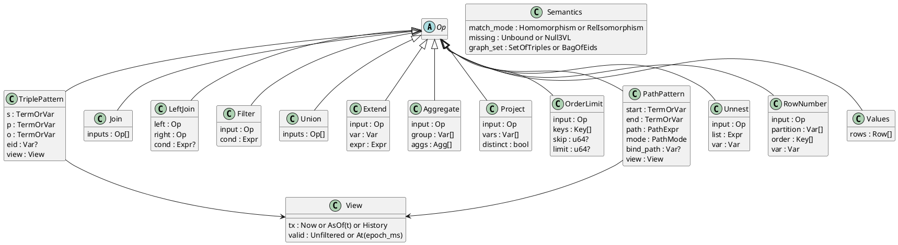
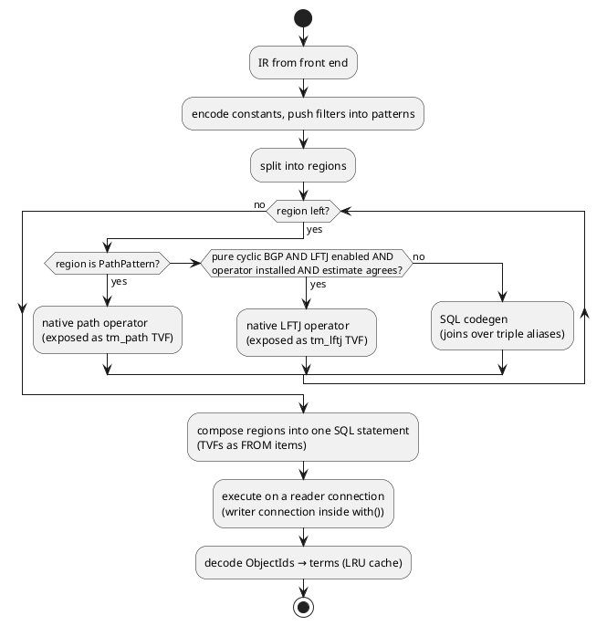
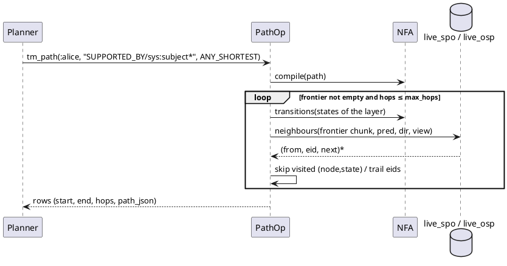

# Query

SPARQL and Cypher compile to one logical IR. A planner routes each part of a plan to generated SQL, the native path operator, or an opt-in leapfrog-triejoin (LFTJ) operator. Time is a property of every triple pattern.

## Logical IR

The IR is a small relational graph algebra whose leaves are view-scoped triple patterns. Flags carry the semantic differences between the dialects, so one executor serves both.



- Every `TriplePattern` and `PathPattern` has its own `View`. A query-level time clause sets the default, and a per-pattern clause overrides it. See [[query#Temporal Syntax]].
- `eid` binds the statement id. SPARQL binds it with `~ ?r` or `<<( )>>` reifier syntax, Cypher with a relationship variable. See [[query#Front Ends#Cypher Dual View]].
- Expressions include `Exists`/`NotExists` (SPARQL `EXISTS`/`MINUS`, Cypher pattern predicates) and `Lookup` (Cypher `x.k`: a per-row property lookup that never multiplies rows). Joins can mark variables null-safe.
- The Rust types are [[crates/tm-ir/src/op.rs#Op]] and [[crates/tm-ir/src/op.rs#IrQuery]]. The IR also has `Unnest`, `RowNumber`, `Lookup` and null-safe join variables for Cypher.
- Constants are encoded to ObjectIds at plan time. A constant IRI or string missing from the dictionary makes its pattern empty, so the plan short-circuits.

## Views and Scans

A view is a pair: a transaction-time selector and a valid-time selector. One function turns a triple pattern plus its view into SQL predicates. No other code writes time predicates.

| View part | SQL predicate | Index family |
|---|---|---|
| `tx = Now` | `t_ret IS NULL` (verbatim, so the partial index applies) | `live_*` |
| `tx = AsOf(t)` | `t_add <= t AND (t_ret IS NULL OR t_ret > t)` | `hist_*` |
| `tx = History` | none | `hist_*` |
| `valid = At(d)` | `(v_from IS NULL OR v_from <= d) AND (v_to IS NULL OR v_to > d)` | `valid_p`, or filtered from the above |

The exact shapes and verified plans are in [[storage#Query Shapes]]. The function is [[crates/tm-core/src/view.rs#scan_predicates]]; the query executor resolves `AsOf(Instant)` to a `t` at plan time and calls it through [[crates/tm-exec/src/scan.rs#view_predicates]].

- `asOf(instant)` resolves `t` inside the read's own statement, as `(SELECT coalesce(max(t), 0) FROM tx WHERE instant <= ?)` bound to one shared parameter, so it sees the read's snapshot. A future `t` is taken literally.

### Virtual Predicates

Some predicates are computed from the triple row instead of stored, by [[crates/tm-exec/src/virtual_pred.rs#VirtualPred]]. The scan expands them into column references, so they cost no joins.

| Predicate | Value | Used by |
|---|---|---|
| `sys:subject`, `sys:object`, `sys:predicate` | `s`, `o`, `p` of the statement `eid` | Path hops through layers. See [[query#Physical Planning#Path Engine]] |
| `tm:txAdded`, `tm:txRetracted` | `t_add`, `t_ret` as `TX` ids | SPARQL `?r tm:txAdded ?t`, Cypher `r.txAdded` |
| `tm:addedAt`, `tm:retractedAt` | the `instant` of `t_add`, `t_ret` as `DATETIME` with offset `Z` | SPARQL `?r tm:addedAt ?when`, Cypher `r.addedAt` |
| `tm:validFrom`, `tm:validTo` | `v_from`, `v_to` as `DATETIME` | SPARQL and Cypher |
| `tm:retractKind` | `ret_kind` | History queries |
| volatile keys | `volatile.value` for `(s, key)` | Cypher `n.lastSeen` under `Now` only. See [[storage#Volatile Table]] |

- **Instants:** `tm:addedAt` and `tm:retractedAt` read `tx.instant` with a scalar subquery by the integer primary key `tx.t`, so the pattern stays one `triple` alias and a bound eid still costs no extra scan. A constant date-time compares by instant: `t_add = (SELECT t FROM tx WHERE instant = ?)` seeks the unique `tx_instant` index once. `tm:retractedAt` is absent while the statement is live; under `asOf` it shows a later retraction, as `tm:txRetracted` does.
- **Bitemporal recipes:** the instants sit beside `tm:validFrom` and `tm:validTo` in one row, so "learned late" is `?r tm:addedAt ?a ; tm:validFrom ?f FILTER(?a > ?f)` and "recorded after it stopped being true" is `FILTER(?a > ?to)` over `tm:validTo`. SPARQL has no date-time arithmetic, so a lag of more than N days is a Cypher query: `r.addedAt.epochMillis - r.validFrom.epochMillis > $days * 86400000`.

## Physical Planning

The planner (routing in [[crates/tm-exec/src/plan/route.rs#route_bgp]]) splits the IR into regions and routes each region to the engine that handles its shape best. Regions compose because native operators are exposed to SQL as table-valued functions.



### SQL Codegen

Acyclic patterns, filters, optionals, unions, aggregates and ordering become one SQL statement, with one `triple` alias per triple pattern. SQLite's planner orders the joins and picks the indexes, from statistics the engine keeps current.

- The generator is [[crates/tm-exec/src/sqlgen/mod.rs#Gen]].
- A pattern becomes `triple AS tN` plus equality constraints for constants and shared variables, plus its view predicates.
- `LeftJoin` → `LEFT JOIN … ON`, `Union` → `UNION ALL`, `Aggregate` → `GROUP BY`, `Project{distinct}` → `DISTINCT`, `OrderLimit` → `ORDER BY/LIMIT/OFFSET`.
- `RelIsomorphism` adds `tI.eid <> tJ.eid` for every pair of relationship patterns in one `MATCH`.
- Order by value decodes first: string and double ordering is not id ordering. See [[data-model#ObjectId#Range Scans]].
- All values are bound as parameters; the generated SQL text never contains data.

### Join Ordering

Constants are bound parameters, so SQLite cannot see which predicate is rare. It orders joins well only with statistics, which the engine therefore treats as part of the schema, not as tuning.

Measured on SQLite 3.53 with 1.1 million statements and a four-pattern BGP with bound parameters: without statistics the planner starts from the 500 000-row `knows` pattern and takes 272 ms. With `ANALYZE` it starts from the 50-row pattern and takes 1 ms. With statistics, it also chose the best order for every skewed shape tried, including predicate-only patterns. The bundled SQLite of `rusqlite` enables `STAT4`.

- **Always present:** `Db::open` runs `PRAGMA optimize=0x10002` and, on a populated file without STAT4 samples, a full `ANALYZE`. After bulk loads and at most once every `OpenOptions.optimize_every` commits (default 1000) the writer runs a full `ANALYZE` and then `PRAGMA optimize`. `Db::optimize()` runs a full `ANALYZE`. A bulk import session defers this trigger to one analysis at its end ([[query#Bulk Import]]).
- **STAT4 and readers:** `PRAGMA optimize` alone analyses with a limit and writes no STAT4 samples, so the planner could not tell a 50-row predicate from an 18 000-row one. Pooled readers also keep the statistics they loaded when they opened, so the writer bumps the schema cookie after each analysis and readers reload the statistics at their next read.
- **Only plans degrade:** stale statistics change a plan's speed, never its results. `sqlite_stat1` and `sqlite_stat4` are SQLite's own tables, outside the graph and outside [[time-model#Never Forget]].
- **Index family:** with statistics, SQLite may use a `hist_*` index for a `Now` pattern whose predicate has no retracted rows, because the cost is the same. Once a predicate has churn, the statistics steer it to `live_*`. Plan tests assert the family on a churned fixture.
- **Explain:** `explain()` returns SQLite's `EXPLAIN QUERY PLAN` for every SQL region. Golden plan tests run the skewed fixture with bound parameters.
- **Fallback (benchmark-gated):** an engine-forced order, where patterns are sorted by the engine's own per-predicate counts and the order is fixed with `CROSS JOIN`, as oxilite does ([[prior-art#oxilite]]). It is built only if a benchmark shape runs more than 10× slower under SQLite's order with fresh statistics than under the best forced order. See [[roadmap#Benchmarks]].

### Path Engine

Paths run as a native breadth-first search over the product of a path DFA and the graph, never a recursive CTE. One engine, [[crates/tm-exec/src/path/engine.rs#PathEngine]], serves SPARQL property paths, Cypher variable-length and shortest patterns, `tm_path` and `View::path`.

- **Automaton:** the path text or IR expression (`/ | * + ? ^`, `{m,n}`, Cypher `-[:T*m..n]->`) compiles to a Thompson NFA over predicate and direction symbols, then to a [[crates/tm-exec/src/path/automaton.rs#Dfa]] by subset construction over a refined alphabet. A hop sequence has exactly one run, so no path is returned twice. `^` pushes the direction down, bounded repetition is unrolled, and an unbounded Cypher cap is a search depth bound, not an unrolling. More than 4 096 DFA states is `Unsupported("path expression too complex")`.
- **Neighbours:** one layer (hop count) at a time. For each DFA letter, the layer's distinct frontier nodes go through `rarray(?1)` in chunks of 256 ids, as `FROM rarray(?1) AS r CROSS JOIN triple AS t`, which drives one index probe per node: `live_spo`, `live_pos` or `live_osp` under `Now`, `hist_*` otherwise, or the rowid for a statement id. Time predicates come only from the view function of [[query#Views and Scans]]; the SQL text holds no data. See [[crates/tm-exec/src/path/fetch.rs#Fetcher]].
- **Virtual hops:** `sys:subject`, `sys:object` and `sys:predicate` step from a statement to its parts, and their inverses step back, under the view of the statement row, so a path crosses layers. Their relationship identity on a trail is `(eid, hop kind)`. In path values a virtual hop names its predicate by a reserved id outside the term dictionary (payload `2^59` and up), which the decoders and [[crates/tm-cypher/src/exec/access.rs#virtual_eid]] map back to the `sys:` IRI.
- **Modes (v1):** `REACH` (endpoints only, set semantics, hops of the shortest witness), `TRAIL` (no repeated stored eid), `ANY_SHORTEST` (the lexicographically smallest hop-key sequence per end) and `ALL_SHORTEST`, all in [[crates/tm-exec/src/path/search/mod.rs#search]]. Rows come in non-decreasing hops; `REACH` orders a layer by raw ObjectId, the other modes by hop key (eid, then stored before virtual, then forward before inverse). A `WHERE "end" = ?` on `tm_path` stops the search early.
- **Limits:** a recursive path needs a bound endpoint, otherwise `Unsupported`. An unbounded Cypher pattern, including `shortestPath`, stops at `OpenOptions.path_max_hops` (default 15) without an error; an explicit Cypher upper bound is honoured; SPARQL paths are uncapped. The search-state guard `path_max_states` (default 1 000 000) fails with `PathLimitExceeded { limit }` and never returns a truncated result.
- **Wildcard:** the reserved atom `sys:anyRelationship` (Cypher `[*]`) steps over relationship-view statements only: not literal properties unless `sys:isEdge true`, not `rdf:type`, not `sys:` statements.
- **Graphs:** a request may carry a graph set (`PathRequest.graphs`). Every statement a path traverses must then be a member of one of the graphs, the membership `(e sys:inGraph g)` visible in the hop's view: the statement stepped over, or for a virtual hop the statement whose part is stepped to or from. Each fetch shape gains one `EXISTS` on `t.eid`, a covering-index seek, with `sys:inGraph` and the graph ids as parameters ([[crates/tm-exec/src/path/fetch.rs#Fetcher]]). Zero-hop rows ignore the set; an empty set or a store without `sys:inGraph` leaves only them.
- **Time-respecting:** with `PathRequest.time_respecting` ([[crates/tm-exec/src/path/engine.rs#TimeRespecting]]) valid time never goes backwards along a path, a journey in a temporal graph. A time τ starts at `after` or −∞; a stored hop over `[v_from, v_to)` needs `v_to > τ` (or no `v_to`) and moves τ to `max(τ, v_from)`; virtual hops keep τ. The view's `validAt` and a graph set still apply. Rows carry `arrival` (epoch ms; `None` for −∞ and for ordinary searches). See [[query#Physical Planning#Path Engine#Time-Respecting Search]].
- **Completeness:** every search reports `Exhaustive`, `StoppedAtBound` or `StoppedAtCap`, see [[query#Physical Planning#Path Engine#Path Completeness]]. SPARQL and Cypher reach time-respecting search through [[query#Temporal Path Syntax]].
- **Later:** `SIMPLE`, `ACYCLIC`, `SHORTEST k`, negated property sets and quantified path patterns.

#### tm_path

The eponymous read-only table function `tm_path(start, path, mode, max_hops, view, graphs)` is registered on every connection and returns `(start, "end", hops, path_json, arrival)`; [[crates/tm-exec/src/path/vtab.rs#call]] is its body.

- **Arguments:** `start` is an ObjectId (NULL gives no rows). `path` is SPARQL 1.1 property-path text plus `{m,n}`, `{m,}` and `{n}`, with atoms `<iri>`, CURIEs (declared prefixes, `sys:`, `tm:`, `rdf:`, `xsd:`) and bare names through `@vocab`. `mode` is `REACH`, `TRAIL`, `ANY_SHORTEST` or `ALL_SHORTEST`, case-insensitive, default `REACH`. `max_hops` defaults to none, except `TRAIL`, which defaults to `path_max_hops`. `view` is `now`, `asOf/<t or RFC 3339>`, `history`, optionally followed by `;validAt/<d>`, or `validAt/<d>` alone, also with the `urn:tiramemsu:tm:` prefix. `graphs` is NULL (no filter), the INTEGER ObjectId of one graph, or TEXT with a JSON array of ids (`'[]'` is the empty set); it may be a column, so a call can follow a graph per row.
- **Output:** `path_json` is NULL for `REACH` and otherwise `{"nodes":[ids],"edges":[{"eid":id,"p":id,"dir":"out"|"in"}]}` with raw ObjectIds as integers. `arrival` is the INTEGER epoch-ms arrival of a time-respecting call, else NULL.
- **Time respect:** a `timeRespecting` or `timeRespecting/<RFC 3339 or epoch ms>` part of the `view` text (any order, at most once, e.g. `now;validAt/2025-01-01;timeRespecting/2024-06-01`) makes the call time-respecting.
- **Hop cap:** a `hopCap` part marks `max_hops` as the configured cap on an unbounded expression, for completeness reporting only ([[query#Physical Planning#Path Engine#Path Completeness]]); a NULL `max_hops` under `TRAIL` is the cap already.
- **Errors:** a bad argument fails the statement with a message that starts with `tm_path: <argument>:`. A `PathLimitExceeded` or `Unsupported` inside SQL is kept in a per-connection slot and re-raised as the typed error by the executor.
- **Snapshot:** the function reads through the calling statement's own connection (a non-owning handle, [[crates/tm-rusqlite/src/table_fn.rs#borrowed_exec]]), so it sees that statement's snapshot, or the speculative state inside `with`.

#### Time-Respecting Search

A time-respecting search answers "could something travel along these facts in time order" with earliest-arrival semantics; each mode keeps the rows of a plain search that respect time.

- **`REACH`** is label-correcting ([[crates/tm-exec/src/path/search/reach.rs#run_timed]]): it keeps the earliest time per `(node, DFA state)` and expands a pair again when it is reached with a strictly earlier time, because a longer walk can arrive earlier. The hop rule is monotone (an earlier time allows every hop a later one does, and never ends later), so when no pair improves every end has its earliest arrival over all walks within the hop bound, and its first layer is its shortest time-respecting walk. Rows are emitted once the search is complete, ordered by hops, then raw id; a pushed-down `"end"` filters them but cannot stop the search early.
- **`TRAIL`** keeps each arena entry's time and skips hops it does not allow; every row is a time-respecting trail with its own arrival.
- **`ANY_SHORTEST` / `ALL_SHORTEST`** ([[crates/tm-exec/src/path/search/shortest.rs#run_timed]]) key a layer's entries by `(node, state, time)` and keep an entry only if its time is strictly earlier than the pair's best time in every earlier layer (Pareto pruning per layer). A dropped entry lies on no shortest path, and every shortest time-respecting walk stays a path of the layered DAG, so the rows are the minimal-length time-respecting paths, ordered by hop key as usual.
- **Reading the interval** costs nothing: every fetch selects `t.v_from, t.v_to`, which are in every covering index.
- **Checked** against a brute-force enumeration of every time-respecting walk ([[tests#Query#Time Respecting Paths Match Brute Force]]).

#### Path Completeness

A path search reports whether it was exhaustive or a hop limit stopped it, and which kind of limit: the bound the query wrote, or the configured cap on an unbounded expression ([[crates/tm-ir/src/path.rs#PathCompleteness]]).

- **Verdicts:** `Exhaustive` (no state left to expand), `StoppedAtBound { max_hops }` (an explicit bound such as a `max_hops` argument stopped it with states left: complete within the bound, as asked) and `StoppedAtCap { max_hops }` (`path_max_hops` stopped an unbounded Cypher `*` or `shortestPath`, or `PathArgs::capped`: longer matches may exist, so it does not claim exhaustive evaluation). `is_complete()` is false only for the cap.
- **Detection:** when the hop bound ends the search with entries left, one more fetch round probes whether one of them has a neighbour along a DFA transition (`Ctx::more` on [[crates/tm-exec/src/path/search/mod.rs#Ctx]]); time and trail identity are not checked by the probe, so a cut means "longer paths may exist". A bounded expression (`*1..3`, `{1,3}`) whose automaton has no move left is exhaustive. A consumer that stops early (an end filter) is not a cut.
- **Cap or bound:** `PathRequest.hop_cap` (IR `PathPattern.hop_cap`, set by Cypher for an unbounded upper limit) marks `max_hops` as the cap; on `tm_path` a NULL `max_hops` under `TRAIL` and a `hopCap` view part do. Every other bound is the query's.
- **Reporting:** `PathEngine::run` returns the verdict and records it in a thread-local scope ([[crates/tm-exec/src/path/report.rs#collect]]) merged over every `tm_path` call of a query (the least complete wins). `View::path_report` returns it with the rows, `Solutions::path_completeness` and `CypherResult::path_completeness` carry it for queries (`None` when no path ran), and the bridge adds it only when asked ([[bindings#JSON Bridge#Operations]]).
- **State guard:** exhaustion of `path_max_states` is never a verdict: the search fails with `PathLimitExceeded`.


#### Path Lowering

The planner routes each `PathPattern` region to `tm_path` ([[crates/tm-exec/src/plan/route.rs#orient]]); the front ends decide which constructs become regions.

The call starts from the bound start, else from the bound end with the inverted expression, and a path may start where another path ends. A nullable path from a constant that is in no statement binds the far end to that very term. A path variable is decoded to a text with lexical terms, read in pattern order whichever end the call started from.

- **SPARQL:** a path with `*`, `+` or `?` is one `REACH` region; a path of only `/`, `|`, `^` uses the SPARQL 1.1 translation to joins and unions and needs no bound endpoint. The time scope is the `FROM` or `SERVICE` scope of the pattern.
- **Graphs:** a region carries the graph selector of its block (`PathPattern.graph`). `GRAPH <g>` and `FROM <g1> FROM <g2>` pass their graphs as the `graphs` argument. `GRAPH ?g` passes the column of `?g` when a pattern joined with the path binds it; otherwise the SQL generator adds the graphs of the view (objects of visible memberships of visible statements) before the call and runs the path once per graph (`sqlgen/native.rs`).
- **Zero-length per graph:** the rule for a constant in no statement applies once per graph in scope: once under `GRAPH <g>` (even a graph with no member) and a `FROM` default, once per graph under `GRAPH ?g`, where the call runs from the constant's plan-local id so the engine returns the zero-hop row per graph.
- **Non-recursive paths in a graph:** each triple of the translation carries the block's selector, like a BGP, so a virtual step (`:b :supportedBy/sys:subject ?x`) reads without a graph there, while a recursive path filters virtual hops too.
- **Cypher:** `*` patterns are `TRAIL` regions, `shortestPath` and `allShortestPaths` are `ANY_SHORTEST` and `ALL_SHORTEST` (minimum 0 or 1). Relationship isomorphism across fixed and variable-length positions is checked on the result rows. An unbounded upper limit becomes `max_hops = path_max_hops` with `hop_cap` set.
- **Time-respecting:** a region with `PathPattern.time_respecting` is always called from its start ([[query#Temporal Path Syntax]]).



### LFTJ

An opt-in worst-case-optimal join for pure cyclic basic graph patterns, behind `NativeKind::Lftj`. Results equal the SQL route row for row; only speed differs. See [[crates/tm-exec/src/lftj/mod.rs#call]].

The operator is [[crates/tm-exec/src/lftj/mod.rs#LftjOperator]], registered as the eponymous table function `tm_lftj(spec)` with output columns `c0 … c31`. The generator compiles a routed region to one call whose plan text ([[crates/tm-exec/src/lftj/spec.rs#LftjSpec]]) lists the patterns in join order, so the operator holds no state. The call sits in an unflattened derived table (`LIMIT -1`), so SQLite materialises it once when it lands in an inner loop, for example on the optional side of a `LEFT JOIN`. Filters, projections, aggregates and optional parts around the region stay in SQL. The triangle evidence is in [[roadmap#Benchmarks]]; the prior art is [[prior-art#MillenniumDB]].

#### Routing Policy

A cyclic BGP goes native only when every condition holds; otherwise it stays SQL and explain names the first condition that failed as the region's `RouteNote`.

1. **Enabled:** `OpenOptions::planner.lftj.enabled` (default false), else `CyclicLftjDisabled`.
2. **Installed:** an LFTJ operator is registered, else `LftjUnavailable`. The facade registers it only when LFTJ is enabled, so default databases do not even have `tm_lftj`.
3. **Applicable:** every input of the join is a stored-triple pattern and at most 32 variables are returned, else `LftjUnsupportedShape`. Virtual predicates, volatile values, paths, a cycle closed only through `OPTIONAL` and a cycle among non-pattern inputs keep SQL with this note.
4. **Estimate:** some pattern matches at least `min_rows_estimate` statements (default 100 000) in its own view, counted with a capped `count(*)` in the planning snapshot, else `LftjBelowEstimate`. `0` routes without counting.

A routed region is `RegionKind::NativeLftj` with `RouteNote::LftjNative`; `View::explain_ir` and `View::explain_sparql` show it with the call's `EXPLAIN QUERY PLAN` rows. Routing is [[crates/tm-exec/src/plan/route.rs#route_bgp]] then [[crates/tm-exec/src/plan/route.rs#lftj_route]].

#### Access Paths

Each pattern becomes one sorted access path read through the calling statement's connection, so the operator sees that statement's snapshot, or the speculative state inside `with`.

The scan is the pattern compiled by the same generator as a SQL pattern: its constants, its own view predicates ([[query#Views and Scans]]) and, under set semantics, the canonical-eid predicate, ordered by its variables in join order. A `GRAPH` selector is already a membership pattern `(e sys:inGraph g)` with its own view, so graph constraints are access paths too. Two patterns of one query may use different transaction and valid times.

#### Join And Semantics

[[crates/tm-exec/src/lftj/join.rs#leapfrog]] binds one variable at a time and leapfrogs the sorted access paths of the patterns containing it with galloping seeks.

- **Order:** subject, object and predicate variables first, most shared and connected first; then eid variables; then hidden eids. Any order gives the same rows.
- **Multiplicity:** every pattern has an eid variable, a hidden one when the query binds none, so parallel statements keep their rows under Cypher's bag of eids, while SPARQL's canonical-eid predicate leaves one row per `(s, p, o)`.
- **Isomorphism:** Cypher patterns of one match group need distinct eids unless their constant predicates differ, as `tI.eid <> tJ.eid` requires on the SQL route; grouped eids are output columns so patterns outside the region stay distinct from them too.
- **Provenance:** provenance eid variables are ordinary eid variables, so `SparqlOptions::provenance` reports the same eids on both routes.

#### Budgets And Limits

The operator polls the operation budget of [[query#Query Budgets]] while it scans and joins; cancellation or a deadline fails the statement with the typed error and returns no rows.

Row and byte budgets count the rows the statement returns, as on the SQL route, and fail with `ResultLimitExceeded` before a partial result exists. The call materialises its output rows before SQLite reads them, so memory grows with the region's output, not just its inputs; a count over millions of triangles holds them all for the duration of the statement.

## Front Ends

Both dialects are built in parallel against the IR. A differential test suite runs equivalent SPARQL and Cypher queries on the same data and requires identical results.

### SPARQL

SPARQL is parsed by `spargebra` (Oxigraph's parser and algebra) and lowered to the IR. The time IRIs use standard `FROM` and `SERVICE`, so the grammar is not modified.

- **v1 query forms:** `SELECT`, `ASK`, `CONSTRUCT`. BGP, `OPTIONAL`, `FILTER`, `UNION`, `MINUS`, `BIND`, `VALUES`, property paths, aggregates, subqueries, `ORDER BY/LIMIT/OFFSET`.
- **v1 update:** `INSERT DATA`, `DELETE DATA`, `DELETE/INSERT … WHERE`. Insert maps to assert, delete to retract (with cascade). See [[time-model#Operations]].
- **SPARQL 1.2:** triple terms, reifiers (`~ ?r`) and annotations (`{| … |}`) bind directly to eids. Annotation triples are layer triples whose subject is the eid.
- **Deviation from RDF 1.2:** the store cannot hold an *unasserted* triple term, because every eid is a stored statement. A triple term or reified triple in inserted data is therefore asserted, and its eid is used. `rdf:reifies` is never stored; it is resolved to the eid.
- **Updates:** `View::sparql` accepts queries and updates. Updates run only on the current view, and a whole update request is one transaction.
- **Predeclared prefixes:** `rdf`, `rdfs`, `xsd`, `sys`, `tm`, `v` (the database `@vocab`) and the database prefix table. A `PREFIX` in the query overrides them.
- **Known limits (M2a):** decimal arithmetic and aggregates return `xsd:double`; string functions drop language tags; `AVG` over an empty group is unbound; `xsd:date` drops a timezone; RDF/XML input is not read. 147 of 781 in-scope W3C tests are listed with a reason in `crates/tm-sparql/tests/w3c/expected-deviations.toml`, and the runner fails on any unexpected result. `spargebra` 0.4.7 quirks (right-associative `a - b - c`, `a/b` as a BGP with a generated blank node) are corrected from the query text, not by patching the parser.
- **Semantics:** `graph_set = SetOfTriples`. Several live eids with the same `(s, p, o)` show as one triple unless the eid is bound. `match_mode = Homomorphism`, `missing = Unbound`.
- **Implementation:** `tm-sparql` (`crates/tm-sparql`) parses, checks and lowers a text in `prepare`, before any SQL runs. `View::sparql` returns a `SparqlResult`: `Solutions`, `Boolean`, `Graph` (CONSTRUCT) or `Update(TxReport)`. It writes SPARQL JSON and N-Triples, RDF 1.2 N-Triples when a triple term occurs.
- **Results:** nodes, blank nodes, eids and transactions are returned as the skolem IRIs `urn:tiramemsu:node:<n>`, `bnode:<n>`, `stmt:<n>` and `tx:<t>`, and they parse back to the same ids when written in a later query. A date-time is rendered in the offset it was stored with.
- **Property paths:** `*`, `+` and `?` paths run on [[query#Physical Planning#Path Engine]]; sequences, alternatives and inverses become joins and unions. A negated property set `!p` is `Unsupported("negated property sets")`. `spargebra` already desugars a sequence `a/b` of plain IRIs into a pattern with a generated blank node, which is exactly the SPARQL 1.1 translation.
- **Named graphs:** `GRAPH <g>`, `GRAPH ?g`, `FROM` and `FROM NAMED` with non-`tm:` IRIs lower to a graph selector on the block's triple patterns ([[data-model#Named Graphs]]). `GRAPH ?g` binds an internal variable per block, so `MINUS` inside compares one graph's solutions. The default graph is the union of all statements. Annotation triples of a reifier and virtual-predicate patterns read with no graph selector. Property paths under a `GRAPH` block or a `FROM <g>` default run on the path engine with the block's graphs ([[query#Physical Planning#Path Engine#Path Lowering]]), and `GRAPH ?g` over a subquery or a block with neither a triple pattern nor a path is `Unsupported`. The selector lowers in `tm-exec` to `(e sys:inGraph g)` joined under the pattern's own view; several `FROM` graphs become an `EXISTS` so a statement in two of them matches once.
- **Updates:** the request is checked before the transaction opens (`LOAD`, `ADD`, `MOVE`, `COPY`, `CLEAR DEFAULT`, `CLEAR ALL`, `DROP DEFAULT`, `DROP ALL` and non-current views are `Unsupported`, and `ADD`/`MOVE`/`COPY` are recognised on the text because `spargebra` rewrites them). `GRAPH` blocks in `INSERT DATA`, `DELETE DATA` and templates, `WITH`, `USING`, `CREATE`, `CLEAR GRAPH`/`NAMED` and `DROP GRAPH`/`NAMED` are supported: inserting into a graph asserts the statement and a membership, deleting from a graph retracts the membership only, and the `TxReport` lists memberships apart from statements. The `WHERE` of `DELETE/INSERT` runs on the writer inside the transaction, so it sees earlier operations of the request. A reifier in a template must be a blank node or a bound eid, not an IRI. Delete templates with a bound reifier retract exactly that eid.
- **Known deviations:** `spargebra` 0.4.7 parses `a - b - c` as `a - (b - c)`, so chains are re-associated when the text has no parenthesised operand of that class. `xsd:decimal` results of arithmetic and aggregates are `xsd:double`, string functions drop language tags, and `AVG` over an empty group is unbound. The W3C subset lists every deviation with its reason in `tests/w3c/expected-deviations.toml`, and the runner fails on any unlisted difference.
- **Duplicate removal only where needed:** removing duplicate `(s, p, o)` costs one covering seek per row, which doubled a 2-hop join in a benchmark. It is skipped for predicates that have never held two eids with the same `(s, p, o)`, which [[storage#Multi-Eid Predicates]] records. Idempotent assert never creates such pairs; only `create` and repeated episodes do.

#### Query Provenance

With `SparqlOptions { provenance: true }`, each `SELECT` row carries the sorted eids of the stored statements that matched to produce it, so an agent can cite its facts and later find answers that relied on a retracted one.

- **Pipeline:** [[crates/tm-sparql/src/provenance.rs#instrument]] rewrites the lowered IR, the facade runs it, and [[crates/tm-sparql/src/provenance.rs#ProvenancePlan#assemble]] builds the rows. The main query and the sibling lookups run in one read, so both see the same state. Off by default: plans, rows and JSON are unchanged.
- **Hidden eids:** every stored triple pattern binds its eid. An unbound eid becomes `~prov<N>`; [[crates/tm-ir/src/var.rs#is_provenance]] tells the planner to keep the canonical-eid predicate for it, so the rows are exactly those without provenance. A reifier's variable is reused, and a user eid that leaves a subquery is aliased so the outer scope is unchanged.
- **One triple, all its eids:** the canonical eid stands for its `(s, p, o)`. One sibling lookup per view (batches of 500) maps it to every visible eid with the same `(s, p, o)`, and the row lists them all.
- **Counts:** matched `OPTIONAL` parts, the `UNION` branch taken, annotations, fixed-length paths, and `SERVICE` time scopes (the eid seen then, even if retracted now). `GRAPH <g>`, `GRAPH ?g` and a single `FROM <g>` also list the `sys:inGraph` membership statement, joined in the pass instead of in `tm-exec`'s graph lowering.
- **Does not count:** expressions are never walked, so statements tested by `FILTER EXISTS`, `NOT EXISTS` or `MINUS` are not listed. Virtual predicates add no eid. Recursive path regions (`*`, `+`, `?`) contribute nothing, because `REACH` carries no eids; the pass records them as `ProvenanceGap::RecursivePath` in `Solutions::provenance_gaps`, so `provenance_complete()` tells complete provenance from incomplete. A text match (`tm:textMatch`) cites the statement it matched. With several `FROM` graphs the membership is an `EXISTS` test and only the statement counts.
- **Modifiers:** top-level `DISTINCT` is merged in Rust: rows equal on the projected cells merge into the first one and union their eids, then `OFFSET`/`LIMIT` apply, so a `DISTINCT … LIMIT` query reads every row. `ORDER BY` stays in SQL. `REDUCED` keeps duplicates.
- **Groups and subqueries:** each provenance column entering an `Aggregate` becomes `GROUP_CONCAT` of statement IRIs, parsed back when rows are assembled, so groups and nested groups union their rows. A `DISTINCT` subquery becomes a group over its projected variables.
- **Errors:** `ASK`, `CONSTRUCT` and updates with provenance are `Unsupported` (`"provenance for ASK"`, `"… CONSTRUCT"`, `"… updates"`), as is `SELECT DISTINCT` of no variable in a subquery. Cypher needs none: relationship variables are eids already.
- **Output:** `Solutions::provenance(row)`. SPARQL JSON gains a non-standard `"provenance"` member between `head` and `results`, because streaming parsers reject anything after the bindings. The JSON bridge takes `provenance: true` on `sparql` and returns `"provenance"` and `"provenanceGaps"` beside `"rows"`.
- **Query-only text:** `SparqlOptions { query_only: true }` refuses an update request with `Unsupported("update in a query-only call")` before anything runs; the bridge spells it `queryOnly`, and the MCP `query` tool always sets it ([[api#MCP Tools]]).

### Cypher

Cypher parses an openCypher subset plus a few documented extensions and runs it over the same statements as SPARQL. The crate is `tm-cypher`; the parser is `open-cypher`, pinned behind an adapter.

- **v1 read:** `MATCH`, `OPTIONAL MATCH`, `WHERE`, `WITH`, `RETURN`, `ORDER BY/SKIP/LIMIT`, `UNWIND`, aggregates, `UNION`, `EXISTS {}` and pattern predicates, `CALL { … }` subqueries (uncorrelated, or importing `WITH`), named paths, variable-length relationships, `shortestPath` and `allShortestPaths` (see [[query#Physical Planning#Path Engine]]), and `CALL db.labels()`, `db.relationshipTypes()`, `db.propertyKeys()`. A variable-length pattern needs a bound endpoint; property maps on it, quantified path patterns and `REPEATABLE ELEMENTS` with it are `Unsupported`.
- **v1 write:** `CREATE` → create; `MERGE` → upsert or an atomic pattern match; `SET` → assert or supersede; `REMOVE` and `DELETE` → retract; `DETACH DELETE` → retract every statement mentioning the node. The whole query is one transaction: [[crates/tiramemsu/src/cypher.rs#Db#cypher_write]] or [[crates/tiramemsu/src/cypher.rs#TxCypher]] inside a caller's `transact`.
- **Not in v1:** `FOREACH`, `LOAD CSV`, `CALL … IN TRANSACTIONS`, schema commands, quantified path patterns, GQL path modes, `!`/`&`/`%` label expressions, pattern comprehension, user-defined procedures, durations and `time`/`localtime`.
- **Semantics:** `graph_set = BagOfEids`, `match_mode = RelIsomorphism` (Cypher 25 default; `REPEATABLE ELEMENTS` opts out, `DIFFERENT RELATIONSHIPS` is the default), `missing = Null3VL`.
- **Pipeline:** [[crates/tm-cypher/src/program.rs#compile]] parses ([[crates/tm-cypher/src/parse/adapter.rs#parse]]), checks scopes, kinds, aggregates, parameters and writes ([[crates/tm-cypher/src/sema/check.rs#check]]), and keeps the checked AST. [[crates/tm-cypher/src/exec/mod.rs#run]] interprets it clause by clause over rows of Cypher values.
- **IR versus interpreter:** graph patterns, label and property-map existence tests, relationship isomorphism and every time view lower to the IR ([[crates/tm-cypher/src/exec/pattern.rs#Plan]]). Expressions, functions, projection, aggregation, ordering, `UNWIND`, `UNION`, `CALL` and write clauses run in Rust, because the IR has only SPARQL scalar functions and no list or map values. `tm-cypher` reaches the store only through the [[crates/tm-cypher/src/runner.rs#Runner]] trait, which the facade implements over a view or a transaction.
- **Names:** labels, types and keys map to IRIs through [[data-model#Vocabulary Mapping]], always with the vocabulary current at compile time, even under `USE AS OF`.
- **Parser:** `open-cypher` has no `CALL { }` clause, `FOREACH` or `LOAD CSV`. [[crates/tm-cypher/src/parse/subq.rs#extract]] cuts each outermost `CALL { }` out of the token stream, parses its body over the same byte offsets and leaves a placeholder call of equal length, and `FOREACH`, `LOAD CSV` and schema commands are recognised when parsing fails. The time clauses and `REPEATABLE ELEMENTS` are blanked by the span-preserving token pass [[crates/tm-cypher/src/parse/prepass.rs#run]]. The fallback, if `open-cypher` has to be replaced, is oxilite's hand-written parser, then `decypher`. See [[prior-art#oxilite]].
- **Statement classification:** a literal object is a property and a node, blank node or statement object is a relationship; `sys:isEdge` overrides this, read in each pattern's view. `rdf:type` is only a label. The unlabelled node scan excludes statements, transactions, class IRIs that are only `rdf:type` objects, and nodes that only `sys:` statements mention.
- **Node identity:** the reserved map key `` `@id` `` sets or matches a node's IRI. `elementId()` returns the IRI or skolem IRI, and `id()` returns the raw ObjectId.
- **`SET x.k = v`:** no value → assert; same value → no-op; `sys:one` → cardinality replacement (annotations dropped); one different value → supersede (annotations kept); several values → retract all, then assert. A list writes one statement per element, and a multi-valued property reads back as a list of distinct values in eid order. `null` or `[]` removes the property.
- **Values:** datetimes keep their offset: `datetime()` round-trips it, a named zone is stored as its offset at that instant, `localdatetime()` is a date-time without timezone, and `=` and ordering compare the instant. Integers beyond 60 bits are stored as `xsd:integer` and read back as Integers. `INF`, `INFINITY` and `NAN` (any case) are float literals, as in the `open-cypher` grammar, so a variable with one of those names needs backticks.
- **Deletes:** `DELETE n` retracts the node's properties and labels, and fails with `DeleteConnectedNode` if relationships remain at the end of the query. `CREATE (n)` with nothing attached writes nothing, because nodes exist only through statements.
- **Volatile values:** under `Now` with valid time unfiltered, `n.key` also reads the volatile table, and a stored statement wins. Cypher never writes volatile values.
- **Errors:** compile-time problems are `Parse` with the byte span in the original text (extensions included), constructs outside the subset are `Unsupported`, and runtime type errors, division by zero and unstorable values are `Eval`.

### Cypher Dual View

An eid is both a relationship and a node. A relationship variable may appear in node position, which is how Cypher reaches layers: edges pointing at edges.

```cypher
MATCH (a)-[r:WORKS_AT]->(c), (b:Belief)-[:SUPPORTED_BY]->(r)
RETURN a, c, r.confidence, r.txAdded, b
```

- A statement used as a node has the implicit label `:Statement`, which exposes `txAdded`, `txRetracted`, `addedAt`, `retractedAt`, `validFrom` and `validTo` as properties.
- `startNode(r)`, `endNode(r)` and `type(r)` work on either form.
- Property or relationship: a literal-valued triple about `r` is a property, and a node- or statement-valued triple is a relationship. `sys:isEdge` overrides this. See [[data-model#Statements]].
- Every standard Cypher query means the same as in Neo4j, except that a relationship variable may stand in node position, which Neo4j rejects. A variable first bound as a node still cannot be used as a relationship.
- Both forms bind the same eid, so a relationship and its `:Statement` node compare equal, and a variable is returned in the form of its first binding. The lowering is in [[crates/tm-cypher/src/exec/pattern.rs#Plan]] (one IR variable for both positions), and the statement helpers are in [[crates/tm-cypher/src/exec/access.rs#stmt_of]].

### Semantic Differences

The IR flags make the dialect differences explicit, so the same plan can be run under either semantics.

| Concern | SPARQL | Cypher |
|---|---|---|
| Graph data | Set of `(s,p,o)` over live eids | Bag of eids |
| Pattern matching | Homomorphism | Relationship isomorphism |
| Missing values | Unbound; errors in FILTER make it false | NULL, three-valued logic |
| Optional | `OPTIONAL {}` (left join) | `OPTIONAL MATCH` |
| Upsert | none (INSERT is idempotent anyway) | `MERGE` |
| Paths | Endpoints, set semantics | Path values, trail semantics |

## Temporal Syntax

Time can be chosen from the API or inside queries in both dialects, either for the whole query or per pattern. Per-pattern scoping is what makes "what changed" a single query.

| Intent | API | SPARQL | Cypher |
|---|---|---|---|
| As of tx | `db.as_of(Tx(150))` | `FROM <urn:tiramemsu:tm:asOf/150>` | `USE AS OF 150` |
| As of wall clock | `db.as_of(Instant(ms))` | `FROM <urn:tiramemsu:tm:asOf/2026-09-01T12:00:00Z>` | `USE AS OF datetime('2026-09-01T12:00:00Z')` |
| Valid at | `.valid_at(ms)` | `FROM <urn:tiramemsu:tm:validAt/2025-03-01>` | `USE VALID AT date('2025-03-01')` |
| History | `.history()` | `FROM <urn:tiramemsu:tm:history>` | `USE HISTORY` |
| Per pattern | view per call | `SERVICE <urn:tiramemsu:tm:asOf/150> { … }` | `CALL { USE AS OF 150 MATCH … RETURN … }` |
| Statement time | — | `?r tm:txAdded ?t`, `?r tm:addedAt ?when` | `r.txAdded`, `r.addedAt` |

- The default, with no clause, is tx `Now` and valid time unfiltered. Valid-time filtering is always opt-in, because an implicit "valid now" would silently hide past facts.
- The `tm:` IRIs are recognised only in `FROM` (whole query) and `SERVICE` (one group). Anywhere else they are ordinary IRIs. Nested `SERVICE` groups override per part, innermost first.
- `SERVICE` is used instead of `GRAPH` so that time and a named graph can be combined later (`SERVICE <tm:asOf/150> { GRAPH <g> { … } }`). A `GRAPH` block inside a `SERVICE` group is read in the group's view, and `FROM` may carry time IRIs beside graph IRIs. A `tm:` IRI as a graph name fails with a `Parse` error that names `SERVICE`. oxilite takes the same route for version scoping ([[prior-art#oxilite]]).
- In Cypher, `USE` takes only time clauses in v1; `USE GRAPH g` is `Unsupported("USE GRAPH")`. There is one graph per database file. A `USE` is accepted at the start of a query, of a `UNION` branch or of a `CALL { }` body (after an importing `WITH`); each selector overrides the inherited one independently ([[crates/tm-cypher/src/exec/time.rs#resolve]]). A write query with a non-`Now` top-level `USE` is `Unsupported`; a historical `CALL { USE … }` inside a write query is allowed.
- The statement time properties `txAdded`, `txRetracted` (Integers), `addedAt`, `retractedAt` (the commit instants, DateTimes), `validFrom` and `validTo` (DateTimes) and ``tm:retractKind`` denote metadata on statements even when a stored property has the same name (which stays reachable as `` `v:txAdded` ``); on ordinary nodes they are ordinary keys, and they are never listed by `keys()`. A relationship property map (`-[r {addedAt: …}]->`) tests the same metadata. `SET r.validFrom` or `r.validTo` supersedes the statement and rebinds the variable; `SET` or `REMOVE` of the four transaction-time names is `Unsupported`. The name table is [[crates/tm-cypher/src/exec/access.rs#temporal_iri]].

```sparql
# what changed about alice's employer between tx 150 and now
SELECT ?before ?after WHERE {
  SERVICE <urn:tiramemsu:tm:asOf/150> { v:alice v:worksAt ?before }
  v:alice v:worksAt ?after .
  FILTER (?before != ?after)
}
```

## Temporal Path Syntax

Both dialects can ask for a time-respecting journey, an opt-in Tiramemsu extension: SPARQL with a `SERVICE` scope and `tm:arrival`, Cypher with a `MATCH` modifier. Both lower to one IR option.

The option is [[crates/tm-ir/src/path.rs#TemporalPath]] on a `PathPattern`: a start instant (`after`, −∞ when absent) and an optional arrival variable. The planner adds `timeRespecting[/<ms>]` to the `tm_path` view text and binds the `arrival` column, so the journey runs on the native operator ([[query#Physical Planning#Path Engine#Time-Respecting Search]]) in the pattern's own view and graph selection, inside the statement's snapshot, exactly as `View::path_with` with `PathArgs::time_respecting` does.

- **Hop rule:** τ starts at `after`; a stored hop over `[v_from, v_to)` needs `v_to > τ` (or none) and moves τ to `max(τ, v_from)`; a virtual hop (`sys:subject`, `sys:object`, `sys:predicate`) keeps τ.
- **Arrival:** an integer of epoch milliseconds, the earliest over every journey to the end in `REACH` (SPARQL), the trail's own in `TRAIL` (Cypher). It is −∞ when no `after` was given and no traversed statement has a `v_from`; SPARQL then leaves the variable unbound and Cypher binds `null`. A zero-length match arrives at `after`.
- **Direction:** a journey runs forward from its start, so the start must be bound; a path bound only at its end is `Unsupported("time-respecting path with no bound start …")` ([[crates/tm-exec/src/plan/route.rs#orient]]).
- **Row shapes:** without `tm:arrival` or `ARRIVAL AS` the rows have exactly the columns of the same query without the modifier; only the matches change.
- **Errors:** grammar mistakes are `Parse` before anything runs; the state guard still fails with `PathLimitExceeded` rather than return a prefix ([[query#Physical Planning#Path Engine#Path Completeness]]).

### SPARQL Temporal Paths

A `SERVICE` IRI under `urn:tiramemsu:tm:` names the modifier; every path in its group is time-respecting, and `?end tm:arrival ?t` binds an arrival. The grammar of the IRI and the pattern is below.

```ebnf
TemporalService ::= 'SERVICE' '<urn:tiramemsu:tm:timeRespecting' Start? '>' GroupGraphPattern
Start           ::= '/' ( Integer | Date | DateTime | '$' Name )
Integer         ::= '-'? [0-9]+                      (* epoch milliseconds *)
Date            ::= xsd:date lexical form            (* 00:00:00 UTC *)
DateTime        ::= xsd:dateTime lexical form        (* no timezone = UTC *)
Name            ::= [A-Za-z_] [A-Za-z0-9_]*          (* a SparqlOptions::params key *)
ArrivalPattern  ::= ( Var | IRI ) 'tm:arrival' Var   (* inside the group *)
```

- **Which paths:** inside the group (also in nested `SERVICE`, `GRAPH`, `OPTIONAL` and `UNION` parts) every property path the parser hands over is one `REACH` region with the modifier: anything with `*`, `+`, `?`, `^` or `|`. A sequence of plain IRIs `a/b` is turned into triple patterns by the parser and is not part of a journey; write it as `(a/b)+` or `a/b?` style paths, or with `^`/`|`. A group with no such path is a `Parse` error. A nested `SERVICE <…timeRespecting…>` replaces the start for its group.
- **`tm:arrival`:** `?end tm:arrival ?t` is not a triple pattern. Its subject must be the end of exactly one time-respecting path of the group and its object a variable bound by no other `tm:arrival`; otherwise, and outside a time-respecting group, it is a `Parse` error. Lowering is `Lowerer::temporal_scope` in `crates/tm-sparql/src/lower/path.rs`.
- **Parameters:** `$name` takes the instant from `SparqlOptions::params` (an `xsd:integer` of epoch ms, an `xsd:date` or an `xsd:dateTime`), bound by the executor like a Cypher parameter; a missing one fails the query. The JSON bridge passes `params: {"name": time}`.
- **Combining:** the view still comes from `FROM` and time `SERVICE` scopes (`SERVICE <tm:asOf/150> { SERVICE <tm:timeRespecting> { … } }` or the other nesting), and `GRAPH`/`FROM` graphs still restrict every hop. The modifier is not accepted in `FROM` or as a `GRAPH` name (`Parse`).

```sparql
# who could have caught it from alice after 2024-06-01, and when at the earliest
SELECT ?who ?when WHERE {
  SERVICE <urn:tiramemsu:tm:timeRespecting/2024-06-01> {
    v:alice v:met+ ?who .
    ?who tm:arrival ?when
  }
}
```

### Cypher Temporal Paths

`TIME RESPECTING` after `MATCH` (or `OPTIONAL MATCH`, after `REPEATABLE ELEMENTS` / `DIFFERENT RELATIONSHIPS` when present) makes the clause's variable-length and shortest-path relationships journeys.

```ebnf
Match       ::= 'OPTIONAL'? 'MATCH' MatchMode? Temporal? Pattern Where?
Temporal    ::= 'TIME' 'RESPECTING' ( 'AFTER' TimeArg )? ( 'ARRIVAL' 'AS' Variable )?
TimeArg     ::= '-'? Integer | Parameter | 'datetime(' String ')' | 'date(' String ')'
```

- **Recognition:** the pre-pass [[crates/tm-cypher/src/parse/prepass.rs#run]] reads the modifier and blanks it, keeping every byte offset, like the other extensions; `time` and `respecting` stay ordinary names elsewhere. Keywords are case-insensitive.
- **Start:** `AFTER` takes an Integer (epoch ms), a `$parameter` holding an Integer, DateTime or Date, `datetime('…')` or `date('…')` (00:00 UTC); a float or any other form is a `Parse` error, a parameter of another type an `Eval` error.
- **Which relationships:** every `*` and `shortestPath` / `allShortestPaths` relationship of the clause, each a journey from `AFTER`; fixed-length relationships are ordinary patterns. A clause without such a relationship is a `Parse` error. The journey starts at the pattern's left node.
- **`ARRIVAL AS t`:** binds the arrival of the clause's single variable-length relationship (two or more is a `Parse` error); `t` must be a new variable, an Integer or `null`, and is `null` on a row an `OPTIONAL MATCH` did not match. `TRAIL` rows each carry their trail's arrival, so `min(t)` per end equals the SPARQL and Rust `REACH` arrival. Checked in [[crates/tm-cypher/src/sema/check.rs#check]] and lowered in [[crates/tm-cypher/src/exec/pattern.rs#Plan]].
- **Combining:** `USE AS OF`, `USE HISTORY` and `USE VALID AT` select the view as usual. Cypher has no graph selector (one graph per file), so a Cypher journey is never graph-scoped.

```cypher
MATCH TIME RESPECTING AFTER $since ARRIVAL AS t (a {`@id`: 'v:alice'})-[:met*]->(who)
RETURN who, min(t) AS earliest
```

## Bulk Import

An opt-in session for large loads: chunks commit as ordinary transactions under an exclusive write lease, and planner statistics are refreshed once at the end instead of after every large commit.

[[crates/tiramemsu/src/import.rs#BulkImport]] comes from `Db::bulk_import` (borrowing) or `Db::bulk_import_shared` (an `Arc<Db>`, for bindings). It is not an atomic multi-chunk transaction, and it changes no storage format.

- **Chunks:** `chunk(f)` and `chunk_with(opts, budget, f)` run [[crates/tiramemsu/src/db.rs#Db#transact_leased]], the same engine as `Db::transact`. A failing chunk rolls back alone and is counted as rejected; earlier chunks stay committed, and numbering stays gap-free.
- **Lease:** the session takes an atomic lease on the `Db`. Every write checks it under the writer mutex, so while a session lives other writes and a second session fail with `ImportInProgress`. Readers are untouched and see the last committed chunk.
- **Deferred statistics:** a chunk's commit sets the core statistics counter to deferred ([[crates/tm-core/src/storage/stats.rs#Stats#set_deferred]]), so it runs no `ANALYZE` and only marks statistics due. `finish` runs one full `ANALYZE` plus the reader refresh of [[query#Physical Planning#Join Ordering]].
- **Progress:** `ImportProgress` counts committed chunks, rejected chunks, asserted, existing and retracted rows, every chunk's `TxId`, chunk time and maintenance time.
- **Failure and interruption:** `finish` never fails. A failed analysis is `ImportSummary::maintenance_error` beside the committed chunks. `cancel` or drop only releases the lease, never analyses, and leaves `Db::statistics_due` true. The next ordinary commit then runs the upkeep, and stale statistics only slow plans.

## Query Budgets

An opt-in budget bounds one operation: how long it waits for a reader, how long it runs, and how much it decodes. Without one every call behaves as before.

A [[crates/tiramemsu/src/budget.rs#QueryBudget]] has five independent fields: `timeout`, `cancel` (a `CancelToken`), `reader_timeout`, `max_rows` and `max_bytes`. `View::with_budget`, `Db::transact_budgeted`, `Db::cypher_write_budgeted` and `QueryBudget::run` (a sequence of calls as one operation) apply it. The JSON bridge takes the same budget per call ([[bindings#JSON Bridge#Budgets]]).

- **One operation, one meter:** the facade enters a `tm_core::budget::Meter` on the calling thread for the whole call ([[crates/tiramemsu/src/budget.rs#run]]); the deadline starts then. A call nested in a budgeted operation (an update's `WHERE`, provenance sibling lookups, the statements of a Cypher query, the lookups of a bridge call) draws on the same meter, never on a fresh one.
- **Reader acquisition:** the pool waits on its condition variable until the reader timeout (`PoolTimeout`), the deadline (`DeadlineExceeded`) or cancellation (`Cancelled`, polled every 10 ms), whichever comes first. `OpenOptions::reader_timeout` is the default and the budget overrides it. With no pool the writer's mutex wait is bounded the same way. SQLite's `busy_timeout` is unrelated and unchanged.
- **SQL:** the reader or writer carries the operation's `Interrupt` while the operation runs (`Executor::set_interrupt`). The `rusqlite` host installs it as SQLite's progress handler every 1 000 VM steps, so a running statement stops with `SQLITE_INTERRUPT`, reported as the typed error. The handler is removed before the read snapshot ends and the connection goes back to the pool, so no stale deadline survives the call.
- **Native work:** the path engine polls the meter while charging search states during frontier expansion ([[crates/tm-exec/src/path/search/mod.rs#StateBudget#charge]]), so a path stops even on a host that cannot interrupt SQL.
- **Writes:** the stop conditions cover waiting for the writer and every statement of the body; the facade checks them once more when the body returns, then removes the interrupt so bookkeeping and `COMMIT` run uninterrupted. A stopped write rolls back like any failed transaction: no statement, term, event or `tx` row.
- **Result budgets:** the engine charges each SQL row as it streams and each decoded row's bytes (8 per cell plus the UTF-8 length of every string) in [[crates/tm-exec/src/exec.rs#run]]; `View::path`, `triples`, `events_since` and the other list reads charge their rows. Past `max_rows` or `max_bytes` the operation fails with `ResultLimitExceeded { limit }`; no prefix is ever returned as a result.


## Text Recall

Recall by words, not by graph pattern: the statements of a view whose string object matches a query, each with a lexical score and the evidence the store holds about it.

One logical operation, [[crates/tm-core/src/text.rs#search]], serves every surface: `View::text_search(&TextQuery)` in Rust, `textSearch` on the JSON bridge, and the `tm_text` table function ([[crates/tm-exec/src/text.rs#call]]) that SPARQL and Cypher compile to through the IR leaf `TextPattern`. All run every query on the caller's connection, in one snapshot, as one budgeted operation ([[query#Query Budgets]]).

- **Matching:** query words are split on whitespace, each quoted, and matched as whole tokens after case folding and diacritics removal (index of [[storage#Text Index]]); `TextMode` is `All` (default), `Any` or `Phrase`, and a trailing `*` is a prefix. Query text is never FTS5 syntax, and text without a word is `InvalidQuery`.
- **Visibility:** matching values are joined to `triple` through `scan_predicates`, the one writer of time predicates, so as-of, history and valid-time views select exactly what `View::triples` selects. `graphs` keeps statements with a membership visible in the same view, `predicates` filters by predicate.
- **Evidence** is read in the same view: the largest numeric object of the confidence predicate (`v:confidence` unless the query names another) or `None`, the count of `sys:confirmedBy`, the distinct `sys:author`s of the asserting and confirming transactions, and `t_add` with its instant. An absent layer is reported as absent, never estimated.
- **Ranking policy** `tiramemsu-text-rank/1`: lexical score (negated bm25) descending, confidence descending with absent last, confirmations, authors, `added_at` (newer first), and statement eid ascending as the final tie-break. Each hit carries its 1-based `rank`; `limit` cuts after ranking.
- **Errors:** `MissingCapability("fts5")` on a host without FTS5, while every other read and write still works; `TextIndexUnavailable` when the index was never built or is behind.

```sparql
SELECT ?e ?score ?c ?s ?o WHERE {
  ?e tm:textMatch "lisbon offsite" ; tm:textScore ?score ; tm:textConfidence ?c ;
     tm:textLimit 10 .                       # also tm:textRank, tm:textMode "any"
  ?s ?p ?o ~ ?e }
```

```cypher
CALL tiramemsu.text.search('lisbon offsite', {limit: 10, mode: 'all', graphs: ['trip']})
YIELD statement, subject, predicate, text, score, rank, confidence
```

- **SPARQL:** the `tm:text*` patterns on one subject variable form one recall ([[crates/tm-sparql/src/lower/bgp.rs]]); `GRAPH <g>` and `FROM` restrict it, `SERVICE <tm:asOf/…>` times it, and `GRAPH ?g` around it is `InvalidQuery`. Recall rows add no query provenance.
- **Cypher:** the procedure ([[crates/tm-cypher/src/exec/text.rs]]) joins the recall with the hit's statement and yields it in node form; `USE AS OF` and the other time clauses apply.

## Conflict Inspection

A read that shows disagreement instead of hiding it: subject/predicate pairs of one view whose distinct objects hold at the same valid time, each value with its attributed evidence.

`View::conflicts(&ConflictQuery)` in Rust, `conflicts` on the JSON bridge, `View.conflicts` in Node and Python and the MCP `conflicts` tool all run [[crates/tm-core/src/conflict.rs#inspect]] on the caller's connection, in one snapshot, as one budgeted operation ([[query#Query Budgets]]).

- **Conflict:** two statements of the view with the same `s` and `p`, different `o`, and intersecting half-open valid intervals, the overlap test of assert ([[time-model#Operations#Assert]]). A self-join finds the candidate pairs; each pair's statements are then swept over their interval bounds into `overlaps`, the maximal windows where two or more objects hold. Statements outside every window are left out.
- **Support, not conflict:** parallel statements with the same object (several eids, as `create` makes them) are listed together under one `ConflictValue`. Disjoint episodes, such as a job that ended before the next began, are never reported.
- **Evidence, never a score:** per statement its eid, valid interval, `t_add` and instant, the largest numeric confidence layer or `None`, the transactions of its `sys:confirmedBy` layers, the distinct `sys:author` and `sys:source` values of the asserting and confirming transactions, and the objects of its source layer (`v:source` unless the query names another). Nothing is combined, ranked or chosen.
- **Schema neutral:** a multi-valued predicate is reported like any other and never as a violation; `declared_many` says when it is declared `sys:cardinality sys:many`. Predicates in the `sys:` namespace are skipped unless the query names one.
- **Views:** now, as-of (a disagreement memory held then) and valid-time views; the history view is `Unsupported`, because it mixes statements that were never believed together. Filters are `subject`, `predicate` and `limit`.
- **Read-only:** inspection never retracts, supersedes or confirms; resolving is an explicit write chosen by the caller (`supersede`, `retract`, `confirm` or a new assertion). Inside `Db::with` it sees the speculative statements.

## Saved Answers

A saved answer stores a query with its parameters, view and last result, and turns later events into conservative `recheck` and `stale` marks, so an agent knows when a remembered answer can no longer be trusted.

The facade API is in [[crates/tiramemsu/src/saved.rs]]: `Db::save_answer(name, &SavedQuery)`, `saved_answer`, `saved_answers`, `check_saved_answers`, `refresh_answer`, `delete_saved_answer`, with `_with` variants that take a `QueryBudget`. Records live in [[storage#Saved Answers]].

- **Identity:** the query text, the language (SPARQL `SELECT`/`ASK` or read-only Cypher), the Cypher parameters (stored losslessly) and the `ViewSpec`, exactly as given, plus the `@vocab` and prefix table read at save time. A refresh reuses all of them, never the current defaults. Updates, `CONSTRUCT` and SPARQL with parameters are `Unsupported`.
- **Dependencies:** SPARQL `SELECT` runs with provenance ([[query#Front Ends#SPARQL#Query Provenance]]); the union of the rows' eids is the dependency set. `ASK` and Cypher cite nothing.
- **Coverage reasons** say why the dependencies do not prove freshness: `mutableView` (now, history, or an as-of point not yet in the past, for the view or any pattern's own scope), `noProvenance`, `negativePattern` (`NOT EXISTS`, `MINUS`), `existsPattern`, `recursivePath`, `virtualPredicate`, `volatile` and `clock`. They come from walking the lowered IR (for Cypher, the IR the run executed), the provenance gaps, a second lowering at another instant to detect `NOW()`, and a conservative text scan for Cypher clock functions.
- **Checkpoint and cursor:** both start at the `last_t` read before the evaluation, so a commit racing the evaluation is re-processed, never skipped. The checkpoint is the state the result reflects; the cursor is how far the log was processed.
- **Invalidation** (`check_saved_answers`, one derived write): for each answer with `mutableView`, the first retraction in `(cursor, head]` of a cited statement makes it `Stale` with that event (explicit, cascade, supersede or cardinality); otherwise the first event of any kind, or a transaction without events (volatile values), makes a fresh answer `Recheck`. Relevance is never analysed: any insertion may add a row, satisfy a `NOT EXISTS` or fill an `OPTIONAL`. Without `mutableView` events are ignored; `clock` still makes a fresh answer `Recheck` once the clock has moved.
- **Replayable:** marks only move towards `Stale`, the cursor and the marks commit together, and the result is a function of status, cursor and log. A crash before commit replays the same range to the same marks, and a processed range is never seen again, so every `Invalidation` is reported once.
- **Refresh:** only a successful re-run sets `Fresh`, replaces result, dependencies and coverage, advances checkpoint and cursor and increments `revision`. A failed one (an error, cancellation, a deadline) processes pending events, records `error`, and keeps the old result, status and checkpoint.
