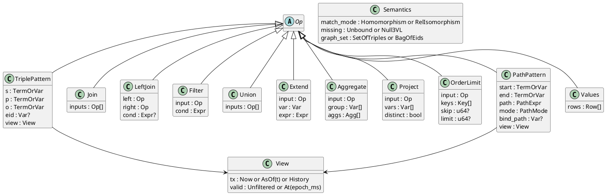
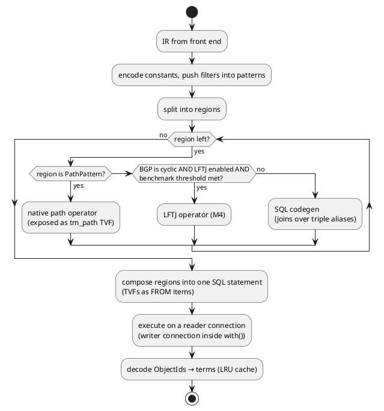
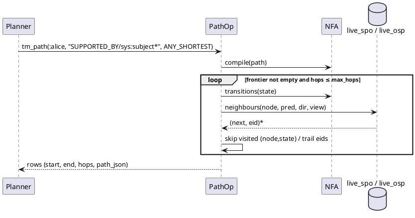

# Query

SPARQL and Cypher compile to one logical IR. A planner routes each part of a plan to generated SQL, the native path operator, or later a leapfrog-triejoin (LFTJ) operator. Time is a property of every triple pattern.

## Logical IR

The IR is a small relational graph algebra whose leaves are view-scoped triple patterns. Flags carry the semantic differences between the dialects, so one executor serves both.



- Every `TriplePattern` and `PathPattern` has its own `View`. A query-level time clause sets the default, and a per-pattern clause overrides it. See [[query#Temporal Syntax]].
- `eid` binds the statement id. SPARQL binds it with `~ ?r` or `<<( )>>` reifier syntax, Cypher with a relationship variable. See [[query#Front Ends#Cypher Dual View]].
- Constants are encoded to ObjectIds at plan time. A constant IRI or string missing from the dictionary makes its pattern empty, so the plan short-circuits.

## Views and Scans

A view is a pair: a transaction-time selector and a valid-time selector. One function turns a triple pattern plus its view into SQL predicates. No other code writes time predicates.

| View part | SQL predicate | Index family |
|---|---|---|
| `tx = Now` | `t_ret IS NULL` (verbatim, so the partial index applies) | `live_*` |
| `tx = AsOf(t)` | `t_add <= t AND (t_ret IS NULL OR t_ret > t)` | `hist_*` |
| `tx = History` | none | `hist_*` |
| `valid = At(d)` | `(v_from IS NULL OR v_from <= d) AND (v_to IS NULL OR v_to > d)` | `valid_p`, or filtered from the above |

The exact shapes and verified plans are in [[storage#Query Shapes]].

### Virtual Predicates

Some predicates are computed from the triple row instead of stored. The scan expands them into column references, so they cost no joins.

| Predicate | Value | Used by |
|---|---|---|
| `sys:subject`, `sys:object`, `sys:predicate` | `s`, `o`, `p` of the statement `eid` | Path hops through layers. See [[query#Physical Planning#Path Engine]] |
| `tm:txAdded`, `tm:txRetracted` | `t_add`, `t_ret` as `TX` ids | SPARQL `?r tm:txAdded ?t`, Cypher `r.txAdded` |
| `tm:validFrom`, `tm:validTo` | `v_from`, `v_to` as `DATETIME` | SPARQL and Cypher |
| `tm:retractKind` | `ret_kind` | History queries |
| volatile keys | `volatile.value` for `(s, key)` | Cypher `n.lastSeen` under `Now` only. See [[storage#Volatile Table]] |

## Physical Planning

The planner splits the IR into regions and routes each region to the engine that handles its shape best. Regions compose because native operators are exposed to SQL as table-valued functions.



### SQL Codegen

Acyclic patterns, filters, optionals, unions, aggregates and ordering become one SQL statement, with one `triple` alias per triple pattern. SQLite's planner picks the indexes.

- A pattern becomes `triple AS tN` plus equality constraints for constants and shared variables, plus its view predicates.
- `LeftJoin` → `LEFT JOIN … ON`, `Union` → `UNION ALL`, `Aggregate` → `GROUP BY`, `Project{distinct}` → `DISTINCT`, `OrderLimit` → `ORDER BY/LIMIT/OFFSET`.
- `RelIsomorphism` adds `tI.eid <> tJ.eid` for every pair of relationship patterns in one `MATCH`.
- Order by value decodes first: string and double ordering is not id ordering. See [[data-model#ObjectId#Range Scans]].
- All values are bound as parameters; the generated SQL text never contains data.

### Path Engine

Paths run as a native breadth-first search over the product of a path automaton and the graph. It is never a recursive CTE. It serves SPARQL property paths, Cypher variable-length patterns and shortest paths.

- **Automaton:** the path expression (`/ | * + ? ^`, Cypher `-[:T*min..max]->`, alternations) compiles to an NFA over predicates and directions.
- **Neighbours:** prepared statements over `live_spo`/`live_osp`, or `hist_*` plus view predicates when not `Now`. The virtual hops `sys:subject` and `sys:object` step from a statement to its parts, and their inverses step back, so a path can cross layers.
- **Modes (v1):** SPARQL reachability (endpoints only, set semantics); Cypher `TRAIL` (no repeated relationship eid); `ANY SHORTEST`; `ALL SHORTEST`.
- **Limits:** at least one endpoint must be bound. An unbounded Cypher pattern gets a cap of 15 hops, set by `max_hops`.
- **Later:** `SIMPLE`, `ACYCLIC`, `SHORTEST k`, and time-respecting paths.
- **SQL surface:** the eponymous virtual table `tm_path(start, path, mode, max_hops, view)` returns `(start, end, hops, path_json)`, so paths compose with SQL regions.



### LFTJ

Leapfrog triejoin (worst-case-optimal) for cyclic patterns is deferred to milestone M4. It is built only if the triangle benchmark shows SQL nested loops are too slow.

If built, each trie iterator seeks into a covering index with prepared statements, batching range reads and galloping in memory to amortise the per-statement cost. See [[prior-art#MillenniumDB]] and [[roadmap#Benchmarks]].

## Front Ends

Both dialects are built in parallel against the IR. A differential test suite runs equivalent SPARQL and Cypher queries on the same data and requires identical results.

### SPARQL

SPARQL is parsed by `spargebra` (Oxigraph's parser and algebra) and lowered to the IR. The time IRIs use standard `FROM` and `GRAPH`, so the grammar is not modified.

- **v1 query forms:** `SELECT`, `ASK`, `CONSTRUCT`. BGP, `OPTIONAL`, `FILTER`, `UNION`, `MINUS`, `BIND`, `VALUES`, property paths, aggregates, subqueries, `ORDER BY/LIMIT/OFFSET`.
- **v1 update:** `INSERT DATA`, `DELETE DATA`, `DELETE/INSERT … WHERE`. Insert maps to assert, delete to retract (with cascade). See [[time-model#Operations]].
- **SPARQL 1.2:** triple terms, reifiers (`~ ?r`) and annotations (`{| … |}`) bind directly to eids. Annotation triples are layer triples whose subject is the eid.
- **Semantics:** `graph_set = SetOfTriples`. Several live eids with the same `(s, p, o)` show as one triple unless the eid is bound. `match_mode = Homomorphism`, `missing = Unbound`.

### Cypher

Cypher parses an openCypher subset plus a few documented extensions. The parser crate is chosen by evaluation, with a hand-written `chumsky` parser for the subset as the fallback.

Parser candidates: `opencypher`, `decypher`, `open-cypher`, `cypher_parser`.

- **v1 read:** `MATCH`, `OPTIONAL MATCH`, `WHERE`, `WITH`, `RETURN`, `ORDER BY/SKIP/LIMIT`, `UNWIND`, aggregates, `CALL { … }` subqueries (uncorrelated, or importing `WITH`), variable-length relationships, `shortestPath`, `allShortestPaths`.
- **v1 write:** `CREATE` → create; `MERGE` → upsert or an atomic pattern match; `SET` → assert or supersede; `REMOVE` and `DELETE` → retract; `DETACH DELETE` → retract every statement mentioning the node.
- **Not in v1:** `FOREACH`, `LOAD CSV`, procedures other than built-ins, full list comprehension.
- **Semantics:** `graph_set = BagOfEids`, `match_mode = RelIsomorphism` (Cypher 25 default; `REPEATABLE ELEMENTS` opts out), `missing = Null3VL`.
- **Names:** labels, types and keys map to IRIs through [[data-model#Vocabulary Mapping]].

### Cypher Dual View

An eid is both a relationship and a node. A relationship variable may appear in node position, which is how Cypher reaches layers: edges pointing at edges.

```cypher
MATCH (a)-[r:WORKS_AT]->(c), (b:Belief)-[:SUPPORTED_BY]->(r)
RETURN a, c, r.confidence, r.txAdded, b
```

- A statement used as a node has the implicit label `:Statement`, which exposes `txAdded`, `txRetracted`, `validFrom` and `validTo` as properties.
- `startNode(r)`, `endNode(r)` and `type(r)` work on either form.
- Property or relationship: a literal-valued triple about `r` is a property, and a node- or statement-valued triple is a relationship. `sys:isEdge` overrides this. See [[data-model#Statements]].
- Every standard Cypher query means the same as in Neo4j. The extension only accepts queries that Neo4j would reject.

### Semantic Differences

The IR flags make the dialect differences explicit, so the same plan can be run under either semantics.

| Concern | SPARQL | Cypher |
|---|---|---|
| Graph data | Set of `(s,p,o)` over live eids | Bag of eids |
| Pattern matching | Homomorphism | Relationship isomorphism |
| Missing values | Unbound; errors in FILTER make it false | NULL, three-valued logic |
| Optional | `OPTIONAL {}` (left join) | `OPTIONAL MATCH` |
| Upsert | none (INSERT is idempotent anyway) | `MERGE` |
| Paths | Endpoints, set semantics | Path values, trail semantics |

## Temporal Syntax

Time can be chosen from the API or inside queries in both dialects, either for the whole query or per pattern. Per-pattern scoping is what makes "what changed" a single query.

| Intent | API | SPARQL | Cypher |
|---|---|---|---|
| As of tx | `db.as_of(Tx(150))` | `FROM <urn:tiramemsu:tm:asOf/150>` | `USE AS OF 150` |
| As of wall clock | `db.as_of(Instant(ms))` | `FROM <urn:tiramemsu:tm:asOf/2026-09-01T12:00:00Z>` | `USE AS OF datetime('2026-09-01T12:00:00Z')` |
| Valid at | `.valid_at(ms)` | `FROM <urn:tiramemsu:tm:validAt/2025-03-01>` | `USE VALID AT date('2025-03-01')` |
| History | `.history()` | `FROM <urn:tiramemsu:tm:history>` | `USE HISTORY` |
| Per pattern | view per call | `GRAPH <urn:tiramemsu:tm:asOf/150> { … }` | `CALL { USE AS OF 150 MATCH … RETURN … }` |
| Statement time | — | `?r tm:txAdded ?t` | `r.txAdded` |

- The default, with no clause, is tx `Now` and valid time unfiltered. Valid-time filtering is always opt-in, because an implicit "valid now" would silently hide past facts.
- The `tm:` IRIs are recognised only in `FROM` and `GRAPH`. Anywhere else they are ordinary IRIs.
- In Cypher, `USE` takes only time clauses in v1. There is one graph per database file.

```sparql
# what changed about alice's employer between tx 150 and now
SELECT ?before ?after WHERE {
  GRAPH <urn:tiramemsu:tm:asOf/150> { v:alice v:worksAt ?before }
  v:alice v:worksAt ?after .
  FILTER (?before != ?after)
}
```
