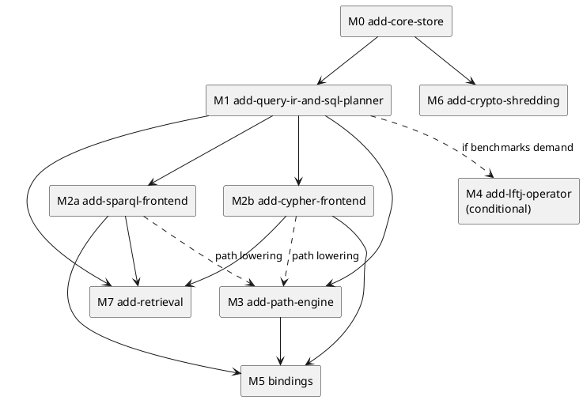

# Roadmap

Milestones in dependency order. Each is an OpenSpec change under `openspec/changes/` with a proposal, specs, a design and tasks.

## Milestones

The core comes first. After the IR lands, the two front ends and the path engine can proceed in parallel.

| Milestone | OpenSpec change | Delivers | Depends on |
|---|---|---|---|
| M0 | `add-core-store` | `tm-core` + `tm-rusqlite` + `tiramemsu` facade: executor trait, ObjectId, terms, schema + triggers, tx engine, views, event log, `with`, volatile, predicate schema, planner statistics | — |
| M1 | `add-query-ir-and-sql-planner` | `tm-ir`, `tm-exec`: IR, views and scans, virtual predicates, SQL codegen, decoding, plan tests on skewed data | M0 |
| M2a | `add-sparql-frontend` | `tm-sparql`: SPARQL 1.1 subset + 1.2 annotations + time IRIs | M1 |
| M2b | `add-cypher-frontend` | `tm-cypher`: openCypher subset + dual view + time clauses + differential suite | M1 |
| M3 | `add-path-engine` | Native path operator, `tm_path` table function, SPARQL/Cypher path lowering | M1 (M2 for lowering) |
| M4 | `add-lftj-operator` (implemented, opt-in) | Leapfrog triejoin for pure cyclic patterns as `tm_lftj`, with routing reasons in explain ([[query#Physical Planning#LFTJ]]) | M1, benchmark evidence |
| M5 | bindings: Python, Node, `add-mcp-adapter` and `add-wasm-sqlite-host` done | Python, Node and WASM over the JSON bridge, the `tiramemsu-mcp` stdio server ([[api#MCP Tools]]), the WebAssembly host ([[architecture#WebAssembly Host]]) | M0–M3 |
| M6 | future: `add-crypto-shredding` | `sys:sensitive`, `SEALED` terms, `seal_key`, erase transaction. See [[time-model#Erasure]] | M0 |
| M7 | `add-text-retrieval` (implemented); vectors future | FTS5 over string terms (`term_fts`, format 2) with evidence ranking from Rust, SPARQL and Cypher ([[query#Text Recall]]); later, on hosts with vector support, k-nearest-neighbour indexes defined as `sys:` triples | M1, M2 |

Six smaller changes built on M0–M3 add the layer features of [[recipes]]: `add-statement-instants`, `add-typed-layers`, `add-query-provenance`, `add-fact-bundles`, `add-graph-scoped-paths` and `add-time-respecting-paths` (all archived). `add-query-budgets` adds opt-in deadlines, cancellation, reader timeouts and result limits ([[query#Query Budgets]]). `add-bulk-import` adds import sessions with deferred statistics ([[query#Bulk Import]]). `add-text-retrieval` adds opt-in text recall with evidence ranking over a derived FTS5 index introduced by format 2 ([[query#Text Recall]], [[storage#Text Index]]). `add-mcp-adapter` adds the opt-in `tiramemsu-mcp` crate, a local stdio MCP server with typed memory tools, read-only mode, budgets and provenance coverage ([[api#MCP Tools]]). `add-saved-answer-invalidation` adds saved answers with conservative event-driven invalidation in the derived tables of format 3 ([[query#Saved Answers]], [[storage#Saved Answers]]). `add-temporal-path-syntax` adds the SPARQL `SERVICE <tm:timeRespecting…>` scope with `tm:arrival`, the Cypher `MATCH TIME RESPECTING` modifier and path completeness reporting ([[query#Temporal Path Syntax]]). `add-lftj-operator` adds the opt-in native cyclic-join operator with conservative routing and explain reasons ([[query#Physical Planning#LFTJ]]). `add-memory-conflict-review` adds read-only conflict inspection with attributed evidence and noncommitting bundle import previews ([[query#Conflict Inspection]], [[data-model#Fact Bundles#Import Preview]]). `add-optional-query-frontends` makes the query engine and both front ends optional cargo features of the facade, with a core-only build that links no parser and a CI feature matrix ([[architecture#Crates#Cargo Features]]). `add-wasm-sqlite-host` adds `tm-wasm`, a host on SQLite compiled to WebAssembly with memory and OPFS storage and capabilities probed at open ([[architecture#WebAssembly Host]]). All ten are archived (2026-10-04). `reserve-replica-id` is a proposal only: it reserves origin bits in allocated ids so that agent memories can merge later, and waits for a decision.

M7 exists because recall by text or embedding, not by graph pattern, is how agents usually query their memory. Ranking by support is part of it: a hit can be ordered by its confidence layers, its `sys:confirmedBy` count, the number of distinct transaction authors behind it and its `tm:addedAt`, all of which the store already holds ([[recipes]]). oxilite's design (index definitions stored as data, tables kept current by triggers, one k-NN statement per query) is the template ([[prior-art#oxilite]]).

## Benchmarks

The benchmarks are tracked from M0 onwards. Targets will be fixed once the scale ceiling is known. See [[overview#Open Inputs]].

The ten follow-up changes from the 2026-10-03 review (budgets, bulk import, text retrieval, MCP, saved answers, temporal syntax, cyclic joins, conflict previews, optional frontends and the WASM host) are implemented and archived under `openspec/changes/archive/2026-10-04-*`, and shipped in 0.3.0.

- **Churn:** N updates per key (N = 1, 10, 100, 1000). As-of throughput should stay at ≥ 70 % of the no-history baseline, the bar set by CozoDB's measurements. See [[prior-art#CozoDB]].
- **Point and 2-hop latency** at 10⁶ and 10⁷ statements, for the now, asOf and validAt views. The SPARQL variant (`crates/tiramemsu/benches/sparql.rs`) runs the same shapes through `View::sparql`; `SPARQL_BENCH_STATEMENTS` sets the size (default 10⁵).
- **Triangles:** SQL nested loops versus the M4 threshold. This decides whether LFTJ is built. See [[query#Physical Planning#LFTJ]]. First result (`bench/triangles/`): SQLite's plan matches an intersection join on a uniform graph (1.0×) but is 41× slower on a hub-and-spoke graph and 36–104× slower on layered graphs, growing with size. The threshold is met for skewed cyclic patterns, so M4 is justified for them. With M4 built, `cargo run --release -p tiramemsu --example triangles` compares both routes through tiramemsu on one file after checking equal counts; at the small scale the native route is 1.3× faster on a uniform graph, 12× on hub-and-spoke and 2–4× on layered graphs (results in `bench/triangles/README.md`).
- **Paths:** all-endpoints shortest path and 3-hop trail latency, reachability over a chain and a small world, all-shortest paths on a grid, and the `rarray` chunk size (`crates/tiramemsu/benches/path.rs`; `PATH_BENCH_STATEMENTS` sets the size, default 10⁵). Trail errors fail the benchmark. Recorded results are in `crates/tiramemsu/benches/README.md`.
- **Size:** bytes per statement, and index overhead against raw data. Baseline: about 153 bytes per statement, with indexes at 5.3× the table ([[storage#Measured Footprint]]). This benchmark also decides whether `hist_*` becomes partial.
- **Supersede:** cost as a function of the cascade set size.
- **Plan quality:** a skewed fixture (one huge class, one rare predicate, churned properties) run with bound parameters, with and without statistics. It guards [[query#Physical Planning#Join Ordering]] and decides whether the forced-order fallback is built.
- **Head-to-head with oxilite:** oxilite's `write-cost` (rows written per triple) and `as-of-latency` (present, past and depth, 80 000–400 000 triples) harnesses, ported to run on both engines. They test the claim that covering history indexes read the past faster than oxilite's change log. See [[prior-art#oxilite]].
