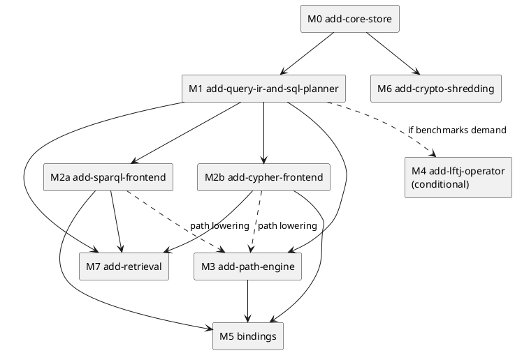

# Roadmap

Milestones in dependency order. Each is an OpenSpec change under `openspec/changes/` with a proposal, specs, a design and tasks.

## Milestones

The core comes first. After the IR lands, the two front ends and the path engine can proceed in parallel.

| Milestone | OpenSpec change | Delivers | Depends on |
|---|---|---|---|
| M0 | `add-core-store` | `tm-core` + `tm-rusqlite` + `tiramemsu` facade: executor trait, ObjectId, terms, schema + triggers, tx engine, views, event log, `with`, volatile, predicate schema, planner statistics | — |
| M1 | `add-query-ir-and-sql-planner` | `tm-ir`, `tm-exec`: IR, views and scans, virtual predicates, SQL codegen, decoding, plan tests on skewed data | M0 |
| M2a | `add-sparql-frontend` | `tm-sparql`: SPARQL 1.1 subset + 1.2 annotations + time IRIs | M1 |
| M2b | `add-cypher-frontend` | `tm-cypher`: openCypher subset + dual view + time clauses + differential suite | M1 |
| M3 | `add-path-engine` | Native path operator, `tm_path` table function, SPARQL/Cypher path lowering | M1 (M2 for lowering) |
| M4 | future: `add-lftj-operator` | Leapfrog triejoin for cyclic patterns | M1, benchmark evidence |
| M5 | future: binding changes | First binding (MCP / Python / Node / WASM) | M0–M3 |
| M6 | future: `add-crypto-shredding` | `sys:sensitive`, `SEALED` terms, `seal_key`, erase transaction. See [[time-model#Erasure]] | M0 |
| M7 | future: `add-retrieval` | FTS5 over string terms (`term_fts`) and, on hosts with vector support, k-nearest-neighbour indexes defined as `sys:` triples, both usable from SPARQL, Cypher and paths | M1, M2 |

M7 exists because recall by text or embedding, not by graph pattern, is how agents usually query their memory. oxilite's design (index definitions stored as data, tables kept current by triggers, one k-NN statement per query) is the template ([[prior-art#oxilite]]).

## Benchmarks

The benchmarks are tracked from M0 onwards. Targets will be fixed once the scale ceiling is known. See [[overview#Open Inputs]].

- **Churn:** N updates per key (N = 1, 10, 100, 1000). As-of throughput should stay at ≥ 70 % of the no-history baseline, the bar set by CozoDB's measurements. See [[prior-art#CozoDB]].
- **Point and 2-hop latency** at 10⁶ and 10⁷ statements, for the now, asOf and validAt views. The SPARQL variant (`crates/tiramemsu/benches/sparql.rs`) runs the same shapes through `View::sparql`; `SPARQL_BENCH_STATEMENTS` sets the size (default 10⁵).
- **Triangles:** SQL nested loops versus the M4 threshold. This decides whether LFTJ is built. See [[query#Physical Planning#LFTJ]].
- **Paths:** shortest path and 3-hop trail latency.
- **Size:** bytes per statement, and index overhead against raw data. Baseline: about 153 bytes per statement, with indexes at 5.3× the table ([[storage#Measured Footprint]]). This benchmark also decides whether `hist_*` becomes partial.
- **Supersede:** cost as a function of the cascade set size.
- **Plan quality:** a skewed fixture (one huge class, one rare predicate, churned properties) run with bound parameters, with and without statistics. It guards [[query#Physical Planning#Join Ordering]] and decides whether the forced-order fallback is built.
- **Head-to-head with oxilite:** oxilite's `write-cost` (rows written per triple) and `as-of-latency` (present, past and depth, 80 000–400 000 triples) harnesses, ported to run on both engines. They test the claim that covering history indexes read the past faster than oxilite's change log. See [[prior-art#oxilite]].
