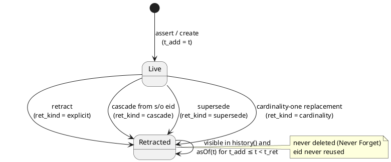
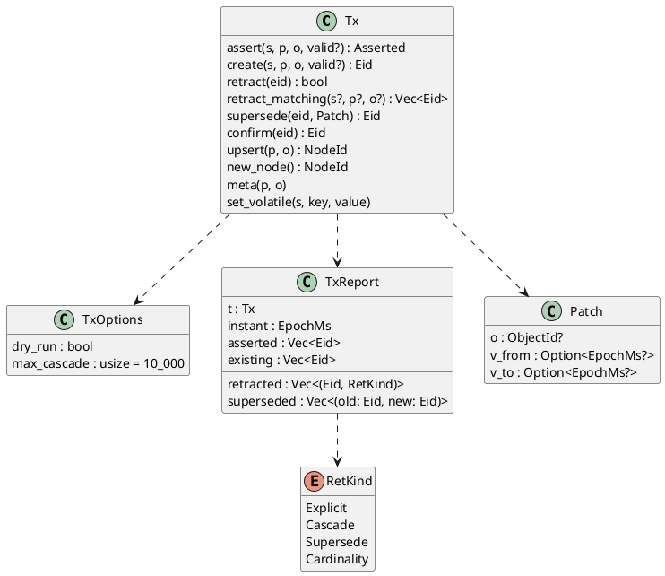
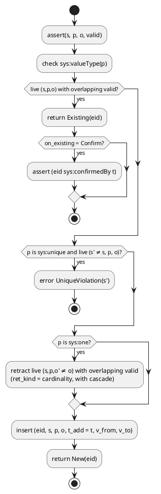
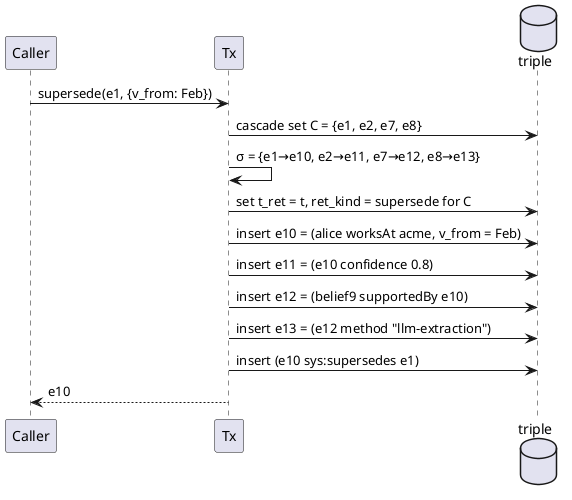

# Time Model

Tiramemsu is bitemporal. Transaction time records when the database learned or stopped believing a fact. Valid time records when the fact held in the world. Nothing is ever deleted.

Transaction time follows Datomic: transactions are entities, and there are `asOf`, `since`, `history` and `with` queries. Valid time follows Graphiti's edge validity windows, but stored as immutable columns. See [[prior-art#Datomic]] and [[prior-art#Graphiti]].

## Transaction Time

Every committed transaction gets a gap-free, strictly increasing number `t` and a strictly increasing wall-clock `instant`. A statement is believed during `[t_add, t_ret)`.

- `t` starts at 1 and is allocated inside the writer transaction. See [[architecture#Connections and Concurrency]].
- `instant = max(now_ms, previous_instant + 1)`. A clock that jumps backwards cannot break the monotonic mapping from instant to `t`.
- `asOf(instant)` resolves to the largest `t` whose `instant` ≤ the given time. Before the first transaction, it is the empty view.
- Every committed `transact` call creates a tx row, even when all its operations were idempotent no-ops. The tx then records that the attempt happened, along with its metadata.
- A transaction is a node with tag `TX`. Metadata is ordinary triples with the tx as subject: `sys:author`, `sys:source`, `sys:reason`, or any user predicate.

## Valid Time

A statement's `[v_from, v_to)` says when the fact held in the world, as epoch milliseconds. NULL means unbounded. The interval is immutable content of the statement.

- Half-open intervals: a fact valid `[2025-01-01, 2026-03-01)` is not valid on 2026-03-01.
- A statement with no valid time (both NULL) is valid for all time.
- Changing valid time, including closing an open interval ("she left in March"), is a [[time-model#Operations#Supersede]], never an in-place update.
- Two live statements with the same `(s, p, o)` and **non-overlapping** intervals are two episodes of the fact, e.g. Alice at Acme in 2020–22 and again from 2024.
- Queries never filter on valid time unless asked (`validAt`). See [[query#Temporal Syntax]].

## Statement Lifecycle

A statement is born live, may be retracted exactly once, and is never deleted. Retraction is explicit or caused by a cascade, a supersede, or a cardinality-one replacement.

## Operations

All writes happen inside `db.transact(|tx| …)` on the single writer. One call is one transaction with one `t`. The report lists what was asserted, retracted and cascaded.

### Assert

`assert` is idempotent. If a live statement with the same `(s, p, o)` and an overlapping valid interval exists, its eid is returned unchanged. Otherwise a new statement is inserted.

- Overlap test: `(a.v_from IS NULL OR b.v_to IS NULL OR a.v_from < b.v_to) AND (b.v_from IS NULL OR a.v_to IS NULL OR b.v_from < a.v_to)`.
- An overlapping but different interval is **not** merged or widened. Use supersede to change it.
- `Asserted` says `New(eid)` or `Existing(eid)`. With `on_existing = Confirm`, an existing match also gets a `sys:confirmedBy` triple. See [[time-model#Operations#Confirm]].
- Schema checks run before insert: `sys:valueType`, `sys:unique`, then `sys:cardinality`. See [[data-model#Predicate Schema]].
- SPARQL `INSERT` and Cypher `MERGE` / `SET` map to assert.

### Create

`create` always inserts a new statement, even when an identical live one exists. It is how parallel edges are made: Cypher `CREATE (a)-[:CALLED]->(b)` twice gives two relationships.

Schema checks still apply. `sys:unique` rejects a duplicate, and `sys:one` retracts the previous objects.

### Retract

`retract(eid)` sets `t_ret` on a live statement and cascades. Retracting an already-retracted eid is a no-op that returns false. `retract_matching` retracts every live match of a pattern.

The reason for a retraction goes on the transaction (`tx sys:reason "…"`), never on the retracted statement: a triple about it added in the same tx would itself be cascaded away. Cypher `DELETE r`, `DETACH DELETE n` and SPARQL `DELETE` map here.

### Supersede

`supersede(eid, patch)` corrects a fact. It retracts the fact's cascade set and replays it under new eids, with the patch applied to the root, all in one transaction. The result is the new root eid.

Supersede is the general **update** verb. It covers changing the object, correcting `v_from`, closing an interval via `v_to`, and fixing typos. `s` and `p` cannot be patched, because that would be a different fact.

Algorithm:
1. Compute the cascade set C of `eid`. See [[time-model#Cascade]].
2. Allocate a new eid for every member of C, forming the substitution map `σ = {old → new}`.
3. Retract every member of C with `ret_kind = supersede`.
4. Insert every member again with `s` and `o` rewritten through σ, content and valid time unchanged, except the root, which gets the patch.
5. Assert `(σ(eid) sys:supersedes eid)`.

The replay is bounded by `max_cascade`. Every annotation and reference therefore survives a correction, and the history shows exactly one correction event.

### Cardinality One

For a `sys:one` predicate, asserting a new object retracts the live objects whose valid time overlaps. It is retract plus assert, **not** supersede: the old value's annotations do not carry over.

`(alice age 30)` → `(alice age 31)` is a different fact. The source or confidence of "30" does not apply to "31", so the annotations on the old eid are cascaded away with `ret_kind = cardinality`, and nothing is replayed. Episodes whose valid time does not overlap coexist.

### Unique Upsert

For a `sys:unique` predicate, at most one live subject may hold a given object. `upsert(p, o)` returns that subject, or creates a new `NODE` and asserts `(node, p, o)`.

The check is a lookup on the `live_pos` index inside the writer transaction, not a SQLite UNIQUE constraint, because only live rows count. Cypher `MERGE (n:Person {email: $e})` uses `upsert` when `email` is unique. Otherwise it matches the whole pattern inside the writer transaction, which is atomic because there is a single writer.

### Confirm

`confirm(eid)` records that another source corroborated a live fact. It asserts `(eid sys:confirmedBy t)`, where `t` is the current tx, and changes no state.

The tx that confirms carries the source and author, so "seen five times from three sources" is a query over `sys:confirmedBy` joined to tx metadata.

## Cascade

Retracting a statement retracts, in the same transaction and recursively, every live statement whose subject or object is that eid. Only statement eids cascade; nodes never do.

- Walk: breadth-first over `live_spo` (`s = e`) and `live_osp` (`o = e`), with a visited set so cycles terminate.
- Retracting `(alice worksAt acme)` touches only triples about that eid, never other triples about `alice` or `acme`.
- Nothing is lost: cascaded rows get the same `t_ret`, so `asOf(t_ret − 1)` still shows the whole structure, including e.g. what a belief relied on.
- Guard rails: `TxReport.retracted` lists the full set, `dry_run` previews it, and `max_cascade` (default 10 000) aborts the transaction with `CascadeLimitExceeded`.

## Event Log

The log of every operation, with its time and kind, is a view over the triple table. It feeds `since t`, replay, auditing, and future replication.

`event(t, eid, op, kind)`: one `assert` row at `t_add` for every statement, plus one `retract` row at `t_ret` carrying `ret_kind` for every retracted statement. A supersede is a pair of retract and assert rows, linked by a `sys:supersedes` triple. The SQL is in [[storage#Event View]].

Correctness property: for every `t`, `asOf(t)` equals the state obtained by replaying `event` rows with time ≤ `t`. See [[tests#Time Travel]].

## Never Forget

No code path deletes a statement, a term or a transaction. The only mutation of a stored row is setting `t_ret` and `ret_kind` once, from NULL. Forgetting means retracting.

- SQLite triggers enforce this in the database itself. See [[storage#Invariant Triggers]].
- `asOf(t)` is exact for every `t`, forever.
- High-churn state that does not deserve history goes in the `volatile` table, which is not part of the graph. See [[storage#Volatile Table]].
- Legal erasure does not break this invariant: it destroys a key, not a row. See [[time-model#Erasure]].

## Erasure

Erasure is crypto-shredding: literals of `sys:sensitive` predicates are sealed with their data subject's key, and erasing destroys the key. No row is deleted, so [[time-model#Never Forget]] still holds.

Scheduled as milestone M6 (`add-crypto-shredding`). Format 1 reserves tag 15 `SEALED`, the schema flag `sys:sensitive` and the table `seal_key`, and rejects all three until M6. See [[data-model#ObjectId]].

- **Sealing:** the object of a statement whose predicate is `sys:sensitive` is stored as a `SEALED` dictionary term whose `lex` is ciphertext. A sealed value is never inlined, since an `INT` or `SHORT_STR` id would carry the plaintext.
- **Idempotence:** encryption is deterministic per key (AES-SIV), so one value under one key always gives the same term, and assert still matches by id. Equality works within one data subject. Range filters on sealed values run in Rust after decryption and use no index.
- **Data subject:** the node the statement is ultimately about, found by following `STMT` subjects down to a node. Annotations of a sensitive fact share its key.
- **Keys:** `seal_key(subject, key, destroyed_t)` is the one table where a value is erased. Erasing is an ordinary transaction, so its tx metadata records who erased and why. It overwrites the key and sets `destroyed_t`. `PRAGMA secure_delete` and a WAL checkpoint keep the old key bytes out of the file. A host may supply keys through a `KeyProvider` (OS keychain, KMS) instead.
- **After erasure:** statements, eids, times, provenance and history stay queryable. A sealed value decodes as the literal `sys:Erased`. Backups taken before erasure still hold the key, which is documented rather than solved.
- **Limit:** IRIs are never sealed. Personal data that must be erasable is modelled as literals of sensitive predicates, not as node IRIs.

## Speculative Transactions

`db.with(ops, |view| …)` applies a transaction hypothetically, lets the caller query the result, and discards it. Discarded speculation never reaches history.

- Implementation: take the writer lock, `SAVEPOINT spec`, run the operations with the full engine (schema, cascade, supersede), run the caller's queries **on the writer connection** so they see the uncommitted state, then `ROLLBACK TO spec; RELEASE spec`.
- `TxOptions.dry_run` uses the same mechanism and returns the `TxReport` without committing.
- Ids allocated during speculation are burned: the id counters are advanced for real after the rollback, so no id seen inside `with` is ever reissued. No tx row is written.
- It holds the single write lock, so it is meant for short speculation, not long-lived sandboxes.
- Speculation always starts from "now". Branching the past is not supported, as in Datomic.
