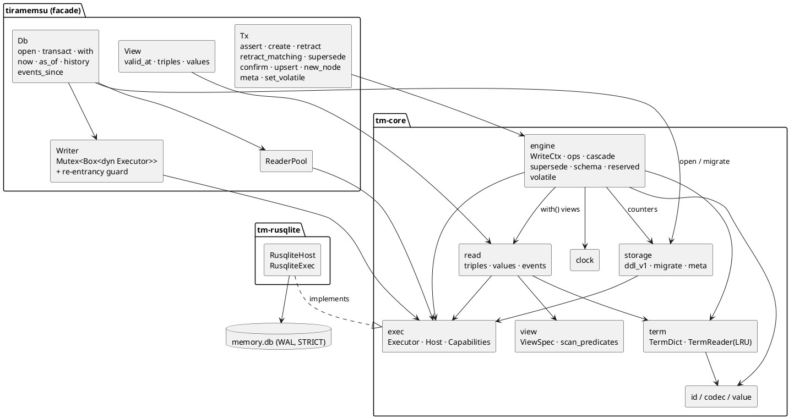
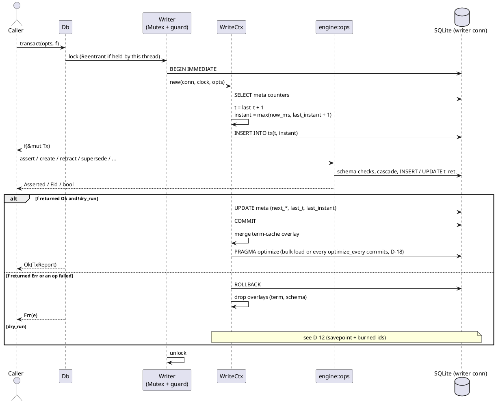
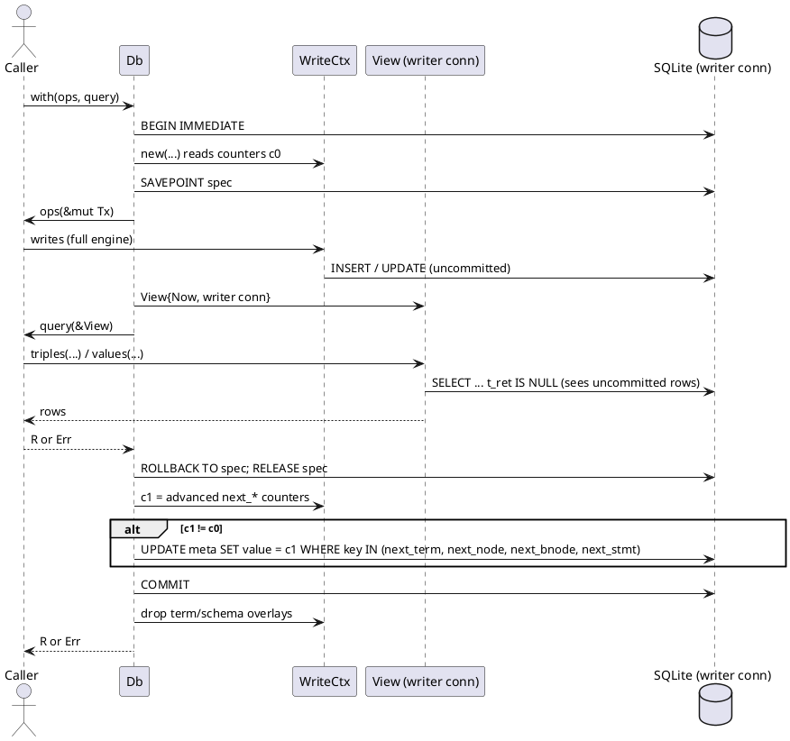

## Context

See `proposal.md` (Why) for motivation. The design is fixed in `lat.md/`; this document turns it into an implementation plan for milestone M0 and records the few details that `lat.md` leaves open. When this document and `lat.md` disagree, `lat.md` wins.

Constraints that shape the approach:

- **Exact on-disk format.** The DDL for format version 1 is given verbatim in `lat.md/storage#Schema`, including the invariant triggers of `lat.md/storage#Invariant Triggers` and the `event` view of `lat.md/storage#Event View`. M0 ships it unchanged.
- **Single writer, pooled readers.** Every write, dry run, speculation and schema change goes through one writer connection behind a mutex. Reads use a pool of read-only connections on the same WAL file (`lat.md/architecture#Connections and Concurrency`).
- **Never forget.** The only mutation of a stored statement is setting `t_ret` and `ret_kind` once (`lat.md/time-model#Never Forget`). Every algorithm below is built from INSERTs and single retraction UPDATEs.
- **One place for time predicates.** Time is resolved only in the view-aware scan (`lat.md/architecture#Layers`, `lat.md/query#Views and Scans`). M0 owns that function so that M1 (`add-query-ir-and-sql-planner`) reuses it instead of writing a second one.
- **No query languages.** SPARQL, Cypher and paths are later changes. M0 reads through `View::triples(s?, p?, o?)` and a small value-resolution helper for volatile state.
- **Executor boundary.** `tm-core` reaches SQLite only through its own synchronous `Executor` trait (`lat.md/architecture#Executor`); `rusqlite` lives in the host crate `tm-rusqlite` (D-17).

## Goals / Non-Goals

**Goals:**

- A `tm-core` crate with no dependency on any query language or SQLite binding, which M1 can build on: ObjectId codec, dictionary, storage, engine, view descriptor, scan predicates and the `Executor` trait.
- A `tiramemsu` facade whose names match `lat.md/api#Rust Surface`, so bindings can later wrap it one to one.
- Every spec scenario runnable as a test against a temporary file. Property tests cover as-of equals replay, stable historical reads, the codec round trip and order within a tag.
- Reads that use covering indexes for the scan shapes in `lat.md/storage#Query Shapes`.

**Non-Goals:**

- `View::sparql`, `View::cypher`, `View::path` and the `Parse` / `Unsupported` errors, which come with M1–M3.
- The vocabulary mapping logic (`@vocab`, CURIE rendering). M0 only allows `sys:vocab` and the `sys:prefix*` predicates to be written.
- Cypher-facing handling of `sys:isEdge`. M0 only stores and validates the flag.
- In-memory or WASM databases, a SQLite loadable extension, and bindings.
- Executor hosts other than `rusqlite`. M0 only draws the boundary and proves it with a test host that declares no capability (D-17).
- Crypto-shredding (M6) and retrieval (M7). Format 1 only reserves their tag, flag and table names.
- Performance tuning beyond covering indexes, prepared-statement caching and automatic planner statistics (D-18). An engine-forced join order is benchmark-gated and not part of M0. The benchmarks in `lat.md/roadmap#Benchmarks` only get a harness skeleton here.

## Decisions

### D-1 Workspace and module layout

The Cargo workspace has three crates, following `lat.md/architecture#Crates`. `tm-core` holds all semantics and the `Executor` trait, and depends on nothing SQLite-specific. `tm-rusqlite` is the executor host (D-17). `tiramemsu` holds connection management and the public handles, and opens databases through `tm-rusqlite`.

```text
Cargo.toml                    # [workspace] members = ["crates/*"], shared lints
crates/tm-core/
  src/lib.rs                  # re-exports; #![forbid(unsafe_code)]
  src/error.rs                # Error, Result
  src/id.rs                   # ObjectId, Tag, Eid, TxId: bit layout, tag/payload
  src/value.rs                # Value, Literal canonicalisation (xsd parsing)
  src/codec.rs                # inline encode/decode, skolem IRIs
  src/vocab.rs                # sys:, tm:, xsd:, rdf: IRI constants, tag IRIs
  src/term.rs                 # TermDict (writer: lookup-or-insert), TermReader (lookup + LRU)
  src/clock.rs                # Clock trait, SystemClock, ManualClock (tests)
  src/exec.rs                 # Executor, Host, Capabilities, SqlValue, SqlError (D-17)
  src/storage/mod.rs          # open/init, pragmas, foreign-file detection
  src/storage/stats.rs        # PRAGMA optimize at open, commit counter, analyze() (D-18)
  src/storage/ddl_v1.sql      # verbatim DDL of lat.md/storage#Schema + triggers + event view
  src/storage/migrate.rs      # MIGRATIONS table, run_migrations()
  src/storage/meta.rs         # Counters { next_term, next_node, next_bnode, next_stmt, last_t, last_instant }
  src/view.rs                 # ViewSpec { tx: TxSel, valid: ValidSel }, scan_predicates()
  src/read.rs                 # triples(), values(), events_since(), tx lookups
  src/event.rs                # Event, Op
  src/report.rs               # TxReport, Asserted, RetKind, TxOptions, AssertOpts, OnExisting, Valid, Patch
  src/engine/mod.rs           # WriteCtx: begin/commit/rollback, id allocation, report building
  src/engine/ops.rs           # assert, create, retract, retract_matching, confirm, meta, new_node, new_bnode
  src/engine/cascade.rs       # cascade_set(), retract_set()
  src/engine/supersede.rs     # supersede()
  src/engine/schema.rs        # PredicateSchema cache, write checks, schema-change validation
  src/engine/reserved.rs      # sys: namespace allow-list
  src/engine/volatile.rs      # set_volatile, clear_volatile
  tests/                      # integration tests, one file per capability + props.rs,
                              # run on RusqliteHost and MinimalHost (D-16)
crates/tm-rusqlite/
  src/lib.rs                  # RusqliteHost (Host), RusqliteExec (Executor), capabilities
  src/error.rs                # rusqlite::Error -> SqlError
  src/register.rs             # UDF / virtual-table registration hook (empty in M0; used by M1+)
crates/tiramemsu/
  src/lib.rs                  # pub use of tm-core types; facade handles
  src/db.rs                   # Db, OpenOptions, writer mutex, re-entrancy guard, optimize()
  src/pool.rs                 # ReaderPool (Mutex<Vec<Box<dyn Executor>>> + Condvar), only with reader_pool
  src/view.rs                 # View { spec, source: Readers | Writer(&mut dyn Executor) }
  src/tx.rs                   # Tx<'a> facade over WriteCtx
  tests/                      # facade-level tests (concurrency, reopen, with)
```

Alternatives considered: one crate for M0 (rejected, because M1 must depend on the core without pulling in connection pooling); putting the view predicates in the future `tm-exec` (rejected, because `lat.md/architecture#Layers` puts the temporal view in Core and M0 already needs it for `triples()`); `rusqlite` directly in `tm-core` (rejected by D-17).



### D-2 Core types

The types follow `lat.md/api#Rust Surface` and `lat.md/time-model#Operations`. Generic bounds may change during implementation, as `lat.md/api` allows. The names do not change.

```rust
// tm-core::id
#[derive(Copy, Clone, Debug, PartialEq, Eq, PartialOrd, Ord, Hash)]
pub struct ObjectId(i64);                       // (payload << 4) | tag
#[repr(u8)]
pub enum Tag { Iri = 0, Node, BNode, Stmt, Tx, Int, Bool, DateTime, Date,
               ShortStr, Str, LangStr, Typed, Double, Decimal }   // 15 = SEALED, reserved for M6
pub struct Eid(ObjectId);                       // invariant: tag == Stmt
pub struct TxId(u64);                           // t; ObjectId via TxId::oid()

impl ObjectId {
    pub fn tag(self) -> Result<Tag>;            // Err(Unsupported { feature: "SEALED (M6)" }) for 15
    pub fn signed_payload(self) -> i64;         // self.0 >> 4 (arithmetic)
    pub fn unsigned_payload(self) -> u64;       // (self.0 as u64) >> 4 (logical)
    pub fn from_signed(tag: Tag, p: i64) -> ObjectId;
    pub fn from_unsigned(tag: Tag, p: u64) -> ObjectId;
}

// tm-core::value
pub enum Value {
    Iri(String), Node(u64), BNode(u64), Stmt(Eid), Tx(TxId),
    Int(i64), Bool(bool), DateTime { ms: i64, tz: Option<i16> }, Date(i64),   // tz = offset minutes
    Str(String),                                // SHORT_STR or STR, decided by the codec
    LangStr { lex: String, lang: String },
    Typed { lex: String, datatype: String },
    Double(f64), Decimal(String),               // Decimal holds the canonical lexical form
}
impl Value {
    pub fn literal(lex: &str, datatype: Option<&str>, lang: Option<&str>) -> Value; // canonicalises
    pub fn big_integer(decimal: &str) -> Value; // INT if it fits in 60 bits, else Typed xsd:integer
}

// tm-core::report
pub struct Valid { pub from: Option<i64>, pub to: Option<i64> }        // Valid::ALWAYS = both None
pub enum OnExisting { Return, Confirm }
pub struct AssertOpts { pub valid: Valid, pub on_existing: OnExisting }
pub enum Asserted { New(Eid), Existing(Eid) }
#[repr(u8)] pub enum RetKind { Explicit = 0, Cascade = 1, Supersede = 2, Cardinality = 3 }
pub struct TxOptions { pub dry_run: bool, pub max_cascade: usize }    // default false, 10_000
pub struct Patch { pub o: Option<Value>, pub v_from: Option<Option<i64>>, pub v_to: Option<Option<i64>> }
pub struct TxReport {
    pub t: TxId, pub instant: i64,
    pub asserted: Vec<Eid>, pub existing: Vec<Eid>,
    pub retracted: Vec<(Eid, RetKind)>, pub superseded: Vec<(Eid, Eid)>,
}
pub struct Triple { pub eid: Eid, pub s: ObjectId, pub p: ObjectId, pub o: ObjectId,
                    pub t_add: TxId, pub t_ret: Option<TxId>,
                    pub v_from: Option<i64>, pub v_to: Option<i64>, pub ret_kind: Option<RetKind> }
pub enum Op { Assert, Retract }
pub struct Event { pub t: TxId, pub eid: Eid, pub op: Op, pub kind: Option<RetKind> }

// tm-core::view
pub enum TxSel { Now, AsOf(TimeRef), History }
pub enum TimeRef { Tx(u64), Instant(i64) }
pub enum ValidSel { Unfiltered, At(i64) }
pub struct ViewSpec { pub tx: TxSel, pub valid: ValidSel }
/// The only function that writes time predicates (lat.md/query#Views and Scans).
pub fn scan_predicates(spec: &ViewSpec, alias: &str, params: &mut Params) -> String;

// tm-core::clock
pub trait Clock: Send + Sync { fn now_ms(&self) -> i64; }
```

Write-side methods take `impl IntoObject` (implemented for `ObjectId`, `Eid`, `TxId`, `Value` and `&Value`), so callers can pass decoded ids or fresh values. `IntoObject::into_object(self, &mut TermDict)` interns on the write path.

```rust
// tiramemsu
pub struct OpenOptions { pub readers: usize /*4*/, pub clock: Arc<dyn Clock>,
                         pub busy_timeout: Duration /*5s*/, pub term_cache_capacity: usize /*16_384*/,
                         pub optimize_every: u64 /*1000*/ }
impl Db {
    pub fn open(path: impl AsRef<Path>, opts: OpenOptions) -> Result<Db>;   // tm-rusqlite host
    pub fn open_with_host(host: impl Host, path: impl AsRef<Path>, opts: OpenOptions) -> Result<Db>;
    pub fn optimize(&self) -> Result<()>;                                   // full ANALYZE (D-18)
    pub fn capabilities(&self) -> Capabilities;                             // host declaration (D-17)
    pub fn transact<F>(&self, opts: TxOptions, f: F) -> Result<TxReport>
        where F: FnOnce(&mut Tx) -> Result<()>;
    pub fn with<F, G, R>(&self, ops: F, query: G) -> Result<R>
        where F: FnOnce(&mut Tx) -> Result<()>, G: FnOnce(&View) -> Result<R>;
    pub fn now(&self) -> View;
    pub fn as_of(&self, at: TimeRef) -> View;
    pub fn history(&self) -> View;
    pub fn events_since(&self, t: u64) -> Result<Vec<Event>>;
}
impl View {
    pub fn valid_at(self, epoch_ms: i64) -> View;
    pub fn triples(&self, s: Option<ObjectId>, p: Option<ObjectId>, o: Option<ObjectId>) -> Result<Vec<Triple>>;
    pub fn values(&self, s: ObjectId, key: ObjectId) -> Result<Vec<ObjectId>>;   // triple objects, else volatile (Now only)
    pub fn encode(&self, v: &Value) -> Result<Option<ObjectId>>;                 // lookup only, never inserts
    pub fn decode(&self, id: ObjectId) -> Result<Value>;
}
impl Tx<'_> {
    pub fn assert(&mut self, s: impl IntoObject, p: impl IntoObject, o: impl IntoObject, valid: Valid) -> Result<Asserted>;
    pub fn assert_with(&mut self, s: impl IntoObject, p: impl IntoObject, o: impl IntoObject, opts: AssertOpts) -> Result<Asserted>;
    pub fn create(&mut self, s: impl IntoObject, p: impl IntoObject, o: impl IntoObject, valid: Valid) -> Result<Eid>;
    pub fn retract(&mut self, eid: Eid) -> Result<bool>;
    pub fn retract_matching(&mut self, s: Option<ObjectId>, p: Option<ObjectId>, o: Option<ObjectId>) -> Result<Vec<Eid>>;
    pub fn supersede(&mut self, eid: Eid, patch: Patch) -> Result<Eid>;
    pub fn confirm(&mut self, eid: Eid) -> Result<Eid>;
    pub fn upsert(&mut self, p: impl IntoObject, o: impl IntoObject) -> Result<ObjectId>;
    pub fn new_node(&mut self) -> Result<ObjectId>;
    pub fn new_bnode(&mut self) -> Result<ObjectId>;
    pub fn meta(&mut self, p: impl IntoObject, o: impl IntoObject) -> Result<Eid>;
    pub fn set_volatile(&mut self, s: impl IntoObject, key: impl IntoObject, value: impl IntoObject) -> Result<()>;
    pub fn clear_volatile(&mut self, s: impl IntoObject, key: impl IntoObject) -> Result<()>;
    pub fn encode(&mut self, v: impl IntoObject) -> Result<ObjectId>;
    pub fn t(&self) -> TxId;
}
```

### D-3 Error enum

The variants of `lat.md/api#Errors` are kept with their field names. `Parse` and the query-only variants are added by later changes, so the enum is `#[non_exhaustive]`. `Unsupported { feature }` is taken from `lat.md/api#Errors` now, because format 1 must reject the features reserved for M6 (tag 15 `SEALED` and `sys:sensitive`, `lat.md/time-model#Erasure`); later changes reuse it for query features outside the v1 subset. Seven variants are added. Each one is a decision chosen during spec writing, because the specs need an error that `lat.md` does not name:

```rust
#[non_exhaustive]
#[derive(Debug, thiserror::Error)]
pub enum Error {
    UniqueViolation { p: ObjectId, o: ObjectId, existing: ObjectId },
    ValueTypeMismatch { p: ObjectId, expected: ObjectId, got: Tag },
    CascadeLimitExceeded { root: Eid, limit: usize },
    NotLive(Eid),
    InvalidPatch(String),
    SelfReference(Eid),
    ReservedNamespace(String),
    SchemaConflict { violating: Vec<Eid> },
    FormatVersion { found: i64, supported: i64 },
    Unsupported { feature: String },                       // M0: "SEALED (M6)", "sys:sensitive (M6)"
    // chosen during spec writing:
    InvalidTerm { position: Position, reason: String },   // wrong kind for s/p/o/key, unknown term id
    InvalidInterval { v_from: i64, v_to: i64 },            // assert/create with v_from >= v_to
    NotUniquePredicate(ObjectId),                          // upsert on a predicate without sys:unique true
    Reentrant,                                             // write started from inside a write/with callback
    ForeignFile(PathBuf),                                  // SQLite file with user tables but no tiramemsu meta
    Sqlite(SqlError),                                      // host-neutral (D-17): result code + message; I/O, busy, corruption
    Custom(Box<dyn std::error::Error + Send + Sync>),       // caller-aborted transaction body
}
```

Alternative: reuse `InvalidPatch` for empty intervals in assert and create. It was rejected because the name would mislead callers that never passed a patch. `InvalidPatch` stays specific to supersede.

Alternative: reject tag 15 with `InvalidTerm`, as the `lat.md/api#Errors` row for `InvalidTerm` still reads. It was rejected because a `SEALED` id is not malformed, only not yet supported; `Unsupported` tells the caller which milestone adds it.

### D-4 ObjectId codec and canonicalisation (`lat.md/data-model#ObjectId`)

- The bit layout is `(payload << 4) | tag` on `i64`. `INT`, `DATE` and `DATETIME` use a signed payload with an arithmetic shift, which preserves signed order (`lat.md/data-model#ObjectId#Canonical Encoding`). The other inline tags use an unsigned payload with a logical shift. Tag 15 is `SEALED`, reserved for crypto-shredding (M6, `lat.md/time-model#Erasure`); decoding it or writing it fails with `Unsupported`.
- `DATETIME` payload *(D20 in `lat.md/overview#Decision Record`)*: `(epoch_ms << 11) | tz`, so `id = (epoch_ms << 15) | (tz << 4) | 7`. `tz` 0 means no timezone; 1–1681 is the offset in minutes plus 841 (−14:00 … +14:00, `Z` = `+00:00` = 841). The instant is `id >> 15` (arithmetic; SQLite's `>>` is arithmetic too), which serves value equality and order in Rust and in generated SQL without a UDF, and a no-timezone value compares as UTC. Two date-times are the same term only if instant and offset both match. Signed id order is instant first, then `tz`, so the instant range `[lo, hi)` is the id range `(lo << 15) | 7 <= id < (hi << 15) | 7` filtered on `id & 15 = 7` (`lat.md/data-model#ObjectId#Range Scans`).
- `SHORT_STR` payload *(chosen during spec writing)*: the UTF-8 bytes are packed big-endian into the high 56 bits of the payload, and the byte length goes in its low 4 bits. The result may be negative as an `i64`, which is fine, because no order is promised for strings.
- Canonicalisation *(chosen during spec writing)*: only `xsd:integer` maps to `INT`. Derived integer types (`xsd:int`, `xsd:long` …) and `xsd:float` stay `TYPED`. Literals that are ill-typed for `xsd:integer`, `xsd:boolean`, `xsd:date`, `xsd:dateTime`, `xsd:double` and `xsd:decimal` (including an offset beyond ±14:00) are kept verbatim as `TYPED`. A `dateTime` keeps its offset, or its absence, and decodes with it. Digits below one millisecond are truncated. A timezone suffix on `xsd:date` is ignored. Dates outside the 60-bit payload and date-times whose instant lies beyond ±2^48 ms become `TYPED`.
- `DOUBLE` lexical form: Rust's shortest round-trip representation in XSD canonical form (`1.0E0`). NaN is `NaN`, with `num` NULL, because SQLite stores NaN as NULL anyway. `DECIMAL` lexical form has no leading zeros in the integer part and no trailing zeros in the fraction, keeping at least `.0`. Its `num` is the nearest `f64`.
- Skolem IRIs *(chosen during spec writing)*: `urn:tiramemsu:node:<n>` and `urn:tiramemsu:bnode:<n>` are recognised only with a canonical decimal `n` (no sign, no leading zeros, `1 ≤ n < 2^60`). The codec does not check whether `n` was ever allocated, so import from another database round-trips exactly. Payload counters start at 1, so `n = 0` is never produced.
- Tag IRIs for `sys:valueType` *(chosen during spec writing)* are `urn:tiramemsu:sys:` followed by the tag name in upper case (`sys:INT`, `sys:STMT`, …).

### D-5 Term dictionary (`lat.md/storage#Term Dictionary`)

- The writer runs `SELECT id FROM term WHERE tag=?1 AND lex=?2 AND ifnull(dt,0)=ifnull(?3,0) AND ifnull(lang,'')=ifnull(?4,'')` (served by the expression index `term_key`). On a miss it inserts with `id = next_term` and increments the in-transaction counter. `IS` is required because the `term_key` UNIQUE index treats NULLs as distinct (see Risks).
- The writer keeps a `HashMap<TermKey, i64>` cache in two layers: a committed layer, and a per-transaction overlay that is merged into it only after COMMIT and dropped on ROLLBACK or savepoint rollback. This prevents stale ids from failed or speculative transactions from leaking into later ones.
- Readers share a `Mutex<LruCache<i64, Term>>` (id → term). It is filled only by reader-pool decodes of committed rows. Terms are immutable and burned ids are never reissued, so entries never need invalidation.
- The read path encodes with lookups only (`View::encode`). A miss returns `None`, and `triples()` short-circuits to an empty result (`lat.md/query#Logical IR`).

### D-6 Storage open, format version and migrations (`lat.md/storage#Format Versioning`)

`open` follows these steps:

1. Ask the host for the writer executor (for `tm-rusqlite`: `SQLITE_OPEN_READ_WRITE | CREATE` and `busy_timeout`), then set `journal_mode=WAL`, `synchronous=NORMAL` and `recursive_triggers=ON` (see Risks) through it.
2. `BEGIN IMMEDIATE`, then inspect `sqlite_schema`:
   - no objects: execute `ddl_v1.sql` and insert the `meta` rows (`format_version=1`, every `next_*=1`, `last_t=0`, `last_instant=0`), then COMMIT;
   - objects present but no `meta` table: `ForeignFile`;
   - `meta.format_version > SUPPORTED`: `FormatVersion`, ROLLBACK, file untouched;
   - lower version: run `MIGRATIONS[found..SUPPORTED]` in order, set the new `format_version`, COMMIT. Any error means ROLLBACK.
3. Run `PRAGMA optimize=0x10002` on the writer, outside the initialisation transaction (D-18).
4. If the host declares `reader_pool`, open `readers` read-only executors (`SQLITE_OPEN_READ_ONLY`, same pragmas except `journal_mode`, which is persistent). Otherwise the writer also serves reads (D-17).

`MIGRATIONS` is a `&'static [Migration]` with `struct Migration { from: i64, apply: fn(&mut dyn Executor) -> Result<()> }`; it runs inside the open's `BEGIN IMMEDIATE`. It is empty for v1. `storage::open_with(path, migrations, supported)` is `pub(crate)` plus `#[cfg(test)]`, so tests can register a synthetic v1→v2 migration and a failing one to exercise the migration requirements. Migrations may only add objects (`lat.md/storage#Format Versioning`). This is enforced by review, and by a test that compares row counts and checksums of `triple`, `term` and `tx` before and after migrating.

### D-7 Transaction lifecycle and the report

`WriteCtx` is created under the writer mutex. The re-entrancy guard is a thread-local set of the `Db` ids whose writer this thread holds. A second acquisition from the same thread returns `Error::Reentrant` instead of deadlocking.



- The `tx` row is inserted at BEGIN rather than at COMMIT, so `TX` ids in metadata written by this transaction refer to an existing row. Rollback removes it, because rollback is not a DELETE.
- Report rules *(chosen during spec writing)*:
  - `asserted` lists every INSERT into `triple` in order, including engine rows (metadata, `sys:confirmedBy`, replays, `sys:supersedes` links, cardinality flag replacements).
  - `existing` is deduplicated in first-seen order and excludes eids present in `asserted`.
  - `retracted` is in UPDATE order, which is BFS order per root.
  - `superseded` holds the full σ, root first, per supersede call.
- A dry-run report carries the `t` and `instant` it would have used. Neither is consumed: `t` stays gap-free, and the next commit reuses both.
- Failed transactions roll back everything, including `meta`, so ids seen inside a failed body may be reissued. That is what `lat.md/api#Errors` means by "leaves no trace". Only `with` and `dry_run` burn ids (`lat.md/storage#Triple Table`).

### D-8 Assert, create and the schema pipeline (`lat.md/time-model#Operations#Assert`)

For `assert_with(s, p, o, opts)`:

1. Encode `s`, `p` and `o`, interning as needed. Validate positions (`InvalidTerm`) and the reserved namespace (D-11). Validate the interval: when both bounds are present, `v_from < v_to`, else `InvalidInterval`.
2. `schema = self.schema(p)`: load it lazily from live `sys:` flag triples of `p`, cached in the transaction.
3. Check `valueType(o)`, else `ValueTypeMismatch`.
4. Idempotency lookup on `live_spo`:
   ```sql
   SELECT eid FROM triple
   WHERE s=?1 AND p=?2 AND o=?3 AND t_ret IS NULL
     AND (v_from IS NULL OR ?5 IS NULL OR v_from < ?5)
     AND (?4 IS NULL OR v_to IS NULL OR ?4 < v_to)
   ORDER BY eid LIMIT 1;           -- ?4 = new v_from, ?5 = new v_to
   ```
   On a hit, return `Existing(eid)` and, with `OnExisting::Confirm`, run `confirm(eid)`. When several rows match, the smallest eid is returned *(chosen during spec writing)*.
5. If `schema.unique`, run `SELECT s FROM triple WHERE p=?1 AND o=?2 AND t_ret IS NULL AND s<>?3 LIMIT 1` on `live_pos`. A hit is `UniqueViolation { p, o, existing }`. Valid time is ignored, because `lat.md` says "at most one live subject" *(interpretation recorded)*.
6. If `schema.one`, select the live `(s, p, o'≠o)` rows with overlapping valid time. Each one gets `retract_root(eid, RetKind::Cardinality)`, which applies the whole cascade set with the same kind and no replay (`lat.md/time-model#Operations#Cardinality One`).
7. Allocate `eid = next_stmt++`. If `s == eid` or `o == eid`, fail with `SelfReference(eid)`. Then INSERT with `t_add = t`.
8. If `p` is a schema-flag predicate (`sys:cardinality`, `sys:unique`, `sys:valueType`), the schema-change validation of D-10 runs between steps 3 and 4. It sees every earlier write of the transaction, and a conflict fails before anything is inserted or replaced.

`create` skips step 4 and otherwise runs the same pipeline. Referenced `STMT` ids in `s` or `o` are **not** checked for existence or liveness *(chosen during spec writing)*. `lat.md` makes `SelfReference` an error and allows cycles (`lat.md/data-model#Layers`), and both are only reachable through forward references. A liveness rule would make `SelfReference` dead code and cycles impossible to build.

### D-9 Cascade (`lat.md/time-model#Cascade`)

```text
cascade_set(root, limit) -> Vec<Eid>             // BFS order, root first
  order = [root]; seen = {root}; i = 0
  while i < order.len():
    e = order[i]; i += 1
    for x in  SELECT eid FROM triple WHERE s = e AND t_ret IS NULL      -- live_spo
         ∪    SELECT eid FROM triple WHERE o = e AND t_ret IS NULL      -- live_osp
         (ordered by eid for determinism):
      if seen.insert(x): order.push(x)
      if order.len() > limit: return Err(CascadeLimitExceeded{root, limit})
  return order

retract_root(root, kind):                        // kind ∈ {Explicit, Supersede, Cardinality}
  if root not live: return false
  set = cascade_set(root, opts.max_cascade)
  for (i, e) in set:
    k = if i == 0 || kind != Explicit { kind } else { Cascade }
    UPDATE triple SET t_ret = :t, ret_kind = k WHERE eid = e AND t_ret IS NULL
    report.retracted.push((e, k))
```

- The limit counts the root plus newly retracted statements and applies per root *(chosen during spec writing)*. Only live rows are walked, so previously retracted subtrees are neither counted nor crossed.
- Kinds: `cascade` (1) marks only the descendants of an explicit retraction. Supersede and cardinality give their own kind to the whole set, as the text of `lat.md/time-model#Operations#Supersede` step 3 and `lat.md/time-model#Operations#Cardinality One` specifies.
- `retract_matching(s?, p?, o?)` snapshots the matching live eids in ascending order, ignoring valid time. It calls `retract_root(e, Explicit)` for each one still live, and returns the whole snapshot *(chosen during spec writing)*. An all-`None` pattern is allowed. Every match is guarded by `max_cascade`.
- `retract` of an unknown or retracted eid returns `false` *(chosen during spec writing for unknown ids)*.

### D-10 Predicate schema (`lat.md/data-model#Predicate Schema`)

- `PredicateSchema { one: bool, unique: bool, value_type: Option<ObjectId>, is_edge: Option<bool> }`. It is loaded with one `live_spo` range query `WHERE s = :p AND p IN (sys:cardinality, sys:unique, sys:valueType, sys:isEdge) AND t_ret IS NULL`, and cached per `WriteCtx`. The cache entry for `X` is invalidated whenever a statement with subject `X` and a flag predicate is inserted or retracted, including by cascade. The cache dies with the `WriteCtx`, so rollbacks need no special handling.
- The flag predicates are implicitly `sys:one`, and their objects are validated with a built-in value type: `{sys:one, sys:many}`, BOOL, or an IRI. Invalid values raise `ValueTypeMismatch` *(chosen during spec writing)*. Flags on `sys:` subjects raise `ReservedNamespace`. The valid time of a flag statement is ignored for enforcement *(chosen during spec writing)*.
- Schema-change validation runs before the flag row is inserted and uses the state of the current transaction:
  - `one`: `SELECT a.eid, b.eid FROM triple a JOIN triple b ON b.p=a.p AND b.s=a.s AND b.o<>a.o AND <overlap(a,b)> WHERE a.p=:p AND a.t_ret IS NULL AND b.t_ret IS NULL`
  - `unique`: `SELECT eid FROM triple WHERE p=:p AND t_ret IS NULL AND o IN (SELECT o FROM triple WHERE p=:p AND t_ret IS NULL GROUP BY o HAVING COUNT(DISTINCT s) > 1)`
  - `valueType`: stream the live `(eid, o)` rows of `p` from `live_pos` and apply the matcher in Rust.
  - The union of eids, sorted ascending, goes into `SchemaConflict { violating }`.
- Value-type matcher: a tag IRI compares `o.tag()`. A datatype IRI maps to a set of tags, plus `TYPED` values whose term `dt` equals the IRI (D-4 table in the spec).
- `upsert(p, o)` fails with `NotUniquePredicate` unless `schema.unique` *(chosen during spec writing)*. Otherwise it looks up the live subject on `live_pos`, or runs `new_node()` and `assert(node, p, o, Valid::ALWAYS)`. Serialisation through the single writer makes it atomic (`lat.md/time-model#Operations#Unique Upsert`).

### D-11 Reserved namespace (`lat.md/data-model#Vocabulary Mapping#Reserved Namespaces`)

The allow-list for user-written `sys:` predicates is:

- `cardinality`, `unique`, `valueType`, `isEdge`;
- `vocab`, `prefix`, `prefixName`, `prefixIri`;
- `author`, `source`, `reason`, only when the subject is a `TX`.

`sys:sensitive` is recognised but reserved for M6 (`lat.md/data-model#Predicate Schema`): it raises `Unsupported { feature: "sys:sensitive (M6)" }`, checked before the allow-list so the caller learns why. Everything else raises `ReservedNamespace(iri)` *(the TX-subject rule for metadata predicates was chosen during spec writing)*. Engine-internal writes (`sys:confirmedBy`, `sys:supersedes`) bypass the check through a private `insert_engine_triple`. Every `tm:` predicate is also reserved for writes (aligned during review with the query layer, where `tm:` predicates are virtual and would shadow a stored triple).

### D-12 Supersede by cascade-and-replay (`lat.md/time-model#Operations#Supersede`)

```text
supersede(root, patch):
  row = SELECT * FROM triple WHERE eid = root
  if row is None or row.t_ret is not None: Err(NotLive(root))
  new = apply(patch, row)                 // o, v_from, v_to only
  if new.valid is empty:                  Err(InvalidPatch("empty interval"))
  if new == row content:                  Err(InvalidPatch("no change"))   // chosen during spec writing
  C = cascade_set(root, max_cascade)      // BFS, root first
  σ = { m -> alloc_eid() for m in C }     // allocation order = BFS order
  rows = load content of C                // before retracting
  retract every m in C with Supersede     // same UPDATE as D-9
  schema pipeline for the new root: valueType, unique, cardinality-one (D-8 steps 3, 5, 6)
  for m in C (BFS order):
    s' = σ.get(m.s) or m.s ; o' = σ.get(m.o) or m.o
    (o', valid') = patched values if m == root
    INSERT (σ(m), s', m.p, o', t, valid')          // always insert, no idempotency
    report.superseded.push((m, σ(m)))
  insert_engine_triple(σ(root), sys:supersedes, root)
  return σ(root)
```

- The patch `o` is taken literally and is not rewritten through σ.
- Replayed non-root members skip schema checks. They conformed before, σ preserves tags, and live data always satisfies the current schema, because schema changes that break it are rejected (D-10). *Chosen during spec writing.*
- Earlier `sys:supersedes` links hang off the root, so they are members of `C` and are replayed. After two corrections, the newest root links to both predecessors. This follows the algorithm literally; it is not a special case *(consequence recorded during spec writing)*.
- `Patch` has no `s` or `p` fields. The facade offers `Patch::from_fields(map)` for bindings, which returns `InvalidPatch` when `s` or `p` is present.

### D-13 Speculation, dry runs and burned ids (`lat.md/time-model#Speculative Transactions`)

`with` and `dry_run` share one mechanism: an outer `BEGIN IMMEDIATE` that wraps `SAVEPOINT spec`. After rolling back to the savepoint, the advanced id counters are written into `meta` and the outer transaction commits. That single commit is the "small commit" of `lat.md/storage#Triple Table`, and no other state can slip in between.



- Burning happens on success and on failure of `ops` or `query` *(chosen during spec writing)*. `last_t` and `last_instant` are never written.
- The speculative `View` is `Now` on the writer connection, and `valid_at` is allowed. It never touches the shared reader LRU.
- A dry run is `with(f, |_| Ok(()))` that returns the report built inside the savepoint.

### D-14 Views and reads (`lat.md/query#Views and Scans`, `lat.md/storage#Query Shapes`)

`scan_predicates` emits exactly these shapes, with `t_ret IS NULL` written verbatim for `Now`:

| TxSel | Predicate |
|---|---|
| `Now` | `a.t_ret IS NULL` |
| `AsOf(Tx(t))` | `a.t_add <= :t AND (a.t_ret IS NULL OR a.t_ret > :t)` |
| `AsOf(Instant(ms))` | the same, with `:t` = `(SELECT coalesce(max(t), 0) FROM tx WHERE instant <= :ms)`, bound once as a CTE inside the same statement |
| `History` | none |
| `ValidSel::At(d)` | `AND (a.v_from IS NULL OR a.v_from <= :d) AND (a.v_to IS NULL OR a.v_to > :d)` |

- The instant is resolved per read, inside the read's snapshot, and a future `Tx(t)` is evaluated literally. A `View` is a pure value with no I/O at creation *(chosen during spec writing, instead of clamping at creation, which would need I/O in a constructor that cannot fail)*.
- `triples()` projects every column, ordered by `eid`. Rows from `AsOf` views always report `t_ret = None` and `ret_kind = None`, because any retraction visible there happened after `t`. This keeps historical reads stable *(chosen during spec writing)*. Full-row projection is not covering, because `ret_kind` is in no index. The covering requirement applies to the position-and-eid shapes that M1 generates, and the covering-index test runs `EXPLAIN QUERY PLAN` on those shapes directly.
- `values(s, key)` returns the objects of `triples(Some(s), Some(key), None)` if any. Otherwise, and only for `Now`, it returns the volatile value (`lat.md/storage#Volatile Table`) *(API chosen during spec writing, since M0 has no query language to expose virtual properties)*.
- `events_since(t)` runs `SELECT t, eid, op, kind FROM event WHERE t > :t ORDER BY t, op, eid`. `'assert' < 'retract'` gives asserts before retracts at the same `t` *(ordering chosen during spec writing)*.

### D-15 Volatile table

`set_volatile` runs `INSERT INTO volatile(s,key,value,updated_at) VALUES (?,?,?,:instant) ON CONFLICT(s,key) DO UPDATE SET value=excluded.value, updated_at=excluded.updated_at`. `clear_volatile` is `DELETE FROM volatile WHERE s=? AND key=?`. It was added during spec writing: `docs/design-options.md` Q20 explicitly allows deletes there, and no trigger protects `volatile`. Both run in the writer transaction, so failures, dry runs and speculation discard them. The key must be an IRI.

### D-16 Testing strategy and lat.md anchoring

- Integration tests live in `crates/tm-core/tests/<capability>.rs`, mirroring the spec folders, and use a `TestDb` helper (a temp file with a `ManualClock`). Facade and concurrency tests live in `crates/tiramemsu/tests/`.
- `tm-core` takes `tm-rusqlite` as a dev-dependency only; Cargo allows this cycle for integration tests. `TestDb` is parameterised by host, and every integration test runs twice: on `RusqliteHost` and on `MinimalHost`, a test wrapper around it that declares no capability (so no reader pool). This is the proof that the core tier needs only the required operations (D-17).
- Property tests (`proptest`) cover:
  - the codec round trip and order within a tag;
  - as-of equals replay, over a small model interpreter that generates operation sequences (assert, create, retract, retract_matching, supersede, cardinality-one) over a fixed pool of subjects, predicates and objects;
  - stable historical reads;
  - "no trigger ever fires" under random operations.
- Each test that implements a leaf of `lat.md/tests.md` carries exactly one `// @lat: [[tests#…]]` comment, placed on the test function. Engine functions carry `// @lat: [[time-model#Operations#…]]`-style refs to the section they implement, for example `// @lat: [[time-model#Operations#Supersede]]` on `engine::supersede::supersede` and `// @lat: [[storage#Invariant Triggers]]` next to the DDL constant.

### D-17 Executor trait and the rusqlite host (`lat.md/architecture#Executor`)

`tm-core` defines the boundary and depends on nothing SQLite-specific. Every SQL statement the core issues, including DDL, pragmas and migrations, goes through it.

```rust
// tm-core::exec
pub enum SqlValue { Null, Integer(i64), Real(f64), Text(String), Blob(Vec<u8>) }
pub struct SqlError { pub code: i32, pub extended_code: i32, pub message: String }
#[derive(Copy, Clone, Debug, Default)]
pub struct Capabilities { pub reader_pool: bool, pub functions: bool, pub vtab: bool,
                          pub stat4: bool, pub fts5: bool }
pub trait Executor: Send {
    fn capabilities(&self) -> Capabilities;
    // prepared statements with bound parameters; the host may cache them
    fn execute(&mut self, sql: &str, params: &[SqlValue]) -> Result<usize>;
    fn query(&mut self, sql: &str, params: &[SqlValue],
             row: &mut dyn FnMut(&[SqlValue]) -> Result<()>) -> Result<()>;
    fn execute_batch(&mut self, sql: &str) -> Result<()>;              // DDL, pragmas
    // interactive transactions, savepoints, read snapshots
    fn begin_immediate(&mut self) -> Result<()>;
    fn begin_read(&mut self) -> Result<()>;                            // snapshot held until commit/rollback
    fn commit(&mut self) -> Result<()>;
    fn rollback(&mut self) -> Result<()>;
    fn savepoint(&mut self, name: &str) -> Result<()>;
    fn rollback_to(&mut self, name: &str) -> Result<()>;
    fn release(&mut self, name: &str) -> Result<()>;
}
pub struct HostOptions { pub busy_timeout: Duration }
pub trait Host: Send + Sync {
    fn capabilities(&self) -> Capabilities;
    fn open_writer(&self, path: &Path, opts: &HostOptions) -> Result<Box<dyn Executor>>;
    fn open_reader(&self, path: &Path, opts: &HostOptions) -> Result<Box<dyn Executor>>; // only with reader_pool
}
```

- The trait is synchronous, because the tx engine reads before it writes (idempotent assert, cascade, schema checks, dictionary lookup) inside one interactive transaction.
- `tm-core` needs only the required operations. It never calls a user function, a virtual table or FTS5, so transactions, views, the event log, `View::triples`, volatile state and the predicate schema run on a host that declares no capability. Without `reader_pool`, `tiramemsu` routes every read through the writer, under the writer mutex, inside `begin_read` … `commit`.
- The core reads `Capabilities` once at open and exposes them through `Db::capabilities()`, so that `tm-exec` (M1) can refuse to open without `functions` and `vtab` rather than degrade.
- `tm-rusqlite` implements `Host` and `Executor` on `rusqlite` (features `bundled`, `functions`, `vtab`, `array`). It declares all five capabilities, after checking `PRAGMA compile_options` for `ENABLE_STAT4` and `ENABLE_FTS5`. rusqlite-specific mechanisms stay there: `prepare_cached` behind `execute`/`query`, `busy_timeout`, mapping `rusqlite::Error` to `SqlError`, `Connection::from_handle` inside virtual tables, `rarray`, and the UDF and virtual-table registration hook that M1 and the path engine fill.
- The facade's `Db::open` uses `RusqliteHost`; `Db::open_with_host` accepts any `Host` and is what the minimal-host test suite uses.

Alternative considered: `rusqlite` directly in `tm-core`, as the first drafts had. It was rejected because the boundary is cheap to draw before code exists and expensive later: oxilite, which started from an abstract executor, runs on five SQLite hosts (`lat.md/prior-art#oxilite`). An async trait was also rejected, since every v1 host is in-process and synchronous and the engine's read-then-write loop would pay for it on every statement.

### D-18 Planner statistics (`lat.md/query#Physical Planning#Join Ordering`)

Constants are bound parameters, so SQLite orders joins well only with statistics. The store therefore keeps them current itself, as part of the format rather than as tuning.

- **Open:** `PRAGMA optimize=0x10002` after initialisation or migration (D-6 step 3). It analyses tables that were never analysed, so a fresh or never-analysed file gets statistics without a caller action.
- **Writer:** `storage::stats` counts commits since the last run. After a commit, it runs `PRAGMA optimize` when that count reaches `OpenOptions.optimize_every` (default 1000), or when the commit inserted at least `optimize_every` statements, which is how a bulk load is recognised *(threshold chosen during spec update)*. It runs after `COMMIT` and outside any transaction, and its failure is ignored rather than returned, because the transaction has committed and statistics never affect results. Dry runs and speculation do not count.
- **Explicit:** `Db::optimize()` runs a full `ANALYZE` on the writer.
- `sqlite_stat1` (and `sqlite_stat4` with the `stat4` capability) are SQLite's own tables: outside the graph, outside never-forget and outside the format-1 schema comparison.
- Plan tests over the skewed fixture of `lat.md/tests#Query#Skewed Joins Start Selective` belong to M1; M0 only asserts that statistics exist after an ordinary load and never change results.

Alternative considered: an engine-forced join order (per-predicate counts plus `CROSS JOIN`, as oxilite does). It stays a benchmark-gated fallback for M1 (`lat.md/overview#Decision Record` D19). Leaving `ANALYZE` to the caller was rejected because the measured cost of a bad start is 272 ms against 1 ms.

## Risks / Trade-offs

- [A plain UNIQUE index treats NULL `dt`/`lang` as distinct] → Resolved during review: `term_key` is an expression index over `ifnull(dt,0)` and `ifnull(lang,'')` (`lat.md/storage#Schema`), so the database itself rejects duplicates. A property test still asserts that no duplicate `(tag, lex, dt, lang)` exists after random workloads.
- [`INSERT OR REPLACE` bypasses DELETE triggers] → Resolved during review: `triple_no_replace`, `term_no_replace` and `tx_no_replace` BEFORE INSERT triggers are in format 1 (`lat.md/storage#Invariant Triggers`).
- [`INSERT OR REPLACE INTO triple` from a raw connection deletes the conflicting row without firing `triple_no_delete`, because `recursive_triggers` is off by default; `DROP TRIGGER` is also possible] → The engine never uses REPLACE and turns on `recursive_triggers` on its own connections. Tools that deliberately drop triggers cannot be stopped at the file level. This is listed under Open Questions for `lat.md`.
- [Cascade and supersede on large layer networks hold the writer lock for long] → `max_cascade` bounds each root. Batched `UPDATE … WHERE eid IN (…)` is a later optimisation behind the same function. The supersede benchmark skeleton measures cost against cascade-set size.
- [Writer-side caches (terms, schema) may leak state from rolled-back work] → Caches are transaction-scoped overlays, merged only after COMMIT. Tests cover "fail after interning", then "intern the same value again", and check that ids are consistent with the `term` table.
- [Ids seen inside a failed transaction may be reissued] → This is intended (`lat.md/api#Errors`: no trace). It is documented on `Db::transact`. Callers must not persist ids from a failed body.
- [Re-entrant calls could deadlock the writer mutex] → A thread-local guard returns `Error::Reentrant`. It cannot detect a callback that hands work to another thread and waits for it; that is documented as a caller error.
- [Two processes on one file bypass the in-process mutex] → `BEGIN IMMEDIATE` plus `busy_timeout` serialise them in SQLite. Counters are always re-read from `meta` at BEGIN, so `t` stays gap-free. A `Sqlite(Busy)` error surfaces after the timeout.
- [No-op supersede rejected with `InvalidPatch`] → This may surprise bindings that "update to the same value". The error message says "no change", and callers can compare before calling.
- [As-of views hide future retractions by reporting `t_ret = None`] → Callers who need real lifetimes use `history()`. This is documented on `Triple`.
- [Not checking liveness of referenced eids allows live annotations on retracted statements] → This is intended, to keep lat's cycles and `SelfReference` meaningful. Such rows are ordinary statements, and they are visible and retractable.
- [The executor trait adds a dynamic call and row copying to every statement] → Rows cross as `&[SqlValue]` borrowed per callback, statements stay cached in the host, and the benchmark skeleton compares against a direct `rusqlite` loop. The trait can gain a typed fast path later without changing the specs.
- [A host may declare a capability its SQLite lacks] → `tm-rusqlite` checks `PRAGMA compile_options` before declaring `stat4` and `fts5`; other hosts are out of scope for M0.
- [`PRAGMA optimize` in the commit path adds latency to every `optimize_every`-th commit] → It only re-analyses tables whose statistics SQLite considers stale, runs after `COMMIT` so it never extends a transaction, and can be tuned with `optimize_every`.

## Migration Plan

Not applicable: this is a greenfield change and creates format version 1. The migration runner ships empty, so later changes can add forward migrations under the rules of `lat.md/storage#Format Versioning`. Rollback of this change means not using the crates. No existing data is affected.

## Open Questions

- Should `lat.md/storage#Invariant Triggers` gain a `BEFORE INSERT` trigger that rejects an existing `eid` (closing the `INSERT OR REPLACE` gap for raw connections)? That would change the DDL of format version 1. It can be added later as a format-2 migration without changing these specs, which only promise that DELETE and content UPDATE are blocked.
- `ValueTypeMismatch.got` is a `Tag` here, but a front end may later prefer the datatype IRI. The field type can be widened before 1.0 without changing any scenario.
