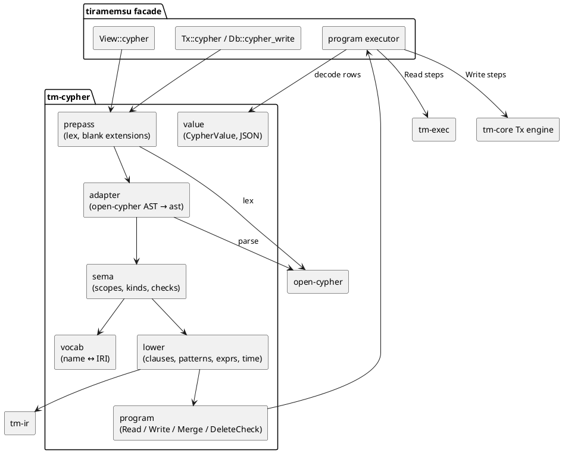
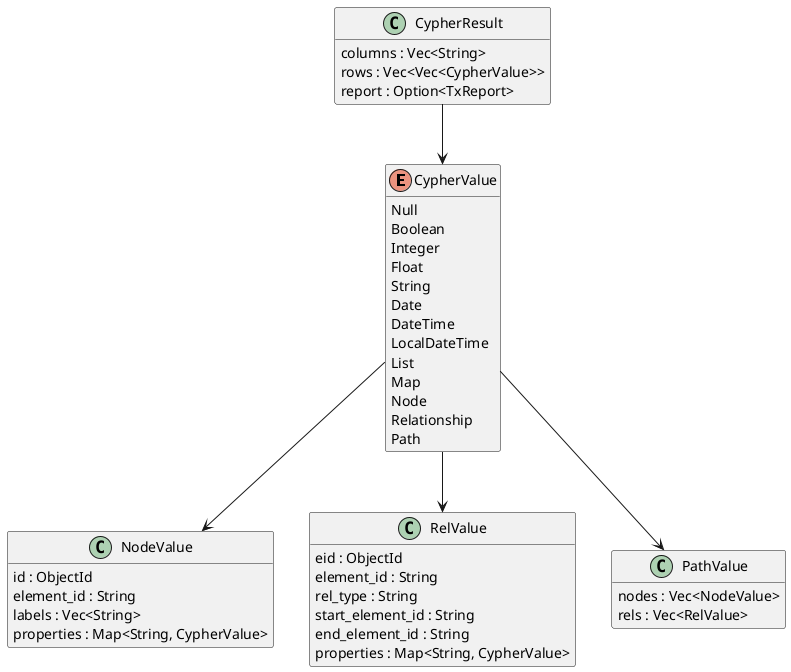
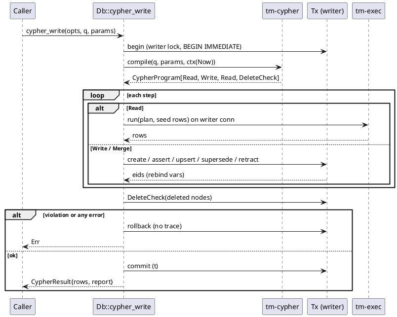

## Context

See proposal.md (Why) for the motivation. This design covers how `tm-cypher` and the facade entry points are built on what M0 and M1 provide.

What already exists or is being built in parallel:
- **M0 `add-core-store`** (`tm-core`, facade `Db`/`View`/`Tx`): the ObjectId codec, the term dictionary, the tx engine (`assert`, `create`, `retract`, `supersede`, `upsert`, cascade, schema checks), views, the volatile table and predicate schema flags. See `lat.md/time-model#Operations` and `lat.md/data-model#Predicate Schema`.
- **M1 `add-query-ir-and-sql-planner`** (`tm-ir`, `tm-exec`): the logical IR with per-pattern `View` and `Semantics` flags, virtual predicates (`tm:txAdded`, `tm:validFrom`, volatile keys, …), SQL codegen and result decoding. See `lat.md/query#Logical IR`, `lat.md/query#Views and Scans#Virtual Predicates` and `lat.md/query#Physical Planning#SQL Codegen`.
- **M2a `add-sparql-frontend`**: runs in parallel. It only meets this change in the differential suite (`dialect-differential-testing`).
- **M3 `add-path-engine`**: will later modify `cypher-read` so that variable-length and shortest-path patterns are evaluated. Here they are parsed and rejected (`lat.md/query#Physical Planning#Path Engine`).

Constraints taken from lat.md:
- Cypher semantics flags are `graph_set = BagOfEids`, `match_mode = RelIsomorphism` (`REPEATABLE ELEMENTS` opts out) and `missing = Null3VL` (`lat.md/query#Front Ends#Cypher`).
- Time predicates are written only by the view-aware scan. The front end only sets a `View` per pattern (`lat.md/query#Views and Scans`).
- The dual view must never change the meaning of a standard query (`lat.md/query#Front Ends#Cypher Dual View`).
- Names map through `@vocab` and the prefix table (`lat.md/data-model#Vocabulary Mapping`). Skolem IRIs for `NODE`, `BNODE`, `STMT` and `TX` round-trip exactly (`lat.md/data-model#Nodes and Identity`).
- Never forget: every write is an assert, a create, a retract or a supersede (`lat.md/time-model#Never Forget`).

## Goals / Non-Goals

**Goals:**
- A parser choice that covers the full openCypher grammar, carries spans, and has a permissive licence, isolated behind an adapter so that it can be replaced.
- One lowering path from the Cypher AST to `tm-ir` for reads, and a *Cypher program* (read plans interleaved with write steps) for writes. `tm-cypher` stays free of `tm-exec` and SQLite.
- Exact, testable mappings: clause → IR, write clause → Tx op, stored term → Cypher value.
- Differential equivalence with SPARQL over shared fixtures.

**Non-Goals:**
- Evaluating variable-length or shortest paths (M3).
- LFTJ or any physical-planning change (M1/M4).
- A Cypher syntax for writing valid time on property statements, for tx metadata, or for volatile values. Those stay API-only.
- Full GQL, Neo4j-specific clauses (`SHOW`, schema DDL, `CALL … IN TRANSACTIONS`), APOC, and dynamic labels.
- Query caching and prepared-statement reuse across calls, beyond what `tm-exec` already does.

## Decisions

### 1. Parser: `open-cypher` 0.2.x behind an adapter, with oxilite's vendored parser as the fallback

Evaluated on 2026-09-29 from crates.io, docs.rs and GitHub metadata, and, for oxilite, from its source at commit `67b5d67` (`lat.md/prior-art#oxilite`, decision D23):

| Criterion | **`open-cypher`** 0.2.1 | oxilite parser (vendored) | `decypher` 0.2.0-alpha.6 | `opencypher` 0.1.4 | `cypher-parser` 0.8.1 (`cypher_parser`) |
|---|---|---|---|---|---|
| Maintainer / repo | a-poor/open-cypher | `crates/oxilite-cypher` in oxilite (same author as Tiramemsu) | sunsided/decypher (was sunsided/cypher) | rockstar/opencypher (repo returns 404) | Shopify/cypher-parser |
| Last release | 2026-09-21 | oxilite M7, done; source commit 2026-09-29 | 2026-05-19 (alpha) | 2026-07-13 | 2026-07-09 |
| Licence | Apache-2.0 (MIT OR Apache-2.0 for own source) | MIT OR Apache-2.0 | EUPL-1.2 OR MIT OR Apache-2.0 | MIT OR Apache-2.0 | MIT |
| Technique | Logos lexer + LALRPOP, typed spanned AST | hand-written lexer (253 lines), recursive-descent parser (1 169) and AST (471): about 1 900 lines | hand-written rowan CST → typed AST | hand-written, typed spanned AST | hand-written |
| Grammar coverage | full openCypher **2024.3**, all 377 BNF productions traced; plus `COUNT{}`/`COLLECT{}`, GQL path modes, `!=` | the openCypher 9 subset oxilite runs: reads, writes (`CREATE`, `MERGE`, `SET`, `REMOVE`, `DELETE`), `UNWIND`, `UNION`, `CALL`; no `FOREACH` or `LOAD CSV` | "tracked against the openCypher EBNF"; unsupported productions return `Unsupported` | reads, writes, `CALL {}`, `FOREACH`, `LOAD CSV`, `UNION` | **read-only subset**: no writes, no `$params`, no `CALL {}`, no multi-label |
| Conformance evidence | parses every TCK query occurrence (4 131 unique); fuzzing, mutation testing, 85 % coverage gate | runs the openCypher TCK **end to end**: 3 733 of 3 880 scenarios pass (96.2 %, read-only 96.4 %) on bundled SQLite, system SQLite and D1; the 147 failures are allow-listed with reasons | error-resilient parsing; AST marked unstable | unit tests; README says "broadly usable" | executor tests |
| Spans / errors | byte spans on every node, rendered diagnostics, recovery mode | tokens carry a character position; AST nodes carry no spans | spans, `thiserror` errors | spans, optional `miette` | position on errors |
| Token stream access | `lex()` exposes every token, trivia included | `tokenize()`; we own the source | CST | no | no |
| Tiramemsu extensions (`USE AS OF`, `MATCH REPEATABLE ELEMENTS`) | no; pre-pass needed | no, but can be added natively once vendored | no | no | no |
| MSRV / deps | 1.88; generated parser checked in | no parser-generator deps; only a 48-line error module | rowan | none heavy | none |
| Risk | young 0.2 rewrite, single maintainer | we maintain it; byte spans must be added; constructs outside its subset need an `Unsupported` recogniser | alpha, unstable AST | source repo unreachable, so provenance cannot be audited | wrong scope |

**Recommendation: `open-cypher = "=0.2.1"`**, pinned exactly. It is the only candidate with verified full-grammar coverage and TCK-derived syntax evidence, and its `lex()` token stream makes the extension pre-pass (Decision 2) trivial and span-exact. `cypher-parser` is disqualified by scope. `opencypher` is disqualified because its repository cannot be reviewed.

**Fallback chain (D23).** We switch if one of these happens: an unfixable parse bug in an in-scope TCK scenario; licence or maintenance loss; or an upstream break we cannot pin around. The first fallback is to vendor oxilite's hand-written lexer, parser and AST into `tm-cypher/src/parse/oxilite/` (MIT OR Apache-2.0, notices kept). It is small enough to own, it has no parser-generator dependencies, and it already carries a real engine through 96 % of the TCK. The adapter would then map oxilite's `Query`/`SingleQuery`/`Clause`/`Pattern*`/`Expr` into our `ast::Query`. Vendoring needs three additions: byte spans on AST nodes (tokens have character positions only), the time and match-mode extensions parsed natively instead of by the pre-pass, and a recogniser that reports `Unsupported` for constructs outside its subset (`FOREACH`, `LOAD CSV`, GQL path modes, …) rather than `Parse`. The second fallback is `decypher`, if its AST has stabilised by then. This replaces the earlier plan of writing our own `chumsky` parser as the last resort: that was about two weeks of work with only our own TCK run as evidence, while oxilite's parser is proven code by the same author. Because of the adapter (`parse/adapter.rs` converts the upstream AST into our own `ast::Query`), a switch replaces one module and keeps every semantic and lowering test.

Sources: <https://crates.io/crates/open-cypher>, <https://github.com/a-poor/open-cypher>, <https://docs.rs/open-cypher>, oxilite `crates/oxilite-cypher/src/{lexer,parser,ast}.rs`, `crates/oxilite-cypher/tck-allowlist.txt` and README (M7 row), <https://crates.io/crates/decypher>, <https://github.com/sunsided/decypher>, <https://crates.io/crates/opencypher>, <https://crates.io/crates/cypher-parser>, <https://github.com/Shopify/cypher-parser>, Neo4j match modes <https://neo4j.com/docs/cypher-manual/25/patterns/match-modes/>, openCypher TCK <https://github.com/opencypher/openCypher/tree/main/tck/features>.

### 2. Extension pre-pass that keeps offsets

None of the candidates parses `USE AS OF | VALID AT | HISTORY` or the Cypher 25 match modes. The upstream grammar stays untouched, and a token-level pre-pass runs over `open_cypher::lex(text)`:
- It recognises `USE` at a *scope start*: the start of the query, after `UNION [ALL]`, after `CALL {`, or after the importing `WITH …` that opens a `CALL` body. It parses the time-selector grammar with a tiny recursive-descent parser over the tokens: `USE (AS OF expr | HISTORY)? (VALID AT expr)?`, where `expr` is an integer literal, a parameter, `datetime(string)` or `date(string)`.
- It recognises `REPEATABLE ELEMENTS` and `DIFFERENT RELATIONSHIPS` directly after `MATCH` or `OPTIONAL MATCH`.
- It replaces each recognised extension with spaces of the same byte length, so every span the upstream parser reports stays valid in the original text. It records a side table `ScopeExt { at_byte, time: TimeSel }` and `MatchExt { match_kw_byte, mode }`, which the adapter joins to AST nodes by span.
- A `USE` that is not at a scope start is left in place, so the upstream parser reports a `Parse` error with the right span. `USE <identifier>` (a graph name) is blanked and recorded as `Unsupported`.

Alternatives: forking the upstream grammar (a merge burden), or a regex over the text (unsafe inside strings and comments). The token stream avoids both.

### 3. Crate layout and dependency direction

```
crates/tm-cypher/
  src/lib.rs          // pub fn compile(text, &Params, &CompileCtx) -> Result<CypherProgram>
  src/error.rs        // CypherError -> facade Error::{Parse, Unsupported, Eval}
  src/parse/prepass.rs  // Decision 2
  src/parse/adapter.rs  // open-cypher AST -> ast::Query (only upstream-aware module)
  src/ast.rs          // our subset AST with spans
  src/sema/scope.rs   // variables, kinds, scopes, imports, shadowing
  src/sema/check.rs   // aggregates, unsupported features, write-under-time rule
  src/vocab.rs        // Decision 9, name <-> IRI
  src/lower/pattern.rs  // node/rel patterns, labels, classification, isomorphism
  src/lower/expr.rs   // expressions, property lookups, functions table
  src/lower/clause.rs // MATCH/OPTIONAL/WITH/RETURN/UNWIND/UNION/CALL
  src/lower/time.rs   // scope stack of View
  src/program.rs      // CypherProgram, Step::{Read, Write, Merge, DeleteCheck}
  src/write.rs        // write clause -> WriteOp templates
  src/value.rs        // CypherValue, ordering, equality, JSON
  src/funcs.rs        // built-in function and procedure registry
  tests/              // unit, TCK runner (tests/tck/), golden IR snapshots
crates/tiramemsu/src/cypher.rs  // View::cypher, Tx::cypher, Db::cypher_write, executor
crates/tiramemsu/tests/differential/  // corpus + fixtures + runner
```

`tm-cypher` depends on `open-cypher`, `tm-ir` and `tm-core` (ids, `Value`, vocab reader and schema snapshot types only). It does **not** depend on `tm-exec`. The facade runs a `CypherProgram`: `Read` steps go through `tm-exec`, and `Write` steps through `Tx`. This keeps the rule from `lat.md/architecture#Crates` that front ends compile against the IR only.

`CompileCtx` is a read-only snapshot taken at compile time. It holds the vocab and prefix table (current), the predicate schema flags per distinct view used in the query (for classification), and the handle's default `View`.



### 4. Semantic analysis and variable kinds

Each variable has a kind: `Node`, `Rel`, `Value` or `Path`. A `Rel` variable may later appear in node position. It keeps kind `Rel` (it is returned as a Relationship) and is marked `dual_used`. A `Node` variable in relationship position is a `Parse` error (`cypher-dual-view`). Scopes follow openCypher: `WITH` and `RETURN` close scopes, and `CALL` bodies see only imported variables. Returned names must not shadow outer ones. The checks produce `Parse` errors with spans for: undefined variables, kind conflicts, aggregates in `WHERE` or nested aggregates, `UNION` column mismatches, missing parameters and bad `SKIP`/`LIMIT` literals. They produce `Unsupported` for the constructs listed in `cypher-read`.

A node variable that is bound only through a relationship end can hold an entity node, a statement (dual view) or a literal (the end of an `isEdge true` literal statement). Its runtime kind is found from the ObjectId tag, and `labels()`/`keys()` return `null` for literals.

### 5. AST → IR lowering per clause

Notation: `TP(s,p,o,eid,view)` is a `TriplePattern`. `E(...)` is an existence test, lowered to a semi-join, `Filter(Exists)`. `σ` is the current view from the scope stack (Decision 8).

| Cypher construct | IR |
|---|---|
| `(n:L)` generator | `Project{distinct}(TP(n, rdf:type, L, _, σ), [n])` |
| `(n)` with nothing else binding `n` | node scan: `Distinct(Union(Project(TP(n,?p,?o,_,σ) ⋈ notSys(?p) ⋈ isNodeKind(n)), Project(TP(?s,?p,n,_,σ) ⋈ relClass(?p,n) ⋈ isNodeKind(n))))` |
| extra label on a bound `n` | `Filter(E(TP(n, rdf:type, L, _, σ)))` |
| `{k: v}` on node or relationship | `Filter(E(TP(x, k, ?o, _, σ) ∧ cypherEq(?o, v)))`. Other non-numeric constants are encoded at plan time, so the join is on the id. A DateTime constant compares the instant, `o >> 15` within tag `DATETIME`, because the same instant with another offset is another id (D20). |
| `(a)-[r:T]->(b)` | `TP(a, T, b, r, σ)` ⋈ `relClass(T, b)` (static when `T` is flagged, else a tag test on `b`) |
| `-[r]->` untyped | `TP(a, ?p, b, r, σ)` ⋈ `notSys(?p) ∧ ?p ≠ rdf:type ∧ relClass(?p, b)` |
| `<-` / undirected | swap s/o, or `Union` of both orientations |
| `[:A\|B]` | `Union` of the typed patterns, sharing `r` |
| relationship var in node position | the term is `r`, the eid variable (Decision 7) |
| isomorphism | for each pair of rel eid vars in one clause: `Filter(ri ≠ rj)`. Skipped under `REPEATABLE ELEMENTS`. Clause flag `match_mode`. |
| `WHERE` in `MATCH` | `Filter` over the clause's join |
| `OPTIONAL MATCH P WHERE c` | `LeftJoin(left, lower(P), cond = c)` |
| `x.k` | `Lookup(x, k, σ, multi = ListIfMany)` scalar expression (Decision 6) |
| `WITH`/`RETURN` items | `Extend`* then `Project`; `Aggregate(group = non-agg items)` when aggregates are present; `DISTINCT` → `Project{distinct}` |
| `ORDER BY`/`SKIP`/`LIMIT` | `OrderLimit` with keys decoded to Cypher order (Decision 10) |
| `UNWIND e AS x` | `Join(input, Unnest(e, x))`, using `Values` for constant lists and a `json_each`-style table function for computed lists |
| `CALL {}` uncorrelated | `Join(input, lower(body))` |
| `CALL { WITH a … }` correlated | decorrelate: `K = Distinct(Project(input,[a]))`; `S = lower(body) seeded by K`; `Join(input, S)` on `a`, null-safe (`IS`). Per-row `ORDER BY`/`LIMIT` inside the body becomes a window `ROW_NUMBER() OVER (PARTITION BY a)`. A body aggregate without group keys groups by the imported vars and is `LeftJoin`ed with defaults (`count` → 0, `collect` → `[]`). |
| `UNION [ALL]` | `Union` (+ `Project{distinct}` for `UNION`) |
| `EXISTS {}` / pattern predicate | `Exists` / `NotExists` expression |
| named fixed path `p = …` | `Extend(p, makePath(n0, r1, n1, …))` |
| var-length / `shortestPath` | `Unsupported` now; M3 lowers to `PathPattern` |
| `db.labels()` etc. | `Project{distinct}` over the matching `TP` with `notSys` |

`relClass(p, o)` is `(isNodeOrStmt(o) ∧ p ∉ EdgeFalse) ∨ p ∈ EdgeTrue`, where `EdgeTrue` and `EdgeFalse` are constant sets from the `CompileCtx` schema snapshot for view `σ`. `notSys(p)` is `p ∉ SysPreds(σ)`, the set of predicate ids whose IRI starts with `urn:tiramemsu:sys:`, which is precomputed from the term dictionary.

All plans carry `Semantics { match_mode: RelIsomorphism | Homomorphism per clause, missing: Null3VL, graph_set: BagOfEids }`.

### 6. Property access: a correlated lookup, with a list when multi-valued

`x.k` lowers to `Lookup { subject: x, pred: k, view: σ, class: Property, volatile: σ.tx == Now }`. SQL codegen emits a correlated scalar subquery: 0 rows → NULL, 1 distinct value → that value, more → a JSON array ordered by `min(eid)` per value. For `volatile`, a `COALESCE(<triple lookup>, (SELECT value FROM volatile WHERE s = x AND key = k))`, so the triple wins. `keys()` and `properties()` are lookups over `TP(x, ?p, ?o)` with `relClass` negated, `notSys`, and the temporal names excluded.

Alternative rejected: a `LeftJoin` per property access. It multiplies rows when there are several values and breaks the bag semantics of the surrounding pattern.

**IR dependency.** `Lookup`, `Exists` and null-safe join are needed. SPARQL needs `Exists` and M1 plans correlated scalar lookups for virtual predicates. If `Lookup` is missing when this change starts, it is added to `tm-ir` in coordination with M1 (task 3.1), not forked here.

### 7. Lowering the dual view

A relationship pattern always binds its eid to a variable, named or synthetic (`_r3`). Because `eid` is an ObjectId with tag `STMT`, the same variable can be used directly as the `s` or `o` term of another `TriplePattern`. `(b)-[:SUPPORTED_BY]->(r)` is just `TP(b, SUPPORTED_BY, r, _, σ)` where `r` is already bound. Nothing special happens at execution time.

- `:Statement` on a variable in node position → `Filter(tagOf(x) = STMT)`. As a generator → `TP(?s, ?p, ?o, x, σ) ⋈ notSys(?p)`.
- `x.txAdded` / `txRetracted` / `validFrom` / `validTo` on a variable of kind `Rel`, or on a node-position variable whose tag is `STMT` → the M1 virtual predicates `tm:txAdded` … over the row of eid `x` (a column reference, no join). On ordinary nodes the planner uses `CASE WHEN tagOf(x) = STMT THEN virtual ELSE Lookup(x, @vocab+name) END`, because the kind of a node-position variable is only known at run time.
- `startNode`/`endNode`/`type` → `sys:subject`/`sys:object`/`sys:predicate` virtual predicates on eid `x`.
- Result decoding: `Rel` kind → Relationship value; a node-position value with tag `STMT` → Node value with labels `["Statement", …]`.

### 8. Time lowering: a scope stack of views

`TimeSel { tx: Option<Now|AsOf(t)|AsOfInstant(ms)|History>, valid: Option<At(ms)> }`. The compiler keeps a stack that starts with the handle's `View`. A `ScopeExt` at a query, `UNION` branch or `CALL` body start pushes `merge(top, sel)`, overriding selector by selector (`cypher-temporal-clauses`). Every `TP`, `Lookup`, label test and virtual predicate built in that scope gets `σ = top`. `AsOfInstant` is resolved to `t` at compile time with the M0 instant → `t` resolution (the largest `t` with `instant ≤ ms`), so plans only contain `AsOf(t)`. An imported variable keeps its value. Only lookups made inside the body use the body's `σ`.

### 9. Vocabulary resolution algorithm

```
resolve(name, quoted, ctx):
  if !quoted or ':' not in name:
      return IRI(ctx.vocab + pct_encode(name))          // Person -> urn:tiramemsu:v:Person
  (pre, local) = split_once(name, ':')
  if pre in ctx.prefixes (user ∪ builtins{sys,tm,rdf,rdfs,xsd,v=vocab}):
      return IRI(ctx.prefixes[pre] + local)
  if is_absolute_iri(name): return IRI(name)            // RFC 3987 absolute
  error Parse(span, "not a declared CURIE or absolute IRI")

render(iri, ctx):
  if iri.starts_with(ctx.vocab) and ':' not in rest: return pct_decode(rest)
  best = longest ctx.prefixes[p] that prefixes iri (tie: smallest p)
  if best: return p + ':' + rest
  return iri                                             // full IRI, no backticks
```

Resolution always uses the vocabulary *current at compile time*, whatever the query's time clauses. The IRIs then go through the M1 constant encoder. A missing dictionary term short-circuits the pattern to empty (`lat.md/query#Logical IR`). Reserved implicit labels: `Statement` and `Predicate` are checked before `resolve`. `@id` values go through `resolve_id`: a declared CURIE, an absolute IRI, or one of the skolem forms `urn:tiramemsu:{node,bnode,stmt}:<n>`, which decode to the matching ObjectId (`lat.md/data-model#Nodes and Identity`).

Vocabulary writes: facade helpers `Tx::set_vocab(iri)` and `Tx::set_prefix(name, iri)` retract the previous live setting and assert the new one. They are thin wrappers over `retract_matching` and `assert` on the allowed `sys:` predicates, and they reject built-in prefix names with `ReservedNamespace`.

### 10. Cypher value model and result encoding



| Stored tag (`lat.md/data-model#ObjectId`) | Cypher value | Write direction |
|---|---|---|
| `INT` | Integer | Integer within 60 bits → `INT`, else `TYPED xsd:integer` |
| `BOOL` | Boolean | Boolean |
| `DOUBLE`, `DECIMAL` | Float | Float → `DOUBLE` |
| `SHORT_STR`, `STR` | String | String → canonical `SHORT_STR`/`STR` |
| `LANG_STR` | String (tag dropped) | — |
| `TYPED` | String (lexical form) | — |
| `DATE` | Date | Date |
| `DATETIME` | DateTime with its stored offset when `tz ≠ 0`, LocalDateTime when `tz = 0`; ms precision | DateTime → instant plus its offset (`(epoch_ms << 11) \| tz`); a named zone (`Europe/Kyiv`) → the offset it resolves to at that instant, the zone name is not kept; LocalDateTime → `tz = 0` |
| `IRI`, `NODE`, `BNODE` in node position | Node | via `@id` or new `NODE` |
| same in property position (`isEdge false`) | String of the full IRI / skolem IRI | — |
| `STMT` in rel position / node position | Relationship / Node `:Statement` | — |
| `TX` (from `txAdded`, `txRetracted`) | Integer `t` | read-only |

`elementId` is the IRI or the skolem IRI (`urn:tiramemsu:node|bnode|stmt:<n>`). `id()` is the raw ObjectId as `i64`. Ordering follows the openCypher global order (`cypher-read`). Values are decoded before `ORDER BY` (`lat.md/query#Physical Planning#SQL Codegen`).

Date-times keep their timezone offset (D20, `lat.md/data-model#ObjectId#Canonical Encoding`). `12:00+02:00` and `10:00Z` are two stored terms that each read back with their own offset, but Cypher `=`, `<` and `ORDER BY` compare the instant (`id >> 15`), so they are equal in Cypher. A named zone is resolved to its offset at write time, and only the offset is stored. Timezones are never normalised to UTC.

The JSON encoding is used by bindings and MCP. Scalars are native JSON. Date is `"YYYY-MM-DD"`, DateTime is ISO-8601 with its stored offset (`Z` for +00:00), and LocalDateTime is ISO-8601 without an offset. Node is `{"elementId","labels","properties"}`, Relationship is `{"elementId","type","startNodeElementId","endNodeElementId","properties"}`, and Path is `{"nodes":[…],"relationships":[…]}`. Integers outside ±2⁵³ are emitted as strings, with a `"$int"` wrapper.

In the facade, `QueryResult` gets a `Cypher(CypherResult)` variant. M2a adds its own variant, which keeps the two changes independent.

### 11. Write execution: a Cypher program with eager clause boundaries

A write query compiles to `CypherProgram { steps }`. Each clause boundary that follows a write is *eager*: the rows produced so far are materialised, and the next read step is seeded with them as `Values`. Every step runs on the writer connection inside the one transaction (`Tx`), with `σ = Now` for the top level, so later clauses see earlier writes (`cypher-write`). Expressions a write needs (`n.age + 1`) are computed as `Extend` columns in the preceding read step, so write steps only receive concrete ObjectIds and `CypherValue`s.



**Write clause → Tx operation mapping** (`lat.md/time-model#Operations`):

| Cypher | Tx operations |
|---|---|
| `CREATE (n:L {k:v})` | `new_node()` (or the `@id` IRI) → `assert(n, rdf:type, L)`, `assert(n, k, v)` per element |
| `CREATE (a)-[r:T {k:v, validFrom:f}]->(b)` | `r = create(a, T, b, valid=[f, t))`, then `assert(r, k, v)` |
| `MERGE (n {uk: v, …})`, `uk` is `sys:unique` | `n = upsert(uk, v)`, then `assert` of the remaining labels and properties |
| `MERGE pattern` (otherwise) | `Merge{match_plan, create_ops}`: run `match_plan` (σ = Now, writer conn). With 0 rows, run the create ops as for `CREATE`. |
| `ON CREATE SET` / `ON MATCH SET` | the SET ops, gated on the Merge outcome |
| `SET x.k = v` | the rule list in `cypher-write`: `assert` / no-op / `assert` (cardinality one) / `supersede(e, {o: v})` / `retract` × n + `assert` |
| `SET x.k = null`, `REMOVE x.k` | `retract(e)` for each live property statement (cascade) |
| `SET x += m` / `SET x = m` | per-key SET, plus (for `=`) `retract` of the unlisted keys |
| `SET n:L` / `REMOVE n:L` | `assert(n, rdf:type, L)` / `retract_matching(n, rdf:type, L)` |
| `SET r.validFrom/validTo = d` | `r' = supersede(r, {v_from/v_to: d})`; rebind `r := r'` |
| `DELETE r` (statement) | `retract(r)` (cascade; a retracted statement is a no-op) |
| `DELETE n` (node) | `retract` of the live label and property statements with `s = n`; record `n` for `DeleteCheck` |
| `DETACH DELETE n` | `retract` of every live statement with `s = n` or `o = n` (cascade) |
| end of program | `DeleteCheck`: for each recorded `n`, any live relationship-class statement with `s = n` or `o = n` → `DeleteConnectedNode` |

`Tx::cypher` runs the same program inside a caller's `transact` closure. `Db::cypher_write` is `transact(opts, |tx| tx.cypher(q, p))`, and it returns the rows plus the `TxReport`.

Why the "SET = supersede for a single existing value" rule: lat.md says `SET` maps to "assert or supersede". Supersede is the update verb that keeps annotations (`lat.md/time-model#Operations#Supersede`). For `sys:one` predicates, the cardinality model says the new value is a different fact whose annotations must not carry over (`lat.md/time-model#Operations#Cardinality One`), so assert is used. With several values it is ambiguous which one to "correct", so they are retracted explicitly and the new value is asserted.

### 12. Errors

The facade `Error` gains two variants. They are recorded for `lat.md/api#Errors` in the final task.
- `DeleteConnectedNode { node: ObjectId, relationships: Vec<Eid> }`, for Neo4j's "cannot delete node that still has relationships".
- `Eval { dialect, msg }`, for runtime expression errors (type errors, integer division by zero, unstorable property values, invalid `@id`). SQLite cannot raise typed errors from expressions, so SQL codegen maps them to a registered `tm_raise(code)` function that the executor turns into `Eval`.

Compile-time semantic errors reuse `Parse { dialect: Cypher, span, msg }`, as Neo4j reports them as `SyntaxError`. Constructs outside the subset use `Unsupported { feature }`.

### 13. Differential suite

`crates/tiramemsu/tests/differential/` holds:
- `fixtures/*.rs`: builders that apply transactions through the `Tx` API under a mocked, monotonic clock.
- `corpus/*.toml`: one table per pair, with `name`, `fixture`, `sparql`, `cypher`, `mode = "bag"|"set"`, `order = "ordered"|"unordered"`, `columns = {sparql_var = "cypher_col"}`, an optional `view`, `category`, and for divergence pairs `expect_sparql` / `expect_cypher`.
- `normalise.rs`: SPARQL term / Cypher value → `Canon` (ObjectId for resources, and skolem IRIs `urn:tiramemsu:{node,bnode,stmt}:` parsed back to the ObjectId). `urn:tiramemsu:tx:<t>` and Cypher Integer `txAdded` both become `Canon::Tx(t)`. Literals become canonical values, and unbound/null become `Missing`.
- `runner.rs`: loads the corpus and checks category coverage (≥ 40 pairs). It runs both sides, compares, and prints a diff.

The runner is behind a `sparql` cargo feature of the facade tests. Without M2a, the Cypher side is compiled and the pairs are reported as pending.

### 14. openCypher TCK subset

A small Gherkin runner (`tm-cypher/tests/tck/`), adapted from oxilite's `tests/tck.rs` (D23, `lat.md/prior-art#oxilite`), runs every vendored feature file from the openCypher repository, pinned to the same commit that `open-cypher` uses. Graph setup steps (`having executed`) run through `Db::cypher_write`. Expected result tables are compared after mapping Neo4j's `(:L {k: v})` notation to our Node values.

**Allow-list, not skip-list.** Every scenario is run. Each scenario that is expected to fail is listed in `tests/tck/allowlist.txt`, one line per scenario, as `<feature path> [n][#k] :: <reason>`, where `#k` names the example row of a scenario outline and the reason cites the spec or milestone. The runner fails on any **unexpected failure** (a failing scenario that is not listed) and on any **unexpected pass** (a listed scenario that now passes and must be removed). Deviations therefore stay explicit, and the list changes only by an explicit edit. `TM_TCK_WRITE_ALLOWLIST=<file>` writes the current failures as a new list after a fix, and `TM_TCK_FILTER=<substring>` runs a subset without the two checks. The runner prints the pass rate overall, for read-only scenarios and per feature directory, so the number can be compared with oxilite's 96.2 %.

Feature files expected to pass, apart from listed scenarios:
- **clauses:** `match/Match1`, `Match2`, `Match3`, `Match6` (fixed-length named paths only), `Match7`, `Match8`; `match-where/MatchWhere1–6`; `create/Create1–6`; `merge/Merge1–9`; `set/Set1–6`; `remove/Remove1–3`; `delete/Delete1–6`; `return/Return1–8`; `return-orderby/ReturnOrderBy1–6`; `return-skip-limit/ReturnSkipLimit1–3`; `with/With1–7`; `with-where/WithWhere1–7`; `with-orderBy/WithOrderBy1–4`; `with-skip-limit/WithSkipLimit1–3`; `unwind/Unwind1`; `union/Union1–3`.
- **expressions:** `aggregation/Aggregation1–8`; `boolean/Boolean1–5`; `comparison/Comparison1–4`; `conditional/Conditional1–2`; `existentialSubqueries/ExistentialSubquery1–3`; `graph/Graph1–4`, `Graph6`, `Graph8`, `Graph9`; `literals/Literals1–8`; `map/Map1–3`; `null/Null1–3`; `path/Path1–3` (fixed-length); `pattern/Pattern1`; `precedence/Precedence1–4`; `string/String1–14`; `list/List1–12` (except the list-comprehension forms we reject); `mathematical/Mathematical1–17`; `typeConversion/TypeConversion1–6`.
- **Allow-listed as whole features, with reasons:** `Match4` and `Match5` (variable-length, M3); `Match9` (deprecated); `call/Call1–6` (procedures); `Pattern2` (pattern comprehension); `quantifier/*`; `Graph5` (label expressions) and `Graph7` (dynamic access); `temporal/*` except the `date()`, `datetime()` and `localdatetime()` construction and comparison scenarios (durations, `time`/`localtime`, and results that print a named zone are out of v1; offsets are kept per D20, but a zone name is not); and `useCases/*` until M3.

Scenarios allow-listed for semantic reasons: `CREATE ()` persistence (an empty node writes no statement); `id()` values (we return ObjectIds); and multi-valued property shapes. Each line names its spec reference.

### 15. Decisions chosen during spec writing

lat.md left these open. Each was chosen as the option most consistent with lat.md, and each will be recorded in lat.md by the final task.

| # | Decision | Rationale / lat.md anchor |
|---|---|---|
| C1 | `rdf:type` statements are labels only, never relationships or properties | labels ↔ `rdf:type` (`lat.md/data-model#Vocabulary Mapping`); keeps LPG meaning |
| C2 | A multi-valued property reads as a list of distinct values in eid order; a list written by SET becomes one statement per element | cardinality many is the default (`lat.md/data-model#Predicate Schema`) |
| C3 | Label and property-map constraints are existence tests (no row multiplication) | bag of eids applies to relationships only (`lat.md/query#Front Ends#Cypher`) |
| C4 | The unlabelled node scan excludes statements, transactions, `rdf:type`-only class IRIs and `sys:`-only nodes | standard queries unchanged (`lat.md/query#Front Ends#Cypher Dual View`) |
| C5 | Untyped relationship patterns, `:Statement` enumeration and built-in name procedures also hide `sys:` | extends the `sys:` hiding rule (`lat.md/data-model#Reserved Namespaces`) |
| C6 | `sys:isEdge` flags are read as visible in each pattern's view | schema is versioned data (`lat.md/data-model#Predicate Schema`) |
| C7 | The end of an `isEdge true` literal statement binds to the literal value. An `isEdge false` non-literal object reads as its IRI or skolem IRI string. | lat.md says "forces the view whatever the object kind" |
| C8 | `SET` rule list (assert / no-op / cardinality assert / supersede / retract all + assert) | "SET → assert or supersede" (`lat.md/query#Front Ends#Cypher`) and `lat.md/time-model#Operations#Cardinality One` |
| C9 | `validFrom`/`validTo` in a CREATE relationship map set the valid interval. `SET r.validFrom/validTo` supersedes, and the variable rebinds to the new eid. | valid-time change is a supersede (`lat.md/time-model#Valid Time`) |
| C10 | `txAdded`/`txRetracted` return Integer `t`; the temporal names win over user properties on statements; `tm:` CURIEs work; `` `tm:retractKind` `` returns a string; none of them are listed in `keys()` | `lat.md/query#Views and Scans#Virtual Predicates` |
| C11 | `CREATE (n)` with no labels, properties or relationships writes nothing (the node is not persisted) | nodes have no lifetime (`lat.md/data-model#Nodes and Identity`) |
| C12 | The reserved key `` `@id` `` in node maps gives or matches the IRI identity. `elementId` returns the IRI or skolem IRI (`stmt:` included), and `id()` returns the raw ObjectId. | "created by IRI from Cypher" (`lat.md/data-model#Nodes and Identity`) |
| C13 | The implicit labels `Statement` and `Predicate` are reserved. `:Predicate` = subjects of schema flags. | `MATCH (p:Predicate)` in `lat.md/data-model#Predicate Schema` |
| C14 | Built-in prefixes: `sys`, `tm`, `rdf`, `rdfs`, `xsd`, `v` (= current `@vocab`), and they cannot be redefined. Names are percent-encoded. Rendered names carry no backticks. The longest prefix wins. | `lat.md/data-model#Vocabulary Mapping` |
| C15 | Names resolve with the vocabulary current at compile time, even under `USE AS OF` | keeps query text meaning stable across time |
| C16 | A single `USE` takes a tx selector plus optional `VALID AT`, and selectors override independently (handle → query → CALL body) | `lat.md/query#Temporal Syntax` |
| C17 | A write query with a non-Now top-level `USE` → `Unsupported`; historical `CALL { USE … }` reads are allowed | writes always happen "now" (`lat.md/time-model#Operations`) |
| C18 | `DELETE n` retracts the node's properties and labels, and the connectivity check runs at the end of the query → new error `DeleteConnectedNode`. `DETACH DELETE` retracts every statement with `s = n` or `o = n`. | Neo4j parity; `lat.md/query#Front Ends#Cypher` |
| C19 | Runtime expression errors → new error `Eval`; compile-time semantic errors → `Parse` with span; a write on a read-only `View` → `Unsupported` | `lat.md/api#Errors` |
| C20 | Volatile values are visible whenever the tx selector is `Now` (any valid time) and are listed by `keys()`/`properties()`; Cypher never writes volatile | `lat.md/storage#Volatile Table` |
| C21 | In scope beyond the lat.md list: `UNION`, `EXISTS {}`/pattern predicates, `CASE`, map projection, list comprehension over lists (pattern comprehension rejected), fixed-length named paths, built-in procedures `db.labels`/`db.relationshipTypes`/`db.propertyKeys` | "procedures other than built-ins" and "full list comprehension" are the only exclusions in lat.md |
| C22 | Facade entry points `Tx::cypher` and `Db::cypher_write`, plus the helpers `Tx::set_vocab` and `Tx::set_prefix` | `lat.md/api#Rust Surface` has only `View::cypher` |

## Risks / Trade-offs

- [`open-cypher` 0.2 is days old and has one maintainer] → Pin `=0.2.1`, keep the adapter as the only upstream-aware module, and run the TCK in CI. The first fallback is to vendor oxilite's hand-written parser (about 1 900 lines, MIT OR Apache-2.0, 96.2 % of the TCK end to end), then `decypher` (Decision 1, D23). No new `chumsky` parser is planned.
- [The pre-pass misreads `USE` inside strings or comments] → It works on the lexer's token stream, never on raw text, and fuzz tests assert that spans are unchanged by blanking.
- [Correlated `Lookup` subqueries are slow on wide `RETURN` clauses] → Lookups on the same subject are batched into one subquery with `GROUP BY p` when more than 3 keys are read. `EXPLAIN QUERY PLAN` tests check that `live_spo`/`hist_spo` are used.
- [The M1 IR lacks `Lookup`, null-safe join or window support] → Task 3.1 checks the IR first and adds any gap to `tm-ir` together with M1's owners. SPARQL needs the same primitives, so no divergence is expected.
- [Multi-valued properties surprise Neo4j users (`n.x` becomes a list)] → Documented, covered by divergence pairs. `sys:cardinality one` restores scalar semantics.
- [Eager write boundaries use memory on large `MATCH … SET`] → Acceptable at the target scale (10⁴–10⁷ statements, `lat.md/overview#Goals`). `max_cascade` still bounds retract fan-out.
- [Classification depends on schema flags snapshotted at compile time] → Compilation and execution share one read snapshot (reader) or the writer transaction, so the snapshot cannot drift.
- [`CREATE (n)` with no statements is not persisted] → Documented, and the TCK allow-list names the affected scenarios.
- [Differential tests block on M2a] → The Cypher side compiles now, pairs are reported as pending, and the suite turns on when the `sparql` feature is available.

## Migration Plan

Greenfield: there is no existing Cypher surface or data format change. The crate and the facade methods land behind the workspace build, and M0 file format version 1 is unchanged. Rollback means removing the crate and the facade methods. No stored data depends on this change, except `sys:vocab`/`sys:prefix` statements written by the helpers, which are ordinary versioned triples.

## Open Questions

- Should `r.txAdded` also be available as a tx node, to join tx metadata (`sys:author`) directly? This is deferrable: it adds a function or pattern, and it would not change the integer result specified here.
- Integer JSON encoding beyond ±2⁵³ (the `"$int"` wrapper) may change once the first binding is chosen (`lat.md/overview#Open Inputs`). Bindings own this encoding detail, and it does not affect the specs.
