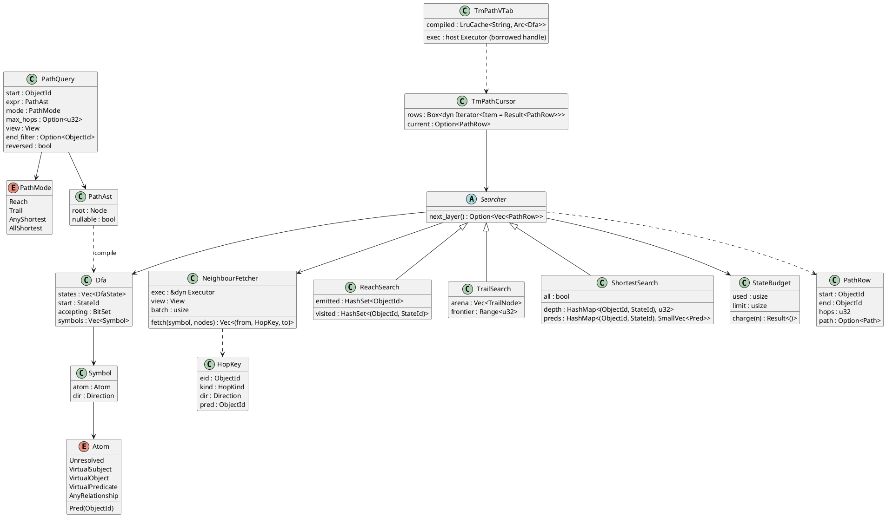
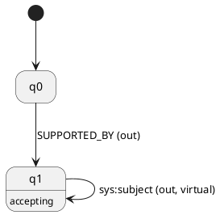
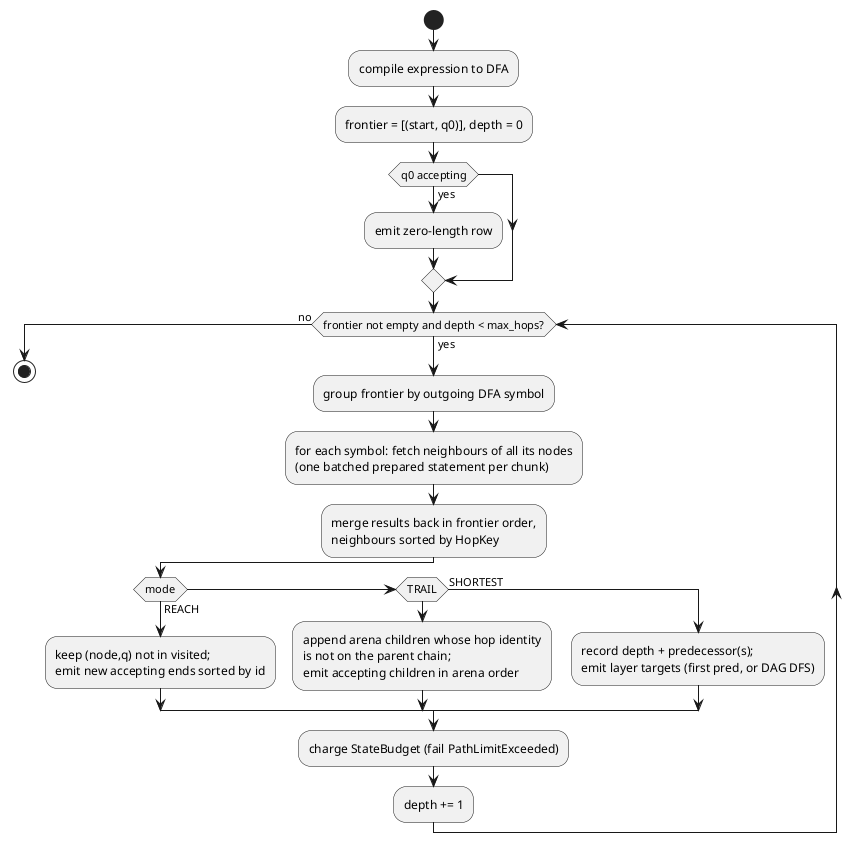
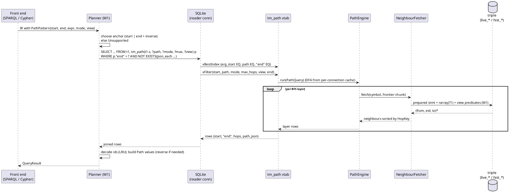

## Context

See `proposal.md` (Why) for the motivation. This section covers only the state and constraints that shape the design.

**What M1 (`add-query-ir-and-sql-planner`) already provides:**
- **IR:** `PathPattern { start, end, path, mode, bind_path, view }` (`lat.md/query#Logical IR`).
- **View-predicate function:** a single function that turns a `View` into SQL predicates. It emits the verbatim `t_ret IS NULL` for `Now`, so the partial `live_*` indexes apply (`lat.md/query#Views and Scans`, `lat.md/storage#Query Shapes`). Per lat.md, no other code may write time predicates.
- **Virtual predicates:** `sys:subject`, `sys:object` and `sys:predicate`, resolved to row columns in scans (`lat.md/query#Views and Scans#Virtual Predicates`).
- **SQL codegen and region composition:** "TVFs as FROM items" (`lat.md/query#Physical Planning`).
- **Native-operator extension point** in `sql-execution`. A `PathPattern` region is routed to `tm_path(start, path, mode, max_hops, view)`. Until this change it fails with `Unsupported`.
- **ObjectId decoding** through the LRU term cache.

**What M2a and M2b provide:** they parse SPARQL property paths and Cypher variable-length and shortest patterns. For now they report `Unsupported` for them. `sparql-query` "Property paths before the path engine" still evaluates a single IRI or `^iri` as a triple pattern.

**Constraints:**
- `lat.md/query#Physical Planning#Path Engine` requires:
  - a native BFS over the product of an automaton and the graph, never a recursive CTE;
  - the modes REACH, TRAIL, ANY SHORTEST and ALL SHORTEST;
  - at least one bound endpoint;
  - a 15-hop cap for unbounded Cypher patterns;
  - virtual hops;
  - the eponymous vtab `tm_path(start, path, mode, max_hops, view) → (start, end, hops, path_json)`.
- Every read happens inside the caller's read transaction on one SQLite connection (`lat.md/architecture#Connections and Concurrency`). Inside `with()` that is the writer connection.
- **Executor boundary (D22, `lat.md/architecture#Executor`, `#Crates`):** `tm-exec` reaches SQLite only through the `Executor` trait. `tm_path` and `rarray` are virtual tables, so they require the host capability `vtab` and are registered by the host. The first host is the crate `tm-rusqlite` (rusqlite, bundled SQLite). Host-specific mechanics named below (rusqlite `vtab`/`array`, `rarray`, `prepare_cached`, `Connection::from_handle`) live in that crate.
- Scale target: 10⁴–10⁷ statements (D1). Paths must be fast enough for the path benchmarks in `lat.md/roadmap#Benchmarks`.

**Grounding:** MillenniumDB evaluates RPQs over the product of an automaton and the graph. It gets all-shortest paths from a BFS that keeps a compact representation of predecessors, and it pipelines path modes (PathFinder).
- Evaluating regular path queries under the all-shortest paths semantics — https://arxiv.org/abs/2204.11137
- PathFinder: a unified approach for handling paths in graph query languages — https://arxiv.org/abs/2306.02194
- SQLite table-valued functions as eponymous virtual tables with HIDDEN argument columns — https://www.sqlite.org/vtab.html#tabfunc2 and https://www.sqlite.org/vtab.html#epovtab
- rusqlite `vtab` (`eponymous_only_module`, `VTab`, `VTabCursor`, `IndexInfo`), used by the `tm-rusqlite` host — https://docs.rs/rusqlite/latest/rusqlite/vtab/index.html
- rusqlite `array` / `rarray`, used by the `tm-rusqlite` host — https://docs.rs/rusqlite/latest/rusqlite/vtab/array/index.html

## Goals / Non-Goals

**Goals:**
- One path engine, in `tm-exec/src/path/`, behind three surfaces: the planner (`PathPattern` regions), the `tm_path` vtab, and `View::path`. The surfaces cannot drift apart because they share one code path.
- Every hop reads through M1's view-predicate function, so time semantics match triple scans exactly.
- Memory is bounded and results stream per BFS layer. A `LIMIT` stops the search early.
- Results come in a deterministic order, with no global sort of the whole result set.

**Non-Goals:**
- `WALK`, `SIMPLE`, `ACYCLIC`, `SHORTEST k`, time-respecting paths, and quantified path patterns. Each is a later change (`lat.md/query#Physical Planning#Path Engine` "Later").
- Bidirectional search, and cost-based choice of which endpoint to start from. v1 starts from the start when it is bound, and from the end otherwise.
- Evaluating paths with both endpoints unbound (all pairs).
- Changing the storage schema or indexes. The engine uses only the existing `live_*`, `hist_*` and `valid_p` indexes and rowid lookup.
- The loadable SQLite extension binding (`lat.md/api#Bindings`), which is a later binding change.

## Decisions

### 1. Module structure: one engine, three surfaces

The engine lives in `tm-exec::path`, with these submodules:
- `syntax`: path text to AST;
- `ast`: IR `PathExpr` to AST;
- `automaton`: NFA and DFA;
- `resolve`: atoms to ObjectIds;
- `fetch`: neighbour fetcher;
- `search`: one searcher per mode;
- `row`: `PathRow` and `path_json`.

The surfaces call into it: `vtab` (`tm_path`), `planner` routing, and the facade's `View::path`.

**Alternative considered:** implement `View::path` by running `SELECT … FROM tm_path(…)`. It was rejected because it adds an SQL round trip and loses typed errors. Instead, both surfaces call `PathEngine::run(exec, PathQuery) -> impl Iterator<Item = Result<PathRow>>`, where `exec` is the host's `Executor` for the calling connection.



### 2. Path expression front: two parsers, one AST

- **Path text** (`tm_path` and `View::path`) is parsed by a small hand-written recursive-descent parser. It follows the SPARQL 1.1 property path grammar (precedence: `|` < `/` < unary `^` < postfix `* + ? {m,n}`), with bounded repetition `{m,n}`, `{m,}` and `{n}` added. Atoms are `<iri>`, a CURIE, or a bare name. The reserved `sys:anyRelationship` is the wildcard.
  - Bare names and CURIEs resolve through the vocabulary mapping (`lat.md/data-model#Vocabulary Mapping`).
  - `tm-exec` cannot depend on a front end. If, when this is implemented, the vocab/prefix resolver exists only in `tm-cypher`, it is moved into `tm-core` in the first task group.
- **The planner** converts the IR `PathExpr` straight to the same AST. It does not print and reparse.
  - SPARQL `spargebra::PropertyPathExpression` maps as follows: `NamedNode` → Pred, `Reverse` → Inverse, `Sequence`, `Alternative`, `ZeroOrMore`, `OneOrMore`, `ZeroOrOne`. `NegatedPropertySet` → `Unsupported`.
  - Cypher `-[:A|B*m..n]->` maps to `Repeat(Alt(A, B), m, n')`. `-` becomes `Alt(x, ^x)`, and `<-` becomes `Inverse`.

**Alternative considered:** make the SPARQL property path syntax the only input, and have the planner print it. It was rejected because the planner already holds a typed tree. For SQL composition, though, the planner **does** print canonical text, with full IRIs and `sys:anyRelationship` (see Decision 9). SQL-level `tm_path` then works the same whether a person or the planner wrote the call, and `explain_ir` golden snapshots stay readable.

### 3. Automaton: Thompson NFA → ε-free → DFA by subset construction

The AST compiles to a Thompson NFA, whose symbols are `(Atom, Direction)`. After ε-closure it is determinised with subset construction.

- **Bounded repetition** `e{m,n}` unrolls to m copies of e, followed by (n − m) optional copies.
- **`e{m,}`** unrolls to m copies followed by `e*`.
- **Unbounded Cypher patterns** are not unrolled to the cap. The cap is enforced as a depth bound in the searcher, so `*` stays a loop.

A DFA is needed, not only an NFA:
- **TRAIL and ALL_SHORTEST return paths.** With an ambiguous NFA (e.g. `p|p` or `(p*)*`), the same hop sequence reaches several states and comes out as duplicate rows. The spec forbids these duplicates ("All shortest does not duplicate ambiguous matches"). With a DFA, a hop sequence has exactly one run, so paths are unique by construction.
- **REACH** also profits: the visited set is keyed by `(node, dfa_state)`, so fewer states are explored.

**Symbol overlap:**
- `AnyRelationship` overlaps with concrete `Pred` atoms. When both occur in one expression, which only happens in hand-written `tm_path` text, the alphabet is refined into disjoint classes before subset construction: each concrete predicate, plus "any other relationship".
- Virtual atoms never overlap with stored predicates, because `sys:` predicates cannot be asserted.

**DFA size guard:** at most 4 096 DFA states, beyond which the query fails with `Unsupported { feature: "path expression too complex" }`. Realistic expressions have fewer than 50 states. The guard only stops adversarial bounded repetitions.

**Alternative considered:** keep the NFA and deduplicate emitted paths per layer. It was rejected because the search itself is duplicated too (the work grows with the degree of ambiguity), and deduplicating ALL_SHORTEST enumeration is costly.

Example for the lat.md diagram's `SUPPORTED_BY/sys:subject*`:



### 4. Product-graph BFS, layer by layer, for every mode

Every mode is a breadth-first search over `(node, dfa_state)`. It advances one **layer** (hop count) at a time, and each layer is one round of batched neighbour fetches. The depth bound is `max_hops`: the explicit argument, the Cypher cap (`OpenOptions.path_max_hops`, default 15), or none. Layers give the spec'd order "non-decreasing hops" for free, and they are the unit that results stream in.

**Initialisation.** The search starts from `(start, q0)` at depth 0. If `q0` is accepting (the expression is nullable), the zero-length row is part of layer 0. This is how `*`, `?` and `{0,n}` include the start, even when the start is in no statement.

**REACH** (set semantics, endpoints only):
- It keeps `visited: HashSet<(node, state)>` and `emitted: HashSet<node>`.
- A state is expanded only when it is first inserted into `visited`. With finitely many (node, state) pairs this terminates on any cycle without a hop bound.
- An end is emitted the first time any accepting state reaches it. By the BFS property, that is its minimal hop count, which is the spec'd `hops`.
- Each layer's newly emitted ends are sorted by raw ObjectId before they are yielded. This is for determinism only, not a value order. (For a `DATETIME` end, raw order happens to follow the instant, `id >> 15`, then the offset code; value comparison elsewhere still uses the instant.)

**TRAIL** (no repeated relationship identity):
- The search tree is kept in an **arena**, `Vec<TrailNode { node, state, parent: u32, hop: HopKey }>`. Children share prefixes, so the memory used is the number of distinct trail prefixes, not their total length.
- Before adding a child, the parent chain (at most `max_hops` entries) is walked to check that the hop identity was not used. The identity is `eid` for stored hops and `(eid, kind)` for virtual hops. An O(depth) walk is cheaper than a per-trail hash set when depth ≤ 15.
- There is no visited set, because nodes may repeat. Termination comes from the finite edge set: a trail has at most |E| hops. In practice the hop bound ends it first.
- Deterministic order: layer k+1 is created by expanding layer k in arena order, with each node's neighbours sorted by `HopKey`. By induction, each layer is then in lexicographic order of hop-key sequences, so rows need no sort.

**ANY_SHORTEST / ALL_SHORTEST** (after 2204.11137):
- `depth[(node, state)]` records the first-discovery layer.
- `preds[(node, state)]` holds a list of `(prev (node, state), HopKey)`. An entry is added when the state is discovered at depth d+1 for the first time, or rediscovered at the same depth d+1. A later rediscovery at a greater depth is ignored.
- `ANY_SHORTEST` keeps only the first predecessor. Its frontier is processed in the order of each state's canonical path, with neighbours sorted by HopKey. The first discovery is then the lexicographically smallest shortest path, which is what the spec requires for tie-breaks, so no sorting is needed.
- `ALL_SHORTEST` keeps every predecessor, forming a layered DAG. Layer d of the result is emitted once BFS has finished discovering depth d (all predecessors into depth d are known then):
  1. The targets are the accepting `(n, q)` with `depth = d` whose node `n` has not been emitted at a smaller depth.
  2. The DAG ancestors of the targets are marked with a reverse walk over `preds`.
  3. A DFS runs forward from `(start, q0)` over the marked sub-DAG, taking successors in HopKey order. It yields each path that reaches a target.

  This yields all minimal paths in global lexicographic order. It is lazy: it streams an exponential number of paths while holding only the DAG and one DFS stack. Successor lists are built per layer from `preds`.
- Nodes found at depth d are closed, so the search terminates without a hop bound.

**End filter.** When the planner pushes `"end" = ?` (Decision 9), REACH and ANY_SHORTEST stop as soon as the target is emitted. ALL_SHORTEST stops after finishing the target's layer. TRAIL still expands (longer trails may reach the end again), but it only emits rows for that end.

**Alternative considered:** DFS for TRAIL. Its memory is O(depth × branching) instead of the frontier size. It was rejected for v1 because DFS output is not in hop order, so the spec'd order would need a full sort, which costs the memory saved. It also breaks streaming by layer. The memory guard (Decision 7) covers the worst case. DFS can come back with `SIMPLE`/`ACYCLIC`, whose order may be defined differently.



### 5. Neighbour fetch: batched prepared statements per (symbol kind, direction, view shape)

A layer's frontier is grouped by DFA symbol. For each symbol, the distinct frontier nodes are sent in chunks (default 256 ids, tunable internally) through `rarray(?1)`, a virtual table the host provides under its `vtab` capability (in `tm-rusqlite`, from the rusqlite `array` feature). The host registers `rarray` on every connection, next to `tm_path`. Each SQL text is prepared once per connection through the executor's statement cache (`prepare_cached` in `tm-rusqlite`). The text depends only on (atom kind, direction, view shape). The predicate id and the view's `t` and `d` are bind parameters, never string-spliced (`lat.md/query#Physical Planning#SQL Codegen`: "the generated SQL text never contains data").

| Symbol | SQL core (plus `AND <view predicates>` from M1's function) | Index expected |
|---|---|---|
| `Pred(p)` out | `SELECT s, eid, o FROM triple WHERE p = ?2 AND s IN rarray(?1)` | `live_spo` / `hist_spo` |
| `Pred(p)` in | `SELECT o, eid, s FROM triple WHERE p = ?2 AND o IN rarray(?1)` | `live_pos` / `hist_pos` |
| `AnyRelationship` out / in | `SELECT s, eid, o, p FROM triple WHERE s IN rarray(?1)` (resp. `o IN`), then a Rust-side relationship-view filter | `live_spo` / `live_osp` |
| `sys:subject` / `sys:object` / `sys:predicate` out | `SELECT eid, eid, s` (resp. `o`, `p`) `FROM triple WHERE eid IN rarray(?1)`. Only nodes with tag `STMT` are sent. | rowid |
| `sys:subject` / `sys:object` / `sys:predicate` in | `SELECT s, eid, eid FROM triple WHERE s IN rarray(?1)` (resp. `o IN`, `p IN`) | `live_spo` / `live_osp` / `live_pos` |

- Rows come back as `(from, eid, to[, p])` and are grouped by `from` in Rust. Within each group they are sorted by `HopKey`. The rows are then merged in frontier order, which keeps the determinism argument of Decision 4.
- **The view-predicate text comes only from M1's function.** A unit test asserts that each fetch statement contains the verbatim `t_ret IS NULL` under `Now`. `EXPLAIN QUERY PLAN` tests assert that the indexes named above are used (`tests#Storage Invariants#Views Use Covering Indexes`).
- **Relationship-view filter** for `AnyRelationship`. At query start it loads the set of `sys:isEdge` predicate ids (true and false) and the ids of `rdf:type` and of `sys:` IRIs through a `term.lex LIKE 'urn:tiramemsu:sys:%'` lookup. Per row it keeps: object tag ∈ {IRI, NODE, BNODE, STMT, TX}, or `p` has `isEdge = true`; not `isEdge = false`; `p ≠ rdf:type`; `p` not in `sys:`. This mirrors the M2b dual-view classification. If M2b exposes a classifier, the filter reuses it.
- **Frontier nodes that can never be subjects** are dropped before querying. That means literal tags for the out-direction of stored predicates, and non-`STMT` tags for forward virtual hops. This is a cheap tag test (`id & 15`).

**Alternative considered:** one prepared statement per frontier node (MillenniumDB-style seeks). It was rejected because the per-statement overhead in SQLite (step and reset through FFI) dominates on wide frontiers. Batching amortises it, as the LFTJ note in `lat.md/query#Physical Planning#LFTJ` also recommends.

**Alternative considered:** recursive CTE. It is excluded by lat.md (D15).

### 6. Virtual hops are symbols, not stored rows

`sys:subject`, `sys:object` and `sys:predicate` compile to dedicated `Atom` variants when the resolver meets their IRIs. They are never looked up as a stored `p`. Their `HopKey` is `(eid, kind = Subject|Object|Predicate, dir)`, and trail identity is `(eid, kind)` (spec `layer-hops`). Stored hops are ordered before virtual ones for the same eid (the kind order is Stored < Subject < Object < Predicate), and `Out` is ordered before `In`. The view applies to the statement row that is traversed (`WHERE eid IN …` or `s IN …` together with the view predicates). A retracted statement is therefore invisible under `Now` whether it is walked as an edge or through its parts.

In `path_json`, a virtual hop is written as `{"eid": e, "p": <sys:subject id>, "dir": "out"|"in"}`. `p` is the IRI id of the virtual predicate, which is always in the dictionary because `lat.md` reserves it. The Cypher decoder turns such a hop into a synthetic relationship value:
- `type()` is the CURIE `sys:subject`;
- `startNode` and `endNode` follow the stored direction (statement → part);
- it has no properties;
- its identity is distinct from the statement's own relationship.

### 7. Memory bounds: `StateBudget`

Each evaluation owns a `StateBudget` with `limit = OpenOptions.path_max_states` (default 1 000 000). It is charged for:
- REACH: visited entries;
- TRAIL: arena nodes;
- shortest modes: `depth` entries plus predecessor entries.

Exceeding the limit returns `PathLimitExceeded { limit }`. This is a new typed error, analogous to `CascadeLimitExceeded` (`lat.md/api#Errors`). At about 48 bytes per state, the default is about 50 MB in the worst case.

Rows are emitted per layer, and the in-flight fetch buffers are bounded by chunk size × fan-out. The hop cap (15 by default for Cypher) is a *semantic* limit that returns results. The state budget is a *safety* limit that fails. The two are kept distinct, as the specs require.

**Alternative considered:** truncate silently at the budget. It was rejected because a partial path result would look complete. That breaks "exact answers", and it is the reason `CascadeLimitExceeded` aborts too.

### 8. `tm_path` as an eponymous-only, read-only virtual table

`tm-exec` owns the module's behaviour (schema, `best_index`, `filter` over `PathEngine`). The executor host binds it to its own virtual-table API and registers it on every connection that M0/M1 open (readers and writer), right after M1's SQL helpers. In `tm-rusqlite` this is `conn.create_module("tm_path", eponymous_only_module::<TmPathVTab>(), None)`.

**Host capability:** `tm_path` and `rarray` need the host capability `vtab` (`lat.md/architecture#Executor`). On a host that does not declare it, `tm-exec` refuses to open with a clear error naming the missing capability; there is no silent fallback to another path strategy.

**Declared schema:**
```sql
CREATE TABLE x(start INTEGER, "end" INTEGER, hops INTEGER, path_json TEXT,
               arg_start HIDDEN, path HIDDEN, mode HIDDEN, max_hops HIDDEN, view HIDDEN)
```
SQLite maps table-valued-function arguments, in order, to HIDDEN columns. The visible columns are therefore exactly `start`, `end`, `hops`, `path_json`, as `SELECT *` must return (spec `path-table-function`). The first argument goes to `arg_start`, and the visible `start` echoes it.

`end` is a SQLite keyword that falls back to an identifier. It works unquoted in most positions, but the planner always writes `"end"`, and the docs recommend quoting it.

**`best_index`:**
- It needs usable `EQ` constraints on `arg_start` and `path`. Without them it returns `SQLITE_CONSTRAINT`, so SQLite picks a join order where the start is known first, and fails with "no query solution" when there is none.
- It also consumes optional EQ constraints on `mode`, `max_hops`, `view` and `"end"`, and encodes which ones are present in `idxNum`.
- The estimated cost falls when `"end"` is bound.
- `orderByConsumed` is never set, so an explicit `ORDER BY` still sorts. The natural order is the deterministic one.

**`filter`:**
1. Validate the argument types. Errors start with `tm_path: <arg>: …`. A NULL start gives an empty cursor.
2. Parse the view text into M1's `View`, resolving `asOf/<instant>` through the `tx` table on this connection.
3. Look up the path text in a per-connection LRU of parsed ASTs and symbolic DFAs, keyed by text (correlated calls repeat it for every outer row). The atoms are then resolved to ids for this call, because the vocab may change between statements.
4. Build the searcher, which streams rows.

**Re-entrancy:** the vtab issues neighbour queries on its own connection. SQLite allows this from inside `xFilter` and `xNext`. In `tm-rusqlite`, the vtab holds a non-owning `Connection::from_handle(db.handle())`, which does not close on drop, and keeps its prepared-statement cache there. All reads therefore see the calling statement's snapshot. On the writer inside `with()`, that includes the uncommitted speculative rows (spec "reads a consistent snapshot").

**Typed errors across the SQL boundary:** SQLite errors are strings. When a native error (`PathLimitExceeded`, `Unsupported`, `Parse{Path}`) happens inside the vtab, it is stored in a per-connection slot (`RefCell<Option<Error>>`) and the vtab returns `SQLITE_ERROR` with the `tm_path:` message. When a statement fails, M1's executor checks the slot first and re-raises the typed error. Raw SQL users see the message.

**Alternative considered:** a scalar function that returns a JSON array. It was rejected because it cannot stream, cannot join or be correlated as a FROM item, and cannot take an `"end"` constraint.

**Alternative considered:** a non-eponymous `CREATE VIRTUAL TABLE`. It was rejected because it would persist schema into the file, and lat.md wants functions registered at open time without format changes.

### 9. Planner integration through M1's native-operator extension point

The `PathPattern` region implements M1's TVF region hook. `lower_path_region` receives the pattern, the set of variables already bound by earlier regions, and the view. It returns a FROM item plus column bindings.

1. **Choose the anchor:**
   - start bound (constant, parameter, or a variable bound by another region or by `VALUES`) → anchor = start;
   - else end bound → anchor = end, expression = `Inverse(expr)`, `reversed = true`;
   - else fail with `Unsupported { feature: "path with no bound endpoint" }` at plan time.
2. **Emit** `tm_path(<anchor expr>, ?path_text, ?mode, ?max_hops, ?view_text) AS pN`, with:
   - the canonical text of the (possibly inverted) expression;
   - the mode from the front end;
   - `max_hops` = NULL for SPARQL (no cap), the explicit Cypher upper bound, or `OpenOptions.path_max_hops` for unbounded Cypher patterns;
   - the canonical view text: `asOf/<t>`, `history`, `now`, optionally with `;validAt/<RFC3339 ms>`.
3. **Bind columns:**
   - the far endpoint variable → `pN."end"`;
   - if the far endpoint is already bound or constant → `WHERE pN."end" = <expr>`, which `best_index` consumes as the early-termination target;
   - if the same variable is at both ends → `pN."end" = pN.start`.
4. **Path variable:** `bind_path` → `pN.path_json`, `pN.hops`. The decoder builds the Cypher `Path` value from `path_json`, reversing nodes and edges and flipping `dir` when `reversed`. The SQL never reverses JSON.
5. **Relationship isomorphism (Cypher)** is enforced with SQL filters over `json_each(pN.path_json, '$.edges')`, which exclude virtual-hop entries by their `p`:
   - against each fixed relationship alias `tK`: `NOT EXISTS (SELECT 1 FROM json_each(pN.path_json,'$.edges') j WHERE j.value->>'eid' = tK.eid AND j.value->>'p' NOT IN (<virtual ids>))`;
   - against another path region `pM`: a `NOT EXISTS` over the join of both `json_each`s.

   Trail uniqueness *within* a path is the engine's job.
6. **SPARQL set semantics:** REACH already emits distinct ends per anchor, and no extra `DISTINCT` is added. Join multiplicity with other patterns follows normal SPARQL join rules.
7. **Unknown constant start:** when a constant start is not in the dictionary, M1 would short-circuit the pattern. If the expression is nullable, the pattern instead becomes an `Extend`/`Values` that binds the far end to the constant term itself. That is the zero-length match of a term that is in no statement. Otherwise it stays empty.
8. **Non-recursive SPARQL paths** (no `*`, `+`, `?`) are not routed here. The SPARQL lowering expands them per the SPARQL 1.1 translation (sequence → join on a fresh variable, alternative → union, inverse → swap), and they become ordinary triple patterns for SQL codegen. The virtual `sys:` predicates in such paths use M1's column expansion.
9. **Cypher-only checks** happen in the lowering, before IR:
   - shortest with min ∉ {0, 1} → `Unsupported`;
   - property maps on variable-length relationships → `Unsupported`;
   - quantified path patterns → `Unsupported`;
   - `REPEATABLE ELEMENTS` with variable length → `Unsupported` ("walk semantics").



### 10. `View::path` and options

`View::path(start, path, mode, max_hops) -> Result<Vec<PathRow>>` (`lat.md/api#Rust Surface`):
- It takes a reader connection, or the writer connection inside `with()`, opens a read transaction, parses the text, and runs `PathEngine` under `self`'s view. Its `max_hops: u32` is always a hard bound; `u32::MAX` means none.
- `PathRow { start, end, hops, path: Option<Path> }`, where `Path { nodes: Vec<ObjectId>, hops: Vec<Hop { eid, pred, dir }> }`.
- `PathMode` is `{ Reach, Trail, AnyShortest, AllShortest }`, and its text names are `REACH | TRAIL | ANY_SHORTEST | ALL_SHORTEST`.

New `OpenOptions` fields:
- `path_max_hops: u32 = 15`: the Cypher cap, and the `tm_path` TRAIL default;
- `path_max_states: usize = 1_000_000`.

New errors:
- `PathLimitExceeded { limit }`;
- `Parse { dialect: Path, span, msg }`, where `span` is the byte offset range.

### 11. Chosen during spec writing

These points are not fixed by lat.md. Each was picked as the option most consistent with it, and each is recorded here so reviewers can challenge it.

**Modes and results**
- **Mode names:** `REACH`, `TRAIL`, `ANY_SHORTEST`, `ALL_SHORTEST`, case-insensitive. The lat.md diagram uses `ANY_SHORTEST`.
- **REACH output:** `hops` is the length of the shortest witnessing path, and `path_json` is NULL.
- **ANY_SHORTEST tie-break:** the smallest hop-key sequence. The hop key is ordered by eid, then kind (stored < subject < object < predicate), then direction (out < in).
- **ALL_SHORTEST uniqueness:** paths are unique by node and hop sequence, which the DFA guarantees.
- **Ordering:** rows come in non-decreasing hops. REACH rows are ordered by the end's raw ObjectId within a layer (determinism only, not a value order), and the other modes by lexicographic hop-key sequence.
- **Trail identity:** a stored hop's identity is its eid regardless of direction. A virtual hop's identity is `(eid, virtual predicate)`.

**Hop caps**
- **Cap scope:** the 15-hop cap applies to every unbounded Cypher pattern, including `shortestPath` and `allShortestPaths`. It is configurable through `OpenOptions.path_max_hops`. An explicit Cypher upper bound is honoured even above the cap. SPARQL paths have no cap.
- **`tm_path` `max_hops` default** when it is NULL or omitted: none for REACH and the shortest modes, and the database cap for TRAIL. `View::path` always takes an explicit bound.

**Path text and arguments**
- **Path text grammar:** SPARQL 1.1 property path syntax plus `{m,n}`, `{m,}` and `{n}`. Atoms are `<iri>`, a CURIE, or a bare name through `@vocab`. The wildcard is the reserved atom `sys:anyRelationship`.
- **`view` argument text:** `now | asOf/<t> | asOf/<RFC3339> | history`, optionally followed by `;validAt/<date|datetime>`, or `validAt/<d>` alone. The full `urn:tiramemsu:tm:` prefix is also accepted.
- **Argument errors:** they start with `tm_path:` and name the argument. A NULL `start` gives zero rows, not an error.
- **HIDDEN argument columns:** `arg_start, path, mode, max_hops, view`. The visible columns are exactly `start, "end", hops, path_json`.
- **`path_json` shape:** `{"nodes":[ids],"edges":[{"eid","p","dir":"out"|"in"}]}`, with raw ObjectIds as JSON integers.

**Virtual hops and the wildcard**
- **`sys:predicate`** is also a virtual hop, forward and inverse. The virtual-predicate table in lat.md lists it for path hops.
- **Wildcard step** (Cypher `[*]`): it matches only relationship-view statements. That excludes literal properties unless `isEdge` is true, `rdf:type` labels, `sys:` statements, and virtual hops.

**Lowering**
- **SPARQL non-recursive paths** (`/`, `|`, `^` only) use the SPARQL 1.1 translation to joins and unions. They need no bound endpoint.
- **Unsupported forms:** negated property sets; Cypher var-length property maps; quantified path patterns; `REPEATABLE ELEMENTS` with variable length; shortest-path minimum ∉ {0, 1} (Neo4j's own restriction). Under that minimum rule, shortest walks are trails.
- **Virtual hops in Cypher paths** appear as synthetic relationships whose `type()` is the CURIE.

**Guards and new errors**
- **Memory guard:** `path_max_states`, default 1 000 000, with the new error `PathLimitExceeded { limit }`.
- **DFA size guard:** 4 096 states → `Unsupported { feature: "path expression too complex" }`.
- **New parse dialect:** `Path`.

## Risks / Trade-offs

- **[Risk] TRAIL explodes on dense graphs.** The number of trails grows exponentially with hops, and 15 hops on a hub-heavy graph can reach millions. → Mitigations: the `StateBudget` fails fast with a typed error; the arena shares prefixes; the hop cap is configurable; benchmarks measure 3-hop trails, the documented sweet spot. DFS for `SIMPLE`/`ACYCLIC` is left to a later change.
- **[Risk] Re-entrant queries from inside a vtab** (`Connection::from_handle` on the live handle) are `unsafe`, and they could break if rusqlite changes its handle semantics. → Mitigations: this is confined to one module of the host crate `tm-rusqlite`, behind a safe wrapper whose lifetime is tied to the vtab; there is a test that runs `tm_path` inside `with()` and inside a correlated join; the rusqlite version is pinned in the workspace.
- **[Risk] Batching changes the result order.** → Mitigations: per-group sorting and merging in frontier order are explicit steps; property tests compare batch sizes 1, 7 and 256 for identical row sequences.
- **[Risk] Using `rarray` in `IN` can make SQLite pick a poor plan** (e.g. a scan instead of a seek). → Mitigations: `EXPLAIN QUERY PLAN` tests on each fetch shape; a fallback of one bound id per statement, selected by a constant switch, if a shape regresses.
- **[Trade-off] The path text is reparsed on every correlated call.** → Mitigation: a per-connection LRU of parsed ASTs and symbolic DFAs, keyed by text. Only the atom-to-id resolution runs per call (k dictionary lookups).
- **[Trade-off] ALL_SHORTEST holds the predecessor DAG for the whole search.** This is O(product states + predecessor edges), bounded by `StateBudget`. The emitted paths stream, but the DAG does not.
- **[Risk] Typed errors are lost through SQLite.** → Mitigation: the per-connection error slot, with a test that `View::cypher` returns `PathLimitExceeded`, not a generic SQLite error.
- **[Risk] Relationship isomorphism filters over `json_each` cost O(path length) per row.** → They are acceptable at ≤ 15 hops. If benchmarks show a cost, a later optimisation passes excluded eids into the vtab.
- **[Risk] Archive ordering.** If this change is archived before M1, M2a and M2b, the interim `Unsupported` requirements will contradict `path-lowering`. → Mitigation: the proposal Impact states the order, and the final task checks it.

## Migration Plan

This is greenfield. There is no file-format change and no data migration.
- The host registers `tm_path` and `rarray` at connection open, which persists nothing, so older files open unchanged.
- The only behaviour change for users is that queries which failed with `Unsupported` (interim M1, M2a and M2b behaviour) now return results.
- Rollback means reverting the change. No persisted state depends on it.
- **Archive order:** M1 → M2a/M2b → this change. When archiving, add delta specs that REMOVE or MODIFY:
  - `sparql-query` "Property paths before the path engine";
  - the interim path requirement in `cypher-read`;
  - the interim path requirement in `sql-execution`.

## Open Questions

- Chunk size for `rarray` batches (default 256) and the LRU size for compiled paths (default 64). Benchmarks will tune both. Neither changes specs or tasks.
- Whether the relationship-view classifier for the wildcard is shared with `tm-cypher`, or duplicated in `tm-exec` behind one test fixture. It depends on where M2b puts it. Either way the behaviour is fixed by the specs.
