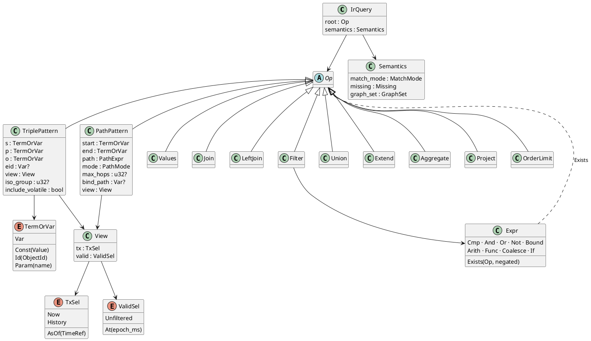
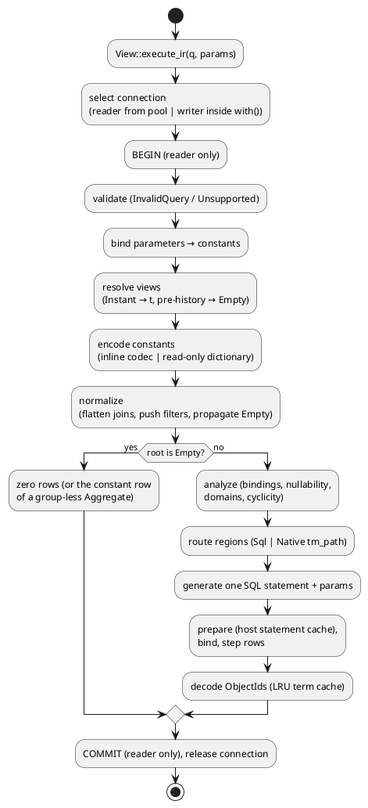
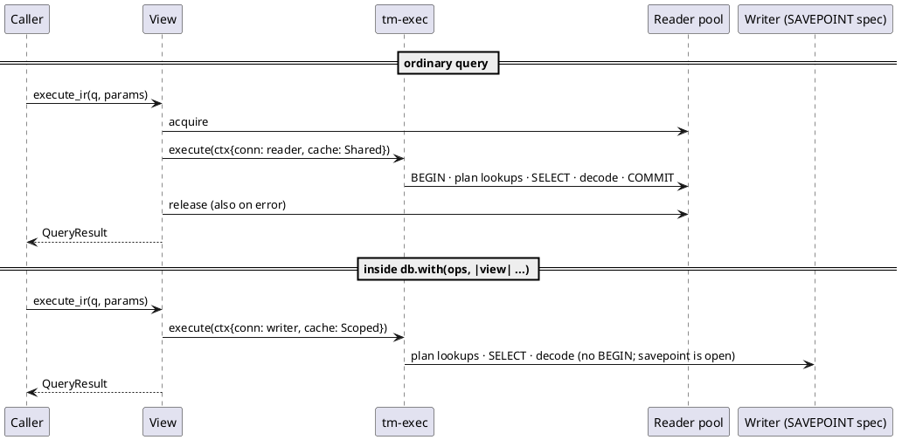

## Context

See `proposal.md` (Why) for motivation. This design depends on change `add-core-store` (M0) and assumes it is merged. M0 provides `tm-core` with the ObjectId codec (`lat.md/data-model#ObjectId`), the term dictionary, the exact DDL from `lat.md/storage#Schema` (partial `live_*` indexes, `hist_*` with `t_add DESC`, `valid_p`, `log_add`, `log_ret`), the `volatile` table, `TimeRef` resolution, the single writer plus reader pool (`lat.md/architecture#Connections and Concurrency`), `Db::with` on a SAVEPOINT (`lat.md/time-model#Speculative Transactions`), and the facade handles `Db` / `View` / `Tx` (`lat.md/api#Rust Surface`).

Constraints that shape this design, all fixed by lat.md:

- Time is resolved in one place only: the view-aware scan (`lat.md/architecture#Layers`, `lat.md/query#Views and Scans`).
- `t_ret IS NULL` must appear verbatim, or the partial indexes are not used (`lat.md/storage#Query Shapes`).
- Constants are encoded at plan time, and a constant missing from the dictionary empties its pattern (`lat.md/query#Logical IR`).
- Hybrid execution: SQL codegen, native paths exposed as the table-valued function `tm_path`, and LFTJ deferred (`lat.md/query#Physical Planning`, decision D12).
- SQL text never contains data (`lat.md/query#Physical Planning#SQL Codegen`).
- String and double order is not id order (`lat.md/data-model#ObjectId#Range Scans`).
- Queries run on a reader connection, except inside `with()`, where they run on the writer (`lat.md/query#Physical Planning`, the routing diagram).
- SQLite orders the joins, and it does so well only with statistics. Statistics are part of the schema, kept current by M0, not tuning (`lat.md/query#Physical Planning#Join Ordering`, decision D19).
- The core reaches SQLite only through `tm-core`'s synchronous `Executor` trait. `tm-exec` needs the host capabilities `functions` and `vtab`, and refuses to open without them (`lat.md/architecture#Executor`, decision D22).
- `DATETIME` keeps its timezone offset: the payload is `(epoch_ms << 11) | tz`, so value comparison uses the instant `id >> 15`, while joins and `sameTerm` use id equality (`lat.md/data-model#ObjectId#Canonical Encoding`, decision D20).

The SQLite shapes this design relies on were checked on SQLite 3.53.0 against the lat.md DDL:

- a Now pattern bound on subject and predicate uses `COVERING INDEX live_spo`;
- AsOf uses `hist_*`;
- object-bound uses `live_osp`;
- a LEFT JOIN with view predicates in `ON` keeps `live_spo`;
- the correlated canonical-eid subquery (D10) runs as `COVERING INDEX live_osp (o=? AND s=? AND p=? AND t_ret=?)`;
- the dictionary decode join is a rowid seek;
- `tm:txAdded = ?` uses `COVERING INDEX log_add`;
- `-16 >> 4 = -1`, so the shift is arithmetic;
- Now with valid-at and only the predicate bound picked `live_pos`, not `valid_p`, so tests accept either;
- with 1.1 million statements and a four-pattern BGP with bound parameters, the plan started from the 500 000-row pattern without statistics (272 ms) and from the 50-row pattern after `ANALYZE` (1 ms), and with statistics it picked the best order on every skewed shape tried, predicate-only patterns included;
- with statistics, a Now pattern whose predicate has no retracted rows may use a `hist_*` index (equal cost); on a churned predicate it uses `live_*`.

## Goals / Non-Goals

**Goals:**

- `tm-ir`: a front-end-neutral, serialisable-for-debugging IR that matches the class diagram in `lat.md/query#Logical IR`, plus the three semantic flags.
- `tm-exec`: a deterministic pipeline IR → regions → one SQL statement → typed rows. It has golden-testable SQL text and EXPLAIN QUERY PLAN checks.
- A stable native-operator interface that `add-path-engine` (M3) plugs into without changing the planner, and a routing hook for LFTJ (M4) that stays disabled.
- A facade entry point `View::execute_ir` / `View::explain_ir`, used by tests now and by the front ends later.

**Non-Goals:**

- Parsing SPARQL or Cypher, and lowering them (M2a, M2b). This includes MINUS, EXISTS surface syntax, CONSTRUCT templates and Cypher write clauses.
- The path algorithm, the NFA and path modes (M3). Only the operator contract and its SQL composition are built here.
- LFTJ (M4), plan caching beyond the host's prepared-statement cache, streaming results, and query timeouts.
- An engine-owned join-order optimiser. SQLite orders the joins from statistics (D16). An engine-forced order is a benchmark-gated fallback, not built in this change.
- Maintaining statistics. M0 (`add-core-store`) runs `PRAGMA optimize` and owns `Db::optimize()`; this change only relies on them.
- Any write through the IR. Execution is read-only.

## Decisions

### D1. Crate and module layout

`tm-ir` depends only on `tm-core` (for `ObjectId`, `Value`, `TimeRef`), as in `lat.md/architecture#Crates`.

```
crates/tm-ir/src/
  lib.rs          re-exports; IrQuery
  var.rs          Var (interned name), VarSet
  term.rs         TermOrVar, Const
  view.rs         View, TxSel, ValidSel, overlay()
  semantics.rs    Semantics, MatchMode, Missing, GraphSet, presets
  op.rs           Op and one struct per operator
  expr.rs         Expr, CmpOp, ArithOp, Func
  agg.rs          Agg, AggFunc, Key
  path.rs         PathExpr, PathMode (interface only; evaluated in M3)
  vocab.rs        IRIs of the virtual predicates (sys:subject … tm:retractKind)
  params.rs       Params = BTreeMap<String, Value>
  validate.rs     structural validation (InvalidQuery / Unsupported)
  builder.rs      ergonomic IrBuilder used by tests and front ends
  display.rs      canonical S-expression printer (snapshot tests) + property-path text printer (tm_path `path` argument)
```

`tm-exec` depends on `tm-ir`, `tm-core` (its synchronous `Executor` trait, the declared host capabilities, and the host registration hooks for scalar functions and virtual tables), `lru` and `regex`. It does not depend on `rusqlite`: the `rusqlite` features `functions` and `vtab`, `prepare_cached`, `Connection::from_handle` inside a virtual table and `rarray` stay inside the host crate `tm-rusqlite`, the first and only v1 host (`lat.md/architecture#Crates`, `lat.md/architecture#Executor`).

```
crates/tm-exec/src/
  lib.rs          QueryEngine, ExecContext, execute(), explain()
  host.rs         capability check (functions, vtab) and registration through tm-core's host hooks
  error.rs        ExecError → mapped to facade Error
  plan/
    bind.rs       parameter substitution
    resolve.rs    View → ResolvedView (TimeRef::Instant → t, pre-history → Empty)
    encode.rs     constant encoding (inline codec / read-only dictionary lookup)
    normalize.rs  flatten joins, filter push-down, Empty propagation
    analyze.rs    variable binding, nullability, domains (Term | Computed), cyclicity
    route.rs      region splitting and routing (Sql | Native)
  scan.rs         view_predicates(): the ONLY writer of time predicates
  virtual_pred.rs virtual predicate → column mapping, alias reuse
  sqlgen/
    mod.rs        Rel / Block model, deterministic alias and parameter allocation
    pattern.rs    TriplePattern, canonical-eid (set semantics), isomorphism
    ops.rs        Join / LeftJoin / Filter / Union / Extend / Aggregate / Project / OrderLimit / Values
    expr.rs       Expr → SQL (three-valued logic, value comparisons)
    order.rs      sort keys, NULLS FIRST/LAST
    native.rs     TVF FROM items (tm_path)
  udf.rs          pure deterministic SQL functions (tm_kind, tm_sortkey, tm_num, …, regexp), host-neutral definitions
  native.rs       NativeOperator trait, OperatorRegistry, LftjConfig
  exec.rs         run the statement through the tm-core Executor, one read transaction
  decode.rs       row → ResultValue, TermCache (LRU), scoped cache for speculation
  result.rs       QueryResult, ResultValue, ExecStats, Explain, RegionInfo
```

The facade `tiramemsu` adds `View::execute_ir`, `View::explain_ir` and `View::descriptor`, re-exports the IR and result types, adds `OpenOptions { term_cache_capacity, planner: PlannerOptions }`, and wires function and operator registration into every connection it opens.

**Host capabilities** (decision D22). `tm-core` needs only the required host set (prepared statements with bound parameters, interactive transactions, savepoints, a stable read snapshot). `tm-exec` additionally needs the declared capabilities `functions` (its UDFs: `tm_kind`, `tm_num`, `tm_str`, `tm_sortkey`, `tm_vkey`, `tm_min_by`/`tm_max_by`, `regexp`) and `vtab` (`tm_path` and `rarray`). `host.rs` checks them when the facade opens a database with the query engine. A host without either one fails `Db::open` with `MissingCapability { capability }` (`lat.md/api#Errors`). It never degrades silently, for example by comparing ids where a UDF was needed. With both present, the UDFs and the native operators are registered through the host's hooks on the writer and on every pooled reader. The first host, `tm-rusqlite`, declares both. `stat4` is declared too but only improves plans (D16), so its absence is not an error.

*Alternative considered:* one `tm-query` crate. It was rejected because front ends must compile against the IR without pulling in `rusqlite` codegen (`lat.md/architecture#Crates`).

*Alternative considered:* `tm-exec` depending on `rusqlite` directly and registering on `&rusqlite::Connection`. It was rejected because it would tie the query engine to one host, while the boundary costs little before code exists (`lat.md/architecture#Executor`).

### D2. IR types

The types follow `lat.md/query#Logical IR` one to one. Fields that the lat.md diagram does not show are marked *(chosen during spec writing)*.

```rust
pub struct IrQuery { pub root: Op, pub semantics: Semantics }

pub enum Op {
    Triple(TriplePattern), Path(PathPattern), Values(Values),
    Join(Join), LeftJoin(LeftJoin), Filter(Filter), Union(Union),
    Extend(Extend), Aggregate(Aggregate), Project(Project), OrderLimit(OrderLimit),
}

pub enum TermOrVar { Var(Var), Const(Value), Id(ObjectId), Param(String) }

pub struct TriplePattern {
    pub s: TermOrVar, pub p: TermOrVar, pub o: TermOrVar,
    pub eid: Option<Var>,
    pub view: View,
    pub iso_group: Option<u32>,       // chosen: relationship pattern of MATCH group n
    pub include_volatile: bool,       // chosen: opt-in volatile virtual properties
}
pub struct PathPattern {
    pub start: TermOrVar, pub end: TermOrVar,
    pub path: PathExpr, pub mode: PathMode,
    pub max_hops: Option<u32>,        // chosen: explicit, passed to tm_path
    pub bind_path: Option<Var>, pub view: View,
}
pub struct Values { pub vars: Vec<Var>, pub rows: Vec<Vec<Option<TermOrVar>>> } // None = UNDEF
pub struct Join { pub inputs: Vec<Op> }                         // [] = unit relation
pub struct LeftJoin { pub left: Box<Op>, pub right: Box<Op>, pub cond: Option<Expr> }
pub struct Filter { pub input: Box<Op>, pub cond: Expr }
pub struct Union { pub inputs: Vec<Op> }
pub struct Extend { pub input: Box<Op>, pub var: Var, pub expr: Expr }
pub struct Aggregate { pub input: Box<Op>, pub group: Vec<Var>, pub aggs: Vec<Agg> }
pub struct Project { pub input: Box<Op>, pub vars: Vec<Var>, pub distinct: bool }
pub struct OrderLimit { pub input: Box<Op>, pub keys: Vec<Key>,
                        pub skip: Option<TermOrVar>, pub limit: Option<TermOrVar> } // u64 or $param

pub struct View { pub tx: TxSel, pub valid: ValidSel }
pub enum TxSel { Now, AsOf(TimeRef), History }                  // TimeRef::Tx(t) | Instant(ms)
pub enum ValidSel { Unfiltered, At(i64) }

pub struct Semantics { pub match_mode: MatchMode, pub missing: Missing, pub graph_set: GraphSet }
pub enum MatchMode { Homomorphism, RelIsomorphism }
pub enum Missing { Unbound, Null3VL }
pub enum GraphSet { SetOfTriples, BagOfEids }

pub enum Expr {
    Var(Var), Const(Value), Param(String),
    Cmp(CmpOp, Box<Expr>, Box<Expr>),              // = != < <= > >=
    SameTerm(Box<Expr>, Box<Expr>),
    And(Vec<Expr>), Or(Vec<Expr>), Not(Box<Expr>),
    Bound(Var),                                    // SPARQL BOUND / Cypher IS NOT NULL
    In(Box<Expr>, Vec<Expr>, bool /*negated*/),
    Arith(ArithOp, Box<Expr>, Box<Expr>), Neg(Box<Expr>),
    Coalesce(Vec<Expr>), If(Box<Expr>, Box<Expr>, Box<Expr>),
    Func(Func, Vec<Expr>),                         // STR, LANG, DATATYPE, IS_IRI, IS_LITERAL, IS_NUMERIC,
                                                   // STRLEN, UCASE, LCASE, CONTAINS, STRSTARTS, STRENDS, REGEX
    Exists(Box<Op>, bool /*negated*/),             // chosen: semi/anti-join for EXISTS and label checks
}
pub struct Agg { pub var: Var, pub func: AggFunc, pub arg: Option<Expr>, pub distinct: bool }
pub enum AggFunc { Count, Sum, Avg, Min, Max, Sample, GroupConcat { sep: String }, Collect }
pub struct Key { pub expr: Expr, pub descending: bool }
pub enum PathExpr { Pred(Value), Inverse(Box<PathExpr>), Seq(Vec<PathExpr>), Alt(Vec<PathExpr>),
                    ZeroOrMore(Box<PathExpr>), OneOrMore(Box<PathExpr>), ZeroOrOne(Box<PathExpr>),
                    Repeat { inner: Box<PathExpr>, min: u32, max: Option<u32> } }
pub enum PathMode { Reachability, Trail, AnyShortest, AllShortest }
```



Choices made here:

- **`Semantics` is per query, not per operator** *(chosen during spec writing)*. `lat.md/query#Semantic Differences` scopes the flags per dialect, and a query has one dialect. Cypher needs existence checks, such as a label on an already-matched node, to not multiply rows under `BagOfEids`, so it lowers them to `Expr::Exists` instead of per-pattern flags.
- **`TxSel::AsOf(TimeRef)`** *(chosen during spec writing)*. lat.md shows `AsOf(t)`. Front ends compile against the IR only and cannot read the `tx` table, so a SPARQL `FROM <tm:asOf/2026-…Z>` carries `TimeRef::Instant`. `plan/resolve.rs` resolves it inside the query's read snapshot, using M0's resolution (largest `t` with `instant ≤ ms`, empty before tx 1: `lat.md/time-model#Transaction Time`).
- **Pattern views are always explicit, with no `Inherit`** *(chosen during spec writing)*. `View::descriptor()` returns the handle's view, and front ends lower with it as the default. `tm_ir::View::overlay(tx: Option<TxSel>, valid: Option<ValidSel>)` merges a query-level clause part by part (`lat.md/query#Temporal Syntax`). `execute_ir` never rewrites pattern views, so the IR is self-describing and golden tests do not depend on the handle.
- **`Expr::Exists(Op, negated)`** compiles to a correlated `EXISTS (subquery)` / `NOT EXISTS (subquery)`. The subquery sees the outer row's variables, and correlation equalities are generated on the variables it shares with the outer row. The finished `add-sparql-frontend` change relies on this: SPARQL `FILTER EXISTS` / `FILTER NOT EXISTS` lower to it as a semi-join / anti-join, and `MINUS` lowers to a negated Exists over the shared variables. The same construct serves Cypher existence checks such as labels and pattern predicates.

### D3. Planning pipeline



The planner reads only through the executing connection, so the resolution in `resolve.rs`, the lookups in `encode.rs`, execution and decoding all share one snapshot. That is the "one snapshot per query" requirement.

### D4. Constant encoding and short-circuit

`encode.rs` turns every `TermOrVar::Const`, `Expr::Const`, bound `Param` and `Values` cell into one of three states:

- `Enc::Id(ObjectId)`: inline via the codec (`lat.md/data-model#ObjectId#Canonical Encoding`), or found in the dictionary with the same `SELECT id FROM term WHERE tag=? AND lex=? AND dt IS ? AND lang IS ?` that M0 uses. It never inserts.
- `Enc::Missing(Value)`: not in the dictionary. The value is kept for value comparisons (D9) and for output.
- `Enc::Impossible`: the kind cannot occur in this position (a literal as predicate or subject, a non-STMT subject of a virtual predicate, a wrong-kind object of a virtual predicate).

A TriplePattern with any `Missing` or `Impossible` position, or with a view that resolved to pre-history, becomes `Op::Empty`. Empty propagates as the query-ir spec states:

| Operator | Result |
|---|---|
| Join | Empty if any input is Empty |
| Filter, Extend, Project, OrderLimit | Empty if the input is Empty |
| Union | drop Empty branches; Empty if none remain |
| LeftJoin | right Empty gives the left side, with right-only variables marked always-missing; left Empty gives Empty |
| Aggregate | grouped: Empty. Group-less: a constant one-row `Values` (count 0, collect `[]`, others missing), computed in Rust with no SQL |
| `Exists(Empty)` | constant false, or true when negated |

A `Missing` constant inside a `Values` row or an `Extend` is **not** an emptiness signal. The value is real, it is simply not stored. It gets the Computed domain (D9): it is returned as-is, and it never equals a stored term by identity.

Filter push-down (`normalize.rs`) substitutes `?v = c` into a pattern position only when `c` is id-exact: an IRI, node, statement, tx, boolean, string, language string or date. Numeric constants are not substituted, because SPARQL/Cypher `1 = 1.0` is true while the ids differ. A datetime constant is not id-exact either, since `12:00+02:00 = 10:00Z` is true while the ids differ (D20). It is pushed down as an instant range instead, `tN.x BETWEEN ?lo AND ?hi AND (tN.x & 15) = 7` with `lo = (ms << 15) | 7` and `hi = (ms << 15) | 0x7FF7`, which covers every offset of that instant and keeps the index seek (`lat.md/data-model#ObjectId#Range Scans`). `sameTerm(?v, c)` is id-exact for every kind and is substituted as `tN.x = ?`. `?r = e` on an eid variable becomes `tN.eid = ?` (an integer primary-key lookup).

### D5. The view → predicate function

`scan.rs` holds the only code that writes time predicates (`lat.md/query#Views and Scans`). Every other module, including the canonical-eid subquery, virtual predicates and `tm_path` view text, calls it.

```rust
pub fn view_predicates(alias: &str, v: &ResolvedView, p: &mut ParamAlloc) -> Vec<SqlCond> {
    let mut out = Vec::new();
    match v.tx {
        ResolvedTx::Now      => out.push(format!("{alias}.t_ret IS NULL")),        // verbatim
        ResolvedTx::AsOf(t)  => { let n = p.bind_int(t);                           // one ?N, used twice
            out.push(format!("{alias}.t_add <= ?{n} AND ({alias}.t_ret IS NULL OR {alias}.t_ret > ?{n})")) }
        ResolvedTx::History  => {}
    }
    if let ValidSel::At(d) = v.valid { let n = p.bind_int(d);
        out.push(format!("({alias}.v_from IS NULL OR {alias}.v_from <= ?{n}) AND ({alias}.v_to IS NULL OR {alias}.v_to > ?{n})")) }
    out
}
```

Placement: predicates of inner-joined aliases go to `WHERE`, and predicates of a LeftJoin's right-side aliases go to that join's `ON`. That keeps the partial index usable (verified) and gives correct optional semantics.

### D6. Virtual predicates

`virtual_pred.rs` maps a constant predicate IRI to `(column, output tag)`, as in `lat.md/query#Views and Scans#Virtual Predicates`:

| IRI | Column | Term-domain expression | Constant object compare |
|---|---|---|---|
| `sys:subject` / `sys:object` | `s` / `o` | `a.s` / `a.o` | `a.s = ?` |
| `sys:predicate` | `p` | `a.p` | `a.p = ?` |
| `tm:txAdded` / `tm:txRetracted` | `t_add` / `t_ret` | `(a.t_add << 4) \| 4` | `a.t_add = ?payload` (uses `log_add`) |
| `tm:validFrom` / `tm:validTo` | `v_from` / `v_to` | `(a.v_from << 15) \| (841 << 4) \| 7` (a `DATETIME` with offset `Z`) | `a.v_from = ?instant` (the constant's `id >> 15`, any offset) |
| `tm:retractKind` | `ret_kind` | `(a.ret_kind << 4) \| 5` | `a.ret_kind = ?payload` |

- A nullable column adds `a.<col> IS NOT NULL`, so an absent value produces no triple.
- `v_from` / `v_to` hold UTC epoch milliseconds, so the virtual object is a `DATETIME` whose payload is `(ms << 11) | 841`, the timezone code of `Z` *(chosen during spec writing)* (`lat.md/data-model#ObjectId#Canonical Encoding`). A constant object compares by instant, so `tm:validFrom "2026-03-01T02:00:00+02:00"^^xsd:dateTime` matches `v_from` = 2026-03-01T00:00Z.
- `tm:retractKind` is exposed as an `INT` 0–3 *(chosen during spec writing)*, so the dictionary needs no seeded IRIs. `hist_*` does not contain `ret_kind`, so this one scan pays a rowid lookup, which is acceptable for history queries.
- **Alias reuse:** if the subject is the eid variable of a TriplePattern with an identical `ResolvedView`, the expression is built on that pattern's alias, with no new FROM item. Otherwise a new alias `triple AS tN` is added with `tN.eid = <subject expr>` plus its own view predicates. An unbound subject scans the view.
- Virtual-predicate patterns bypass set semantics, since there is one virtual triple per eid, and they cannot bind `eid` (validation error).
- `sys:` / `tm:` IRIs that are not in the table are ordinary IRIs. Variable predicates never match virtual triples *(chosen during spec writing)*: otherwise every `?s ?p ?o` would multiply by eight.

**Volatile keys** *(inclusion conditions chosen during spec writing)*: when `include_volatile` is set, the view is `{Now, Unfiltered}`, `p` is a constant and there is no `eid` variable, the pattern compiles to a derived table:

```sql
(SELECT t.s AS s, t.o AS o FROM triple AS t WHERE t.p = ?1 AND t.t_ret IS NULL
 UNION ALL
 SELECT v.s, v.value FROM volatile AS v WHERE v.key = ?1
   AND NOT EXISTS (SELECT 1 FROM triple AS x WHERE x.s = v.s AND x.p = v.key AND x.t_ret IS NULL)) AS vN
```

Under any other view the flag is ignored and the volatile branch is omitted: "absent rather than wrong" (`lat.md/storage#Volatile Table`). `At(d)` is excluded too, because volatile values have no valid time.

### D7. Region splitting and routing

```rust
fn route(op: &Op, cfg: &PlannerOptions, reg: &OperatorRegistry) -> Result<Region> {
    match op {
        Op::Path(pp) => {
            let orient = orient_path(pp)?;          // start bound? else end bound → Inverse(path), swap; neither → Unsupported
            let op = reg.path().ok_or(Unsupported("path patterns: no path operator registered"))?;
            Ok(Region::Native(NativeRegion::Path { op, orient }))
        }
        Op::Join(j) if is_bgp(j) && is_cyclic(j) => {
            if cfg.lftj.enabled && reg.lftj().is_some() && meets_threshold(j, &cfg.lftj) {
                unreachable_in_m1!()                // M4: Region::Native(NativeRegion::Lftj)
            }
            Ok(Region::Sql { note: RouteNote::CyclicLftjDisabled })
        }
        _ => Ok(Region::Sql { note: RouteNote::None }),
    }
}
```

- `is_cyclic` treats the BGP's join graph (variables as vertices, patterns as hyperedges) with GYO reduction; it is used for routing and for `Explain`.
- Because native regions are exposed as table-valued functions, "compose regions" means that a native region becomes a FROM item of the enclosing SQL block. The output is always **one** SQL statement.
- `PlannerOptions { lftj: LftjConfig { enabled: false, min_rows_estimate: u64 } }` exists so that M4 only has to add an implementation. In M1, `enabled = true` is accepted but has no operator, so routing still goes to SQL with `RouteNote::LftjUnavailable`.

**Native operator contract** (for `add-path-engine` to implement):

```rust
pub trait NativeOperator: Send + Sync {
    fn kind(&self) -> NativeKind;                       // Path | Lftj
    fn tvf_name(&self) -> &'static str;                 // "tm_path"
    fn register(&self, host: &mut dyn tm_core::HostRegistry) -> tm_core::Result<()>; // eponymous vtab, via the host's `vtab` hook
}
```

`HostRegistry` stands for `tm-core`'s registration hooks; M0 fixes the exact name. The host-specific virtual-table glue (for `rusqlite`, `Connection::from_handle` inside the vtab and `rarray` for frontier chunks) lives in `tm-rusqlite`.

`tm_path(start INTEGER, path TEXT, mode TEXT, max_hops INTEGER, view TEXT)` returns the columns `start, "end", hops, path_json`.

The argument formats are owned by the `add-path-engine` change (capability `path-table-function`). This planner only prints them:

- `path` is `PathExpr` printed in the path text grammar: SPARQL 1.1 property-path syntax plus `{m,n}` / `{m,}` / `{n}`. Atoms are full IRIs or CURIEs, and `sys:anyRelationship` is the Cypher `[*]` wildcard. It is printed by `display.rs` and bound as a parameter.
- `mode` is one of `REACH | TRAIL | ANY_SHORTEST | ALL_SHORTEST`, compared case-insensitively.
- `max_hops`: NULL means unbounded for `REACH` and the shortest modes; `TRAIL` then uses `OpenOptions.path_max_hops`. Front ends that must apply the 15-hop Cypher cap, including to `shortestPath`, pass it explicitly (`lat.md/query#Physical Planning#Path Engine`).
- `view` is `now | asOf/<t> | asOf/<RFC3339> | history`, optionally followed by `;validAt/<d>`, or `validAt/<d>` alone. It is produced by `scan.rs` from the resolved view. *(Aligned with `add-path-engine` during review.)*
- The start argument is a parameter or a correlated column of an earlier FROM item. SQLite allows table-valued-function arguments to reference left-hand tables.
- A bound end adds `pN."end" = <expr>`, and `bind_path` maps to `pN.path_json`.

The registry is populated at `Db::open` from `OpenOptions` (a hidden `with_native_operator` for tests and for M3), and `register` runs through the host hooks on the writer and on every pooled reader, after the capability check in D1.

### D8. SQL generation per operator

`sqlgen` compiles each `Op` into a `Rel { from: Vec<FromItem>, conds: Vec<Cond>, cols: IndexMap<Var, ColExpr>, maybe_missing: VarSet, shape: Flat | Derived }`. Aliases are allocated in pre-order: `t0…` for triple, `d0…` for term decode joins, `p0…` for TVFs, `q0…` for derived tables and `x0…` for correlated subqueries. Parameters are numbered `?1…` in order of first use, and a repeated value, such as the same `t`, reuses its number within one view call. Output columns are aliased `c0…cn` in result order, so user variable names never reach the SQL text.

| Operator | SQL |
|---|---|
| TriplePattern | `triple AS tN`; a constant gives `tN.x = ?k`; a repeated variable gives `tN.s = tN.o`; `view_predicates`; plus D10 and D11 |
| Join | merge flat Rels: `FROM a, b` with conditions in `WHERE`, and shared variables as `=` (D12 for maybe-missing); `Join[]` is `(SELECT 1) AS qN` |
| LeftJoin | `left LEFT JOIN right ON <shared-var eqs> AND <right view preds> AND <cond>`; the right side is a bare alias when it is a single pattern, otherwise `(SELECT …) AS qN` |
| Filter | conjuncts pushed to the lowest Rel that binds their variables, never into a LeftJoin's right side from above; the rest go to `WHERE` (or `HAVING` directly above an Aggregate) |
| Union | `SELECT … UNION ALL SELECT …` with aligned `c*` columns; variables absent from a branch become `NULL`; derived when composed |
| Extend | an extra select expression; the domain is Term when the expression is a variable, id-encodable constant or Coalesce/If of those, otherwise Computed |
| Aggregate | `SELECT g…, agg… FROM (<input>) GROUP BY g…` (D13) |
| Project | a select list in the declared order; `distinct` gives `SELECT DISTINCT` |
| OrderLimit | `ORDER BY <sort keys> [NULLS FIRST\|LAST], <tie-break cols>` plus `LIMIT ?` / `OFFSET ?`; skip without limit is `LIMIT -1 OFFSET ?` |
| Values | `(SELECT column1 AS c0, … FROM (VALUES (?1, ?2), (?3, NULL))) AS qN`; zero variables and one row is the unit |
| PathPattern | `tm_path(?, ?, ?, ?, ?) AS pN` FROM item (D7) |
| `Exists(op, neg)` | `[NOT] EXISTS (SELECT 1 FROM … WHERE <correlation on shared vars>)` |

Ordering is guaranteed only for an OrderLimit at the root, or under a root Project/Extend. The planner hoists its `ORDER BY` to the outermost SELECT. A nested OrderLimit with a limit keeps its `ORDER BY … LIMIT` inside its derived table, only to choose rows. Tie-breakers are the remaining output columns' raw values, which makes the order deterministic.

Golden example: a layer join under mixed views, SPARQL preset, eid bound on the first pattern.

```sql
SELECT t0.s AS c0, t0.o AS c1, t0.eid AS c2, t1.o AS c3
FROM triple AS t0, triple AS t1
WHERE t0.p = ?1 AND t0.t_ret IS NULL
  AND t1.s = t0.eid AND t1.p = ?2
  AND t1.t_add <= ?3 AND (t1.t_ret IS NULL OR t1.t_ret > ?3)
  AND t1.eid = (SELECT min(x0.eid) FROM triple AS x0
                WHERE x0.s = t1.s AND x0.p = t1.p AND x0.o = t1.o
                  AND x0.t_add <= ?3 AND (x0.t_ret IS NULL OR x0.t_ret > ?3))
```

### D9. Values, comparisons and SQL helper functions

Each variable has a static **domain**:

- **Term:** the SQL column holds an ObjectId.
- **Computed:** a native SQLite INTEGER, REAL or TEXT, with a static `ValueClass` (Int, Double, Str, Bool, Dynamic). Computed values come from arithmetic, string functions, aggregates, and constants that are missing from the dictionary.

Value semantics use pure, deterministic, `SQLITE_INNOCUOUS` scalar functions that `udf.rs` registers on every connection *(chosen during spec writing)*. They take an ObjectId plus the columns of an optional decode join `LEFT JOIN term AS dN ON dN.id = (x >> 4) AND (x & 15) IN (0,10,11,12,13,14)`. That join is added only for variables that are used by value.

| Function | Purpose |
|---|---|
| `tm_kind(id)` | comparison class: node, IRI, stmt, tx, numeric, bool, datetime, date, string, lang-string, typed |
| `tm_num(id, num)` | numeric value: INTEGER for `INT`, REAL from `num` for `DOUBLE` / `DECIMAL`, else NULL |
| `tm_str(id, lex)` | string value for `SHORT_STR` (decoded inline) and `STR` / `LANG_STR` (from `lex`), else NULL |
| `tm_sortkey(id, lex, num, lang)` | memcmp-ordered BLOB: `[class rank][order-preserving payload]` (D11) |
| `tm_vkey(native, class)` | the same key for Computed values and missing constants |
| `tm_min_by(id, key)` / `tm_max_by(id, key)` | aggregates returning the id with the smallest or largest key |
| `regexp(pattern, text)` | REGEX via the `regex` crate |

Comparison codegen, with three-valued logic mapped onto SQL NULL:

- `DATETIME` values compare by instant (decision D20). The payload is `(epoch_ms << 11) | tz`, so the instant is `id >> 15`, an arithmetic shift that needs no UDF and no dictionary, and a date-time without a timezone orders as UTC. Term identity stays id equality: shared-variable joins, `sameTerm`, `DISTINCT` and the canonical-eid predicate (D10) all compare ids, so `12:00+02:00` and `10:00Z` are equal under `=` and distinct as terms (`lat.md/data-model#ObjectId#Canonical Encoding`).
- `a = b` where both are Term: if either side is statically non-numeric and not datetime, `a = b` (canonical ids). If either side is statically a datetime, `(a & 15) = 7 AND (b & 15) = 7 AND (a >> 15) = (b >> 15)`, with a constant side bound as its instant. Otherwise `CASE WHEN tm_kind(a)=NUM AND tm_kind(b)=NUM THEN tm_num(a,da.num) = tm_num(b,db.num) WHEN (a & 15) = 7 AND (b & 15) = 7 THEN (a >> 15) = (b >> 15) ELSE a = b END`. Different kinds give false, not NULL.
- `<`, `<=`, `>`, `>=`: `CASE WHEN tm_kind(a) = tm_kind(b) THEN key(a) < key(b) END`, so incompatible kinds give NULL (unknown). When both sides are statically datetimes, the key is the instant `a >> 15` directly. A range filter on a pattern's datetime object against a constant is also pushed down as a seek from `(ms << 15) | 7` with `(tN.o & 15) = 7` (`lat.md/data-model#ObjectId#Range Scans`).
- A constant is bound as its precomputed key BLOB. This works for `Enc::Missing` constants, which is how "range over long strings" works without a dictionary entry.
- `Bound(v)` is `v IS NOT NULL`. `And`/`Or`/`Not` are SQL's, whose NULL truth tables match the SPARQL error rules and Cypher's three-valued logic.
- A Term-versus-Computed comparison or join uses the value rule (`tm_num` / `tm_str` / class) and never id equality.

### D10. Set versus bag semantics: the canonical-eid predicate

Under `SetOfTriples`, a TriplePattern with `eid = None` that is not virtual and not volatile gets `tN.eid = (SELECT min(xN.eid) FROM triple AS xN WHERE xN.s = tN.s AND xN.p = tN.p AND xN.o = tN.o AND <view_predicates(xN)>)`. Each visible distinct `(s, p, o)` then matches exactly once, and a BGP of such patterns yields a set, as SPARQL requires (`lat.md/query#Front Ends#SPARQL`).

- *Elision:* the predicate is dropped when the root is `Project{distinct}` over only Join, Filter and TriplePattern operators, because the outer DISTINCT already removes the duplicates.
- *Alternative A:* `SELECT DISTINCT` per BGP as a derived table. It was rejected because it materialises and loses index seeks inside `LEFT JOIN`s and correlated positions.
- *Alternative B:* GROUP BY `s, p, o`. It was rejected for the same reason.
- The chosen form keeps plans flat and costs one covering-index seek per candidate row (verified `COVERING INDEX live_osp (o=? AND s=? AND p=? AND t_ret=?)`).

### D11. Relationship isomorphism, missing values and ordering

- **Isomorphism:** under `RelIsomorphism`, every pair `(i < j)` of patterns with the same `iso_group` adds `ti.eid <> tj.eid` (`lat.md/query#Physical Planning#SQL Codegen`). The pair is skipped when both predicates are different constants, which is provably true. Path-internal relationship uniqueness against fixed relationships belongs to M3 (Open Questions).
- **Missing values:** `analyze.rs` computes `maybe_missing` per Rel (the right side of a LeftJoin, a Union branch lacking the variable, an UNDEF in Values, a Computed expression). For a shared variable `v` that is maybe-missing on either side:
  - `Unbound` joins on `(a.v IS NULL OR b.v IS NULL OR a.v = b.v)` and outputs `COALESCE(a.v, b.v)`, which is SPARQL compatibility;
  - `Null3VL` joins on `a.v = b.v` and outputs `a.v`.
- **Ordering:** each key is `tm_sortkey(...)`, or `tm_vkey` for Computed values, with `NULLS FIRST` under `Unbound` and `NULLS LAST` under `Null3VL` for ascending order, reversed for descending.
  - Class ranks follow the spec's fixed cross-kind order *(chosen during spec writing)*.
  - The numeric payload is an order-preserving f64 followed by an order-preserving i64 tie-break, which keeps 60-bit integers exact.
  - The string payload is its UTF-8 bytes, which is code-point order, then `0x00` and the language tag.
  - Dates are order-preserving i64 of the payload. Datetimes are the order-preserving i64 of the instant `id >> 15`, so the offset does not affect value order; two date-times at the same instant with different offsets tie on the key and fall to the raw-id tie-breakers.

### D12. Aggregates

| AggFunc | SQL | Domain |
|---|---|---|
| Count (`*` / expr / distinct) | `count(*)`, `count(x)`, `count(DISTINCT x)` | Computed Int |
| Sum | `sum(tm_num(x, dx.num))`: INTEGER when every input is `INT`, else REAL | Computed Dynamic |
| Avg | `avg(tm_num(x, dx.num))` | Computed Double *(chosen; M2a may re-type to xsd:decimal)* |
| Min / Max | `tm_min_by(x, key)` / `tm_max_by(x, key)` | Term |
| Sample | `min(x)` (an arbitrary representative) | Term |
| GroupConcat | `group_concat(tm_str(x, dx.lex), ?sep)` | Computed Str |
| Collect | `json_group_array(x) FILTER (WHERE x IS NOT NULL)` | List of Term |

### D13. Result decoding and the term cache

```rust
pub struct QueryResult { pub columns: Vec<Var>, pub rows: Vec<Vec<Option<ResultValue>>>, pub stats: ExecStats }
#[non_exhaustive] pub enum ResultValue { Term(Value), List(Vec<Option<ResultValue>>) } // M3 adds Path
pub struct ExecStats { pub sql_executed: bool, pub cache_hits: u64, pub dictionary_reads: u64 }
```

- Term cells are decoded by tag. Inline tags are decoded directly by the M0 codec. Dictionary tags (IRI, STR, LANG_STR, TYPED, DOUBLE, DECIMAL) go through `TermCache::get(id)`. On a miss, `SELECT tag, lex, dt, lang, num FROM term WHERE id = ?` runs on the **same** connection (same snapshot), and TYPED/DOUBLE/DECIMAL `dt` is decoded recursively.
- Computed cells: INTEGER becomes an `xsd:integer` literal (or a boolean when the class is Bool), REAL becomes `xsd:double`, and TEXT becomes a plain string. Lists are parsed from JSON.
- `TermCache` is `Mutex<lru::LruCache<ObjectId, Arc<Term>>>` in `DbInner`, shared by all readers, with capacity `OpenOptions::term_cache_capacity` (default 16 384 *(chosen during spec writing)*).
- Terms are immutable and never deleted (`lat.md/storage#Invariant Triggers`), so entries never go stale.
- Inside `with()`, decoding uses a `ScopedCache` (a HashMap consulted first, then the shared cache read-only) that is dropped with the closure, so terms created only by speculation never reach the shared cache.
- There is no term→id encode cache in M1 *(chosen during spec writing)*. The unique `term_key` seek is cheap, and an encode cache would need speculation-aware invalidation.

### D14. Connection selection



The facade `View` gains an internal `ConnSource::{Pool, Speculative(&WriterGuard)}`. `Db::now()`, `as_of()` and `history()` build `Pool` views. The `&View` that `Db::with` hands to its closure is `Speculative`, and because it is borrowed it cannot outlive the savepoint. `tm-exec` receives only a `tm-core` `Executor` handle for that connection plus a cache mode. It never writes, and it runs `PRAGMA query_only`-safe statements only.

### D15. Facade API and errors

```rust
impl View {
    pub fn descriptor(&self) -> tm_ir::View;
    pub fn execute_ir(&self, q: &IrQuery, params: &Params) -> Result<QueryResult>;
    pub fn explain_ir(&self, q: &IrQuery, params: &Params) -> Result<Explain>;
}
pub struct Explain { pub regions: Vec<RegionInfo>, pub short_circuit: bool,
                     pub sql: Option<String>, pub params: Vec<SqlParam>, pub query_plan: Vec<String> }
pub struct RegionInfo { pub kind: RegionKind, pub note: RouteNote, pub aliases: Vec<String>,
                        pub query_plan: Vec<String> }   // this region's EXPLAIN QUERY PLAN rows (SQL regions)
```

- `explain_ir` runs the pipeline up to codegen, then `EXPLAIN QUERY PLAN` with the real parameter values bound, and never steps the query. `Explain.query_plan` is the whole plan, and each SQL region's `RegionInfo.query_plan` holds the plan rows that scan its own aliases, in plan order, so a test can check each region's join order and index family on its own (D16).
- `ExecError` maps onto the facade `Error`:
  - `InvalidQuery { msg }` is new *(chosen during spec writing)*, added next to `Parse` / `Unsupported` in `lat.md/api#Errors`;
  - `Unsupported { feature }`;
  - the existing storage error, which wraps the host's SQLite error (`rusqlite::Error` on `tm-rusqlite`);
  - `MissingCapability { capability }` from D1, raised by `Db::open` on a host that lacks `functions` or `vtab`.

### D16. Join ordering relies on mandatory statistics

Codegen emits one `triple` alias per pattern in IR order and leaves the join order to SQLite (decision D19, `lat.md/query#Physical Planning#Join Ordering`). Every constant is a bound parameter, so SQLite cannot see which predicate is rare, and it orders joins well only with statistics. The engine therefore treats statistics as part of the schema, not as tuning.

- **Measured** on SQLite 3.53 (the bundled SQLite of `rusqlite` enables `STAT4`) with 1.1 million statements: a four-pattern BGP with bound parameters took 272 ms without statistics, because the planner started from the 500 000-row `knows` pattern, and 1 ms after `ANALYZE`, starting from the 50-row pattern. With statistics SQLite chose the best order on every skewed shape tried, predicate-only patterns included.
- **Statistics are M0's job.** `Db::open` runs `PRAGMA optimize=0x10002`, the writer runs `PRAGMA optimize` after bulk loads and at most once every `OpenOptions.optimize_every` commits (default 1000), and `Db::optimize()` runs a full `ANALYZE`. The planner never calls them itself. Stale statistics change a plan's speed, never its results.
- **Plan quality does not depend on the textual order of the patterns.** Codegen does not reorder aliases for performance, and golden SQL stays in IR order, so the SQL text is deterministic.
- **Index family:** with statistics, SQLite may use a `hist_*` index for a Now pattern whose predicate has no retracted rows, because the cost is equal and the result is the same (the view predicate still filters). Once the predicate has churn, the statistics steer the pattern to `live_*`. Plan tests assert the family only on a churned fixture.
- **Explain per region:** `explain()` returns SQLite's `EXPLAIN QUERY PLAN` for every SQL region (D15).
- **Golden plan tests** run a skewed fixture through the ordinary API with bound parameters and no explicit `optimize()` call: one class holding 90 % of the nodes, a 50-row predicate and churned properties. Every golden BGP must start from its most selective pattern, whatever the IR order (`lat.md/tests#Query#Skewed Joins Start Selective`).
- **Fallback, benchmark-gated:** an engine-forced order, where patterns are sorted by the engine's own per-predicate counts and fixed with `CROSS JOIN`, as oxilite does (`lat.md/prior-art#oxilite`). It is built only if a benchmark shape runs more than 10× slower under SQLite's order with fresh statistics than under the best forced order (`lat.md/roadmap#Benchmarks`). `PlannerOptions` keeps room for it; this change does not implement it.

*Alternative considered:* an engine-owned cost model or a forced order from the start. It was rejected because SQLite with `STAT4` already picks the best order on every measured shape, and a forced order would override SQLite's index choice too and need its own statistics kept in step with every commit.

*Alternative considered:* statistics as an optional `Db::optimize()` that the user calls. It was rejected because a user who never calls it gets 272 ms instead of 1 ms on an ordinary four-pattern query.

## Risks / Trade-offs

- [Statistics can be missing or stale, for example right after a large import, or on a host without `STAT4`] → M0 analyses never-analysed tables at open, after bulk loads and every `optimize_every` commits, and stale statistics only cost speed (D16). The skewed-fixture golden plan tests check that statistics appear without an explicit `optimize()`, the benchmarks (`lat.md/roadmap#Benchmarks`) track 2-hop latency, and the engine-forced order is the benchmark-gated fallback.
- [With statistics, SQLite may pick a `hist_*` index for a Now pattern on a churn-free predicate] → The cost and result are the same; plan tests assert `live_*` only on churned predicates (D16).
- [The canonical-eid subquery adds one covering seek per candidate row under `SetOfTriples`] → Elide it under an outer DISTINCT (D10). It is only a correlated covering-index seek, and the benchmark compares it against the Bag baseline, with DISTINCT-per-BGP as a fallback switch if it regresses by more than 30 %.
- [Unbound join compatibility produces `OR … IS NULL` conditions that defeat index seeks] → Emit it only for variables that are actually maybe-missing (`analyze.rs`); certainly-bound variables keep plain `=`.
- [UDF-based value comparisons (`tm_sortkey`, `tm_num`) cannot use indexes] → Push id-exact equalities into patterns (D4). Numeric and string range filters still scan the pattern's candidates, and `term_num` range pushdown for doubles is noted as follow-up work.
- [Correlated `tm_path` arguments constrain SQLite's join order] → That is intended: the start must be bound first, and the planner places the TVF after its binding FROM item.
- [Term-cache mutex contention across many readers] → Lock hold time is a hash lookup. Sharding is possible later behind the same API.
- [Speculative queries on the writer block other writers for their duration] → This is inherent to `with` (`lat.md/time-model#Speculative Transactions`) and documented. `with` is meant for short speculation.
- [The inverse-path rewrite for end-bound paths could return `path_json` in reverse orientation] → M3 owns the orientation contract. M1 marks it in `RegionInfo`, and `bind_path` with an end-bound path is rejected with `Unsupported` until M3.

## Migration Plan

Greenfield and additive: two new crates and new facade methods. The database format does not change, and SQL helper functions are registered per connection and never persisted. Rollback means not calling the new API. M2a, M2b and M3 build on `tm-ir` / `tm-exec` after this change is archived.

## Open Questions

- Relationship uniqueness between var-length path relationships and fixed relationships in one Cypher MATCH (M3/M2b): it needs `tm_path` to expose traversed eids. This is deferred to `add-path-engine`.
- Cypher's own cross-type orderability (maps, lists, paths) versus the fixed kind rank in D11: only relevant for values that M1 does not produce. M2b can extend the rank table.

### Cypher support primitives (added during cross-change review)

`add-cypher-frontend` needs four primitives, and they belong here because M1 is built first:
- `Op::Unnest { input, list: Expr, var }`: `UNWIND`. Constant lists are lowered to `Values`, and computed lists to `json_each(<list json>)` in SQL, preserving element order.
- `Expr::Lookup { subject, pred, view, multi: Single | ListIfMany, include_volatile }`: `x.k`. A correlated scalar subquery; 0 rows → NULL; several → the smallest-eid value, or `json_group_array` in eid order. Several lookups on one subject may be batched into a single subquery.
- `Join.null_safe: Vec<Var>`: emitted as `a.x IS b.x` instead of `=`; used for decorrelated `CALL { WITH … }`.
- `Op::RowNumber { input, partition, order, var }` + `Filter`: emitted as `ROW_NUMBER() OVER (PARTITION BY … ORDER BY …)`; used for a per-row `ORDER BY/LIMIT` inside `CALL` bodies.
