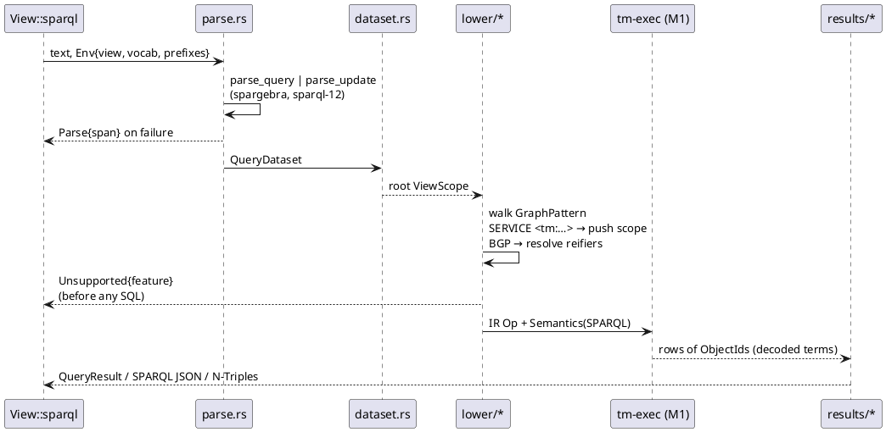
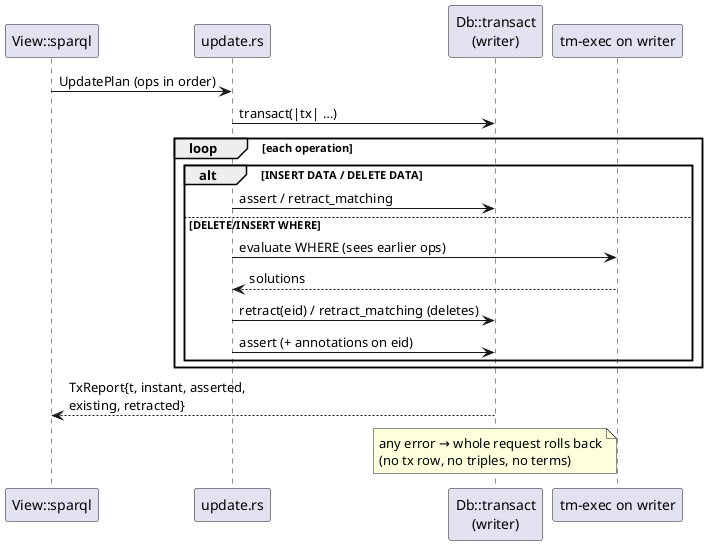

## Context

See `proposal.md` for the motivation. This design covers how SPARQL text becomes M1 IR and store operations. It does not restate the specs.

Constraints fixed by `lat.md`, which this design must not contradict:

- **Parser:** `spargebra` (Oxigraph), and the grammar is not modified. Time is carried by standard `FROM` and `SERVICE` IRIs, never by `GRAPH` (decision D21; `lat.md/query#Front Ends#SPARQL`, `lat.md/query#Temporal Syntax`).
- **Semantic flags:** `graph_set = SetOfTriples`, `match_mode = Homomorphism`, `missing = Unbound` (`lat.md/query#Front Ends#Semantic Differences`, `lat.md/query#Logical IR`).
- **Time:** every `TriplePattern`/`PathPattern` carries its own `View { tx, valid }`. A query-level clause sets the default and a per-pattern clause overrides it. Time predicates are written only by the view-aware scan (`lat.md/query#Views and Scans`). The front end only chooses views.
- **Writes:** insert maps to assert (idempotent), and delete maps to retract with cascade (`lat.md/time-model#Operations`). One `transact` call is one `t`. Updates go through the single writer (`lat.md/architecture#Connections and Concurrency`).
- **Values:** the canonical ObjectId encoding, including the deliberate deviation from RDF term identity for numbers and booleans, and `DATETIME` keeping its timezone offset in the inline payload `(epoch_ms << 11) | tz` with `tz` 0 meaning no timezone (decision D20; `lat.md/data-model#ObjectId#Canonical Encoding`). Term identity compares the whole id; value comparison of date-times compares the instant `id >> 15`. Anonymous nodes and blank nodes are skolemised as `urn:tiramemsu:node:<n>` / `urn:tiramemsu:bnode:<n>` (`lat.md/data-model#Nodes and Identity`).
- **Errors:** `Parse { dialect, span, msg }` and `Unsupported { feature }` (`lat.md/api#Errors`).
- **Crate graph:** `tm-sparql` depends on `spargebra` and `tm-ir` only (plus `tm-core` for ids and codec). The facade `tiramemsu` wires it in (`lat.md/architecture#Crates`).

Upstream facts this design relies on, checked in the `spargebra` 0.4.7 sources (docs.rs/spargebra, crate source):

- The features are `sparql-12` (enables `oxrdf/rdf-12`), `sep-0002`, `sep-0006` and `standard-unicode-escaping`. None is on by default.
- `SparqlParser::new().with_prefix(name, iri)?.with_base_iri(iri)?.parse_query(&str) / .parse_update(&str)`, returning `Result<_, SparqlSyntaxError>`.
- `Query::{Select, Construct, Describe, Ask} { dataset: Option<QueryDataset { default, named }>, pattern, base_iri }`.
- `GraphPattern` variants: `Bgp, Path, Join, LeftJoin, Filter, Union, Graph, Extend, Minus, Values, OrderBy, Project, Distinct, Reduced, Slice, Group, Service`, plus `Lateral` behind `sep-0006`.
- `TermPattern::Triple(Box<TriplePattern>)` exists behind `sparql-12`. The parser **desugars reifiers**: `s p o ~ r` and `<< s p o ~ r >>` become `r rdf:reifies <<( s p o )>>` triple patterns. An omitted reifier becomes a fresh `BlankNode`. Annotation blocks become triples whose subject is the reifier.
- `GraphUpdateOperation::{InsertData{data: Vec<Quad>}, DeleteData{data: Vec<GroundQuad>}, DeleteInsert{delete, insert, using, pattern}, Load, Clear, Create, Drop}`. `ADD`/`MOVE`/`COPY` are desugared into `Drop` + `DeleteInsert` over graph names. `WITH <g>` is desugared into `GRAPH <g>` in templates and pattern. `DELETE WHERE` becomes a `DeleteInsert` whose pattern is a **`Join` of one-triple `Bgp`s**.
- `Function` includes `Custom(NamedNode)` (which is also how XSD casts such as `xsd:integer(?x)` arrive) and, behind `sparql-12`, `Triple, Subject, Predicate, Object, IsTriple, LangDir, HasLang, HasLangDir, StrLangDir`.
- `SparqlSyntaxError` has no public position accessor. It is `#[error(transparent)]` over a private kind whose `Syntax` variant is `#[from] peg::error::ParseError<peg::str::LineCol>`. Its `Error::source()` is therefore the peg error, which has a public `location { line, column, offset }`.

## Goals / Non-Goals

**Goals:**
- Lowering is a pure function from spargebra's algebra plus a small environment (view, prefixes, vocab) to IR, with no database access except constant encoding through M1's resolver. This makes it golden-testable as text.
- Every feature outside v1 is rejected in one place, the lowering pass, before any SQL runs, with a stable `feature` string.
- Update requests reuse the tx engine unchanged. `tm-sparql` produces a list of `Tx` operations, and M0 enforces the rules (schema, cascade, unique, reserved namespace).
- The W3C test suite is runnable from day one, with an explicit list of expected deviations. Deviations are never silently skipped.

**Non-Goals:**
- Property-path evaluation beyond a single IRI or its inverse. This is M3 (`add-path-engine`), which replaces the interim requirement in `sparql-query`.
- Setting valid time, or writing tx metadata (`sys:reason` on the current tx), from SPARQL Update. Both stay API-only in v1.
- SPARQL Protocol (HTTP), CSV/TSV/XML result formats, `DESCRIBE`, federated `SERVICE`, entailment regimes, and named graphs.
- Query optimisation beyond what M1's planner does. This change emits straightforward IR and relies on M1's filter pushdown and constant encoding.
- The Cypher half of the differential suite (M2b owns the suite harness, and this change contributes the SPARQL queries).

## Decisions

### D1. Crate layout of `tm-sparql`

```
crates/tm-sparql/
  Cargo.toml          spargebra = { version = "0.4", features = ["sparql-12"] }, peg = "0.8", tm-ir, tm-core
  src/lib.rs          pub fn prepare(text, &Env) -> Result<Prepared>; Prepared::{Query(QueryPlan), Update(UpdatePlan)}
  src/parse.rs        parser construction (predeclared prefixes), query-vs-update dispatch, span extraction
  src/env.rs          Env { base_view, vocab, prefixes, speculative: bool }
  src/dataset.rs      TimeIri parser, ViewScope (tx part / valid part), FROM/USING/SERVICE resolution, GRAPH <tm:…> rejection
  src/lower/mod.rs    Query → QueryPlan (form, root Op, Semantics, projection, construct template)
  src/lower/pattern.rs GraphPattern → Op (lowering table below)
  src/lower/bgp.rs    BGP flattening, reifier/triple-term resolution, redundant-triple elimination
  src/lower/expr.rs   Expression / Function → IR Expr; supported-function whitelist; XSD casts
  src/lower/agg.rs    Group/AggregateExpression → Aggregate
  src/lower/path.rs   interim single-IRI / inverse paths; the M3 hook point
  src/lower/vars.rs   fresh internal variable allocator (names not expressible in SPARQL)
  src/terms.rs        spargebra term ↔ IR constant; skolem IRI parse/format (node, bnode, stmt, tx)
  src/update.rs       GraphUpdateOperation → UpdatePlan → Tx operations
  src/construct.rs    template instantiation (queries and update templates share it)
  src/results/term.rs ObjectId value → RDF term rendering
  src/results/json.rs SPARQL 1.1 Query Results JSON writer
  src/results/nt.rs   N-Triples / RDF 1.2 N-Triples writer for CONSTRUCT
  src/error.rs        feature-name constants, error constructors
  tests/golden/       *.rq / *.ru inputs + *.ir (lowered IR text) + *.srj expected results
  tests/w3c/          manifest-driven runner + expected-deviations.toml
```

In the facade (`tiramemsu`), `View::sparql(&self, q: &str) -> Result<QueryResult>` builds the `Env` from the view and calls `prepare`. A `QueryPlan` goes to the M1 executor on the view's connection (a reader, or the writer inside `with`). An `UpdatePlan` goes to `Db::transact`. `QueryResult` gains the variants `Boolean(bool)`, `Graph(Vec<RdfTriple>)` and `Update(TxReport)` alongside M1's solution table, together with `write_sparql_json` and `write_ntriples`.

*Alternatives:* a separate `Db::sparql_update` entry point was rejected because `lat.md/api#Rust Surface` fixes one `View::sparql`, and the MCP `sparql` tool takes one text. Putting SPARQL JSON in the facade was rejected because it is SPARQL-specific and belongs next to the term renderer.

### D2. Query vs update dispatch *(chosen during spec writing)*

`prepare` first tries `parse_query`. If that fails, it tries `parse_update`. If both fail, the reported error is the update parser's error when the first keyword after the prologue (`BASE`/`PREFIX`) is one of `INSERT DELETE LOAD CLEAR CREATE DROP ADD MOVE COPY WITH`. Otherwise it is the query parser's error. An update is accepted only when `Env` is the plain current view: `tx = Now`, `valid = Unfiltered`, and not speculative. Otherwise the result is `Unsupported("update on a non-current view")`. *Alternative:* a separate method per kind. It was rejected for the reason given in D1.

### D3. Parse error positions

`span` is recovered by `err.source().and_then(|s| s.downcast_ref::<peg::error::ParseError<peg::str::LineCol>>())`, which gives `{ line, column, offset }`. It depends on the exact `peg` 0.8 minor version that spargebra uses, pinned in `Cargo.toml` and guarded by a unit test. Fallback: parse the Display text `error at L:C:`. If both fail, `span` is `None`. *Alternatives:* forking spargebra, or an upstream PR for a `location()` accessor. The PR is worth filing, but it is not blocking.

### D4. Predeclared prefixes *(chosen during spec writing)*

The parser is built with `with_prefix` for `rdf`, `rdfs`, `xsd`, `sys` → `urn:tiramemsu:sys:`, `tm` → `urn:tiramemsu:tm:`, `v` → the db `@vocab`, and every row of the db prefix table (`lat.md/data-model#Vocabulary Mapping`). Query `PREFIX` declarations override them, as spargebra's prefix map does. This makes the `lat.md/query#Temporal Syntax` example (which uses `v:` without a declaration) valid as written. No default base IRI is set.

### D5. Lowering table (spargebra → IR)

Every lowered query carries `Semantics { match_mode: Homomorphism, missing: Unbound, graph_set: SetOfTriples }` at the root. `scope` is the current `ViewScope` (see D7).

| spargebra node | IR | Notes / flags |
|---|---|---|
| `Bgp { patterns }` (after flattening, D6) | `Join[TriplePattern{s,p,o,eid,view: scope}]` | `eid` is set only by reifier resolution. Otherwise `None`, and `SetOfTriples` dedups `(s,p,o)` over eids |
| `Path { NamedNode(p) }` | `TriplePattern{s, p, o}` | interim |
| `Path { Reverse(NamedNode(p)) }` | `TriplePattern{o, p, s}` | interim, swapped |
| `Path { other }` | `Unsupported("property path")` | M3 replaces this with `PathPattern{mode: Reach, view: scope}` |
| `Join { l, r }` | `Join[l, r]` | nested joins are flattened |
| `LeftJoin { l, r, expr }` | `LeftJoin{l, r, cond: expr}` | filter inside OPTIONAL becomes `cond` (spargebra already places it there) |
| `Filter { expr, inner }` | `Filter{inner, cond}` | SPARQL error → false is the M1 `Unbound` semantics of `Filter` |
| `Union { l, r }` | `Union[l, r]` | nested unions are flattened |
| `Service { name: time IRI, inner, silent }` | lower `inner` with `scope.apply(TimeIri)` | no IR node. The view is pushed into leaves. `silent` is ignored (D7) |
| `Service { name: other IRI }` / `Service { Variable }` | `Unsupported("SERVICE")` | federation is out of scope |
| `Graph { name: tm: IRI }` | `Parse { dialect: Sparql, msg: "time IRI in GRAPH; use SERVICE <…>" }` | D7, D10 |
| `Graph { name: other IRI }` / `Graph { Variable }` | `Unsupported("named graph")` / `Unsupported("GRAPH variable")` | |
| `Extend { inner, var, expr }` | `Extend{inner, var, expr}` | expression error → unbound (M1 `Unbound` semantics) |
| `Minus { l, r }` | `Filter{l, Not(Exists(r ⋈corr l))}` with the MINUS domain condition | correlated anti-join: remove μ when some μ' in r is compatible and `dom(μ) ∩ dom(μ') ≠ ∅` |
| `Filter(Exists(p))` / `Not(Exists(p))` | `Expr::Exists(Op)` | correlated on in-scope vars |
| `Values { vars, rows }` | `Values{rows}` | `UNDEF` → unbound cell |
| `OrderBy { inner, exprs }` | `OrderLimit{inner, keys, skip: None, limit: None}` | fused with an enclosing `Slice` |
| `Slice { inner, start, length }` | `OrderLimit{…, skip, limit}` | fused into the `OrderLimit` below when present (see D5a) |
| `Project { inner, vars }` | `Project{inner, vars, distinct: false}` | internal vars are never projected |
| `Distinct { Project }` | `Project{…, distinct: true}` | |
| `Reduced { Project }` | `Project{…, distinct: false}` | REDUCED allows either, and the cheaper one is chosen |
| `Group { inner, vars, aggs }` | `Aggregate{inner, group, aggs}` | `COUNT(*)`, `COUNT/SUM/AVG/MIN/MAX/SAMPLE/GROUP_CONCAT`, `distinct` flag. `Custom` → `Unsupported("custom aggregate")` |
| `Lateral` | (not compiled: `sep-0006` off) | parse error |
| `Query::Describe` | `Unsupported("DESCRIBE")` | |
| `Query::Ask` | root `Project{[], distinct: false}` + `OrderLimit{limit: 1}` | boolean = at least one row |
| `Query::Construct { template }` | root = lowered pattern; the template is kept for `construct.rs` | |

D5a. **ORDER BY with projection.** spargebra yields `Slice(Distinct?(Project(OrderBy(X))))`. The lowering produces `OrderLimit(Project(X))` with the keys rewritten onto projected columns. When a key uses a non-projected variable, the variable is carried as a hidden column that the encoder drops. With `DISTINCT`, a hidden column would change distinctness, so that case is `Unsupported("ORDER BY non-projected variable with DISTINCT")` *(chosen during spec writing)*. This avoids relying on SQLite keeping subquery order.

D5b. **Expressions.** The operators map one to one to IR `Expr`. Functions are whitelisted as listed in the `sparql-query` "Built-in functions" requirement. `Custom(xsd:string|integer|decimal|double|boolean|date|dateTime)` is lowered to IR casts, and any other `Custom(iri)` → `Unsupported(iri)`. `NOW()` is the wall-clock instant at query start, fixed for the whole query, and not the view's time. *If M1's IR `Expr` lacks `Exists(Op)` or a function this whitelist needs, this change adds it to `tm-ir` (additive only) (chosen during spec writing).*

### D6. BGP flattening and reifier resolution

1. **Flatten:** merge `Join` trees of `Bgp`s within one scope into one pattern list. This is needed because `DELETE WHERE` arrives as a `Join` of one-triple BGPs.
2. **Resolve triple terms bottom-up:** a pattern `r rdf:reifies <<( s p o )>>` becomes `TriplePattern{s,p,o, eid: r}`. `r` is a variable, a blank node (→ fresh internal variable), or an IRI. A statement skolem IRI becomes a constant `STMT`. Any other IRI becomes a constant that matches nothing, so the pattern is empty, not an error. A triple term `<<( s p o )>>` in any other object position becomes a fresh eid variable `?_eN` plus `TriplePattern{s,p,o, eid: ?_eN}`, and the term is replaced by `?_eN`. Nesting recurses.
3. **Eliminate redundant asserted triples:** a plain `TriplePattern{s,p,o, eid: None}` is dropped when the same list has `TriplePattern{s,p,o, eid: Some(_)}` with identical terms and the same view. The eid-bound pattern implies the triple, and keeping both would only add a join. This turns `s p o ~ ?r {| q v |}` into two patterns instead of three.
4. **Reject:** `?r rdf:reifies X` where X is not a triple term → `Unsupported("rdf:reifies without triple term")`. A variable predicate with a triple-term object → `Unsupported("variable predicate with triple term")`.

`rdf:reifies` therefore never reaches the scan, and a variable-predicate scan never produces it (`sparql-rdf12-annotations`, "rdf:reifies is virtual"). *Alternative:* storing `rdf:reifies` triples. It was rejected because the eid already is the reifier (`lat.md/query#Front Ends#SPARQL`, "bind directly to eids"), and storing it would double every annotated fact.

### D7. Dataset and time IRI recognition

`TimeIri` is parsed from an IRI string that starts with `urn:tiramemsu:tm:`:

| Suffix | Result |
|---|---|
| `asOf/` + `[0-9]+` | `Tx(AsOf(Tx(t)))` |
| `asOf/` + xsd:date or xsd:dateTime lexical | `Tx(AsOf(Instant(ms)))`, resolved to `t` by the M0 instant lookup at execution |
| `validAt/` + xsd:date or xsd:dateTime | `Valid(At(ms))` |
| `history` | `Tx(History)` |
| anything else | `Parse` error naming the IRI |

A date means 00:00Z. A date-time without a timezone means UTC *(chosen during spec writing)*. A `ViewScope` is `{ tx: Option<TxSel>, valid: Option<ValidSel> }` and is resolved against its parent: `child.part.or(parent.part)`. Precedence, innermost first: nested `SERVICE <tm:…>` groups (innermost wins per part) > `FROM` (or `USING` in updates) > the API `View` *(the per-part inheritance and override rules are chosen during spec writing, consistent with "query-level sets the default, per-pattern overrides" in `lat.md/query#Logical IR`)*. Two `FROM`s for the same part with different values → `Unsupported("conflicting time selectors")`. `FROM NAMED`/`USING NAMED` with time IRIs are accepted as no-ops. Non-`tm:` IRIs in `FROM`/`FROM NAMED`/`USING`/`USING NAMED`/`GRAPH` → `Unsupported("named graph")`. Time IRIs are looked for **only** in `QueryDataset`, `GraphPattern::Service` and `DeleteInsert.using`. Everywhere else they stay ordinary IRI constants (`lat.md/query#Temporal Syntax`), except that `GraphPattern::Graph` checks its name for the `tm:` namespace only to reject it.

**Per-group scope is `SERVICE`, not `GRAPH` (decision D21).** `SERVICE <tm:…> { … }` is evaluated locally: it pushes the scope and emits no IR node, exactly as `GRAPH` did in the earlier draft. `SERVICE SILENT <tm:…>` behaves the same; `SILENT` does not mask errors inside the group, because nothing remote can fail. `SERVICE` with any other IRI, or with a variable, is federation → `Unsupported("SERVICE")`. `GRAPH <tm:…>` → `Parse { dialect: Sparql, span: None, msg }` whose message names `SERVICE` (for example `time IRI <urn:tiramemsu:tm:asOf/150> is not allowed in GRAPH; use SERVICE <…> { … }`), so a query written for the earlier draft gets a direct fix. `GRAPH` with any other IRI and `GRAPH ?g` keep `Unsupported("named graph")` and `Unsupported("GRAPH variable")`.

*Rationale:* `GRAPH` stays free for named graphs, so a later change can add them and time composes with them without a grammar change or a new meaning for an existing IRI: `SERVICE <tm:asOf/150> { GRAPH <g> { … } }`. Using `GRAPH` for time would have made a time IRI and a graph name compete for the same slot. oxilite made the same choice for version scoping (`lat.md/prior-art#oxilite`). *Alternatives:* keeping `GRAPH <tm:…>` as a second accepted form was rejected, because two spellings of one scope double the tests and would block `GRAPH` from ever meaning a graph inside a time scope. Treating `GRAPH <tm:…>` as `Unsupported("named graph")` was rejected because the user almost certainly meant a time scope, and a `Parse` error that names `SERVICE` says how to fix it.



### D8. Update → Tx operation mapping

An `UpdatePlan` is a list of operations executed in order inside **one** `db.transact` closure. The `WHERE` of each `DeleteInsert` runs on the writer connection inside that transaction, so it sees earlier operations of the same request, as in the `with` mechanism of `lat.md/time-model#Speculative Transactions`.

| SPARQL | Tx operations |
|---|---|
| `INSERT DATA { s p o }` | `assert(s, p, o, valid: None)` |
| `INSERT DATA { s p o ~ r {| q v |} }` | `e = assert(s,p,o)`, σ(r)=e, then `assert(e, q, v)` |
| reified triple / triple term as a term in inserted data | `e = assert(s,p,o)` (deviation: asserted), and `e` is used in place |
| `INSERT DATA` blank node `_:b` | `new BNODE` per label per request (fresh, not reified) |
| `DELETE DATA { s p o }` | `retract_matching(s, p, o)` (all live eids, every episode, cascade) |
| `DELETE/INSERT … WHERE` | evaluate `WHERE` once → solutions. For each solution × delete template: plain triple → `retract_matching`, triple with a bound reifier → `retract(eid)`. Then for each solution × insert template → as `INSERT DATA`, with template blank nodes fresh per solution |
| `DELETE WHERE { … }` | same as above with `delete = pattern` |
| `LOAD / CLEAR / CREATE / DROP` | `Unsupported("<KEYWORD>")` |
| `GRAPH` in data/templates (including desugared `WITH`/`ADD`/`MOVE`/`COPY`), whatever the IRI, a `tm:` IRI included | `Unsupported("named graph")`: data and templates always write the current state, so a time IRI there has no meaning and the `SERVICE` hint would not apply (`SERVICE` is not allowed in data or templates) |
| `GRAPH` / `SERVICE` inside the `WHERE` pattern | as in queries (D5, D7) |

Instantiated delete triples are deduplicated, and all deletes of one operation run before its inserts (SPARQL 1.1 Update semantics). Reifier rules in templates *(chosen during spec writing)*: a reifier must be a blank node, a variable bound to a `STMT`, or a statement IRI of a stored statement with equal content. Otherwise → `Unsupported("reifier that is not a statement")`. One reifier mapped to two different triples → `Unsupported("reifier of more than one triple")`. Asserting the tm: statement-time predicates or the `sys:` virtual hops is rejected with `ReservedNamespace` *(chosen during spec writing: `lat.md/api#Errors` lists this error for reserved `sys:` predicates, and it is extended to the read-only virtual predicates so that they cannot be shadowed by stored triples)*. The M0 engine raises every other constraint error unchanged.



### D9. Result encoding *(skolem forms for STMT and TX chosen during spec writing)*

| ObjectId tag | RDF term | JSON `type` |
|---|---|---|
| `IRI` | IRI | `uri` |
| `NODE` | `urn:tiramemsu:node:<n>` | `uri` |
| `BNODE` | `urn:tiramemsu:bnode:<n>` (skolemised, per `lat.md/data-model#Nodes and Identity`) | `uri` |
| `STMT` | `urn:tiramemsu:stmt:<n>` | `uri` |
| `TX` | `urn:tiramemsu:tx:<t>` | `uri` |
| `INT` | `xsd:integer` canonical | `literal` + datatype |
| `BOOL` | `xsd:boolean` `true`/`false` | `literal` + datatype |
| `DATETIME` | `xsd:dateTime` in its stored offset: local time for that offset plus `±hh:mm`, `Z` for offset 0, no suffix when `tz` = 0 (no timezone); `.sss` only when ms ≠ 0 | `literal` + datatype |
| `DATE` | `xsd:date` | `literal` + datatype |
| `SHORT_STR`, `STR` | plain literal | `literal` |
| `LANG_STR` | literal + lower-cased tag | `literal` + `xml:lang` |
| `TYPED`, `DOUBLE`, `DECIMAL` | stored lexical + datatype | `literal` + datatype |

`terms.rs` parses all four skolem forms back to the same ObjectId, so values round-trip into later queries and into the `~ <urn:tiramemsu:stmt:N>` reifier form. BNODE is rendered as a skolem IRI rather than as JSON `bnode`, so that a blank node stays addressable across requests. The W3C runner maps `urn:tiramemsu:bnode:` back to blank nodes before isomorphism comparison. `CONSTRUCT` renders an eid reifier as its statement IRI and emits `rdf:reifies <<( … )>>` (`sparql-rdf12-annotations`).

### D10. Error mapping

| Source | Error |
|---|---|
| spargebra `SparqlSyntaxError` | `Parse { dialect: Sparql, span: D3, msg: Display }` |
| malformed `tm:` time IRI | `Parse { dialect: Sparql, span: None, msg: "invalid time IRI <…>" }` |
| `GRAPH` with a `tm:` IRI in a query or `WHERE` pattern | `Parse { dialect: Sparql, span: None, msg }` naming the IRI and `SERVICE` (D7) |
| lowering rejections | `Unsupported { feature }` with the constants in `error.rs`: `DESCRIBE`, `SERVICE` (non-time IRI or variable), `GRAPH variable`, `named graph`, `property path`, `custom aggregate`, function names (`MD5`, `RAND`, …, custom IRI), `ORDER BY non-projected variable with DISTINCT`, `conflicting time selectors`, `rdf:reifies without triple term`, `variable predicate with triple term`, `reifier that is not a statement`, `reifier of more than one triple`, `update on a non-current view`, `LOAD`, `CLEAR`, `CREATE`, `DROP` |
| M0 tx engine | passed through unchanged (`UniqueViolation`, `ValueTypeMismatch`, `CascadeLimitExceeded`, `SelfReference`, `ReservedNamespace`, …) |

## Risks / Trade-offs

- [spargebra's position is only reachable through `source()` + downcast, which is coupled to its `peg` version] → pin `peg` to the same minor version, add a unit test that asserts a known line and column, keep the Display fallback, and file an upstream PR for a public accessor.
- [SPARQL 1.2 is a Working Draft, and spargebra's `sparql-12` syntax or desugaring may change] → pin `spargebra` to `0.4.x`. Isolate the desugaring assumptions (the `rdf:reifies` shape) in `lower/bgp.rs`, with golden tests that fail loudly on change.
- [Asserting reified triples on insert deviates from RDF 1.2, where a reification does not assert] → this is forced by the data model (every eid is a stored statement). It is documented in the spec, and W3C 1.2 evaluation tests that depend on unasserted reifications are listed as expected deviations.
- [Canonical literals break some W3C tests (`open-world`, `"01"^^xsd:integer` distinctness)] → an expected-deviation list with the reason for each entry. The runner fails on any unexpected pass or failure, so deviations stay explicit. Timezone preservation is no longer a deviation: `DATETIME` keeps its offset (D20), so `sameTerm`, `TZ`, `TIMEZONE` and result rendering follow SPARQL 1.1. Sub-millisecond digits are still truncated, and tests that depend on them stay listed.
- [Time-scoped queries written with `GRAPH <tm:…>` (an earlier draft of this design) stop working] → nothing has shipped, and the `Parse` error names `SERVICE`, so the fix is mechanical.
- [MINUS / EXISTS as correlated subqueries may be slow in SQLite for large left sides] → acceptable at the target scale (10⁴–10⁷). Golden IR tests keep the shape stable, so M1 can later add an anti-join rewrite.
- [Updates are rejected on non-current views, which surprises callers who hold an `as_of` view] → the error names the reason. The MCP `sparql` tool only passes time arguments for reads.
- [Numeric `tx` values render as IRIs, so `FILTER(?t > …)` over transactions does not work] → deferred (see Open Questions). `Db::events_since` covers "changes since t".

## Migration Plan

Greenfield: a new crate and a new facade method, with no stored data or format change. Rollback means removing the crate and the facade method. Archive order: archive this change before `add-path-engine`, so that M3's delta can modify the interim "Property paths before the path engine" requirement.

## Open Questions

- Should transactions also compare numerically in SPARQL expressions (for example a `tm:t(?tx)` function returning `xsd:integer`)? This is additive and does not change these specs.
- Should the tm-sparql parser be cached per `(vocab, prefix-table version)` to avoid rebuilding prefix maps per query? This is a performance detail only.
